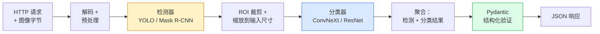

# Vision Pipeline Capstone：从实验室到生产线的视觉管线

> 单个视觉模型有精度，但管线才有健壮性——每一条模型间的接口都是潜在的故障点，一个 Typed 契约能省下一整周的调试。

**类型：** 实现课
**语言：** Python
**前置知识：** 阶段 04 · 01 至 15（计算机视觉全阶段）
**预计时间：** ~120 分钟
**所处阶段：** Tier 1
**关联课程：** 阶段 04 · 06（YOLO 目标检测）、阶段 04 · 08（实例分割 Mask R-CNN）— 理解检测与分类模型在管线中的串联方式

---

## 🎯 学习目标

完成本课后，你能够：

- [ ] 设计一条完整的端到端视觉管线（预处理 → 检测 → 裁剪 → 分类 → 验证 → 响应），并处理每一种失败路径
- [ ] 用 Pydantic 定义模型间的数据契约（Data Contract），让检测器返回格式不匹配时立即抛出明确错误而非静默崩溃
- [ ] 对管线的每一个阶段进行基准测试，定位延迟瓶颈并给出优化方向
- [ ] 将管线封装为 FastAPI 服务，支持健康检查、错误码和链路追踪
- [ ] 了解 DVC 管理数据集、W&B 跟踪实验、Model Registry 管理版本的生产级工程流程

---

## 1. 问题

你已经训练过图像分类器，做过目标检测，甚至跑过语义分割——这些实验在 `python code.py` 之后输出几个数字，一切都很完美。但如果你要把这些模型放进一个真实的系统：用户上传一张照片，系统检测照片里的所有物体并为每个物体分类，然后返回结构化的 JSON 结果呢？

**问题不在于某个模型不够准——在于多个模型串联时的接口。**

一个零售货架审计系统需要一个目标检测器找出商品位置、一个分类器识别商品类别、一个 OCR 引擎读取价格标签。每个模型的输出格式稍有不同——检测器返回 `(cx, cy, w, h)`，分类器期望的是 `(x1, y1, x2, y2)`；分类器要求 RGB 输入，检测器输出的 crop 是 BGR；检测器置信度阈值太高导致一个框都不返回，下游分类代码直接崩溃。

**在实验中这些都是 "小问题"。在生产线里，它们是导致服务每小时中断一次的根因。**

一条视觉管线有多强，取决于它最弱的那个接口。本节课把所有阶段 04 的独立模型串联成一条完整管线，并在每个接口上建立数据契约。

```
没有数据契约的管线:
  检测器 ──→ (cx,cy,w,h) ──→ 分类器
                    │
                    ▼
              坐标格式不匹配
              crop 越界 / 空片
              无检测时下游崩溃
              = 静默的错误结果

有数据契约的管线:
  检测器 ──→ Detection(x1,y1,x2,y2,score) ──→ Pydantic 校验
                                          │
                                          ▼
                              格式不符 → 立即报错 + 详细信息
                              越界 → 自动 clamp
                              空 → 返回空列表 + 日志
                              太小 → 跳过分类
                          = 可观察的、可恢复的系统
```

---

## 2. 概念

### 2.1 管线的七个阶段

一个生产级别的视觉管线通常包含以下阶段：



七个阶段中，两个模型阶段（检测 + 分类）是计算密集型的。其余五个阶段是 **bug 发生的地方**。

### 2.2 数据契约（Data Contract）

数据契约是管线中每一步输入和输出必须遵守的类型规范。在最简单的实现中，它是一个 Pydantic BaseModel：

```
Detection(
    box: tuple[float, float, float, float],   # (x1, y1, x2, y2)，绝对像素坐标
    score: float,                              # [0, 1]
    class_id: int,                             # 来自检测器的标签映射
    mask_rle: Optional[str] = None             # 可选的 RLE 编码掩码
)

PipelineResult(
    image_id: str,
    detections: list[Detection],
    classifications: list[Classification],
    inference_ms: float,
)
```

当检测器返回了 `(cx, cy, w, h)` 格式而不是下游期望的 `(x1, y1, x2, y2)` 时，Pydantic 的验证会在边界处立即失败——你立刻就能发现并修复问题，而不是花三个小时排查一个下游 crop 静默返回了空区域。

**五秒钟的代码可以省下整整一周的调试时间。**

### 2.3 延迟分布——钱花在了哪里

三条在所有视觉管线中都成立的经验法则：

1. **预处理通常是最大的 CPU 开销块。** JPEG 解码、色彩空间转换、缩放——这些都是 CPU 绑定的操作，而且容易被遗忘。
2. **检测器主导 GPU 时间。** 70-90% 的 GPU 时间花在检测器的前向传播上。
3. **后处理在 GPU 上便宜、在 CPU 上昂贵。** NMS、RLE 编解码等后处理总被低估。

知道这些分布意味着你可以把优化工作集中在回报率最高的地方。

### 2.4 失败模式与处理策略

| 失败场景 | 正确处理策略 | 错误做法 |
|---|---|---|
| 检测器没检测到任何物体 | 返回空 `detections` 列表，记录日志 | 崩溃 |
| 检测框超出图像边界 | 在裁剪前将坐标 clamp 到图像尺寸 | 切片越界 → Index Error |
| 检测框太小（如 3x4 像素） | 设置 min_crop 阈值，跳过该框的分类 | 让分类器处理 3 像素补丁 |
| 用户上传了损坏的图像 | 400 响应 + 具体错误码（`image_decode_failed`） | 500 内部服务器错误 |
| 模型加载失败 | 在启动时失败而非首次请求时 | 第一次推理时才报错 |
| 分类器超时 | 返回检测但不返回分类，而非整个请求失败 | 超时整个 HTTP 请求 |

生产级管线不为每种失败编写通用的 `try/except`。每个失败都有一个明确的错误码和响应策略。

### 2.5 微批量（Micro-batching）

生产服务需要同时服务多个客户端。微批量的思路是：**积攒一批请求，一次性做前向传播**。

典型配置：积攒最多 20 毫秒的请求，合并为一个批次送入 GPU，推理完成后将结果分配给各请求。`torchserve`、Triton Inference Server 等框架内置了这个功能。小流量场景下也可以自己实现一个简单的微批处理器。

**代价是：每请求额外增加最多 20 毫秒的等待延迟。收益是：吞吐量成倍增长。** 这是一个典型的延迟-吞吐权衡。

### 2.6 模型版本控制与实验跟踪

在工业管线中，每一次推理都应该可追溯。这意味着：

```
请求 ID: req-abc-123
  ├─ 预处理: 3.21 ms
  ├─ 检测器: v2.1 (sha256=e4f2...)  42.35 ms
  ├─ 分类器: v3.4 (sha256=a8b3...)  8.12 ms
  ├─ 后处理: 1.05 ms
  └─ 总耗时: 54.73 ms
```

每条链路日志中包含：
- **Trace ID**：每个请求的唯一标识符，贯穿所有阶段
- **模型名称与权重哈希**：确保每次响应都能追溯到具体的模型版本
- **每阶段耗时**：定位性能问题的关键数据

这些元数据通过 W&B（Weights & Biases）或 MLflow 进行持久化存储，实现完整的实验跟踪。

### 2.7 数据集管理（DVC）

当管线进入生产后，数据和模型都需要版本管理。DVC（Data Version Control）是 CV 领域的标准工具：

```
dvc init                        # 初始化 DVC 仓库
dvc add data/raw/               # 添加原始数据集
dvc add models/detector_v2.pt   # 添加模型检查点
git add dvc.yaml dvc.lock       # 将管线定义提交到 Git
dvc push                        # 将数据推送到远程存储
```

DVC 的核心价值在于：**将大文件（图像、视频、模型）存在对象存储中，将它们的引用留在 Git 里**。这使得你可以在 Git 分支之间切换数据集和模型的组合。

---

## 3. 从零实现

完整代码在 `code/main.py` 中。以下逐步拆解核心组件。

### 第 1 步：数据契约——五种类型的定义

```python
from pydantic import BaseModel, Field
from typing import List, Optional, Tuple

class Detection(BaseModel):
    box: Tuple[float, float, float, float]   # (x1, y1, x2, y2)
    score: float = Field(ge=0, le=1)         # 自动约束 0~1
    class_id: int = Field(ge=0)              # 非负整数
    mask_rle: Optional[str] = None           # 可选掩码


class Classification(BaseModel):
    detection_index: int
    class_id: int
    class_name: str
    score: float = Field(ge=0, le=1)


class PipelineResult(BaseModel):
    image_id: str
    detections: List[Detection]
    classifications: List[Classification]
    inference_ms: float
```

`Field(ge=0, le=1)` 会自动约束 score 范围——如果检测器意外返回了 -0.5 或 1.3，Pydantic 在构造 `Detection` 时就会抛出 `ValidationError`，而不是让你的服务后续以不可预测的状态运行。

### 第 2 步：管线类——从预处理到结构化输出

```python
import time
import torch
import torch.nn.functional as F
from PIL import Image


class VisionPipeline:
    def __init__(self, detector, classifier, class_names,
                 device="cpu", min_crop_size=16):
        self.detector = detector.to(device).eval()
        self.classifier = classifier.to(device).eval()
        self.class_names = class_names
        self.device = device
        self.min_crop_size = min_crop_size
        self.stage_timings = {}

    def preprocess(self, image):
        """转换为 CHW 格式的浮点张量，值域 [0, 1]。"""
        if isinstance(image, np.ndarray):
            tensor = torch.from_numpy(image).permute(2, 0, 1).float() / 255.0
        elif isinstance(image, Image.Image):
            image = image.convert("RGB")
            tensor = torch.from_numpy(np.array(image)).permute(2, 0, 1).float() / 255.0
        else:
            raise TypeError(f"只支持 numpy ndarray 和 PIL Image，收到 {type(image)}")
        return tensor.to(self.device)

    @torch.no_grad()
    def detect(self, image_tensor):
        """目标检测。"""
        t0 = time.perf_counter()
        result = self.detector([image_tensor])[0]
        self.stage_timings["detect"] = (time.perf_counter() - t0) * 1000
        return result

    @torch.no_grad()
    def classify(self, crops):
        """批量分类，空输入返回空列表。"""
        if len(crops) == 0:
            return []
        t0 = time.perf_counter()
        batch = torch.stack(crops).to(self.device)
        logits = self.classifier(batch)
        probs = logits.softmax(-1)
        scores, cls = probs.max(-1)
        self.stage_timings["classify"] = (time.perf_counter() - t0) * 1000
        return list(zip(cls.tolist(), scores.tolist()))

    def run(self, image, image_id="anonymous"):
        """完整管线。"""
        t_start = time.perf_counter()

        tensor = self.preprocess(image)
        det = self.detect(tensor)

        crops = []
        valid_indices = []
        detections = []

        for i, (box, score, label) in enumerate(
            zip(det["boxes"], det["scores"], det["labels"])
        ):
            x1, y1, x2, y2 = [max(0, int(b.item())) for b in box]
            x2 = min(x2, tensor.shape[-1])   # clamp 防越界
            y2 = min(y2, tensor.shape[-2])

            detections.append(Detection(
                box=(float(x1), float(y1), float(x2), float(y2)),
                score=float(score),
                class_id=int(label),
            ))

            # 太小则跳过分类
            if (x2 - x1) < self.min_crop_size or (y2 - y1) < self.min_crop_size:
                continue

            crop = tensor[:, y1:y2, x1:x2]
            crop = F.interpolate(
                crop.unsqueeze(0), size=(64, 64),
                mode="bilinear", align_corners=False,
            )[0]
            crops.append(crop)
            valid_indices.append(i)

        class_preds = self.classify(crops)

        classifications = []
        for idx, (cls_id, cls_score) in zip(valid_indices, class_preds):
            name = (self.class_names[cls_id]
                    if cls_id < len(self.class_names)
                    else f"class_{cls_id}")
            classifications.append(Classification(
                detection_index=idx,
                class_id=int(cls_id),
                class_name=name,
                score=float(cls_score),
            ))

        total_ms = (time.perf_counter() - t_start) * 1000
        self.stage_timings["total"] = total_ms

        return PipelineResult(
            image_id=image_id,
            detections=detections,
            classifications=classifications,
            inference_ms=total_ms,
        )
```

每一处都有具体处理策略，而不是用一个大的 `try/except` 吞掉所有错误。

### 第 3 步：接入真实模型

```python
from torchvision.models.detection import maskrcnn_resnet50_fpn_v2
from torchvision.models import convnext_tiny

# 使用预训练权重搭建真实管线
detector = maskrcnn_resnet50_fpn_v2(weights="DEFAULT")
classifier = convnext_tiny(weights="DEFAULT")
class_names = [f"imagenet_class_{i}" for i in range(1000)]

pipe = VisionPipeline(
    detector=detector,
    classifier=classifier,
    class_names=class_names,
    device="cuda" if torch.cuda.is_available() else "cpu",
)
```

在实际工程中，你会在这里引入 DVC 管理训练好的权重文件：

```bash
# 从 DVC 拉取特定版本的检测器模型
dvc checkout --models detector_v2.1.pt
dvc checkout --models classifier_v3.4.pt
```

### 第 4 步：FastAPI 服务包装

```python
from fastapi import FastAPI, UploadFile, HTTPException
from io import BytesIO

app = FastAPI()
pipe = None  # 在启动时加载

@app.on_event("startup")
def load_models():
    """启动时加载模型，而不是在第一次请求时——避免首次请求超时。"""
    global pipe
    detector = maskrcnn_resnet50_fpn_v2(weights="DEFAULT").eval()
    classifier = convnext_tiny(weights="DEFAULT").eval()
    pipe = VisionPipeline(detector, classifier, class_names=[f"c{i}" for i in range(1000)])

@app.post("/detect")
async def detect_endpoint(file: UploadFile):
    """接收图像 → 运行管线 → 返回 JSON。"""
    if file.content_type not in {"image/jpeg", "image/png", "image/webp"}:
        raise HTTPException(status_code=400,
                            detail={"error_code": "unsupported_content_type"})
    data = await file.read()
    try:
        img = Image.open(BytesIO(data)).convert("RGB")
    except Exception:
        raise HTTPException(status_code=400,
                            detail={"error_code": "image_decode_failed"})
    result = pipe.run(img, image_id=file.filename or "upload")
    return result.model_dump()
```

部署命令：

```bash
uvicorn main:app --host 0.0.0.0 --port 8000
curl -F 'file=@dog.jpg' http://localhost:8000/detect
```

### 第 5 步：分阶段基准测试

```python
def benchmark(pipe, num_runs=10, image_size=(400, 600)):
    test_img = (np.random.rand(*image_size, 3) * 255).astype(np.uint8)
    pipe.run(test_img)  # 预热

    for _ in range(num_runs):
        pipe.run(test_img, image_id=f"bench-{_}")

    print("\n分阶段延迟:")
    print("-" * 40)
    for stage, times in pipe._timing_history.items():
        times.sort()
        n = len(times)
        p50 = times[n // 2]
        p95 = times[int(n * 0.95)]
        print(f"  {stage:12s}  p50={p50:7.2f} ms  p95={p95:7.2f} ms")
```

CPU 上的典型输出：preprocess 约 3 ms，detect 300-500 ms，classify 20-40 ms，总计 350-550 ms。在 GPU 上，detect 降到 20-40 ms，preprocess 和 classify 的相对占比会变得更重要。

---

## 4. 工业工具

### 4.1 生产管线常用框架选型

| 场景 | 推荐方案 | 备注 |
|---|---|---|
| 快速原型 | FastAPI + 裸管线 | 开发最快，适合验证思路 |
| 中小流量生产 | TorchServe | PyTorch 官方，内置批处理与版本管理 |
| 高并发多模型 | Triton Inference Server | NVIDIA 出品，支持动态批处理、并发推理 |
| 企业级 MLOps | BentoML + MLflow | 一站式部署 + 实验跟踪 + 模型注册 |
| 边缘部署 | TensorRT / ONNX Runtime | 嵌入式设备首选 |

### 4.2 实验跟踪（W&B / MLflow）

在生产管线中，你需要回答的问题不仅仅是"当前模型准不准"，还有"哪个模型版本在这个批次数据上表现最好"：

```python
import wandb

# 初始化实验
wandb.init(project="vision-pipeline", config={
    "detector": "maskrcnn_resnet50_fpn_v2",
    "classifier": "convnext_tiny",
    "min_crop_size": 16,
    "batch_size": 32,
})

# 在每个 batch 上记录指标
for batch_idx, (images, labels) in enumerate(dataloader):
    result = pipeline.run_batch(images)
    wandb.log({
        "inference_latency_ms": result.inference_ms,
        "num_detections": len(result.detections),
        "detection_precision": compute_precision(result, labels),
    })
```

实验跟踪让你能复现任何一个线上决策——"上周三那个准确率暴跌的部署，用的是哪个模型版本？"答案就在 W&B 的记录里。

### 4.3 DVC 数据版本管理

```bash
# 初始化 DVC
dvc init

# 跟踪数据集（大文件存在 S3/GCS，引用留在 Git）
dvc add data/train_images/
dvc add data/val_images/
git commit -m "track dataset v2"

# 跟踪模型权重
dvc add models/detector_epoch_50.pth
git commit -m "track model v2.1"

# 团队协作
dvc pull        # 拉取远程数据
dvc push        # 推送数据到远程
dvc checkout    # 切换到特定版本的数据集
```

### 4.4 Model Registry（模型注册表）

Hugging Face Hub 是最常用的轻量级模型注册表：

```python
from huggingface_hub import HfApi

api = HfApi()

# 上传检测器模型
api.upload_folder(
    folder_path="./models/detector/",
    repo_id="my-org/vision-detector-v2",
    repo_type="model",
)

# 列出所有模型版本
versions = api.list_repo_files("my-org/vision-detector-v2", repo_type="model")
for v in versions:
    print(v)
```

在流水线中使用注册表模型：

```python
from transformers import AutoModelForObjectDetection

# 从注册表拉取指定版本
detector = AutoModelForObjectDetection.from_pretrained(
    "my-org/vision-detector-v2@refs/tags/v2.1"
)
```

### 4.5 性能对比

| 部署方案 | 适合规模 | 批处理 | 版本管理 | 监控 | 安装复杂度 |
|---|---|---|---|---|---|
| FastAPI 裸管线 | < 100 QPS | 需自行实现 | 需自行实现 | 需自行实现 | 极低 |
| TorchServe | 100-1K QPS | 内置 | 内置 | 内置 CloudWatch | 低 |
| Triton | 1K-10K QPS | 动态批处理 | 模型仓库 | Prometheus 指标 | 中 |
| BentoML | 企业级 | 内置 | 内置 | 内置 | 中 |

---

## 5. 知识连线

本课学习的管线设计思想，是后续所有 AI 系统的必要基础：

- **阶段 04 · 06（YOLO 目标检测）**：目标检测模型是大多数视觉管线的第一个节点，理解 YOLO 的输出格式和延迟特性有助于更好地设计检测后的裁剪和分类逻辑。
- **阶段 04 · 08（实例分割 Mask R-CNN）**：Mask R-CNN 除了边界框还会输出像素级掩码，这需要在线管线的 postprocessing 中增加 RLE 编码步骤。
- **阶段 11（LLM 工程）**· 模型部署与推理：虽然 LLM 的场景不同，但数据契约、实验跟踪、模型版本管理的工程原则完全一致——这也是为什么计算机视觉管线的设计模式被大量复用到 LLM 推理服务中。

---

## 6. 工程最佳实践

### 6.1 管线上线前的决策检查清单

| 问题 | 推荐方向 |
|---|---|
| 需要多少 TPS？ | <100 → FastAPI; >1000 → Triton/TorchServe |
| 输入分辨率是否固定？ | 固定 → 可用 TensorRT 静态 shape 编译; 可变 → ONNX dynamic axes |
| 是否需要 AB 测试模型版本？ | 需要 → 选择支持版本路由的服务（Triton / BentoML） |
| 延迟 SLA 是多少？ | <50ms → GPU + 量化; 50-200ms → GPU FP16; >200ms → CPU 可接受 |
| 数据需要版本管理吗？ | 需要 → DVC + 远程存储（S3 / MinIO） |
| 实验需要可复现吗？ | 需要 → W&B / MLflow + 代码 Git 锁定 |

### 6.2 管线调优建议

- **先 profiling 再优化**：用 `cProfile` 或 W&B 的 timing 功能定位真正的瓶颈。最常见的情况是——你以为检测器是瓶颈，但实际上预处理（JPEG 解码）占了 40% 的时间。
- **每阶段都设超时**：检测器 2 秒超时、分类器 500 毫秒超时。超时后返回降级结果，而不是让整个请求挂起。
- **缓存热路径**：相同图像的重复检测毫无意义。在管线入口处加一层 Redis 缓存，键为图像哈希，值为检测结果。
- **健康检查**：负载均衡器需要知道你的服务是否还活着。`/health` 端点应仅检查模型是否已加载，不要执行完整推理。

### 6.3 中文场景特别建议

- 国内云服务商（阿里云、腾讯云、华为云）均提供模型托管服务。如果你的管线需要部署到国内，优先考虑阿里云的 PAI-EAS 或腾讯云的 TI-One，它们内置了 DVC 类似的数据管理和 A/B 测试能力。
- 如果使用海康威视、大华等安防平台的嵌入式硬件（通常是 ARM + 自研 NPU），TensorRT 不可用。建议选择 TFLite 或供应商专用推理引擎作为推理后端，并用 ONNX 作为中间交换格式。
- 国内常见的 CV 标注平台（百度 PaddleNLP 标注、阿里 DataLabeling、海天瑞声）导出的标注格式各不相同。建议在数据预处理阶段统一转换为 COCO 或 VOC XML 格式，避免下游模型因标注格式不一致而训练失败。

### 6.4 踩坑经验

1. **启动时加载模型而不是请求时加载**：第一次请求时加载模型会导致该请求的延迟达到几十秒。应该在服务启动的 `startup` 事件中完成加载。
2. **忘记设置 `.eval()`**：`nn.Module` 处于训练模式时，Dropout 和 BatchNorm 会引入随机性或更新统计量，导致同一次推理两次结果不同。
3. **坐标格式混用**：检测器可能返回 `(x1, y1, x2, y2)` 或 `(cx, cy, w, h)` 或 `(x1, y1, w, h)`。在管线接口处必须统一格式化。Pydantic 的 validator 可以在这里发挥作用。
4. **忘记 GPU 同步就计时**：`time.perf_counter()` 在 GPU 上是异步的。必须先调用 `torch.cuda.synchronize()`，再记录结束时间，否则测量的不是真实推理时间。
5. **忽略空检测结果**：当所有检测框都被过滤掉后，`crops` 列表为空，调用 `torch.stack([])` 会崩溃。始终检查列表是否为空。

---

## 7. 常见错误

### 错误 1：用一个大的 `try/except` 吞掉所有错误

**现象：** 管线代码中有一个包裹了全部逻辑的 `try/except Exception`，生产环境中偶尔出现 500 错误但无法定位原因。

**原因：** 泛型异常处理隐藏了失败的具体位置和类型。是一个检测器返回了异常的坐标格式？还是图片解码失败？还是分类器形状不匹配？统统变成了"某个异常"。

**修复：**

```python
# ❌ 错误写法：吞掉所有错误
def run(self, image):
    try:
        # ... 所有管线逻辑
    except Exception as e:
        print(f"管线出错: {e}")
        return None  # 调用者根本不知道发生了什么

# ✓ 正确写法：每个边界有明确的错误码
def run(self, image):
    try:
        tensor = self.preprocess(image)
    except ValueError as e:
        raise PreprocessError("图像格式不合法", error_code="bad_image_format")
    except TypeError as e:
        raise PreprocessError("不支持的输入类型", error_code="unsupported_input")

    det = self.detect(tensor)
    # ... 每一步都在自己的作用域内失败，并携带明确的 error_code
```

### 错误 2：忘记在流水线中处理空检测结果

**现象：** 当某张图片检测不到任何目标时，服务崩溃报 `IndexError`。

**原因：** 检测器返回空框列表时，后面的 crop 提取和分类代码仍然试图遍历并 stack 这些空框。

**修复：**

```python
# ❌ 错误：没有检查空检测
detections = get_detections(image)  # 可能为空
crops = [crop_from_box(d) for d in detections]  # 空列表可以工作
results = classifier(crops)          # 但如果后续有 det["boxes"][0] 就崩溃

# ✓ 正确：每一步都有空值保护
detections = get_detections(image)
if len(detections) == 0:
    logger.info("未检测到任何目标，返回空结果")
    return PipelineResult(image_id=id, detections=[], classifications=[], inference_ms=0)

crops = extract_crops(detections, min_size=self.min_crop_size)
```

### 错误 3：在 CPU 上测量 GPU 延迟而不同步

**现象：** 在配有 GPU 的机器上做的基准测试结果比实际生产环境快 10 倍以上。

**原因：** CUDA 操作是异步的。`torch.no_grad()` 包裹的前向传播在 GPU 上调度后立即返回，真正的计算还在后台排队。如果没有 `torch.cuda.synchronize()`，你测到的只是 kernel 调度时间而非执行时间。

**修复：**

```python
# ✓ 正确：GPU 计时必须同步
with torch.no_grad():
    torch.cuda.synchronize()           # 等待之前的 GPU 操作完成
    t0 = time.perf_counter()
    output = model(input_tensor)
    torch.cuda.synchronize()           # 等待当前 forward 完成
    latency_ms = (time.perf_counter() - t0) * 1000
```

### 错误 4：返回 500 而不是 400 给客户端错误输入

**现象：** 用户上传了一张损坏的 JPEG，服务端返回 HTTP 500。

**原因：** HTTP 500 表示"服务器出错了"，客户端会认为是暂时性问题并重试同一张损坏的图片——导致相同的 500 错误再次出现，形成重试风暴。

**修复：**

```python
# ✓ 正确：给客户端明确的可操作错误信息
@app.post("/detect")
async def detect_endpoint(file: UploadFile):
    if file.content_type not in IMAGE_TYPES:
        raise HTTPException(
            status_code=400,
            detail={
                "error_code": "unsupported_content_type",
                "message": f"不支持的内容类型: {file.content_type}",
                "supported_types": list(IMAGE_TYPES),
            },
        )
```

---

## 8. 面试考点

### Q1：为什么要在管线中使用 Pydantic 数据契约？不做会怎样？（难度：⭐⭐）

**参考答案：**

数据契约的核心价值是**将静默失败转化为显式失败**。没有类型约束时，一个模型返回了 `(cx, cy, w, h)` 而下游期望 `(x1, y1, x2, y2)`，代码不会报错——它只是在下游产生错误的 crop 区域，这个错误可能在几轮训练甚至线上推理后才被发现。

加上 Pydantic 之后，类型校验在模型边界处立即捕获不匹配。代价是每次校验需要几微秒——相对于一次检测前向传播的几十毫秒，这个成本可以忽略不计。

如果不做类型校验，替代方案可以是手动检查每个字段的形状和值域，但这样写出来的代码会非常冗长且容易遗漏边界条件。Pydantic 将校验逻辑声明式地写在类型定义中，一处维护，处处生效。

### Q2：在你的视觉管线中，如何确定真正的性能瓶颈？（难度：⭐⭐）

**参考答案：**

不能凭直觉猜测，必须 profile。步骤：

1. 在每个阶段（预处理、检测、裁剪、分类、后处理）入口和出口放置计时器
2. 跑 100+ 个代表性样本（覆盖正常情况、异常情况、极端情况）
3. 计算每个阶段的均值、p50、p95
4. 如果预处理占比超过 30%，考虑使用更快的解码库（OpenCV vs Pillow vs libjpeg-turbo）
5. 如果检测器占比超过 70%，考虑替换更快的检测架构或启用量化

关键原则：**先定位瓶颈再优化**。很多团队的优化方向搞反了——花时间调整分类器的 batch size，却忽略了 JPEG 解码占了 40% 的时间。

### Q3：解释微批量（Micro-batching）的延迟-吞吐权衡。（难度：⭐⭐）

**参考答案：**

微批量的思路是"等多一会儿，凑够一批再一起算"。好处是 GPU 对批量的矩阵乘法效率远高于单张图片，吞吐量成比例提升。坏处是每个请求需要额外等待最多 batching window（比如 20ms）才能进入队列。

适用条件：
- QPS 较高（> 50），有大量请求排队
- 单个请求的延迟 SLA 比较宽松（> 100ms）

不适用条件：
- 严格的实时性要求（< 50ms SLA）
- QPS 很低（< 5），大部分时间窗口是空的，白白增加了延迟

工业界的实际做法通常是自适应的——当队列中有多个待处理请求时开启批处理，当队列变空时立即处理减少等待。Triton Inference Server 的 `max_batch_size` 和 `dynamic_batching` 就是实现这种自适应逻辑的经典方案。

### Q4：如果要设计一个支持模型热更新的视觉管线，你会怎么设计？（难度：⭐⭐⭐）

**参考答案：**

核心思想是**模型和服务逻辑分离**，使用双缓冲切换：

1. 模型加载为独立的 `ModelProvider` 组件，通过接口 `detect(image) -> Dict` 提供服务，管线类依赖接口而非具体实现
2. 加载新模型时，在新 GPU 上实例化新模型，加载权重，验证通过后切换到全局 ModelProvider 的引用
3. 使用引用计数确保旧模型在所有正在处理的请求完成后再卸载，避免 OOM
4. 切换过程需要加读锁——读取请求继续用旧模型，写入（切换）请求等待所有读取完成后锁定全局引用完成切换
5. 模型元数据（版本名、权重哈希、训练集版本、评估指标）在响应头中返回，方便追踪

这种设计的代价是实现复杂度显著增加，但对于需要频繁 AB 测试模型版本的生产服务来说是值得的投资。

---

## 🔑 关键术语

| 术语 | 人们怎么说 | 实际含义 |
|---|---|---|
| 管线（Pipeline） | "整个系统" | 一系列有序的预处理、推理和后处理步骤，每两步之间有类型化的接口 |
| 数据契约（Data Contract） | "输出格式" | Pydantic / dataclass 定义——每步的输入输出必须符合这些定义；在边界处捕获集成 bug |
| 预处理（Preprocessing） | "喂给模型之前" | 解码、色彩转换、缩放、归一化——通常是最大的 CPU 时间消耗 |
| ROI 裁剪（ROI Crop） | "把检测区域切出来" | 根据检测框从原图中裁剪出小图，缩放到分类器输入尺寸 |
| 微批量（Micro-batcher） | "攒一批再算" | 收集请求的聚合器——等待固定时间窗口内积累多个请求，做一次批量前向传播 |
| 追踪 ID（Trace ID） | "请求编号" | 每个请求的独立标识符，在每阶段日志中记录，用于端到端追踪慢请求 |
| 错误码（Failure Code） | "错误类型" | 每种失败类型一个命名错误码（如 `image_decode_failed`），替代笼统的 500 错误，使客户端能做出正确响应 |
| 健康检查（Health Check） | "服务状态探测" | 一个轻量级端点，报告服务是否可用（模型是否加载）。负载均衡器依赖此判断是否将流量导向该实例 |
| 权重哈希（Weights Hash） | "模型指纹" | 用 SHA256 计算模型权重的校验和，用于唯一标识和追踪模型版本 |
| DVC | "Git 的数据扩展" | 将大数据文件存在对象存储中，把引用留在 Git 仓库——实现数据和模型的可追溯版本管理 |

---

## 📚 小结

生产级视觉管线不是单个模型的精度竞赛，而是多条模型链路的接口可靠性博弈。你用 Pydantic 定义了数据契约，将静默失败转化为显式报错；用分阶段基准测试定位性能瓶颈；用 FastAPI 将管线封装为可服务的 API。下一步是将这套管线的数据集和模型版本纳入 DVC 和 W&B 的管理体系中，实现完整的工程闭环。

---

## ✏️ 练习

1. 【理解】用自己的话解释为什么"管线中最弱的接口决定整体可靠性"。举一个坐标格式不匹配的例子，说明从静默失败到显式失败的转变过程。200 字以内。

2. 【实现】修改 `code/main.py` 中的 `VisionPipeline.run` 方法，添加一个 fallback 机制：如果分类器在 500ms 内未返回结果，跳过分类但仍然返回检测框。用 `concurrent.futures.ThreadPoolExecutor` 实现超时控制。

3. 【实验】加载 `code/main.py` 中提供的 StubDetector 和 StubClassifier，对 100 张随机合成图像运行基准测试，收集每个阶段的 p50 和 p95 延迟。如果用 OpenCV 替代 NumPy+PIL 做预处理，耗时有什么变化？

4. 【思考】如果你要在管线上游加一个 NSFW（不适宜内容）过滤器，应该在什么位置插入？在检测之前还是分类之后？给出你的设计和理由。

5. 【思考】阅读 Triton Inference Server 的动态批处理文档（https://github.com/triton-inference-server/server/blob/main/docs/user_guide/batching.md），画出动态批处理的请求排队和分发流程图。

---

## 🚀 产出

本课产出以下可复用内容：

| 产出 | 文件 | 说明 |
|---|---|---|
| 端到端视觉管线 | `code/main.py` | 含数据契约、Stub 模型、完整管线类、基准测试、FastAPI 服务包装 |
| 视觉管线设计指南提示词 | `outputs/prompt-vision-pipeline-guide.md` | 分析任意视觉管线架构并给出优化建议的提示词模板 |

---

## 📖 参考资料

1. [官方文档] FastAPI: https://fastapi.tiangolo.com/ — 高性能 Python Web 框架，内置自动文档
2. [官方文档] Pydantic V2: https://docs.pydantic.dev/latest/ — Python 数据校验与序列化工具
3. [论文] He et al. "Mask R-CNN". ICCV, 2017. https://arxiv.org/abs/1703.06870 — 实例分割的开山之作
4. [论文] Liu et al. "YOLOv7: Trainable Bag-of-Freebies Sets New State-of-the-Art for Real-Time Object Detectors". arXiv, 2023. https://arxiv.org/abs/2207.02696 — 当前工业界最常用的目标检测框架之一
5. [论文] Tong et al. "ConvNeXt: A ConvNet for the 2020s". CVPR, 2022. https://arxiv.org/abs/2201.0354 — 现代 CNN 骨干网络的代表作
6. [GitHub] DVC: https://github.com/iterative/dvc — 数据版本控制工具，ML 生产管线标配
7. [官方文档] Weights & Biases: https://docs.wandb.ai/ — 机器学习实验跟踪平台
8. [官方文档] NVIDIA Triton Inference Server: https://developer.nvidia.com/triton-inference-server — 高吞吐推理服务框架

---

> 本课程参考了 AI Engineering From Scratch（MIT License）的课程体系，在此基础上进行了重构和原创内容的扩充。所有中文表达、案例、LLM 视角分析、工程最佳实践、常见错误、面试考点等均为原创内容。
