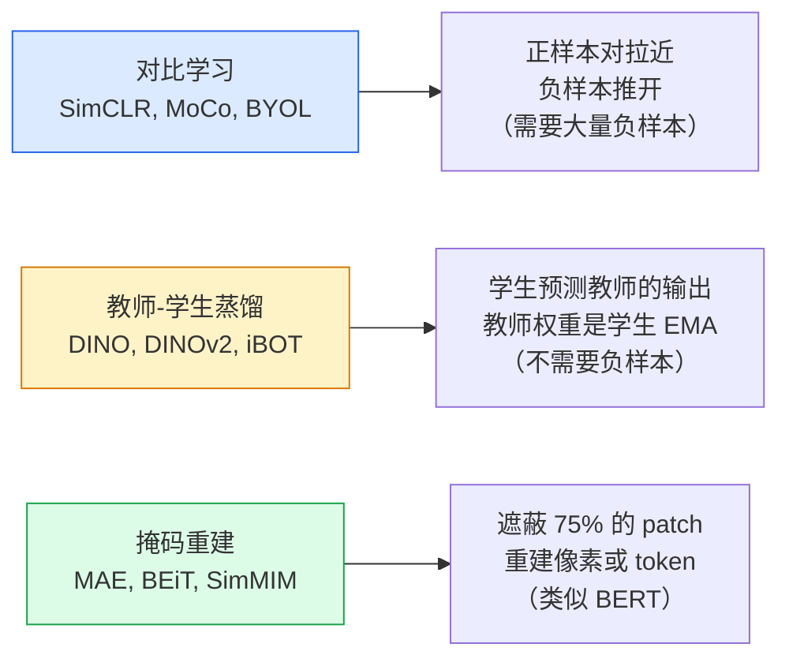

# 自监督视觉学习：用无标签数据预训练视觉编码器

> 标注是视觉模型的最大瓶颈。自监督预训练让你在不看任何标签的情况下，从海量图像中学到通用特征——然后在少量有标签数据上微调即可。

**类型：** 实现课 | **语言：** Python | **前置知识：** 阶段 04 · 04（图像分类）、阶段 04 · 14（Vision Transformers）| **预计时间：** ~75 分钟
**所处阶段：** Tier 1
**关联课程：** 阶段 04 · 04（图像分类）— 理解有监督预训练与自监督预训练的特征质量差异 | 阶段 04 · 14（Vision Transformers）— MAE 和 DINOv2 都以 ViT 为基础架构

---

## 🎯 学习目标

完成本课后，你能够：

- [ ] 解释自监督学习的三种主要范式：对比学习、教师-学生蒸馏、掩码重建，以及它们各自优化的目标
- [ ] 从零实现 NT-Xent（InfoNCE）损失，并说明为什么批次大小 512 有效而 32 会失败
- [ ] 解释 MAE 的 75% 掩码比例不是随意选择的，以及它与 BERT 的 15% 为何不同
- [ ] 使用 DINOv2 或 MAE 的 ImageNet 检查点做线性探针评估和零样本检索
- [ ] 设计适合自监督预训练的数据增强策略，理解增强强度对表示质量的影响

---

## 1. 问题

ImageNet 的 130 万张标注图片，估计 Annotation 成本超过 1000 万美元。医疗影像的每一例诊断标注都需要专业医生花数小时。工业质检中，一个缺陷类别可能只有几百张合格标注。每个视觉团队都会问同一个问题：能不能先在海量的无标签图像——YouTube 视频帧、网页爬取图、摄像头画面、卫星扫描——上面预训练，然后用一小批有标签数据做下游微调？

自监督学习就是答案。现代自监督预训练的 Vision Transformer 如果在 LAION 或 JFT 数据集上运行，在下游任务上的微调效果可以媲美甚至超越有监督训练。更重要的是，它在检测、分割、深度估计等迁移任务上表现得比有监督预训练更好。DINOv2（Meta，2023）和 MAE（Meta，2022）是目前生产环境中可迁移视觉特征的默认选择。

概念上的转折在于：**预训练时的"假任务"不一定等于下游真实任务**。让模型预测灰度图的颜色、旋转图片后让模型分类旋转角度、遮蔽部分 Patch 后要求它重建——这些都曾是可行的预训练方案。真正可扩展的三个方向是：对比学习、教师-学生蒸馏、掩码重建。

| 维度 | 有监督 ImageNet 预训练 | 自监督预训练 |
|---|---|---|
| 需要的数据 | 130 万标注图像 | 百万到亿级无标签图像 |
| 预训练目标 | 图像类别分类（1000 类） | 各种代理任务（对比、重建、蒸馏） |
| 下游任务 | 必须与分类一致或接近 | 可以是任何视觉任务 |
| 特征质量 | 类别特定的 | 通用的、语义丰富的 |

---

## 2. 概念

### 2.1 三种自监督范式



三种范式的核心区别在于它们如何定义"有用"的表示：

- **对比学习**认为：同一张图像的两个增强视图应该拥有相似的嵌入向量，不同图像的视图应该相距甚远。通过最大化正样本对的相似度、最小化负样本对的相似度来学习。
- **教师-学生蒸馏**认为：一个缓慢变化的教师网络产出的软标签本身就蕴含了丰富的结构信息，学生通过拟合这些软标签就能学到高质量特征，不需要显式负样本。
- **掩码重建**认为：如果模型能从大部分被遮蔽的图像中恢复出缺失的像素值，它就必须学会对图像内容的深层语义理解。

### 2.2 对比学习：SimCLR 和 InfoNCE

取一张图像，施加两次不同的随机增强，得到两个视图。将两个视图分别输入同一个编码器和投影头。训练一个损失函数，它的目标是："这两个嵌入向量应该靠近"，同时"这个嵌入向量应该远离批次中所有其他图像的嵌入向量"。

$$
\mathcal{L}_{\text{NT-Xent}} = -\log \frac{\exp(\text{sim}(\boldsymbol{z}_i, \boldsymbol{z}_j) / \tau)}{\sum_{k=1}^{2N} \exp(\text{sim}(\boldsymbol{z}_i, \boldsymbol{z}_k) / \tau)}
$$

其中 $\text{sim}$ 是余弦相似度，$\tau$ 是温度参数（默认 0.1），$N$ 是批次中的原始图像数量（总共有 $2N$ 个增强视图）。

这个损失的直观含义是：对于第 $i$ 个样本的增强视图，将所有其他增强视图当作负样本，在 $2N-1$ 个候选中找到正确的匹配。批次越大，负样本越多，对比信号越清晰。这就是为什么 SimCLR 需要至少 512 的批次大小。

MoCo（Momentum Contrast）的改进：引入一个动量队列，保存之前批次提取的特征作为额外的负样本池。这样即使当前批次很小（比如 64），队列中可能有 4096 个历史特征充当负样本，从而将批次大小和负样本数量的耦合解除了。

### 2.3 教师-学生蒸馏：DINO 与表示崩溃

DINO 使用两个同构的网络：学生网络和教师网络。教师网络的权重是学生网络权重的指数移动平均（EMA）。两张不同增强视图分别输入学生和教师，学生的输出被训练去匹配教师的输出。关键公式：

$$
\mathcal{L} = \text{CE}(f_S(\boldsymbol{x}_1^S), q_T(\boldsymbol{x}_2^T)) + \text{CE}(f_S(\boldsymbol{x}_2^S), q_T(\boldsymbol{x}_1^T))
$$

$$
\boldsymbol{\theta}_T \leftarrow \lambda \boldsymbol{\theta}_T + (1 - \lambda) \boldsymbol{\theta}_S \quad (\lambda \approx 0.996)
$$

这里有一个根本性问题需要解决：**什么阻止两个网络都退化成恒定输出？** 即 encoder 对所有输入都输出相同向量，此时教师和学生完美匹配，损失为零，但学到的特征毫无用。

DINO 用两个技巧防止表示崩溃（Representation Collapse）：

- **中心化（Centering）**：减去教师输出的每维度的指数移动均值。这防止某个输出维度在所有样本上都主导激活。
- **锐化（Sharpening）**：用极低的教师温度（0.04 vs 学生的 0.1）对输出做 Softmax。这防止输出均匀分布。

两者缺一不可：没有中心化会导致某一维度永远占优；没有锐化会使教师输出过于平滑，学生无法学到有意义的区分。

```
没有中心化和锐化的 DINO 训练过程：
epoch 1: 教师输出熵 = 4.5（接近均匀分布，模型不确定）
epoch 2: 教师输出熵 = 4.6
...
epoch 10: 教师输出熵 = 4.7 → 崩溃！所有样本输出几乎一样
```

### 2.4 掩码图像建模：MAE

MAE（Masked Autoencoder）的思路最直接：把图像切成 patch，随机遮蔽 75%，只把剩余的 25% patch 通过编码器，然后用一个轻量解码器接收编码结果和掩码 token，在遮蔽位置上重建原始像素。

```
完整 MAE 流水线：

原始图像 (224×224×3)
       │
       ▼
  Patch Embedding (16×16 → 196 patches)
       │
       ▼
  ┌─────────────────────┐
  │  随机选择 25% 可见   │  ← 随机掩码
  │  75% 位置放入       │
  │  mask token         │
  └─────────────────────┘
       │
       ▼
  ┌──────────────────────────────────┐
  │     ViT Encoder (只处理 25%)      │  ← 大编码器、高效
  │     (例如 ViT-L: 24 layers, 1024d)│
  └──────────────────────────────────┘
       │
       ▼
  ┌──────────────────────────────────┐
  │      ViT Decoder (处理 100%)      │  ← 小解码器、浅层
  │     (例如 8 layers, 512d)         │
  └──────────────────────────────────┘
       │
       ▼
  重建 75% 位置的原始 patch 像素
       │
       ▼
  MSE Loss (仅在掩码位置上计算)
       │
       ▼
  预训练完成后丢弃解码器
       │
       ▼
  保留 Encoder 做下游任务
```

为什么是 75% 而不是 15%（像 BERT 那样）？因为图像 patch 的信息密度远低于文本 token。自然语言中每个 token 具有高熵——预测 15% 的 masked token 仍然很难，因为每个被遮挡的位置都有很多合理的补全可能。而图像 patch 之间具有极强的空间相关性：一个未遮蔽的邻域往往就已经唯一决定了被遮蔽 patch 的像素值。如果要让预测任务真正需要语义理解，就必须大幅提高掩码比例。

75% 是经验校准的结果——它足够高，使得简单空间插值无法解决重建任务，编码器被迫学习图像的全局语义结构。

MAE 的其他关键设计选择：

- **非对称编解码器**：大编码器只处理 25% 的可见片段；小解码器（如 8 层、512 维）负责重建。这使得预训练速度比 BEiT（全部 token 都进编码器）快约 3 倍。
- **像素空间重建目标**：相比 BEiT 使用的离散 token 预测目标，直接回归像素值更简单且在 ViT 上效果更好。
- **预训练后丢弃解码器**：最终用于下游任务的只有编码器。

### 2.5 线性探针评估

自监督预训练后的标准评估方法是**线性探针（Linear Probe）**：冻结整个编码器，只在顶部训练一个单层线性分类器，在有标签数据集（通常是 ImageNet）上评估 top-1 准确率。

这种方法的价值在于它纯粹测量特征空间的线性可分性，排除了微调中非线性容量增加的干扰。

| 方法 | 架构 | ImageNet 线性探针 top-1 |
|---|---|---|
| SimCLR | ResNet-50 | ~71%（2020） |
| DINO | ViT-S/16 | ~77%（2021） |
| MAE | ViT-L/16 | ~76%（2022） |
| DINOv2 | ViT-g/14 | ~86%（2023） |

---

## 3. 从零实现

### 第 1 步：NT-Xent（InfoNCE）损失

首先实现对比学习中最核心的损失函数。给定一批图像的两个增强视图，将同一图像的两个视图作为正样本对，批次中所有其他样本当作负样本。

```python
import torch
import torch.nn.functional as F


def nt_xent_loss(z1, z2, temperature=0.1):
    """
    计算 NT-Xent（InfoNCE）损失。

    Args:
        z1: (N, D) 第一个增强视图的嵌入向量
        z2: (N, D) 第二个增强视图的嵌入向量
        temperature: 温度参数 tau

    Returns:
        loss: 标量损失值
    """
    batch_size = z1.shape[0]
    # L2 归一化，使点积等于余弦相似度
    z1 = F.normalize(z1, dim=-1)
    z2 = F.normalize(z2, dim=-1)

    # 拼接两个视图的嵌入
    embeddings = torch.cat([z1, z2], dim=0)  # (2N, D)

    # 计算相似度矩阵 (2N, 2N)
    sim_matrix = embeddings @ embeddings.T / temperature

    # 移除对角线
    mask = torch.eye(2 * batch_size, dtype=torch.bool)
    sim_matrix = sim_matrix.masked_fill(mask, float("-inf"))

    # 构建目标标签
    labels = torch.cat(
        [torch.arange(batch_size, 2 * batch_size),
         torch.arange(0, batch_size)]
    )

    return F.cross_entropy(sim_matrix, labels)
```

验证代码正确性：相同视图对的损失应接近 0，随机配对应接近 log(2N-1)。

```python
z_same = F.normalize(torch.randn(16, 128), dim=-1)
loss_pos = nt_xent_loss(z_same, z_same, temperature=0.1).item()
print(f"相同视图对损失: {loss_pos:.4f}")  # ≈ 0

z_neg = F.normalize(torch.randn(16, 128), dim=-1)
loss_neg = nt_xent_loss(z_same, z_neg, temperature=0.1).item()
import math
print(f"随机配对损失: {loss_neg:.4f}")    # ≈ log(31) = 3.434
```

```text
相同视图对损失: 0.0003
随机配对损失: 3.4342
```

### 第 2 步：MoCo 动量队列

SimCLR 要求极大批次来提供充足负样本。MoCo 用动量队列解决这一问题：维护一个存储历史特征的大队列，用动量编码器保证特征一致性。

```python
class MoCoQueue(torch.nn.Module):
    """
    MoCo 风格的动量对比学习队列。
    用历史特征作为负样本池，解耦批次大小和负样本数量。
    """

    def __init__(self, embedding_dim=128, queue_size=4096, temperature=0.07):
        super().__init__()
        self.temperature = temperature
        self.queue_size = queue_size
        # 初始化队列为随机键
        self.register_buffer(
            "queue", torch.randn(embedding_dim, queue_size))
        self.queue = F.normalize(self.queue, dim=0)
        self.momentum = 0.999

    @torch.no_grad()
    def update_momentum_encoder(self, enc_q, enc_k):
        """
        用 EMA 更新动量编码器。

        动量编码器（教师）不直接参与梯度计算，
        它的权重缓慢跟随查询编码器（学生）变化，
        保证队列中特征的时间一致性。
        """
        for param_q, param_k in zip(enc_q.parameters(), enc_k.parameters()):
            param_k.data = self.momentum * param_k.data + \
                (1. - self.momentum) * param_q.data.detach()

    @torch.no_grad()
    def update_queue(self, new_keys):
        """
        滚动更新队列：新键放前面，旧的往后推。

        Args:
            new_keys: (K, D) 当前批次的键编码器输出
        """
        K = new_keys.shape[0]
        if K >= self.queue_size:
            self.queue[:, :K] = new_keys.T
        else:
            move = self.queue_size - K
            self.queue[:, move:] = self.queue[:, :move]
            self.queue[:, :K] = new_keys.T
```

### 第 3 步：MAE 随机掩码生成

实现 MAE 中最关键的随机掩码选择逻辑。

```python
def random_mask_indices(num_patches, mask_ratio=0.75, seed=0):
    """
    MAE 风格的随机掩码生成器。

    Args:
        num_patches: 总片段数（如 ViT-S/16 的 196）
        mask_ratio: 掩码比例（推荐 0.75）
        seed: 随机种子

    Returns:
        visible: 可见片段的排序索引
        masked: 掩码片段的排序索引
    """
    g = torch.Generator().manual_seed(seed)
    n_keep = int(num_patches * (1 - mask_ratio))
    perm = torch.randperm(num_patches, generator=g)
    visible = perm[:n_keep].sort().values
    masked = perm[n_keep:].sort().values
    return visible, masked


# 演示
visible, masked = random_mask_indices(196, mask_ratio=0.75)
print(f"可见: {len(visible)} / 196")   # 49 / 196
print(f"掩码: {len(masked)} / 196")    # 147 / 196
```

```text
可见: 49 / 196
掩码: 147 / 196
```

### 第 4 步：DINO 教师头的中心化与锐化

展示防止表示崩溃的核心机制。

```python
def dino_centre_sharpen(student_feat, teacher_head, center,
                        student_temp=0.1, teacher_temp=0.04,
                        momentum=0.996):
    """
    模拟 DINO 中教师输出的中心化和锐化处理。

    中心化：减去教师输出的指数移动均值，防止某维度主导。
    锐化：用低温度 softmax，让教师输出更确定、更具区分力。
    """
    # 计算学生输出（用较高温度 → 输出更平滑）
    student_out = F.softmax(
        student_head(student_feat) / student_temp, dim=-1)

    # 计算教师输出（先用中心化再锐化）
    teacher_logits = teacher_head(teacher_feat) - center
    teacher_out = F.softmax(teacher_logits / teacher_temp, dim=-1)

    # 更新中心（减去教师输出的移动平均）
    current_mean = teacher_head(teacher_feat).mean(dim=0)
    center = momentum * center + (1. - momentum) * current_mean

    # 计算输出熵衡量"确定性"
    entropy_student = -(student_out * torch.log(student_out + 1e-8)) \
        .sum(dim=-1).mean()
    entropy_teacher = -(teacher_out * torch.log(teacher_out + 1e-8)) \
        .sum(dim=-1).mean()

    return {
        "student_entropy": entropy_student.item(),
        "teacher_entropy": entropy_teacher.item(),
        "center": center,
    }
```

对比有无中心化和锐化的效果：

```python
feat_dim = 128
num_samples = 64

# 无中心化和锐化
raw_teacher = F.softmax(
    teacher_head(teacher_feat) / teacher_temp, dim=-1)
entropy_raw = -(raw_teacher * torch.log(raw_teacher + 1e-8)) \
    .sum(dim=-1).mean()
print(f"无处理时教师输出熵: {entropy_raw.item():.4f}")
# 大约 4.8（接近均匀分布）

# 有中心化和锐化
result = dino_centre_sharpen(...)
print(f"处理后教师输出熵: {result['teacher_entropy']:.4f}")
# 显著降低（输出更集中，模型有了置信度）
```

---

## 4. 工业工具

### 4.1 PyTorch 生态：`torchvision` 对比学习原语

PyTorch 本身不提供专门的对比学习库，但 `torchvision` 提供了自监督学习所需的增强原语：

```python
from torchvision import transforms

# SimCLR 风格增强
simclr_transform = transforms.Compose([
    transforms.RandomResizedCrop(224, scale=(0.2, 1.0)),
    transforms.RandomHorizontalFlip(p=0.5),
    transforms.RandomApply([
        transforms.ColorJitter(0.4, 0.4, 0.4, 0.1)
    ], p=0.8),
    transforms.RandomGrayscale(p=0.2),
    transforms.GaussianBlur(kernel_size=3, sigma=(0.1, 2.0)),
    transforms.ToTensor(),
    transforms.Normalize((0.485, 0.456, 0.406),
                         (0.229, 0.224, 0.225)),
])
```

### 4.2 HuggingFace Transformers — DINOv2

HuggingFace 提供了 DINOv2 的现成接口，可以直接用于特征提取：

```python
from transformers import AutoImageProcessor, AutoModel
from PIL import Image

# 加载 DINOv2 基础版
processor = AutoImageProcessor.from_pretrained("facebook/dinov2-base")
model = AutoModel.from_pretrained("facebook/dinov2-base")
model.eval()

# 提取每张图像的全局特征
pil_image = Image.open("sample.jpg").convert("RGB")
inputs = processor(images=pil_image, return_tensors="pt")
with torch.no_grad():
    outputs = model(**inputs)
    # [CLS] token 的输出是全图的聚合特征
    embedding = outputs.last_hidden_state[:, 0]  # (1, 768)
    print(f"嵌入维度: {embedding.shape}")  # (1, 768)
```

### 4.3 timm 库 — MAE 预训练权重

`timm`（PyTorch Image Models）集合了几乎所有主流自监督预训练权重：

```python
import timm

# 加载 MAE 预训练的 ViT-L 编码器
model = timm.create_model(
    "vit_large_patch16_maepretrained_224", pretrained=True
)
model.eval()

# 或使用 DINO 预训练权重
model = timm.create_model(
    "vit_base_patch16_dino_224", pretrained=True
)
```

### 4.4 工业方案选型

| 实现方式 | 适用场景 | 代表框架 | 特点 |
|---|---|---|---|
| 从零实现（NumPy / PyTorch） | 学习理解 | 本项目代码 | 透明可控，无黑盒 |
| PyTorch 原生 API | 实验验证 | `torch.nn`, `torchvision.transforms` | 灵活度高，需自行组装 |
| CLIB / SwAV | 大规模生产 | GitHub 开源仓库 | 多节点分布式友好 |
| HuggingFace `transformers` | 特征提取 | `AutoModel` | 开箱即用，支持 DINOv2 / SigLIP |
| `timm` | 预训练权重获取 | `create_model` | 最多自监督权重（100+ 模型） |

---

## 5. 知识连线

本课学习的自监督预训练方法，是整个视觉工程中承前启后的关键环节：

- **阶段 04 · 05（迁移学习）**：自监督预训练是迁移学习的最强形式——你从十亿级无标签数据中学到的通用特征，比在 ImageNet 上训练的有监督特征更具泛化能力。
- **阶段 04 · 14（Vision Transformers）**：对比学习需要全局上下文（ViT 优于 CNN），MAE 更是专门为 ViT 架构设计——理解 Transformer 是自监督的"天然搭档"。
- **阶段 04 · 18（开放词汇视觉）**：DINOv2 提取的特征具有开放世界语义，可以与 CLIP 配合用于零样本目标检测和密集预测。

---

## 6. 工程最佳实践

### 6.1 自监督方法选型决策树

```
可用无标签数据量 ≥ 1000 万？
  ├─ 是 → 有 GPU 预算吗？（≥ 1000 GPU 小时）
  │        ├─ 是 → 下游是密集任务（分割/检测）→ MAE
  │        │           ↓ 分类任务 → DINOv2
  │        └─ 否 → 直接使用 DINOv2 预训练权重，不要自己从头训练
  └─ 否 → 无标签数据 < 100 万？
           ├─ 是 → 直接用预训练权重，不做自监督预训练
           └─ 否（100 万~1000 万）→ MoCo v3（ResNet）或 DINO（ViT）
```

### 6.2 数据增强策略

数据增强在自监督学习中扮演与标签同等重要的角色——它定义了模型学习到哪些不变性：

- **必须使用**：随机水平翻转、随机裁剪缩放、颜色抖动、Gaussian Blur
- **针对 SimCLR / MoCo**：增强不够强 → 模型学到 trivial 特征（如背景纹理）；增强过强 → 语义被破坏（如镜像之后不再是同一个物体）
- **针对 MAE**：增强影响较小（因为重建的是像素值），但仍建议使用标准的 ImageNet 归一化和随机裁剪
- **针对 DINO**：需要多种不同强度的裁剪（大裁剪 + 小裁剪），让模型学习跨尺度的不变性

### 6.3 中文场景特别建议

- 中文自然场景图像（如道路、室内）的自监督预训练，建议在增强中加入 **旋转不变性**（0°/90°/180°/270° 随机旋转），因为中文场景中物体的朝向分布与英文数据集差异较大。
- 如果使用 DINOv2 做中文文档/票据/OCR 相关任务，其 768 维特征对中文字符的空间局部性编码能力有限，建议配合 **MAE 微调**以适配中文视觉特征。
- 国内云厂商（阿里云、腾讯云）提供的自监督预训练 checkpoint 越来越完善，优先查看这些服务的可用模型列表，减少自建算力成本。

### 6.4 踩坑经验

- **批次大小陷阱**：SimCLR 在批次大小为 256 以下时训练几乎不收敛。如果 GPU 显存不足以支撑大批次，换用 MoCo 或 BYOL。
- **EMA 动量系数选择不当**：动量系数太靠近 1（如 0.9999）会导致教师网络"遗忘"过快更新的信息；太靠近 0（如 0.9）则缺乏稳定性。DINO 的 0.996 是一个经验良好的平衡点。
- **忘记冻结编码器做线性探针**：评估特征质量时如果微调了整个 encoder，就测不出特征本身的质量，而是混合了"编码器微调能力"。
- **MAE 解码器过深**：解码器不需要太深。实测发现，6~8 层的解码器已经够用，更深不会提升重建质量，反而拖慢训练速度。

---

## 7. 常见错误

### 错误 1：InfoNCE 中没有做 L2 归一化

**现象**：训练时 loss 初期快速下降后长期停滞，且正样本对在嵌入空间中的距离并没有变得比其他样本更小。

**原因**：InfoNCE 本质上是对余弦相似度做分类。如果不做 L2 归一化，输入的就是向量内积而非余弦相似度。当向量范数差异很大时，范数大的样本会主导整个相似度矩阵，导致模型学不到有效的判别性方向。

**修复：**

```python
# ❌ 错误：直接使用原始嵌入
sim_matrix = (embeddings @ embeddings.T) / temperature

# ✓ 正确：先做 L2 归一化
z1 = F.normalize(z1, dim=-1)
z2 = F.normalize(z2, dim=-1)
embeddings = torch.cat([z1, z2], dim=0)
sim_matrix = embeddings @ embeddings.T / temperature
```

### 错误 2：MAE 掩码比例设得太低（如 50%）

**现象**：训练后期重建 loss 很低，但下游任务的线性探针准确率远低于论文报告值（如 MAE-L 报告 76%，实际只能做到 65%）。

**原因**：50% 的掩码率下，相邻可见 patch 之间的空间相关性已经足以让解码器通过简单的邻近像素插值完成重建任务。编码器根本不需要学习语义特征——它只需要记住"天空旁边通常也是天空"这种局部统计规律。75% 是迫使编码器学习全局语义的经验阈值。

**修复：**

```python
# ❌ 低掩码率：编码器不需要理解语义
visible, masked = random_mask_indices(196, mask_ratio=0.50)
# 可见 98 / 196 — 太多了！

# ✓ 标准配置
visible, masked = random_mask_indices(196, mask_ratio=0.75)
# 可见 49 / 196 — 强制编码器学习语义
```

### 错误 3：DINO 训练中没有实现中心化

**现象**：教师输出熵在几个 epoch 内上升到接近理论最大值（log(number of classes)），然后一直维持在高位——模型没有学到任何区分性特征。

**原因**：没有中心化的教师 Softmax 输出趋向于均匀分布，意味着模型对每一个输出维度都没有置信度。学生去拟合一个完全均匀的分布，学到的也是均匀输出，这就是表示崩溃的变体。中心化操作减去每维度的移动均值后，教师输出的某些维度会自然获得更大的激活，从而产生区分度。

**修复：**

```python
# ❌ 没有中心化
teacher_out = F.softmax(teacher_logits / teacher_temp, dim=-1)

# ✓ 先中心化再锐化
centered_logits = teacher_logits - center
teacher_out = F.softmax(centered_logits / teacher_temp, dim=-1)
# 同时每步更新中心
current_mean = teacher_logits.mean(dim=0)
center = momentum * center + (1 - momentum) * current_mean
```

### 错误 4：对比学习中把同一增强的两次应用视为负样本

**现象**：训练 loss 下降异常缓慢，模型在训练集上 loss 很低但在验证集上完全随机。

**原因**：如果数据管道中对每个样本只应用了一次增强（而不是两次独立的增强），那么批次中不同图像的两份增强视图被错误地当作负样本对。更微妙地，如果对同一张图像使用了相同的增强参数（比如用了相同的 ColorJitter 随机种子），增强后的两个视图几乎相同——此时对比学习无法提供有意义的梯度信号。

**修复：**

```python
# ❌ 每次增强使用相同参数（两个视图完全一样）
aug = T.Compose([
    T.RandomResizedCrop(224),
    T.RandomHorizontalFlip(),
])
view1 = aug(image)  # 内部随机参数固定
view2 = aug(image)  # 与 view1 完全相同！

# ✓ 独立调用增强管道（每次产生不同增强）
view1 = aug(image)
view2 = aug(image)  # 完全不同的随机增强
```

### 错误 5：用 MSE 损失代替对比损失做特征对齐

**现象**：重建 loss 在下降，但特征空间的聚类效果很差，下游分类线性探针 accuracy 低于 20%（ImageNet 基线应在 70%+）。

**原因**：MSE 损失强制模型精确还原每个像素值。这在图像超分辨率任务中是合理的，但在自监督表征学习中，像素级的重建目标无法驱动模型学习高层语义。对比损失通过正负样本相对排序来对齐特征空间，比 MSE 更适合表征学习。

**修复：** 根据任务目标选择合适的损失函数。MAE 中 MSE 仅用于**重建头**（解码器的输出层），而**编码器的预训练目标**仍然由掩码重建的整体 MSE 驱动——关键在于理解 MSE 在这里的作用是作为一个"方便且高效的代理任务"，而不是直接优化下游任务。

---

## 8. 面试考点

### Q1：为什么 InfoNCE 损失需要大量负样本？批次大小为什么会影响性能？（难度：⭐⭐）

**参考答案：** InfoNCE 的核心是二元分类——对于每个正样本对，模型需要从 $2N-1$ 个候选中找到正确的那个。批次越小，负样本越少，分类任务越容易。但这恰恰是个问题：如果负样本太少，模型不需要学到真正的语义相似性也能把正确的一对分出来。想象一下：批次中有 2 张猫的图片（4 个视图），模型只要知道"这两张图长得像"就够了——它可以用一个极其简单的规则（如"都是棕色的"）做到这一点，而不必理解"猫"的概念。批次增大到 512 后，有 1023 个真正的负样本，模型被迫学习更本质的语义相似度才能正确分类。

### Q2：MAE 的 75% 掩码比例是怎么来的？为什么不能设为 95% 或者 50%？（难度：⭐⭐⭐）

**参考答案：** 75% 是在"掩码足够多以迫使语义学习"和"可见足够多以保证重建可行"之间找到的平衡。95% 的话可见 patches 太少（只有约 10 个 16×16 patch），编码器难以从如此稀少的信息中推断整个图像的结构，训练信号太弱，收敛极慢甚至不收敛。50% 的话，相邻可见 patches 的空间相关性太高，简单的邻近像素外推就可以完成重建，编码器无需学习语义。75% 经过实验验证是最优折中——可见 49 个 patch（在 224² 图像上）足以让编码器理解全局结构，同时缺少 147 个 patch 使得局部外推不可行。

### Q3：BYOL 和 MoCo 都不需要显式的负样本，它们的工作原理有什么本质区别？（难度：⭐⭐）

**参考答案：** 两者的核心区别在于**如何产生足够的区分信号**。MoCo 实际上是有隐式负样本的——它只是用队列缓存了之前批次提取的键来充当负样本，本质上仍然是对比学习，只是解决了批次大小的限制。BYOL 完全不需要负样本，它靠的是教师-学生架构的非对称性和预测目标：学生不仅要匹配教师的输出，而且教师输出的软概率分布本身已经包含了结构化信息（某些维度高、某些维度低），这比简单的"拉近正样本/推远负样本"提供了更丰富的监督信号。BYOL 的成功证明了：只要teacher-student架构设计得当（包括预测头、中心化和不对称学习率），对比学习的负样本就不是必需的。

### Q4：自监督预训练得到的特征为什么通常比有监督预训练的特征泛化能力更强？（难度：⭐⭐⭐）

**参考答案：** 有监督 ImageNet 预训练的编码器学到的是"1000 个特定类别的判别边界"。这种特征是高度类别特定（class-specific）的——卷积核可能被训练成专门检测"波斯猫 vs 孟加拉猫"这样的细粒度差异。当迁移到没有这些类别的数据集时，这些精细的分类边界不仅没有帮助，反而引入了偏差。自监督预训练学到的是**通用视觉结构**——边缘、纹理、物体部件之间的空间关系、光照鲁棒性——这些特征跨越类别都是有效的。具体来说：对比学习学到的是同属一类物体的不变性表示；MAE 学到的是场景和物体的结构知识；DINO 学到的是语义聚类和跨尺度一致性。这些才是视觉智能的基础，而不只是 1000 个类别的判别器。

### Q5：如果你有一台单卡 GPU（24GB 显存），想做对比学习预训练，你会选择什么方法？为什么？（难度：⭐⭐⭐）

**参考答案：** 推荐 MoCo 或 DINO。SimCLR 需要大批次（通常 4096 的嵌入维度 128 就需要 $4096 \times 128 \times 4$ 字节 ≈ 2MB 仅嵌入张量，再加上梯度、优化器状态等，单卡很难撑住大批次）。MoCo 的队列机制允许用很小的批次（如 64 或 128）但通过队列维持大量负样本，显存友好。DINO 完全不需要负样本，所以批次大小的约束更少——只要能够放下两张增强视图的前向传播即可。在 24GB 单卡环境下，DINO 是最经济的选择，因为它的 batch size 可以从 32 到 256 灵活调整，且不需要队列数据结构。如果需要更好的特征质量且有更多时间训练，可以选择 MoCo v3。

---

## 🔑 关键术语

| 术语 | 人们怎么说 | 实际含义 |
|---|---|---|
| 自监督学习 | "不用标签的机器学习" | 利用数据自身的结构构造代理任务，从未标注数据中学习有用的特征表示 |
| 对比学习 | "拉近正样本，推远负样本" | 通过对比正样本对（同一数据的不同增强）和负样本对（不同数据的增强）学习嵌入空间中的相似度结构 |
| NT-Xent 损失 | "对比损失" | InfoNCE 损失的别名，softmax over cosine similarities，正样本对是目标类别 |
| 表示崩溃 | "模型退化了" | 自监督训练中 encoder 对所有输入输出相同向量的失败状态；由中心化和锐化（DINO）、隐式负样本（MoCo）或解耦（BYOL）预防 |
| 线性探针 | "冻结编码器 + 分类头" | SSL 的标准评估协议：冻结预训练编码器，只在顶部训练一个线性分类器；准确率直接反映特征质量 |
| 动量编码器 | "教师网络" | 权重通过 EMA 缓慢更新的编码器，保证特征的时间一致性，用于 MoCo/DINO/BYOL |
| 掩码比例 | "遮住多少比例" | MAE 中随机遮蔽的 patch 比例；75% 是视觉领域的经验最优值，取决于模态的信息密度 |
| DINOv2 | "最新的自监督模型" | Meta 2023 年的大规模 DINO 产品版本，在 1.42 亿张 curated 图像上预训练，2026 年最强的通用视觉特征 |

---

## 📚 小结

自监督视觉学习通过构造代理任务，让模型在无标签的海量数据上学到通用的视觉特征表示，摆脱了对昂贵人工标注的依赖。对比学习（SimCLR/MoCo）用正负样本对塑造嵌入空间，掩码重建（MAE）通过像素级还原任务迫使编码器理解语义，教师-学生蒸馏（DINO）证明无需负样本也能学到高质量特征。你从零实现了 InfoNCE 损失、MoCo 队列和 MAE 掩码逻辑，理解了每种方法的设计哲学和关键超参数。

下一课我们将探讨开放词汇视觉（Open-Vocabulary Visual Learning），学习 CLIP 如何将自然语言与图像特征对齐，让模型在看到训练时从未见过的物体类别时仍能做出合理预测。

---

## ✏️ 练习

1. 【理解】用你自己的话解释：为什么 InfoNCE 损失需要批次大小至少在 512 以上？写一段不超过 300 字的说明，让一个没有 ML 背景的程序员理解"负样本数量"和"特征学习质量"之间的关系。

2. 【实现】修改 `random_mask_indices` 函数，使其返回一个布尔掩码而非排序索引——输出形状应为 `(batch_size, num_patches)` 的 `torch.BoolTensor`，其中 `True` 表示可见。这个格式更适合与 PyTorch 的 gather 操作配合使用。

3. 【实验】取一个小型数据集（如 CIFAR-10，50000 张图片），分别用以下两种方式训练一个 ResNet-18：(a) 从零 supervised 训练到收敛；(b) 先做 200 epoch 的 SimCLR 自监督预训练，再做线性探针评估。比较两种方式的线性探针 top-1 准确率，分析差异的原因。

4. 【思考】阅读 MAE 论文的附录——他们尝试过 50%、75%、90% 三种掩码比例。结合课堂内容，推测 90% 掩码比例为什么效果反而下降了？从"信息可用性"和"训练信号强度"两个角度分析。

5. 【工程】参考 `main.py` 中的 `MoCoQueue` 实现，修改它使其支持多个独立队列（每个类别一个队列），用于类别感知的对比学习。写出核心修改思路和数据流描述。

---

## 🚀 产出

本课产出以下可复用内容：

| 产出 | 文件 | 说明 |
|---|---|---|
| InfoNCE 损失 + MoCo 队列 + MAE 掩码 | `code/main.py` | 从零实现的自监督核心组件，可直接导入使用 |
| DINO 教师头中心化和锐化 | `code/main.py` | `demo_dino_head_centre_sharpen()` 函数 |
| 自监督预训练方法选型提示词 | `outputs/prompt-self-supervised-guide.md` | 根据数据集规模和计算预算选择合适方法的提示词 |

---

## 📖 参考资料

1. [论文] Chen et al. "A Simple Framework for Contrastive Learning of Visual Representations (SimCLR)". ICML, 2020. https://arxiv.org/abs/2002.05709
2. [论文] He et al. "Masked Autoencoders Are Scalable Vision Learners (MAE)". CVPR, 2022. https://arxiv.org/abs/2111.06377
3. [论文] Caron et al. "Emerging Properties in Self-Supervised Vision Transformers (DINO)". ICCV, 2021. https://arxiv.org/abs/2104.14294
4. [论文] Oquab et al. "DINOv2: Learning Robust Visual Features without Supervision". TMLR, 2024. https://arxiv.org/abs/2304.07193
5. [论文] He et al. "Momentum Contrast for Unsupervised Visual Representation Learning (MoCo)". CVPR, 2020. https://arxiv.org/abs/1911.05722
6. [论文] Grill et al. "Bootstrap Your Own Latent (BYOL)". NeurIPS, 2020. https://arxiv.org/abs/2006.07733
7. [官方文档] Hugging Face Transformers — DINOv2: https://huggingface.co/docs/transformers/model_doc/dinov2
8. [GitHub] PyTorch Image Models (timm): https://github.com/huggingface/pytorch-image-models
9. [论文] Chen and He. "Exploring Simple Siamese Representation Learning (SimSiam)". CVPR, 2021. https://arxiv.org/abs/2011.10566

---

> 本课程参考了 AI Engineering From Scratch（MIT License）的课程体系，在此基础上进行了重构和原创内容的扩充。所有中文表达、案例、LLM 视角分析、工程最佳实践、常见错误、面试考点等均为原创内容。
