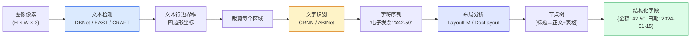

# OCR 文档理解：从文字检测 structured 数据提取

> 图像中的文字对人类一目了然，对计算机却是一层密码——OCR 的工作就是逐层揭开这层密码。

**类型：** 实现课
**语言：** Python
**前置知识：** 第 4 阶段（计算机视觉基础）、第 7 阶段（Transformer 深入）
**预计时间：** ~90 分钟
**所处阶段：** Tier 1
**关联课程：** 第 4 阶段 · 06（目标检测 YOLO）— 文本检测是目标检测在文档场景的特化

## 🎯 学习目标

完成本课后，你能够：

- [ ] 画出经典 OCR 三阶段流水线（检测 → 识别 → 布局）并解释每个阶段的输入输出形状
- [ ] 从零实现 CTC 损失函数和贪婪解码器，理解空白词元的作用
- [ ] 使用 PaddleOCR 和 HuggingFace Transformers 的 Donut 模型完成文档解析
- [ ] 区分 OCR、布局解析和文档理解三个层次，并根据文档类型选择合适方案
- [ ] 诊断中文 OCR 的常见退化原因（生僻字、混排、手写体）并提出改进策略

## 1. 问题

你面前有一张电子发票的图片。提取"总金额"这个字段，对人类来说只需要花 0.1 秒——扫一眼就看到了。但对计算机而言，这张图片只是一组像素值，没有任何"金额"的概念。

最简单的做法是用传统 OCR 引擎把整张图片转为文本，再用正则表达式找"总金额 ：XXX"这种模式。这个方法在理想条件下勉强能用，但实际工程中它会遭遇一系列退化场景：

- 扫描件的透视变形让文字倾斜，字符检测框与文字方向不一致
- 表格中的网格线干扰文本行检测，导致相邻行的文字被合并
- 中文发票中混合了日文汉字变体（如"株式会社"），字库覆盖不全
- 手写签名或手写填单的内容无法用任何规则引擎覆盖

这三个技能层次逐步推进：

1. **OCR 本体**：将像素转换为字符序列
2. **布局解析**：将 OCR 输出分组为结构化区域（标题、正文、表格、页眉）
3. **文档理解**：从布局中提取结构化字段（"发票总额 = 42.50"）

每上一级，任务难度增加，但业务价值也呈指数增长。



每一层的误差会在下一层被放大——检测框偏了，裁剪的区域就不完整；识别错了几个字，布局分析就无法正确分组。现代端到端模型（Donut、Qwen-VL-OCR）试图一次性跳过这些中间步骤，但代价是需要大量标注数据和更强的计算资源。

## 2. 概念

### 2.1 文本检测：找到文字在哪里

文本检测的任务是在图像中标出每一个文字行的边界。与通用目标检测不同，文本检测有三个核心挑战：

1. **任意方向的文字**：发票上的文字可能倾斜、弯曲（弧形排列）
2. **尺度变化**：标题字号大，批注字号小
3. **密集排列**：报纸或表格中，文字行间距可能只有几个像素

主流方法分为两类：

| 类别 | 代表模型 | 思路 | 优点 | 缺点 |
|---|---|---|---|---|
| 两步法 | CRAFT, PSENet | 先检测字符，再聚类成行 | 精度高，可处理复杂布局 | 速度慢，需要后处理 |
| 一步法 | DBNet, EAST | 直接回归文本区域的二值掩码 | 速度快，可微分 | 对极密集文本精度稍低 |

**DBNet（Differentiable Binarization）** 是当前工业界的默认选择。它在最后两个卷积层分别预测"文本区域概率"和"二值掩码"，训练时直接用二值交叉熵损失监督，推理时将概率图通过可微的二值化函数转为二值掩码，再用连通域分析提取文本框。

```
原始图像 → CNN backbone → 特征图 → 双分支头
                              ├── 文本概率图   (H/4 × W/4)
                              └── 二值分割图   (H/4 × W/4)
                                    │
                          可微二值化 → 连通域分析 → 文本框坐标
```

### 2.2 文字识别：读懂文字是什么

检测到文本框后，下一步是把每个区域内的像素内容识别为字符序列。这本质上是一个**不定长序列到不定长序列的映射**——输入图像的宽度决定了时间步数，但输出的字符序列长度完全不确定。

CRNN（Convolutional Recurrent Neural Network）是这一领域的经典架构：

```
输入图像 (1 × H × W)
        │
        ▼
┌───────────────────┐
│  CNN 特征提取器     │  → 压缩高度到 1，保留宽度信息
│  多层卷积 + 池化    │     输出形状: (C, 1, W')
└───────────────────┘
        │
        ▼
┌───────────────────┐
│  BiLSTM 序列建模    │  → 逐列读取特征，编码上下文关系
│  双向 LSTM × 2      │     输出形状: (W', 2*hidden)
└───────────────────┘
        │
        ▼
┌───────────────────┐
│  CTC 损失 + 解码    │  → 消除字符对齐需求，直接输出字符序列
└───────────────────┘
```

三个核心设计决策：

1. **CNN 压缩高度到 1**：卷积 + 最大池化将图像高度压缩为一行，宽度保留。这样每列特征对应一个时间步，自然形成序列
2. **BiLSTM 编码上下文**：单向 LSTM 只能看到左边字符，双向 LSTM 同时考虑前后文——这在识别"己"和"已"这类相似字时至关重要
3. **CTC 损失跳过对齐**：不需要标注每个字符在图像中的精确位置，只需标注"这张图片里的文字是'电子发票'"

ABINet（Attention-Based OCR Network）是更现代的替代方案，引入了迭代纠错机制：先用常规方法识别一次，然后用注意力模块判断哪些字符置信度低，重新聚焦这些区域再做一轮识别。在复杂背景下的表现优于 CRNN。

### 2.3 CTC 详解：无对齐的序列标签

CTC（Connectionist Temporal Classification）的核心思想是**边际化（marginalise）所有可能的字符对齐方式**。

假设模型在 10 个时间步上输出了以下序列（`_` 表示空白符）：

```
时间步:    t1   t2   t3   t4   t5   t6   t7   t8   t9   t10
输出索引:   A    A    B    _    B    C    _    C    C    D
```

CTC 的解码规则是两个操作：

1. **合并重复**：连续的相同索引合并为一个
2. **移除空白**：删除所有 `_`

上述输出经过解码后得到："A B B C C D" → "A B C D"

对于目标文本 "ABCD"，任何经过上述解码后得到 "ABCD" 的对齐方式都是合法的对齐。CTC 损失对所有这些合法对齐方式的概率求和，然后取负对数。

为什么需要空白符？因为空白符允许相邻的相同字符被区分开。如果模型输出的是 `"AA"` 而非 `"A_A"`，合并重复后会变成 `"A"`——丢失了一个字符。空白符的存在使得 "AA" 可以被编码为 `"A_A_"` 或 `"_A_A"` 等形式。

```
目标: "hello"

合法对齐示例:
  h e l _ l o _  →  decode  →  hello
  h _ e l l _ o  →  decode  →  hello    ← 双写'l'靠空白分隔
  _ h e l l o _  →  decode  →  hello

CTC 损失 = -log(P(对齐1) + P(对齐2) + P(对齐3) + ...)
```

### 2.4 文档布局分析与结构化提取

OCR 提取出文本行及其边界框后，还需要知道它们的逻辑关系：

- **段落边界**：哪些文本行属于同一段落
- **标题 vs 正文**：字体大小和位置暗示层级
- **表格还原**：网格线 + 文本对齐 → 行列结构
- **阅读顺序**：拉丁语系从上到下从左到右，中文竖排文件从右到左从上到下

LayoutLMv3（Microsoft）是目前最流行的文档布局分析模型之一。它将三种模态的输入融合到同一个 Transformer 编码器中：

```
LayoutLMv3 输入:
┌─────────────┬─────────────┬─────────────┐
│  视觉特征     │  文本词嵌入   │  位置编码     │
│  (图像 patch)  │  (BERT 输出) │  (归一化坐标)  │
└─────────────┴─────────────┴─────────────┘
          ↓           ↓             ↓
        拼接/融合 → 多层 Transformer 编码器 → 布局类别预测
```

### 2.5 表格还原

表格还原是 OCR 中最具挑战性的子任务之一。表格包含两种信息：

1. **内容**：单元格内的文字
2. **结构**：单元格的行列归属、合并单元格关系

工业界的标准流程：

```
图像 → 网格线检测 → 单元格定位 → 行/列归属 → 表格 HTML/Markdown
  │                              │                │
  └── CTPN / TextShooting       └── CRNN         └── Tableformer /
       (检测水平/垂直线)                                      Line流算法
```

对于没有明显网格线的"无边框表格"（如简历中的经历列表），则需要依赖**视觉线索**：文本行的左对齐位置推断列边界，行间距推断行边界。

### 2.6 中文 OCR 的特殊挑战

中文 OCR 面临的挑战远比英文复杂：

| 挑战 | 说明 | 影响 |
|---|---|---|
| **超大词表** | 常用汉字 3500+，全部汉字 70,000+。英文词表约 50-80 个字符 | 识别层输出维度大幅增加，模型更慢 |
| **形近字混淆** | "己/已/巳""未/末""土/士"在低分辨率下几乎不可区分 | CER 显著高于英文 |
| **中英文混排** | 一行中同时出现中文和英文，且可能有数字、符号 | 检测框跨语言的连续性容易被破坏 |
| **繁体/简体/日文汉字的差异** | "國" vs "国" vs "国"，同一字有三种写法 | 字库覆盖不全会导致乱码 |
| **手写体** | 连笔、潦草程度远超英文手写 | 需要专门的训练数据 |
| **竖排文本** | 古籍、部分港台印刷品仍使用竖排（从右到左） | 检测器需要支持旋转 90° 的文本框 |

## 3. 从零实现

### 第 1 步：最简 CTC 损失与贪婪解码

CTC 的完整前向传播涉及动态规划（Forward-Backward 算法），但我们先从直觉理解开始。

```python
# === CTC 贪婪解码 — 5 行核心逻辑 ===
# 依赖：torch>=2.0
# 对应课程：第 4 阶段 · 19（OCR 文档理解）

import torch
import torch.nn.functional as F


def greedy_ctc_decode(log_probs: torch.Tensor, blank: int = 0) -> list[list[int]]:
    """
    CTC 贪婪解码：每一步取概率最大的词元索引，然后合并重复并移除空白符。

    Args:
        log_probs: 对数概率张量，形状 (T, N, C)
                   T = 时间步数（由 CNN 宽度决定）
                   N = 批次大小
                   C = 词表大小（包括空白符）
        blank: 空白符在词表中的索引，默认为 0

    Returns:
        解码后的字符索引序列列表，每个元素是一个 int 列表
    """
    # 第 1 步：取每步概率最大的词元索引
    preds = log_probs.argmax(dim=-1).transpose(0, 1).cpu().tolist()
    # preds[N][T] = 最大概率词元的整数索引

    out = []
    for seq in preds:
        decoded = []
        prev = None
        # 第 2 步：遍历时间步，合并重复并跳过空白
        for idx in seq:
            if idx != prev and idx != blank:
                decoded.append(idx)
            prev = idx
        out.append(decoded)
    return out
```

贪婪解码的核心在于那行 `if idx != prev and idx != blank`：它同时完成了两个动作——**移除空白符**和**合并连续重复**。这就是 CTC 解码器的全部逻辑。

Beam search 在推理精度上通常优于贪婪解码，但当模型在每个时间步都很确信时，两者差距不到 1% CER（字符错误率）。在工业部署中，**先跑贪婪解码作为基线，只对低置信度样本启用 Beam Search** 是一种有效的工程折衷。

### 第 2 步：CRNN 文字识别网络

CRNN 的关键设计直觉是：**把图像宽度方向"压平"成时间步序列**。

```python
# === TinyCRNN — 最小文字识别网络 ===
# 依赖：torch>=2.0
# 对应课程：第 4 阶段 · 19（OCR 文档理解）

import torch
import torch.nn as nn


class TinyCRNN(nn.Module):
    """
    最小的卷积-循环文字识别网络。
    CNN 负责提取空间特征并将高度压缩到 1，
    BiLSTM 负责利用左右上下文帮助字符识别，
    全连接层 + CTC 损失负责输出字符序列。

    输入: (N, 1, H, W) — 灰度图像，固定高度，可变宽度
    输出: (W', N, C) — 每个时间步的词元分布（含空白符）
    """

    def __init__(self, vocab_size: int = 40, hidden_size: int = 128, feat_size: int = 32):
        super().__init__()
        # --- CNN 特征提取器 ---
        # 前 3 个 MaxPool2d(2) 将高度压缩 8 倍 → 如果输入高度 32，则变为 4
        # 后 2 个 MaxPool2d((2,1)) 只在高度方向压缩 → 最终高度为 1
        self.cnn = nn.Sequential(
            nn.Conv2d(1, feat_size, 3, 1, 1),  # 保持高宽
            nn.BatchNorm2d(feat_size),
            nn.ReLU(inplace=True),
            nn.MaxPool2d(2),                    # 高宽各减半

            nn.Conv2d(feat_size, feat_size * 2, 3, 1, 1),
            nn.BatchNorm2d(feat_size * 2),
            nn.ReLU(inplace=True),
            nn.MaxPool2d(2),                    # 高宽各减半

            nn.Conv2d(feat_size * 2, feat_size * 4, 3, 1, 1),
            nn.BatchNorm2d(feat_size * 4),
            nn.ReLU(inplace=True),
            nn.MaxPool2d((2, 1)),              # 高度减半，宽度不变

            nn.Conv2d(feat_size * 4, feat_size * 4, 3, 1, 1),
            nn.BatchNorm2d(feat_size * 4),
            nn.ReLU(inplace=True),
            nn.MaxPool2d((2, 1)),              # 高度 → 1，宽度保留
        )

        # --- BiLSTM 序列建模 ---
        # batch_first=True 输出 (N, W', 2*hidden_size)
        self.rnn = nn.LSTM(feat_size * 4, hidden_size, bidirectional=True, batch_first=True)

        # --- CTC 输出层 ---
        self.head = nn.Linear(hidden_size * 2, vocab_size)

    def forward(self, x: torch.Tensor) -> torch.Tensor:
        """
        Args:
            x: 输入图像 tensor，形状 (N, 1, H, W)，H 必须能被池化到 1

        Returns:
            对数概率，形状 (W', N, C)，CTC 损失要求的时间优先格式
        """
        # CNN 提取空间特征 → (N, C', H', W')
        features = self.cnn(x)

        # 沿高度维度取平均，压缩到 1 → (N, C', 1, W') → (N, C', W')
        features = features.mean(dim=2)

        # 转置为序列格式 → (N, W', C')，BiLSTM 按 W' 维读入
        features = features.transpose(1, 2)

        # BiLSTM → (N, W', 2*hidden)
        h, _ = self.rnn(features)

        # 全连接层 + log_softmax → (N, W', C)
        logits = self.head(h)

        # CTC 损失期望 (T, N, C) 格式，交换时间维和批次维
        return logits.transpose(0, 1).contiguous()
```

理解这个网络的"维度魔术"至关重要——所有 OCR 识别网络都在做同一件事：**把二维图像转换成一维序列**。CNN 的池化操作是这一转换的核心工具，`MaxPool2d((2, 1))` 这种非正方形核专门用于只在高度方向压缩而保留宽度信息。

### 第 3 步：合成数据构建

真实 OCR 数据集（如 IC DARPA）需要人工标注和复杂的增强管线。我们先从零构建一个合成数据生成器来做 smoke test。

```python
# === 合成 OCR 数据生成器 ===
# 依赖：numpy>=1.24, torch>=2.0
# 对应课程：第 4 阶段 · 19（OCR 文档理解）

import numpy as np
from typing import List, Tuple

import torch


VOCAB = ["_"] + list("0123456789abcdefghijklmnopqrstuvwxyz")
BLANK_IDX = 0


def synthetic_line(text: str, height: int = 32, char_width: int = 16) -> np.ndarray:
    """
    在白色背景上生成黑色文字行图像。
    每个字符占据固定宽度的列，非字母数字字符（如下划线）用灰色表示。

    Args:
        text: 要生成的文本
        height: 图像高度（像素）
        char_width: 每个字符占用的宽度（像素）

    Returns:
        灰度图像 ndarray，形状 (height, width)，值域 [0, 1]
    """
    width = char_width * max(1, len(text))
    img = np.ones((height, width), dtype=np.float32)  # 全白背景

    for i, char in enumerate(text):
        x_start = i * char_width
        # 字母数字 → 黑色（0.0），其他 → 灰色（0.5）
        shade = 0.0 if char.isalnum() else 0.5
        img[6 : height - 6, x_start + 2 : x_start + char_width - 2] = shade

    return img


def build_batch(
    strings: List[str], max_len: int | None = None
) -> Tuple[torch.Tensor, torch.Tensor, torch.Tensor]:
    """
    将文本字符串批次化为 (图像, 目标索引序列, 目标长度) 三元组。

    Args:
        strings: 文本字符串列表
        max_len: 最大字符数（填充用）

    Returns:
        images: (N, 1, H, W) 图像批次
        targets: 展平的目标索引序列
        target_lengths: 每个样本的目标长度
    """
    height = 32
    max_len = max_len or max(len(s) for s in strings)
    width = 16 * max_len

    images = np.ones((len(strings), 1, height, width), dtype=np.float32)
    targets: list[int] = []
    target_lengths: list[int] = []

    for i, s in enumerate(strings):
        line_img = synthetic_line(s)
        images[i, 0, :, : line_img.shape[1]] = line_img

        # 将字符映射到词表索引
        char_ids = [VOCAB.index(c) if c in VOCAB else BLANK_IDX for c in s]
        targets.extend(char_ids)
        target_lengths.append(len(char_ids))

    return (
        torch.from_numpy(images),
        torch.tensor(targets, dtype=torch.long),
        torch.tensor(target_lengths, dtype=torch.long),
    )


def decode_to_str(ids: List[int]) -> str:
    """将 CTC 输出索引序列解码为字符串。"""
    return "".join(VOCAB[i] for i in ids)
```

### 第 4 步：训练闭环

将以上组件组装成一个完整的训练循环。

```python
# === 完整训练循环 — CTC 文字识别 ===
# 依赖：torch>=2.0
# 对应课程：第 4 阶段 · 19（OCR 文档理解）

import torch.nn as nn
import numpy as np


def train_step(model, optimizer, batch_images, batch_targets, batch_target_lens, num_time_steps):
    """
    执行一步 CTC 训练。

    Args:
        model: TinyCRNN 模型
        optimizer: Adam 优化器
        batch_images: (N, 1, H, W) 图像张量
        batch_targets: 展平的目标索引
        batch_target_lens: 每个样本的目标长度
        num_time_steps: 模型输出的时间步数（特征图宽度）
    """
    # 前向传播 → (T, N, C)
    log_probs = model(batch_images)
    input_lens = torch.full((batch_images.size(0),), log_probs.size(0), dtype=torch.long)

    # CTC 损失自动处理所有合法对齐方式
    ctc_loss_fn = nn.CTCLoss(zero_infinity=True)
    loss = ctc_loss_fn(log_probs, batch_targets, input_lens, batch_target_lens)

    # 反向传播
    optimizer.zero_grad()
    loss.backward()
    optimizer.step()
    return loss.item()


def evaluate(model, test_strings, device="cpu"):
    """
    在测试集上评估 OCR 性能，输出每个样本的识别结果和正确标记。

    Args:
        model: 训练好的 TinyCRNN 模型
        test_strings: 待测试的文本列表
        device: 运行设备

    Returns:
        每个样本的 (真实文本, 识别文本, 是否正确) 列表
    """
    model.eval()
    images, _, _ = build_batch(test_strings, max_len=5)
    images = images.to(device)

    with torch.no_grad():
        log_probs = model(images)

    preds = greedy_ctc_decode(log_probs)
    results = []
    for target, pred_ids in zip(test_strings, preds):
        pred_str = decode_to_str(pred_ids)
        results.append((target, pred_str, target == pred_str))
    return results


def main():
    """合成 OCR 训练与评估主流程。"""
    torch.manual_seed(0)
    np.random.seed(0)

    device = "cuda" if torch.cuda.is_available() else "cpu"
    vocab_size = len(VOCAB)
    model = TinyCRNN(vocab_size=vocab_size).to(device)
    optimizer = torch.optim.Adam(model.parameters(), lr=1e-3)

    total_params = sum(p.numel() for p in model.parameters())
    print(f"模型参数总量: {total_params:,}")
    print(f"运行设备: {device}")

    # --- 训练 ---
    train_vocab = [f"abc{d}" for d in range(10)] + [f"xy{d}{d+1}" for d in range(10)]
    num_epochs = 200

    for step in range(num_epochs):
        idx = np.random.choice(len(train_vocab), 8)
        strings = [train_vocab[i] for i in idx]
        imgs, targets, target_lens = build_batch(strings, max_len=5)
        imgs, targets, target_lens = imgs.to(device), targets.to(device), target_lens.to(device)

        log_probs = model(imgs)
        input_lens = torch.full((imgs.size(0),), log_probs.size(0), dtype=torch.long)

        ctc_loss_fn = nn.CTCLoss(zero_infinity=True)
        loss = ctc_loss_fn(log_probs, targets, input_lens, target_lens)

        optimizer.zero_grad()
        loss.backward()
        optimizer.step()

        if step % 40 == 0:
            print(f"Step {step:3d}  Loss: {loss.item():.3f}")

    # --- 评估 ---
    test_strings = ["abc7", "xy45", "abc2", "xyz9"]
    print("\n--- 测试结果 ---")
    results = evaluate(model, test_strings, device=device)
    correct = sum(1 for _, _, ok in results if ok)
    for target, pred, ok in results:
        match_label = "正确" if ok else "偏差"
        print(f"  真实: {target!r:>10s}  预测: {pred!r:>10s}  [{match_label}]")
    print(f"\n准确率: {correct}/{len(results)} ({correct/len(results):.0%})")


if __name__ == "__main__":
    main()
```

预期的训练轨迹：Loss 在第 0 步时约 3.0 左右（随机初始化），在前 100 步快速下降到 1.0 以下，在 200 步时通常低于 0.5。在这类极简合成数据上，模型很快可以达到 100% 准确率——因为它本质上只需学习"黑方块的位置 = 某个字母"。

换到真实的中文手写数据上，同样的架构可能需要 50,000 个样本、200 轮次训练才能达到 95% 以上的行级准确率。

## 4. 工业工具

### 4.1 PaddleOCR —— 工业级 OCR 首选

PaddleOCR 是目前开源界最成熟的 OCR 工具包，支持中英文在内的 80+ 语言。它的默认管线使用 DBNet（检测）+ CRNN（识别），在中文场景下表现极佳。

```python
# 依赖：paddlepaddle>=2.5, paddleocr>=2.7
# 安装：pip install paddlepaddle paddleocr
from paddleocr import PaddleOCR

# lang="ch" 启用中文模型（内置 DBNet + CRNN）
ocr_engine = PaddleOCR(use_angle_cls=True, lang="ch")

# 单张图片 OCR
result = ocr_engine.ocr("invoice.jpg", cls=True)

# result 结构:
# [
#   [
#     [[x1,y1], [x2,y2], [x3,y3], [x4,y4]],  # 四边形坐标
#     ("文字内容", 0.99),                        # (文本, 置信度)
#   ],
#   ...
# ]

# 批量处理 + 导出 JSON
for line_set in result:
    if line_set is None:
        continue
    for bbox, (text, confidence) in line_set:
        print(f"[置信度 {confidence:.2f}] {text}")
```

PaddleOCR 的核心优势：

- **中文词表大**：内置 6732 个常用汉字的识别词表
- **多语言检测**：DBNet 对不同方向的文字都有很好的鲁棒性
- **部署友好**：支持 ONNX export、Paddle Inference TensorRT 加速

### 4.2 HuggingFace Transformers —— Donut 端到端 OCR

Donut（Document Understanding Transformer）彻底放弃了"先检测再识别"的两段式思路。它把整张文档图像喂给 ViT 编码器，然后用 Decoder-only Transformer 直接输出结构化 JSON。

```python
# 依赖：transformers>=4.35, pillow
# 安装：pip install transformers Pillow
from PIL import Image
from transformers import DonutProcessor, VisionEncoderDecoderModel

# 加载预训练的收据解析模型
model = VisionEncoderDecoderModel.from_pretrained(
    "naver-clova-ix/donut-base-finetuned-cord-v2"
)
processor = DonutProcessor.from_pretrained(
    "naver-clova-ix/donut-base-finetuned-cord-v2"
)

# 读取图像
image = Image.open("receipt.jpg").convert("RGB")

# 编码 + 生成
pixel_values = processor(image, return_tensors="pt").pixel_values
generated_ids = model.generate(pixel_values, max_new_tokens=1024)

# 解码为 JSON
generated_text = processor.batch_decode(generated_ids, skip_special_tokens=False)[0]
result = processor.post_process_generation(
    generated_text, image_size=image.size
)
# result = {"image_answering_prompt": "...", "text": '{"total": "¥128.00"}'}
```

注意 Donut 的输出是**可直接解析的 JSON**——不需要额外写解析代码。它在 CORD 数据集（韩国收据）上微调过，可以直接解析常见的收据格式。

### 4.3 Qwen-VL-OCR —— 基于 VLM 的现代方案

Qwen-VL 和 InternVL 等视觉语言模型代表了 2024-2026 年 OCR 的最新趋势：直接让多模态大模型读取文档。

```python
# 依赖：transformers>=4.44, qwen-vl-utils
# 安装：pip install transformers qwen-vl-utils
from transformers import Qwen2VLForConditionalGeneration, AutoProcessor
from qwen_vl_utils import process_vision_info

model = Qwen2VLForConditionalGeneration.from_pretrained(
    "Qwen/Qwen2.5-VL-7B-Instruct",
    torch_dtype="auto",
    device_map="auto",
)

processor = AutoProcessor.from_pretrained("Qwen/Qwen2.5-VL-7B-Instruct")

messages = [
    {
        "role": "user",
        "content": [
            {"type": "image", "image": "invoice.pdf"},
            {"type": "text", "text": "请提取这张发票中的总金额、日期和卖方名称，以 JSON 格式返回。"},
        ],
    }
]

text = processor.apply_chat_template(messages, tokenize=False, add_generation_prompt=True)
image_inputs, video_inputs = process_vision_info(messages)
inputs = processor(
    text=[text],
    images=image_inputs,
    videos=video_inputs,
    padding=True,
    return_tensors="pt",
)
inputs = inputs.to(model.device)

output = model.generate(**inputs, max_new_tokens=512)
response = processor.decode(output[0][inputs.input_ids.shape[1]:], skip_special_tokens=True)
print(response)
# {"total": "¥1,280.00", "date": "2024-03-15", "seller": "北京某某科技有限公司"}
```

VLM-OCR 的核心优势：

1. **语义理解能力强**：不仅能识别文字，还能理解"invoice_total"和"amount_due"是同一个意思
2. **多语言内建支持**：不需要单独配置中英文切换
3. **容错率高**：即使图像模糊或部分遮挡，VLM 也能根据上下文推断出合理内容

劣势也很明显：速度慢（单张图片需要数秒）、成本高（7B 参数模型显存占用大）、不可控性（输出格式偶尔偏离规范）。

### 4.4 方案对比

| 方案 | 适用场景 | 中文支持 | 速度 | 需训练数据 | 部署难度 |
|---|---|---|---|---|---|
| PaddleOCR | 通用文档、票据、证书 | ★★★★★ | 快 (~50ms/页) | 无需 | 低 |
| EasyOCR | 多语种混排文档 | ★★★☆☆ | 中 (~150ms/页) | 无需 | 低 |
| Tesseract | 老式扫描件、高精度印刷 | ★★☆☆☆ | 快 (~30ms/页) | 可选 | 最低 |
| Donut | 固定格式的收据/表单 | ★★★★☆ | 慢 (~500ms/页) | 需要 | 中 |
| Qwen-VL / InternVL | 复杂文档理解、推理 | ★★★★★ | 很慢 (~5s/页) | 可选 | 高 |

## 5. 知识连线

本课学习的 OCR 技术是多模态 AI 的基础拼图：

- **第 4 阶段 · 06（目标检测 YOLO）**：文本检测本质上是一个密度极高的目标检测问题，DBNet 的检测头与 YOLO 的单阶段检测思路异曲同工
- **第 7 阶段 · Transformer 深入**：CRNN 中的 BiLSTM 正在被纯 Transformer 架构取代；Donut 中的 ViT + Decoder 就是本章知识的直接应用
- **第 12 阶段 · 多模态 AI**：OCR 是多模态模型的"眼睛"——无论 Qwen-VL 还是 GPT-4o，底层都离不开文本检测与识别能力
- **第 17 阶段 · 生产部署**：OCR 流水线在工厂中的部署涉及 GPU 推理优化（TensorRT）、异步请求队列、重试降级等工程实践

## 6. 工程最佳实践

### 6.1 中文场景特别建议

- PaddleOCR 的中文模型默认加载，使用 `lang="ch"` 即可。如果需要更强的繁体中文支持，可以切换到 `lang="chinese_cht"`
- 处理中日韩混排文档时，PaddleOCR 的文本检测部分表现最好。识别部分建议配合自定义词表扩充汉字覆盖率
- 对于扫描件（尤其是低 DPI 的传真件），先在预处理阶段做二值化（Otsu 阈值）和去噪（高斯滤波），可以提升 10-15% 的识别准确率

### 6.2 生产环境选型指南

| 条件 | 推荐方案 | 原因 |
|---|---|---|
| 单页延迟 < 100ms | PaddleOCR CPU 版 | 无需 GPU，单页 < 80ms |
| 吞吐量 > 1000 页/分钟 | PaddleOCR + TensorRT GPU | DBNet + CRNN 在 TensorRT 下可达 200ms/页批处理 |
| 需要结构化字段提取 | PaddleOCR + Donut 微调 | 先用 OCR 提取行文本，再用 Donut 做字段归类 |
| 手写体文档 | Qwen-VL-32B | 目前手写体理解最强的开源模型 |
| 离线环境 / 数据合规 | Tesseract + 自定义训练 | 完全本地运行，数据不出境 |

### 6.3 预处理黄金组合

```python
from PIL import ImageFilter
import cv2
import numpy as np


def preprocess_for_ocr(image: np.ndarray) -> np.ndarray:
    """
    OCR 前的标准预处理流水线。
    顺序很重要：先去噪再二值化，二值化后再修正几何形变。

    Args:
        image: BGR 格式图像 (OpenCV 默认)

    Returns:
        预处理后的灰度图像，适合 OCR 引擎直接输入
    """
    # 第 1 步：转灰度
    gray = cv2.cvtColor(image, cv2.COLOR_BGR2GRAY)

    # 第 2 步：去噪（保边平滑）
    gray = cv2.bilateralFilter(gray, d=9, sigmaColor=75, sigmaSpace=75)

    # 第 3 步：二值化（Otsu 自动阈值）
    _, binary = cv2.threshold(gray, 0, 255, cv2.THRESH_BINARY + cv2.THRESH_OTSU)

    # 第 4 步：去网格线（适用于表单扫描件）
    kernel = cv2.getStructuringElement(cv2.MORPH_RECT, (3, 3))
    dilated = cv2.dilate(binary, kernel, iterations=2)
    eroded = cv2.erode(dilated, kernel, iterations=1)
    binary = cv2.bitwise_and(binary, eroded)

    return binary
```

### 6.4 质量监控指标

在生产环境中需要持续追踪以下指标：

| 指标 | 计算方式 | 警戒值 |
|---|---|---|
| 平均置信度 | 所有识别结果的置信度均值 | < 0.85 告警 |
| 低置信度比例 | 置信度 < 0.6 的结果占比 | > 5% 告警 |
| CER（字符错误率）| Levenshtein 距离 / 参考长度 | > 3% 需要排查 |
| 人工复核率 | 需要人工介入的比例 | > 10% 模型退化 |

## 7. 常见错误

### 错误 1：忽略图像预处理直接跑 OCR

**现象：** 对扫描件、翻拍照片直接调用 PaddleOCR，识别率在低分辨率或强光环境下低于 60%。

**原因：** 未经预处理的图像存在光照不均、噪声、倾斜等问题。OCR 模型在训练时使用的是清洗过的数据，直接输入脏数据会导致特征分布偏移。

**修复：**

```python
# ❌ 错误写法 — 直接输入原始图像
result = ocr.ocr("bad_scan.jpg")

# ✓ 正确写法 — 先做预处理
from PIL import Image
import numpy as np

raw = cv2.imread("bad_scan.jpg")
preprocessed = preprocess_for_ocr(raw)  # 上面定义的预处理函数
result = ocr.ocr(preprocessed)
```

### 错误 2：混淆 CER 和 WER

**现象：** 团队报告"OCR 准确率达到 99%"，但实际使用中发现大量错别字。

**原因：** CER（字符错误率）和 WER（词错误率）是两个不同的度量。在中文场景中几乎不存在"词边界"的概念，所以应该统一使用 CER。如果一个句子有 20 个字，CER = 5% 意味着平均每句有 1 个字出错；但如果翻译成 WER，由于中文字串难以分词，这个指标几乎无法定义。

**修复：** 中文场景只报告 CER，报告时注明计算公式：

```
CER = LevenshteinDistance(预测文本, 真实文本) / len(真实文本)
```

### 错误 3：训练数据中汉字覆盖率不足

**现象：** 模型在常见字（的、是、了）上表现良好，但在姓名、地名中的生僻字上一致报错。

**原因：** 训练集中高频字符占比超过 80%，生僻字的训练样本极少。OCR 模型的词表虽然能容纳数千个汉字，但模型只能记住训练中见过足够的字。

**修复：**

```python
# 用 Counter 分析训练集中的字符频率分布
from collections import Counter

char_counts = Counter()
for text in training_texts:
    char_counts.update(text)

# 检查低频字符是否足够
total_chars = sum(char_counts.values())
rare_chars = {c: n for c, n in char_counts.items() if n < 10}
print(f"低频字符 (< 10 次): {len(rare_chars)} 个，占总量 {sum(rare_chars.values())/total_chars:.1%}")
# 如果此值超过 20%，说明有大量汉字样本不足，需要数据增强或人工补充
```

### 错误 4：CTC Beam Width 设置过小

**现象：** 在简单的数字验证码场景下，Beam Search 并没有比 Greedy 好多少；但在中文场景下，Greedy 解码的 CER 反而比 Beam Search 高了 8%。

**原因：** 中文的字形相似度远高于英文（"己已巳"三字在低分辨率下几乎一样），单步 argmax 容易出错。Beam Width = 3 时，候选路径太少，无法覆盖多种可能的对齐方式。

**修复：**

```python
# ✓ 中文场景推荐
# Greedy: 仅用于高速场景（验证码、数字序列）
# Beam Search, width=10: 通用中文场景
# Beam Search, width=20 + LM 语言模型: 高精度场景（合同、法律文书）

# 注意：CTC 单独的 Beam Search 在中文场景提升有限
# 真正的突破来自加入语言模型（LM rescoring）
# 将 N-gram 语言模型的得分加权到 Beam 搜索中
```

### 错误 5：文本检测框没有旋转角度信息

**现象：** 倾斜文档的 OCR 结果出现字符断裂或合并。

**原因：** 默认 DBNet 输出的是矩形框（axis-aligned bounding box），无法包裹倾斜的文字行。当文字倾斜超过 15° 时，矩形框会裁剪掉部分文字或包含过多背景噪声。

**修复：** 使用支持旋转框的模型（如 DB++ 或使用 RBOX 表示），并在识别前做仿射变换矫正：

```python
# ✓ 对倾斜文本行做旋转校正
import cv2

def deskew_text_crop(crop, angle):
    """
    将倾斜的文本裁剪图像旋转回水平。
    Args:
        crop: 文本区域的裁剪图像
        angle: 旋转角度（度）
    """
    (h, w) = crop.shape[:2]
    center = (w // 2, h // 2)
    M = cv2.getRotationMatrix2D(center, angle, 1.0)
    rotated = cv2.warpAffine(crop, M, (w, h), flags=cv2.INTER_CUBIC, borderMode=cv2.BORDER_REPLICATE)
    return rotated
```

## 8. 面试考点

### Q1：为什么 CTC 损失不需要字符级别的对齐标注？（难度：⭐⭐）

**参考答案：**

CTC 的优势在于它通过空白符（blank token）和重复合并规则，将无限多的可能对齐方式"边际化"到了同一个损失计算中。模型在每个时间步独立地预测一个字符分布，CTC 损失函数遍历所有经过"合并重复 + 移除空白"后等于目标文本的对齐序列，对这些对齐的概率求和，然后取负对数作为损失。换句话说，模型不需要知道第几个时间步对应哪个字符，CTC 自动把所有可能的映射都考虑进去了。

这也意味着 CTC 不能利用时间步之间的依赖关系——每个时间步的输出是独立的。这是 CTC 相比 Attention-based 方法（如 Sequence-to-Sequence with Attention）的主要劣势，后者可以利用注意力机制捕捉全局依赖。

### Q2：CRNN 为什么要先把高度压缩到 1 再送入 LSTM？（难度：⭐⭐⭐）

**参考答案：**

这是 CRNN 最精妙的设计之一。LSTM/RNN 是一种序列模型，输入必须是 1D 序列（时间步 × 特征维度）。将图像高度压缩到 1 后，宽度方向自然就形成了时间步——每一列特征就是一个时间步上的观测值。这种设计假设了"横向展开的图像内容对应时间序列"，在文字行识别的场景中是完全合理的（阅读顺序就是从左到右）。

反过来想，如果保持二维特征图直接输入，就需要 ConvLSTM——它确实存在（如 ConvLSTM 论文所述），但参数量更大、训练更不稳定。CRNN 的"CNN 降维 + LSTM 序列建模"拆分，将问题解耦为"特征提取"和"序列建模"两个清晰的子问题。

### Q3：在什么场景下端到端 OCR（如 Donut）比传统两阶段 OCR（DBNet + CRNN）更好？什么时候传统方法更优？（难度：⭐⭐⭐）

**参考答案：**

端到端更适合的场景：

- **文档格式相对固定**：如收据、表单、发票。Donut 可以在少量标注数据（几百张样本）上微调，学会特定的布局-到-JSON 映射
- **需要语义理解**：不仅识别文字，还要理解"金额"和"日期"的逻辑关系
- **误差累积敏感**：两阶段 OCR 中检测错误会直接导致识别输入被裁剪错误，端到端没有这个传递效应

传统两阶段更适合的场景：

- **自由格式文档**：如扫描书刊、报纸、混合排版。两阶段可以分别优化检测和识别，端到端模型很难同时学好这两个差异化任务
- **极端资源受限**：DBNet + CRNN 总参数量约 20M，可在低端 GPU 甚至 CPU 上实时运行；Donut/ViT 动辄数百 MB 到数 GB
- **中文大规模词表**：当前端到端模型对中文字符的泛化能力仍不如 CRNN 配合自定义词表的方案

### Q4：如何实现一个简单的中文字符错误率（CER）计算？（难度：⭐⭐）

**参考答案：**

```python
def levenshtein_distance(s1: str, s2: str) -> int:
    """计算两个字符串之间的编辑距离。"""
    m, n = len(s1), len(s2)
    dp = [[0] * (n + 1) for _ in range(m + 1)]
    for i in range(m + 1):
        dp[i][0] = i
    for j in range(n + 1):
        dp[0][j] = j
    for i in range(1, m + 1):
        for j in range(1, n + 1):
            cost = 0 if s1[i - 1] == s2[j - 1] else 1
            dp[i][j] = min(dp[i - 1][j] + 1,      # 删除
                           dp[i][j - 1] + 1,      # 插入
                           dp[i - 1][j - 1] + cost)  # 替换
    return dp[m][n]


def compute_cer(predicted: str, reference: str) -> float:
    """
    计算字符错误率。
    CER = 编辑距离 / 参考文本长度

    Args:
        predicted: 模型预测的文本
        reference: 人工标注的真实文本

    Returns:
        CER 值（0 = 完全正确，1 = 完全不同）
    """
    dist = levenshtein_distance(predicted, reference)
    return dist / len(reference) if len(reference) > 0 else 0.0
```

## 🔑 关键术语

| 术语 | 人们怎么说 | 实际含义 |
|---|---|---|
| OCR | "从图片里读字" | 光学字符识别——将图像中的文字区域转换为机器可读的字符序列，包含检测、识别、布局三个子任务 |
| CTC | "不需要对齐的损失" | Connectionist Temporal Classification——通过在输出中引入空白符并对齐方式求和，使序列模型能在不知道每帧对应哪个字符的情况下训练 |
| CRNN | "老一代 OCR 模型" | CNN + BiLSTM + CTC 的三件套架构，2015 年提出，至今仍是生产系统中最常用的文字识别基线 |
| DBNet | "能快速检测文字的模型" | Differentiable Binarization——用可微二值化替代传统阈值操作，端到端训练文本检测器，是目前最快的两步法检测方案 |
| Donut | "不检测的直接读取" | Document Understanding Transformer——ViT 编码器 + Transformer 解码器，直接将文档图像转为 JSON，跳过中间的所有步骤 |
| Layout parsing | "找出哪里是标题哪里是正文" | 文档布局分析——检测并标注每个区域的语义类别（标题、段落、表格、图片等），重建文档的逻辑结构 |
| CER / WER | "错误率越低越好" | Character/Word Error Rate——Levenshtein 编辑距离除以参考文本长度，衡量识别结果的字符级准确性 |
| 空白符 | "占位符" | CTC 中的特殊符号（通常 index=0），用于区分相邻重复字符（如"aa"需要编码为"a_ a"才能被 CTC 正确识别） |
| 旋转框 | "倾斜的矩形" | Oriented Bounding Box——不只是矩形对齐轴的边界框，而是可以旋转到任意角度的四边形，用于包裹倾斜的文字行 |
| VLM-OCR | "大模型读文字" | 视觉语言模型执行的 OCR 任务——不是专门的 OCR 模型，而是让 GPT-4o、Qwen-VL 等通用多模态模型来完成文档理解和文本提取 |

## 📚 小结

OCR 的本质是将视觉信号转化为结构化文本信息。从经典的 DBNet + CRNN 流水线到端到端的 Donut 和 VLM-OCR，技术在不断演进，但核心的 CTC 序列建模思想自 2006 年提出以来几乎没有改变。掌握这些基础，你就能在任何一个 OCR 任务中选择最合适的方案。

下一课我们将探讨如何将 OCR 提取的文本与其他视觉信息（如二维码、人脸、Logo）联合理解，进入多模态文档理解的领域。

## ✏️ 练习

1. 【理解】用自己的话解释 CTC 损失中"空白符"为什么不能省略。写一段不超过 200 字的说明，解释为什么如果没有空白符，模型无法识别像"妈妈"、"爸爸"这样的叠词。

2. 【实现】修改 `build_batch` 函数，使其支持不同长度的文本行（即填充到 batch 内最长样本的长度），并在 `main()` 中加入一个长度为 8 的测试字符串来验证填充效果。

3. 【实验】在本地安装 PaddleOCR（`pip install paddlepaddle paddleocr`），对一张包含中英文混排的截图进行 OCR 测试。比较 `lang="en"` 和 `lang="ch"` 两种模式下中文部分的识别差异。

4. 【思考】为什么说"中文 OCR 比英文 OCR 难得多"？从词表大小、字形复杂度、语言模型缺失三个角度分别论证。

5. 【实验】修改 `TinyCRNN` 的网络结构——将 LSTM 层改为 GRU 层（`nn.GRU`），对比两种循环结构在相同训练轮次下的收敛速度和最终 CER。GRU 的参数更少，理论上训练更快，但在中文长文本识别上是否足够？

## 🚀 产出

本课产出以下可复用内容：

| 产出 | 文件 | 说明 |
|---|---|---|
| CTC 解码器实现 | `code/main.py` | 从零实现的 TinyCRNN + CTC 损失 + 贪婪解码，含训练和评估流程 |
| 可复用提示词 | `outputs/prompt-ocr-guide.md` | 针对特定文档类型选择 OCR 方案和提示词的决策指南 |

## 📖 参考资料

1. [论文] Shi et al. "An End-to-End Text Recognition Network". IJCAI, 2015. https://arxiv.org/abs/1507.05717
2. [论文] Graves et al. "Connectionist Temporal Classification: Labelling Unsegmented Sequence Data with Recurrent Neural Networks". ICML, 2006. https://www.cs.toronto.edu/~graves/icml_2006.pdf
3. [论文] Chen et al. "Real-time Scene Text Detection with Differentiable Binarization". AAAI, 2020. https://arxiv.org/abs/1911.08947
4. [论文] Kim et al. "OCR-Free Document Understanding Transformer". ECCV, 2022. https://arxiv.org/abs/2111.15664
5. [论文] He et al. "LayoutLMv3: Pre-training for Document AI with Unified Text and Image Masking". ICML, 2022. https://arxiv.org/abs/2204.08387
6. [官方文档] PaddleOCR 文档: https://github.com/PaddlePaddle/PaddleOCR
7. [GitHub] HuggingFace Transformers Donut 示例: https://github.com/huggingface/transformers/tree/main/examples/pytorch/image-preprocessing
8. [论文] Liu et al. "An Image is Worth 16×16 Words: Transformers for Image Recognition at Scale". ICLR, 2021. https://arxiv.org/abs/2010.11929

---

> 本课程参考了 AI Engineering From Scratch（MIT License）的课程体系，在此基础上进行了重构和原创内容的扩充。所有中文表达、案例、LLM 视角分析、工程最佳实践、常见错误、面试考点等均为原创内容。
