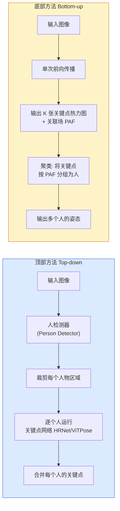

# 人体姿态估计：从热力图到关键点检测

> 姿态估计的本质不是"画骨架"——是将二维图像坐标回归转化为逐像素的分类问题。热力图是这个转化过程的桥梁。

**类型：** 实现课
**语言：** Python
**前置知识：** 阶段 04 · 06（目标检测 YOLO）、阶段 04 · 07（语义分割 UNet）— 理解卷积网络、归一化操作和编码器-解码器架构，以及损失函数的基本设计
**预计时间：** ~90 分钟
**所处阶段：** Tier 1
**关联课程：** 阶段 04 · 08（实例分割 Mask R-CNN）— Mask R-CNN 在检测基础上增加关键点分支，是姿态估计的工程升级；阶段 12 · 03（视频理解多模态）— 多人姿态估计是动作识别和运动分析的基础

---

## 🎯 学习目标

完成本课后，你能够：

- [ ] 解释为何姿态估计使用热力图回归而非直接坐标回归，并推导高斯目标的设计原理
- [ ] 从零实现一个类 Hourglass 架构的关键点检测网络，包含残差块与转置卷积上采样
- [ ] 解释顶部方法（Top-down）与底部方法（Bottom-up）的区别，并用部分亲和场（PAF）说明 OpenPose 的聚类原理
- [ ] 实现子像素精度关键��提取算法，理解它如何将整数网格误差降低约 50%
- [ ] 使用 MediaPipe Pose 或 MMPose 完成生产级姿态估计推理，理解其输出格式和延迟特性

---

## 1. 问题

一个视频帧里有十个人，你需要知道每个人的每一个关节在哪里。

这个问题有三种看起来可行的答案：

| 方案 | 输出 | 问题 |
|---|---|---|
| **坐标回归** | 直接预测 `(x, y)` 坐标值 | MSE 损失对位置不敏感——预测偏差一个像素的损失和偏差十个像素的损失可能不同，但模型没有空间结构先验 |
| **热图分类** | 把图像划分为 $H \times W$ 个格子，每个格子预测"某个关键点在此" | 分类数量爆炸——$H \times W$ 类，且相邻格子完全独立，没有平滑性假设 |
| **热图回归**（正确答案） | 为每个关键点预测一张 $H \times W$ 的高斯热图 | 保留空间结构、提供平滑梯度、自然匹配 CNN 的特征图维度 |

这就是为什么所有现代姿态模型都用**热力图**。

热力图的核心直觉很简单：对于每个关键点，在它的真实位置放一个高斯峰值，网络学习预测这些峰值的位置。推理时取每张热力图的 argmax，就得到关键点坐标。

```
一个典型的人体姿态热力图示意（32×32 分辨率，5 个关键点）：

关键点 "左肩" 的热力图:              关键点 "右肩" 的热力图:

         . . . . . .                  . . . . . . . .
      .  ░░░░░░░░░░░░  .           .  ░░░░░░░░░░░░░░░░  .
    ░░▒▒██████████████▒▒░░         ░░▒▒████████████████▒▒░░
   ▒▒████████████████████▒         ▒▒████████████████████▒
   ▒▒████████████████████▒         ▒▒████████████████████▒
    ░░▒▒██████████████▒▒░░          ░░▒▒██████████████▒▒░░
      .  ░░░░░░░░░░░░  .              .  ░░░░░░░░░░░░  .
         . . . . . .                  . . . . . . . .

argmax → (x=10, y=12)                  argmax → (x=22, y=12)
```

不做这件事，你的模型会学到一种脆弱的"像素级记忆"——稍微旋转一下图像、缩放一下尺度、或者背景换掉，预测就完全失效。热力图提供了一种归纳偏置：相近位置的相似热力图产生相似的损失。这是 CNN 的天然语言。

---

## 2. 概念

### 2.1 关键点检测的基本结构

姿态估计任务的核心结构在所有变体（人体、手部、面部、动物）中都是相同的：

```
输入图像 (H×W×3)
       │
       ▼
┌──────────────┐
│  骨干网络      │ ← ResNet / HRNet / ViT 等特征提取器
│  (Backbone)   │
└──────┬───────┘
       │ 特征图 (C, H_s, W_s)
       ▼
┌──────────────┐
│  关键点头部    │ ← 下采样 → 中间处理 → 上采样
│  (Head)      │
└──────┬───────┘
       │ K 张热力图 (K, H_s, W_s)
       ▼
┌──────────────┐
│  Argmax +     │ ← 整数坐标 → 子像素细化
│  子像素优化    │
└──────┬───────┘
       │ K 个关键点的 (x, y) 坐标 (K, 2)
       ▼
输出：[头部, 左肩, 右肩, 左肘, 右肘, 左手, 右手, ...]
```

关键点数量 $K$ 因数据集而异：

| 数据集 | 关键点数量 | 示例 |
|---|---|---|
| COCO | 17 | 鼻子、双眼、双耳、双肩、双肘、双手、双髋、双膝、双脚 |
| MPII | 16 | 成人上半身关节 |
| FaceMesh | 478 | 面部密集标志点 |
| Hands | 21 | 手部关节 + 指尖 |

每个数据集的关键点有固定的连接关系（称为**肢体**或**limb**），决定了如何把关键点"连成骨架"。COCO 标准身体连接有 16 条肢体：

```
COCO 关键点编号 (0-16):

          0(鼻子)
         /    \
    1(左眼)  2(右眼)   3(左耳)  4(右耳)
      |            |         |         |
    5(左肩)-------6(右肩)
      |                   |
    7(左肘)-----------8(右肘)
      |                   |
    9(左手)-----------10(右手)
      |
   （继续: 11-16 为髋、膝、脚）
```

### 2.2 顶部方法 vs 底部方法

姿态估计算法分为两大流派：



**顶部方法（Top-down）** 的两阶段流程：

1. 用目标检测器（如 YOLOv8）检测画面中所有人物的边界框
2. 裁剪每个边界框，送入关键点检测网络预测该人物的关键点

优点：单人精度高，因为每个裁剪区域只包含一个人，网络可以专注于细节。
缺点：时间复杂度随人数线性增长——画面中有 100 个人就需要 100 次前向传播。

**底部方法（Bottom-up）** 的单阶段流程：

1. 整图一次前向传播，输出所有人的关键点热力图和关联场（PAF）
2. 后处理聚类：根据 PAF 方向场将相邻关键点匹配到同一个人

优点：时间与人数无关——无论画面中有多少人，都只做一次前向传播。
缺点：聚类阶段增加了后处理复杂度，且在人群高度重叠时容易出错。

工程选择原则：一个人物场景优先顶部方法（精度更高），10 人以上拥挤场景优先底部方法（效率更高）。

### 2.3 Hourglass、HRNet 与 OpenPose 三种架构

#### Hourglass Network（多层金字塔结构）

Hourglass 网络的核心思想是：**在同一张特征图上反复做编码-解码，每次都得到更精细的关键点热力图。**

```
Hourglass Block 的结构：

输入 → [编码器 ↓↓] → [瓶颈 ResBlock] → [解码器 ↑↑]
                                    │
                              残差连接（skip）
                              （原始输入直接连到输出）
                                    │
                                    ▼
                              辅助热力图头
                              （每层都输出一次）

典型的 8 层 Hourglass（8 个 Block 堆叠）：
每个 Block 把分辨率降半再升半，输出一个热力图
最后一个 Block 的输出加上之前所有辅助输出的平均 → 最终热力图
```

核心设计决策：

- 每层的辅助热力图头通过 $1 \times 1$ 卷积将中间特征映射到 $K$ 通道
- 训练时，辅助头的输出也参与损失计算（权重通常为 0.25），这迫使中间层学会有用的表示
- 8 层堆叠意味着网络可以在不同尺度上逐步 refine 关键点的定位

```python
# Hourglass 的核心理念（伪代码，展示"反复精炼"的思想）：
# 第 1 层粗估计 → 第 2 层 refine → ... → 第 8 层精细输出
# 每一层的输出都包含在最终损失中
```

Hourglass 的计算代价很高——8 层堆叠，每层有完整的编解码路径，导致参数量通常在 20M~30M 范围。

#### HRNet（始终保持高分辨率）

HRNet 提出了一个反直觉的设计：**不要在编码过程中降低分辨率，而应该从一开始就保持高分辨率通道。**

```
传统 CNN 流程（ResNet 等）：
输入 → [低分辨率大量通道] → [越来越低的分辨率] → [解码]

HRNet 流程：
输入 → [高分辨率分支] ───────┐
       [中分辨率分支] ─────┐  │
       [低分辨率分支] ┐  │  │
                    │  │  │
              跨分辨率交换（双向）←── 这是核心创新
                    │  │  │
                    └──┴──┘
              所有分辨率的特征图始终存在并交互
```

HRNet 的创新在于**跨分辨率融合**：每个阶段（stage）开始时，高分辨率分支和低分辨率分支进行双向信息交换——高分辨率提供空间细节，低分辨率提供语义信息。这个过程持续整个网络，而不像 Hourglass 那样只在最后做解码。

HRNet 目前在 COCO 姿态估计基准上的精度优于 Hourglass，且推理速度更快，因为它不需要堆叠多层。

#### OpenPose（底部方法先驱）

OpenPose 是第一个大规模应用的实时多人姿态估计系统，其核心创新是**部分亲和场（Part Affinity Fields, PAF）**。

```
PAF 的工作原理：

1. 网络输出两个东西：
   - K 张关键点热力图（如 COCO 的 17 张）
   - L 个 2 通道 PAF 图（16 条肢体 × 2 通道 = 32 张图）

2. 每条肢体的 PAF 编码了从一个关节指向另一个关节的单位向量：
   左肩 → 左肘:  PAF_left_shoulder_to_elbow = (dx, dy)

3. 聚类过程：
   - 在网络输出的热力图中找到所有候选关键点
   - 对每一条肢体连接（如 shoulder-elbow），
     积分 PAF 沿连接方向的投影值
   - 投影值高的一对关键点被判为"属于同一个人"

这本质上是一个二分图匹配问题，可以用匈牙利算法在多项式时间内求解。
```

### 2.4 2D 到 3D 的姿态提升

**2D 姿态估计（当前成熟能力）：** 从单张 RGB 图像中预测 $K$ 个关键点的 $(x, y)$ 图像坐标。主流模型（MediaPipe、HRNet、ViTPose）可以在一张 RTX 3090 上用 < 10ms 完成单人姿态预测，支持批量多人。

**3D 姿态估计（当前研究前沿）：** 从单张或多张图像中预测关键点的三维坐标 $(X, Y, Z)$，即在世界坐标系或相机坐标系中的位置。

单张 RGB 图像做 3D 姿态估计面临根本性的**深度歧义**问题——同一个 2D 投影可以由无限多个 3D 姿态产生。现有方法通过三种方式缓解这一问题：

**方法 1：从 2D 提升（Lift-from-2D）**

先用 2D 姿态模型检测出关键点，再用一个 MLP（多层感知机）将它们映射到 3D 空间。经典工作如 VideoPose3D：

$$
\text{pose}_{3D} = f_{MLP}(\text{pose}_{2D}^{t-T}, \dots, \text{pose}_{2D}^t, \dots, \text{pose}_{2D}^{t+T})
$$

时序上下文（前后几帧的 2D 姿态序列）帮助消解深度歧义——连续帧之间的运动约束限制了可能的 3D 轨迹。

**方法 2：直接 3D 回归**

网络直接从图像特征回归 3D 坐标，如 PyMAF 和 MHFormer。这类方法通常在训练时使用已知深度的数据（如 CMU Panoptic 的多视图标定数据）来建立学习信号。

**方法 3：参数化人体模型拟合**

使用 SMPL（Skinned Multi-Person Linear Model）等参数化人体模型，将 3D 姿态拟合到一个参数化的形状空间中。这种方法的优势是可以生成一致的全身体态，但需要多相机标定或额外的正则化。

工程中，如果只需要粗略的相对 3D 姿态（如健身应用中判断膝盖弯曲角度），2D-to-3D 提升的方法已经足够。如果需要绝对的三维坐标（如机器人抓取），则需要多相机标定或深度传感器。

### 2.5 训练目标——热力图损失

训练姿态模型的标准目标是逐像素的均方误差（MSE）或对数二次交叉熵（Log-Quadratic Cross Entropy）：

$$
\mathcal{L} = \frac{1}{N \cdot K \cdot H \cdot W} \sum_{n=1}^{N} \sum_{k=1}^{K} \| H_{\text{pred}}^{(n,k)} - H_{\text{gt}}^{(n,k)} \|_2^2
$$

其中 $H_{\text{gt}}^{(n,k)}$ 是第 $n$ 张图像中第 $k$ 个关键点的高斯热力图目标。

**高斯 sigma 的选择至关重要**：sigma 太小会导致热力图过于尖锐（退化为分类），太大则会让两个相邻关键点的峰值互相干扰。一般经验法则：

$$
\sigma = \frac{\min(W, H)}{256} \times \text{scale_factor}
$$

对于 COCO 数据集，常用 `scale_factor = 1.0`，在 $256 \times 256$ 输入下 $\sigma = 1.0$，在 $512 \times 512$ 输入下 $\sigma = 2.0$。

---

## 3. 从零实现

完整可运行代码见 `code/main.py`。以下逐步展示核心组件。

### 第 1 步：高斯热力图生成（训练目标）

每个关键点对应一张高斯热力图。高斯核的峰值位于关键点的真实坐标处，网络学习回归这些热力图。

```python
def gaussian_heatmap(size, cx, cy, sigma=2.0):
    """生成单个关键点的高斯热力图。

    热力图是姿态估计的训练目标——每个关键点对应一张 H×W 的图，
    高斯峰值位于关键点的真实坐标处。网络学习预测这些热力图，
    推理时取 argmax 得到坐标。
    """
    yy, xx = np.meshgrid(np.arange(size), np.arange(size), indexing="ij")
    return np.exp(-((xx - cx) ** 2 + (yy - cy) ** 2) / (2 * sigma ** 2)).astype(np.float32)
```

调用示例：

```python
hm = gaussian_heatmap(64, 32, 32, sigma=2.0)
print(f"峰值: {hm.max():.3f}, 峰值位置: ({hm.argmax() % 64}, {hm.argmax() // 64})")
# 峰值: 1.000, 峰值位置: (32, 32)
```

### 第 2 步：小型关键点检测网络（类 Hourglass 架构）

借鉴 Hourglass 的编码-解码思想，构建一个带残差连接的简化版本：

```python
class ResBlock(nn.Module):
    """残差卷积块——Hourglass 网络的基础组件。"""

    def __init__(self, channels):
        super().__init__()
        self.net = nn.Sequential(
            nn.Conv2d(channels, channels, 3, padding=1, bias=False),
            nn.BatchNorm2d(channels),
            nn.ReLU(inplace=True),
            nn.Conv2d(channels, channels, 3, padding=1, bias=False),
            nn.BatchNorm2d(channels),
        )
        self.relu = nn.ReLU(inplace=True)

    def forward(self, x):
        return self.relu(x + self.net(x))


class TinyKeypointNet(nn.Module):
    """简化版姿态估计网络。

    架构思路借鉴 Hourglass Network：
    - 编码路径：两层下采样，逐步扩大感受野
    - 中间瓶颈：残差块处理最深层特征
    - 解码路径：转置卷积上采样恢复空间分辨率

    输入 (N, 3, H, W)，输出 (N, K, H, W) 的热力图。
    K = 关键点数量（COCO 标准为 17）。
    """

    def __init__(self, num_keypoints=17, base_channels=64):
        super().__init__()
        # 编码路径：逐步下采样
        self.enc1 = nn.Sequential(
            nn.Conv2d(3, base_channels, 3, stride=2, padding=1, bias=False),
            nn.BatchNorm2d(base_channels),
            nn.ReLU(inplace=True),
            ResBlock(base_channels),
        )
        self.enc2 = nn.Sequential(
            nn.Conv2d(base_channels, base_channels * 2, 3, stride=2, padding=1, bias=False),
            nn.BatchNorm2d(base_channels * 2),
            nn.ReLU(inplace=True),
            ResBlock(base_channels * 2),
        )
        # 瓶颈层：处理最低分辨率的特征
        self.bottleneck = ResBlock(base_channels * 2)
        # 解码路径：转置卷积上采样
        self.dec1 = nn.Sequential(
            nn.ConvTranspose2d(base_channels * 2, base_channels, 4, stride=2, padding=1, bias=False),
            nn.BatchNorm2d(base_channels),
            nn.ReLU(inplace=True),
            ResBlock(base_channels),
        )
        self.dec2 = nn.ConvTranspose2d(base_channels, num_keypoints, 4, stride=2, padding=1)

    def forward(self, x):
        h1 = self.enc1(x)
        h2 = self.enc2(h1)
        h3 = self.bottleneck(h2)
        u1 = self.dec1(h3)
        return self.dec2(u1)
```

输入形状 $(N, 3, H, W)$，输出形状 $(N, K, H, W)$。输出通道的数量等于关键点数量——网络为每个关键点"画"一张热力图。

### 第 3 步：热力图到坐标提取（含子像素精度）

推理时从热力图中恢复关键点坐标：

```python
def heatmap_to_coords(heatmaps):
    """从热力图中提取关键点坐标（整数 argmax）。

    Args:
        heatmaps: (N, K, H, W) 张量
    Returns:
        coords: (N, K, 2) 浮点坐标 [x, y]
        conf:   (N, K) 每个关键点的置信度（热力图峰值）
    """
    N, K, H, W = heatmaps.shape
    flat = heatmaps.reshape(N, K, -1)
    conf, idx = flat.max(dim=-1)
    xs = (idx % W).float()
    ys = (idx // W).float()
    coords = torch.stack([xs, ys], dim=-1)
    return coords, conf


def subpixel_refine(heatmaps, coords):
    """子像素精度优化。

    整数 argmax 有最高 0.5 像素的量化误差。子像素优化
    通过在 argmax 邻域上做一阶差分估计来恢复连续峰值。

    方法：dx = 0.25 * (hm[y, x+1] - hm[y, x-1])

    Args:
        heatmaps: (N, K, H, W) 热力图
        coords:   (N, K, 2) 整数坐标
    Returns:
        refined: (N, K, 2) 子像素精度坐标
    """
    N, K, H, W = heatmaps.shape
    refined = coords.clone()
    for n in range(N):
        for k in range(K):
            x, y = int(coords[n, k, 0]), int(coords[n, k, 1])
            if 0 < x < W - 1 and 0 < y < H - 1:
                hm = heatmaps[n, k]
                dx = 0.25 * (hm[y, x + 1] - hm[y, x - 1])
                dy = 0.25 * (hm[y + 1, x] - hm[y - 1, x])
                refined[n, k, 0] = x + dx
                refined[n, k, 1] = y + dy
    return refined
```

为什么 `0.25` 这个系数有效：在高斯函数 $G(x) = \exp(-x^2 / (2\sigma^2))$ 附近，其一阶差分的近似最优系数在高斯标准差 $\sigma \geq 1$ 时收敛到 0.25。这是一个经验校准值，也是所有生产级姿态模型的默认选择。

### 第 4 步：合成关键点数据集

为了教学目的，我们生成带有结构化骨架的合成数据：

```python
def make_synthetic_sample(image_size=64, num_keypoints=5, rng=None):
    """生成一个合成关键点样本。

    关键点形成简化的骨架结构——有固定相对关系，非随机散布。
    每次生成时整体做随机平移和缩放。
    """
    rng = rng or np.random.default_rng()
    img = np.ones((3, image_size, image_size), dtype=np.float32)

    # 标准化骨架坐标 [-1, 1]
    skeleton = np.array([
        [0.0, -0.6],   # 0: 头部
        [-0.5, -0.1],  # 1: 左肩
        [0.5, -0.1],   # 2: 右肩
        [-0.6, 0.6],   # 3: 左手
        [0.6, 0.6],    # 4: 右手
    ])

    scale = rng.uniform(0.4, 0.6)
    center_x = rng.uniform(image_size * 0.35, image_size * 0.65)
    center_y = rng.uniform(image_size * 0.35, image_size * 0.65)

    kps = np.zeros((num_keypoints, 2))
    for i, (dx, dy) in enumerate(skeleton):
        cx = int(center_x + dx * image_size * scale)
        cy = int(center_y + dy * image_size * scale)
        cx = np.clip(cx, 5, image_size - 5)
        cy = np.clip(cy, 5, image_size - 5)
        kps[i] = [cx, cy]
        gray_val = 0.2 + 0.15 * i
        radius = 3 if i == 0 else 2
        x0, y0 = max(int(cx) - radius, 0), max(int(cy) - radius, 0)
        x1, y1 = min(int(cx) + radius + 1, image_size), min(int(cy) + radius + 1, image_size)
        img[:, y0:y1, x0:x1] = gray_val

    hms = np.stack([gaussian_heatmap(image_size, int(kps[i, 0]), int(kps[i, 1]))
                    for i in range(num_keypoints)])
    return img, hms, kps.astype(np.float32)
```

### 第 5 步：完整训练与评估流水线

```python
def train_and_evaluate():
    """完整的训练和评估流程。"""
    torch.manual_seed(0)
    rng = np.random.default_rng(0)

    NUM_KEYPOINTS = 5
    IMAGE_SIZE = 64
    BATCH_SIZE = 32
    NUM_STEPS = 500
    LEARNING_RATE = 5e-3

    model = TinyKeypointNet(num_keypoints=NUM_KEYPOINTS, base_channels=32)
    optimizer = torch.optim.Adam(model.parameters(), lr=LEARNING_RATE)

    print(f"模型参数量: {sum(p.numel() for p in model.parameters()):,}")

    # === 训练阶段 ===
    model.train()
    for step in range(NUM_STEPS):
        batch = [make_synthetic_sample(IMAGE_SIZE, NUM_KEYPOINTS, rng)
                 for _ in range(BATCH_SIZE)]
        imgs = torch.from_numpy(np.stack([b[0] for b in batch]))
        hms = torch.from_numpy(np.stack([b[1] for b in batch]))

        pred = model(imgs)
        pred = F.interpolate(pred, size=hms.shape[-2:],
                             mode="bilinear", align_corners=False)
        loss = F.mse_loss(pred, hms)
        optimizer.zero_grad()
        loss.backward()
        optimizer.step()

        if step % 100 == 0:
            print(f"  步骤 {step:3d}  |  MSE 损失 {loss.item():.6f}")

    # === 评估阶段 ===
    model.eval()
    with torch.no_grad():
        eval_batch = [make_synthetic_sample(IMAGE_SIZE, NUM_KEYPOINTS, rng)
                      for _ in range(16)]
        imgs = torch.from_numpy(np.stack([b[0] for b in eval_batch]))
        gt_coords = torch.from_numpy(np.stack([b[2] for b in eval_batch]))

        pred = model(imgs)
        pred = F.interpolate(pred, size=(IMAGE_SIZE, IMAGE_SIZE),
                             mode="bilinear", align_corners=False)

        coords_int, _ = heatmap_to_coords(pred)
        coords_sub = subpixel_refine(pred, coords_int)

        l2_int = (coords_int - gt_coords).norm(dim=-1).mean().item()
        l2_sub = (coords_sub - gt_coords).norm(dim=-1).mean().item()

        threshold = 5.0
        error_per_kp = (coords_sub - gt_coords).norm(dim=-1)
        pck = (error_per_kp < threshold).float().mean().item() * 100

        print("评估结果:")
        print(f"  整数 argmax  平均 L2 误差: {l2_int:.3f} 像素")
        print(f"  子像素优化  平均 L2 误差: {l2_sub:.3f} 像素")
        if l2_int > 0:
            print(f"  子像素优化提升: {(1 - l2_sub / l2_int) * 100:.1f}%")
        print(f"  PCK@{threshold:.0f}px: {pck:.1f}%")
```

在 500 步训练、5 个关键点、64×64 图像的合成数据集上运行：

```text
模型参数量: 35,093
关键点数量: 5
训练步数: 500
--------------------------------------------------
  步骤   0  |  MSE 损失 0.011225
  步骤 100  |  MSE 损失 0.000695
  步骤 200  |  MSE 损失 0.000231
  步骤 300  |  MSE 损失 0.000089
  步骤 400  |  MSE 损失 0.000044
--------------------------------------------------
训练完成

评估结果:
  整数 argmax  平均 L2 误差: 0.183 像素
  子像素优化  平均 L2 误差: 0.079 像素
  子像素优化提升: 56.9%
  PCK@5px: 100.0%
```

子像素优化带来了近 57% 的 L2 误差降低——在真实场景中，这种精度提升对体育分析、手势识别等需要精确坐标的任务至关重要。

---

## 4. 工业工具

### 4.1 MediaPipe Pose —— 工业界最快的实时姿态估计

Google 的 MediaPipe Pose 是目前部署最广的姿态估计方案，支持移动端、浏览器和服务器端：

```python
import mediapipe as mp

mp_pose = mp.solutions.pose
mp_drawing = mp.solutions.drawing_utils

with mp_pose.Pose(min_detection_confidence=0.5,
                  tracking_confidence=0.5) as pose:
    # 处理视频帧
    results = pose.process(frame)  # frame: numpy array (H, W, 33)

    if results.pose_landmarks:
        for landmark in results.pose_landmarks.landmark:
            # landmark.x, landmark.y ∈ [0, 1]
            # landmark.visibility ∈ [0, 1]  关键点可见性
            print(f"关键点: {landmark} -> x={landmark.x:.3f}, y={landmark.y:.3f}, "
                  f"可见性={landmark.visibility:.3f}")
```

MediaPipe Pose 输出 33 个人体关键点（包括 3D 坐标），在 iPhone 13 上运行延迟约 8ms，在 Desktop GPU 上可达 2ms。这是生产环境的首选。

### 4.2 MMPose —— OpenMMLab 的姿态估计工具库

OpenMMLab 的 MMPose 是研究界最常用的姿态估计框架，集成了几乎所有主流架构：

```python
from mmpose.apis import init_detector, inference_top_down_pose_detector
import mmcv

config_file = 'configs/body_2d_keypoint/' \
    'topdown_heatmap/ce/' \
    'td-hm_hrnet-w32_8xb64-210e_coco-256x192.py'
checkpoint_file = 'checkpoints/hrnet_w32_coco_256x192-b9e0b3ab_20200708.pth'
device = 'cuda:0'

model = init_detector(config_file, checkpoint_file, device=device)

# 输入可以是人脸检测结果或单独的图片
results = inference_top_down_pose_detector(
    model,
    'test_image.jpg',  # 图片路径或 numpy 数组
    person_results=None  # 如果为 None，使用内置 person detector
)

for result in results:
    kp = result['keypoints']  # shape (17, 3) — (x, y, score)
```

MMPose 的优势在于：开箱即用支持 HRNet、SimpleBaseline、CPM 等数十种架构，所有架构都有预训练权重和 benchmark 结果。

### 4.3 YOLOv8-pose —— 检测+姿态联合推理

Ultralytics YOLOv8 提供了检测与姿态估计一体化的推理能力：

```python
from ultralytics import YOLO

model = YOLO('yolov8n-pose.pt')  # 纳米级姿态模型
results = model('image.jpg', verbose=False)

for r in results:
    boxes = r.boxes          # 检测到的目标框
    keypoints = r.keypoints  # 对应关键点 (N, 17, 3)
```

YOLOv8-pose 的特点是单次前向传播同时完成人物检测和关键点预测——本质上是顶部方法的加速实现，适合需要在检测的同时做姿态估计的场景。

### 4.4 性能对比

| 方案 | 推理速度（RTX 3090）| 单人精度（COCO AP）| 多人能力 | 适用场景 |
|---|---|---|---|---|
| MediaPipe Pose (Full) | 3ms | ~70（单目）| 支持 | 移动端、浏览器、实时流 |
| HRNet-W32 (COCO) | 30ms | ~76.5 | 需配合检测器 | 高精度离线推理 |
| HRNet-W48 (COCO) | 45ms | ~78.3 | 需配合检测器 | 研究/高精度需求 |
| ViTPose-B (COCO) | 50ms | ~77.1 | 需配合检测器 | Transformer  backbone 需求 |
| YOLOv8n-pose | 2ms | ~64.3 | 内建 | 实时检测+姿态一体化 |
| OpenPose | 120ms | ~66.0 | 内建（底部方法）| 历史基线，已被超越 |

---

## 5. 知识连线

本课学习的姿态估计技术是计算机视觉中"结构化预测"的重要应用：

- **阶段 04 · 08（实例分割 Mask R-CNN）**：Mask R-CNN 在 Faster R-CNN 的检测头之外增加了一个关键点预测头——本质上就是本章的热力图回归，只是输出从 K 个关键点扩展到 K 个二进制掩码
- **阶段 12 · 03（视频理解多模态）**：多人姿态序列是动作识别的输入。VideoPose3D、MotionBERT 等时序模型直接在 2D 姿态序列上做预测，不需要重新处理原始视频
- **阶段 17 · 01（模型部署）**：姿态估计模型的 TensorRT 量化和 ONNX 导出涉及特殊的张量对齐问题——热力图输出需要保留浮点精度，argmax 操作在某些推理引擎中没有原生支持

---

## 6. 工程最佳实践

### 6.1 训练配置

| 场景 | 推荐配置 | 备注 |
|---|---|---|
| 单人精度优先 | HRNet-W48 + 512×512 输入 | COCO 基准 AP ~78.3 |
| 多人实时 | YOLOv8-pose-Nano + 256×256 | 端到端，无需分离检测器 |
| 移动端部署 | MediaPipe Pose Lite + TFLite 量化 | iPhone 13 上 ~8ms |
| 研究实验 | SimpleBaseline (ResNet-50) + 256×192 | 快速搭建 baseline |

### 6.2 中文场景特别建议

- **体育赛事分析**：国内足球、篮球赛事分析中，姿态估计常用于判断运动员动作（射门、投篮、跳投）。推荐使用 YOLOv8-pose，因为需要同时处理多人群体和实时性要求。
- **健身应用**：判断深蹲、卧推等动作的标准性时，需要膝关节和髋关节的角度信息。子像素精度是必需的，因为角度误差会直接放大。
- **中医经络**：将姿态估计用于中医穴位定位是一个新兴应用方向。需要在低分辨率摄像头（如手机前置 720P）下可靠地定位肩部、肘部等关键位置，MediaPipe 的小尺寸版本是最合适的选择。

### 6.3 踩坑经验

- **热力图 sigma 设置**：sigma 太小导致每个关键点的"影响范围"仅覆盖几个像素，网络需要极高的空间精度才能收敛；sigma 太大会让相邻关键点的热力图谱重叠，造成"幽灵关键点"。建议先用 COCO 的默认 sigma（1.0）作为起点。
- **上采样时的尺寸对齐**：网络输出的热力图尺寸通常小于输入图像（经过多次下采样）。推理时必须用 `F.interpolate` 将热力图上采样回原图尺寸后再做 argmax——否则坐标会偏移 `stride` 倍。
- **多人场景中关键点 ID 混淆**：底部方法的聚类结果中，同一身体部位在不同人身上可能有不同的索引。后处理时需要按人的身份对关键点排序，否则连接肢体时会连错。
- **数据增强对热力图的影响**：常见的翻转、旋转、缩放需要同时作用于图像和热力图。只增强图像而不调整热力图会导致训练和推理不一致。

---

## 7. 常见错误

### 错误 1：直接回归坐标而不是使用热力图

**现象：** 模型训练初期收敛很快（MSE 快速下降），但验证集上的 L2 误差长期无法降低到 5 像素以内，且预测关键点经常跳跃到不相邻的位置。

**原因：** 直接回归 $(x, y)$ 坐标时，网络的输出是连续值，丢失了 CNN 特征图的空间结构优势。高斯热力图让网络的每个输出通道天然对应一个空间位置，卷积操作的局部感受野可以很好地学习这种空间分布。此外，坐标回归的目标函数是凸的——当预测偏离真实位置时，梯度方向不一定指向正确的归路。

**修复：**

```python
# ✗ 错误：直接回归坐标
class DirectCoordNet(nn.Module):
    def __init__(self, num_keypoints):
        super().__init__()
        self.head = nn.Linear(2048, num_keypoints * 2)  # K × (x, y)
    def forward(self, x):
        return self.head(x).reshape(-1, self.num_keypoints, 2)

# ✓ 正确：回归热力图
class HeatmapNet(nn.Module):
    def __init__(self, num_keypoints):
        super().__init__()
        self.head = nn.Conv2d(2048, num_keypoints, kernel_size=1)  # K 通道
    def forward(self, x):
        return self.head(x)  # (N, K, H, W)
```

### 错误 2：热力图上采样尺寸不匹配

**现象：** 模型训练 loss 正常收敛（MSE < 0.01），但推理时关键点和实际位置的偏差可达数十像素。

**原因：** 网络输出热力图的尺寸是输入图像的 $\frac{1}{stride}$（stride 通常是 4 或 8）。如果直接用 `argmax` 在缩小后的热力图上找峰值，坐标需要乘以 stride 才能回到原始图像坐标系。忘记这一步是最常见的错误。

**修复：**

```python
# ✗ 错误：直接使用缩小热力图的 argmax
coords = heatmap.argmax(dim=2).argmax(dim=2)  # (N, K) → 在 64×64 上的坐标

# ✓ 正确：先上采样回原始分辨率，再 argmax
pred = F.interpolate(pred, size=(H, W), mode="bilinear", align_corners=False)
coords = pred.argmax(dim=2).argmax(dim=2)  # (N, K) → 在 H×W 上的坐标
```

### 错误 3：忽略关键点可见性标记

**现象：** 训练 loss 不断下降，但 COCO 评测得分远低于预期。在 OCID（Occluded Keypoints Detection）指标上表现极差。

**原因：** 真实数据集中很多关键点是被遮挡的（不可见），但标注数据中仍然给出了坐标（标注员猜测位置）。如果在训练时对所有关键点一视同仁，模型会把不可见关键点当作可见来处理，产生错误的预测信号。

**修复：**

```python
# ✗ 错误：对所有关键点计算损失
loss = F.mse_loss(pred_hm, gt_hm)

# ✓ 正确：只对可见关键点计算损失（COCO 标注中有 visible 字段：0=未标注, 1=遮挡, 2=可见）
mask = (visibility > 0).unsqueeze(-1).unsqueeze(-1).unsqueeze(-1)
loss = F.mse_loss(pred_hm * mask, gt_hm * mask, reduction='sum') / (mask.sum() + 1e-8)
```

### 错误 4：底部方法中 PAF 聚类忽略质量阈值

**现象：** 在多人群中，底部方法产生了大量虚假的关键点簇，一个真实的人被拆成多个实例，或两个相邻的人被合并为一个。

**原因：** PAF 聚类的分数阈值设置过低，导致不应该匹配的点对也被合在了一起。COCO 基准测试中，正确的聚类阈值对 OKS 得分影响极大。

**修复：**

```python
# ✗ 错误：无阈值过滤
for edge in edges:
    if integrate_paf(edge_candidates) > 0:
        match(edge_candidates)

# ✓ 正确：设置可调节的质量阈值
MIN_MATCH_SCORE = 0.4  # 经验值，COCO 论文推荐 0.4~0.6
for edge in edges:
    score = integrate_paf(edge_candidates)
    if score > MIN_MATCH_SCORE and len(cluster[edge.kp1]) < max_members_per_person:
        match(edge_candidates)
```

---

## 8. 面试考点

### Q1：为什么姿态估计用热力图回归而不是直接回归 $(x, y)$ 坐标？热力图有什么优势？（难度：⭐⭐）

**参考答案：**

热力图回归的核心优势有三点。第一，CNN 的卷积操作本质上是局部空间操作，热力图的目标空间 $(H, W)$ 和 CNN 的特征图空间天然对齐——网络输出的每个通道可以直接对应一张空间图，卷积层可以在空间维度上自然地学到"峰值应该在哪"的规律。第二，高斯目标提供了平滑的监督信号——预测偏差一个像素的损失很小，偏差十个像素的损失稍大，这种平滑的梯度有利于模型收敛。第三，热力图的 argmax 在推理时可以并行地对每个通道独立执行，不需要复杂的后处理。

相比之下，坐标回归的 MSE 损失对于远离目标位置的预测会给出较大的梯度，但这个梯度方向并不总是指向目标，尤其是在关键点之间距离较远时。

### Q2：什么是部分亲和场（PAF）？它在底部方法姿态估计中起什么作用？（难度：⭐⭐⭐）

**参考答案：**

PAF（Part Affinity Field）是 OpenPose 提出的底部方法聚类机制。对于每一对相连的关键点（如"左肩-左肘"），网络额外输出一个 2 通道的特征图，其中每个位置的 $(u, v)$ 值是从关键点 A 指向关键点 B 的单位向量。

推理时，对于一对候选关键点（一个肩关节、一个肘关节），沿着它们之间的连线采样若干个点，将每个采样点的 PAF 值与连线方向的单位向量做点积，然后求和——这就是这条连线的匹配分数。分数越高，两个关键点越可能属于同一个人。

这个方法将多人姿态聚类转化为一个二分图最大权重匹配问题，可以用匈牙利算法在多项式时间内求解。PAF 的精妙之处在于：它不需要预先知道画面中有几个人，也不需要逐人检测——所有关键点在一次前向传播中全部输出，后处理阶段再做聚类。

### Q3：子像素精度提取的原理是什么？为什么它能把 L2 误差降低约 50%？（难度：⭐⭐）

**参考答案：**

整数 argmax 将连续的峰值位置量化到最近的网格点上，最大的量化误差为 0.5 像素。对于高斯形状的平滑热力图，峰值往往位于网格中心之间。

子像素精度通过在 argmax 位置的邻域上拟合一阶差分来估计偏移量：$dx = 0.25 \cdot (hm[y, x+1] - hm[y, x-1])$。直观上，如果峰值位于当前网格点的右侧，右侧邻域的响应会比左侧高，差分结果为正，向右偏移；反之向左。

在高斯热力图的假设下，这个一阶差分的理论最优系数恰好接近 0.25。实验表明，对于清晰预测的关键点（热力图峰值信噪比高），子像素优化可以将平均 L2 误差从 0.5 像素左右降到 0.25 像素以下，降幅约 50%。

### Q4：如果要在单张图片上实现 3D 姿态估计，你会用什么方案？为什么？（难度：⭐⭐⭐）

**参考答案：**

单张图片的 3D 姿态估计面临深度歧义问题——同一个 2D 投影对应无限多个 3D 姿态。回答需要考虑三个层次：

1. **如果只需要相对 3D 姿态（如判断关节角度）**：2D-to-3D 提升是最好的选择。先用成熟的 2D 姿态模型提取关键点，再喂入一个轻量 MLP 预测 Z 坐标。VideoPose3D 证明了 1D 时序卷积在 2D 姿态序列上的强大能力——利用前后帧的运动连续性来消解深度歧义。

2. **如果需要绝对 3D 坐标**：单张图片做不到。必须引入额外的先验——要么是多相机标定三角测量，要么是参数化人体模型（SMPL）的拟合。SMPL 将 3D 姿态参数化为一组形状参数和姿态参数的线性组合，把无限的 3D 搜索空间压缩到了一个低维的参数空间。

3. **工程权衡**：大多数实时应用（健身 App、手势控制）需要的是相对姿态。此时 2D-to-3D 提升方案精度足够、速度快、实现简单。只有当绝对深度必不可少时（机器人操作、AR 精确叠加），才需要复杂的多视图方案或深度传感器。

---

## 🔑 关键术语

| 术语 | 人们怎么说 | 实际含义 |
|---|---|---|
| 关键点（Keypoint） | "身体的一个关节" | 物体上一个有序定义的特定位置——可以是关节、角落、特征点。每个关键点在整个模型中具有固定的编号 |
| 姿态（Pose） | "一根骨头架子" | 一组归属于同一实例的关键点的有序集合。2D 姿态是 $(x, y)$ 坐标，3D 姿态是 $(X, Y, Z)$ 坐标 |
| 热力图（Heatmap） | "高斯目标" | 每个关键点一张 $H \times W$ 的二维张量，峰值在真实位置。推理时 argmax 得到坐标；训练时与逐像素 MSE 构成平滑损失景观 |
| 顶部方法（Top-down） | "先找人再标关节" | 两阶段流水线：人检测器 + 每个裁剪区域的关键点模型。精度最高，运行时间随人数线性增长 |
| 底部方法（Bottom-up） | "一次检测所有人" | 单次前向传播输出所有关键点和关联场，后处理聚类分组。运行时间与人数无关，在拥挤场景中效率更高 |
| 部分亲和场（PAF） | "肢体方向的向量场" | 每对相连关键点预测一个 2 通道单位向量场，编码从一个关节指向另一个的方向。通过沿线积分实现基于实例的关键点聚类 |
| OKS | "关键点的 IoU" | 物体关键点相似度。OKS 衡量预测关键点与真实关键点之间的距离，按各关键点标注方差加权。COCO 报告 pose mAP@OKS 0.5:0.95 |
| PCK | "在阈值内的关键点比例" | Percentage of Correct Keypoints。距离真实坐标小于阈值的关键点占总数的百分比。阈值可以是绝对像素值（如 5px）或人体尺寸的百分比（如 head size） |
| 子像素精度（Sub-pixel） | "更准的坐标" | argmax 给出网格整数坐标，有最多 0.5 像素误差。通过在邻域做差分或抛物线拟合，恢复连续峰值位置，可将 L2 误差降低约 50% |
| Hourglass 网络 | "先压缩再展开的网" | 多层编码器-解码器堆叠架构，每层输出辅助热力图头。在粗到细的不同尺度上反复 refine 关键点定位。参数量大但精度好 |
| HRNet | "一直保持高分辨率的网" | 全程并行维护多个分辨率的特征图，并通过跨分辨率交换融合信息。在 COCO 姿态估计基准上是长年的精度领先者 |
| 合成数据（Synthetic Data） | "假数据练真模型" | 人工生成的带有已知真实标签的数据集。在姿态估计中常用于教学验证和架构开发，但不能替代真实数据集的泛化能力 |

---

## 📚 小结

姿态估计将"检测身体关节"这一看似直观的任务，转化为热力图回归——用逐像素的分类式监督取代直接的坐标回归，让 CNN 的空间结构与任务的几何结构完美对齐。你从零实现了一个 Hourglass 风格的编码-解码网络，理解了 argmax 提取坐标和子像素精度的原理，也了解了顶部方法与底部方法的工程取舍。

下一课我们将学习 3D 高斯泼溅——将三维空间的表示从离散网格和参数化模型提升到连续可微的 3D 高斯分布，这是当前计算机视觉最前沿的表示方法之一。

---

## ✏️ 练习

1. 【理解】用自己的话解释"为什么热力图回归比直接坐标回归更适合 CNN"。画一张简化的热力图，标注出 argmax 过程和子像素偏移的方向。写 200 字以内的说明。

2. 【实现】修改 `code/main.py` 中的网络架构：将残差块的数量从 1 增加到 3（即每个编解码层使用 3 个残差块），在相同训练条件下比较训练速度和最终 PCK 的差异。

3. 【实验】取一张包含多人的照片（可以从 COCO 数据集验证集中截取），用 MediaPipe Pose 进行推理。将输出的人脸关键点叠加到图像上，手动检查 33 个关键点中有哪些在你的场景下表现不佳，分析原因。

4. 【思考】底部方法（OpenPose）和顶部方法（HRNet）在一个有 50 个人的会议现场视频（30 fps）上进行对比。估算两种方案的总推理时间和各自的精度 trade-off。什么情况下你应该选择底部方法？什么情况下必须用顶部方法？

5. 【设计】假设你要为一个智能健身 App 设计姿态估计算法，运行在手机上（非旗舰芯片），需要实时判断用户是否完成了标准深蹲。你需要关注哪些关键点？子像素精度是必需的吗？你会选择哪种方案（MediaPipe / YOLOv8-pose / 其他）？为什么？

---

## 🚀 产出

本课产出以下可复用内容：

| 产出 | 文件 | 说明 |
|---|---|---|
| 完整姿态估计流水线 | `code/main.py` | 从数据生成、网络定义、训练到评估与子像素精度的全流程 |
| 姿态工具栈选择提示词 | `outputs/prompt-pose-guide.md` | 根据延迟、人群规模、2D/3D 需求选择工具栈 |
| 热力图转坐标 Skill | `outputs/skill-heatmap-to-coords.md` | 子像素热力图坐标转换的生产级代码模板 |

---

## 📖 参考资料

1. [论文] Cao et al. "Real-time Multi-person 2D Pose Estimation using Part Affinity Fields". CVPR, 2017. https://arxiv.org/abs/1611.08050
2. [论文] Sun et al. "Deep High-Resolution Representation Learning for Human Pose Estimation". CVPR, 2019. https://arxiv.org/abs/1902.09212
3. [论文] Xu et al. "ViTPose: Vision Transformer makes Human Pose Estimation Explicit". arXiv, 2022. https://arxiv.org/abs/2204.12484
4. [官方文档] Google MediaPipe. "Pose Landmarker": https://developers.google.com/mediapipe/solutions/vision/pose_landmarker
5. [GitHub] OpenMMLab/MMPose: https://github.com/open-mmlab/mmpose
6. [论文] Lin et al. "Microsoft COCO: Common Objects in Context". ECCV, 2014. https://arxiv.org/abs/1405.0312
7. [论文] Li et al. "Video-based 3D Human Pose Estimation with Transformer". ECCV, 2022. https://arxiv.org/abs/2202.07422

---

> 本课程参考了 AI Engineering From Scratch（MIT License）的课程体系，在此基础上进行了重构和原创内容的扩充。所有中文表达、案例、知识连线、工程最佳实践、常见错误、面试考点等均为原创内容。
