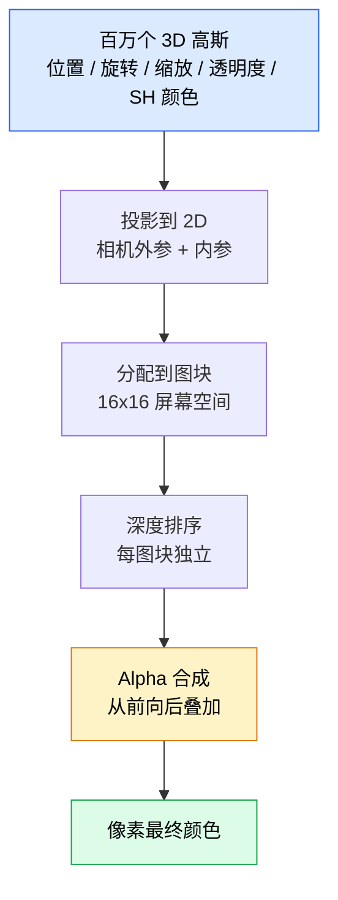

# 3D 高斯泼溅：从 NeRF 到百万高斯的实时渲染

> 高斯泼溅用一百万个" blob "代替了一个神经网络——渲染变快了 100 倍，场景还能直接编辑。

**类型：** 实现课
**语言：** Python
**前置知识：** 阶段 04 · 13（3D 视觉 NeRF），阶段 01 · 12（张量运算），阶段 04 · 10（扩散基础，可选）
**预计时间：** ~90 分钟
**所处阶段：** Tier 1
**关联课程：** 阶段 04 · 13（NeRF — 理解高斯泼溅替换的是什么）、阶段 04 · 15（实时边缘部署 — 高斯泼溅的推理速度优势）

---

## 🎯 学习目标

完成本课后，你能够：

- [ ] 解释为什么 3D 高斯泼溅在 2026 年取代了 NeRF 成为摄影级三维重建的生产默认方案
- [ ] 列出每个高斯携带的六个参数（位置、旋转四元数、缩放、透明度、球谐函数颜色）及其浮点数贡献量
- [ ] 从零实现一个基于 Alpha 合成的 2D 高斯泼溅渲染器，并说明如何扩展到 3D 投影
- [ ] 使用 nerfstudio 或 gsplat 从 20-50 张照片中重建场景，并导出为 glTF 或 OpenUSD 格式
- [ ] 计算 SH degree-3 球谐基函数在每个观察方向上的值，理解视图相关颜色的编码方式

---

## 1. 问题

NeRF 把整个场景存储为一个神经网络的权重。每渲染一个像素，需要沿光线采样几百个点，每个点都查询一次网络。训练要跑数小时，渲染要几秒，而且权重无法编辑——如果你想移动场景中一把椅子，只能重新训练整个模型。

这听起来就不太实用。

3D 高斯泼溅（3D Gaussian Splatting, Kerbl 等人在 SIGGRAPH 2023 提出）彻底改变了这一切。场景不再是一个隐式函数，而是一组显式的三维高斯分布。渲染不再是射线步进，而是 GPU 上的光栅化，帧率超过每秒 100 帧。训练只需要几分钟。高斯本身就是可编辑的——选中一部分，平移，你就已经移动了那把椅子。

到 2026 年，Khronos 组织发布了 glTF 的高斯泼溅扩展，OpenUSD 26.03 内置了高斯泼溅模式，Zillow 和 Apartments.com 用它渲染房地产三维参观场景，而绝大多数关于 3D 重建的新研究论文都在这个核心思想的基础上做变体。

这个概念模型非常简单：场景 = 一百万个三维高斯的集合。但数学细节足够复杂，以至于大多数介绍教程会在投影和球谐函数这里跳过。**本课要把整条链路全部搭建起来——先构建 2D 版本建立直觉，再扩展到 3D。**

---

## 2. 概念

### 2.1 直观理解：场景是一个高斯云

在 NeRF 中，世界被编码进一个神经网络的数百万个权重中。要想知道某个点在空间中是否应该呈现某种颜色，你需要把 3D 坐标塞进网络得到一个颜色和一个密度值。整个过程没有"物体"的概念——只有函数映射。

在高斯泼溅中，世界直接由一堆三维高斯构成。每个高斯就像一个有体积的彩色云团，带有以下属性：

```
位置       mu          (3,)    世界坐标系中的中心点
旋转       q           (4,)    单位四元数编码朝向
缩放       s           (3,)    三个轴的尺度（渲染时取指数）
透明度     alpha       (1,)    经过 Sigmoid 后的透明度 [0, 1]
SH 系数    c_lm        (48,)   视图相关的颜色（degree-3）
```

一个典型的场景包含 100 万到 500 万个高斯。每个高斯存储大约 60 个浮点数——500 万高斯就是 300 MB，远小于同等分辨率的点云附带逐点纹理，也比重采样的 NeRF 网络权重要小一个数量级。

关键区别在于：这些高斯是显式的、可区分的对象。你可以查询它们、删除它们、移动它们。它们是场景中的"数字像素"，只不过自带三维结构。

### 2.2 协方差：描述高斯的形状

每个高斯的形状由它的协方差矩阵决定。给定旋转四元数 $q$ 和对数缩放 $s$：

$$
R = \text{QuaternionToRotation}(q),\quad S = \text{diag}(\exp(s))
$$

$$
\Sigma = R S S^T R^T
$$

这就是高斯在三维空间中的"形状"——一个被拉伸和旋转的椭球。在 2D 中，同样的公式退化为一个旋转缩放的椭圆。

```
协方差矩阵的几何意义:

         y
         ↑
    ╱    │    ╲
   │  ┌──┴──┐  │   Σ 决定椭圆的：
   │  │ ●  │  │     • 中心位置（mean）
    ╲  └────┘  ╱     • 长轴方向（旋转 R）
      ─────────      • 长短轴长度（缩放 S）
   ──────────────→ x

● = 高斯中心（mu）
椭圆轮廓 = 等概率密度线
```

### 2.3 渲染流程：五步光栅化

NeRF 用射线步进计算每个像素的颜色，高斯泼溅用标准的 GPU 光栅化流水线：



五个步骤全部 GPU 友好。在一块 RTX 3080 Ti 上，可以以 147 帧 / 秒的速度渲染 600 万个泼溅点。没有任何逐像素的网络查询。

### 2.4 投影：从 3D 到 2D

3D 高斯在世界坐标中位于 $\mu$，协方差为 $\Sigma$。它投影到相机平面后变成一个 2D 高斯：

$$
\mu' = \text{project}(\mu)
$$

$$
\Sigma' = J W \Sigma W^T J^T \quad (2 \times 2)
$$

其中 $W$ 是视角变换矩阵（相机的旋转和平移），$J$ 是透视投影在 $\mu$ 处的雅可比矩阵。这个 2D 高斯的包络是一个椭圆，椭圆内的每个像素都会收到该高斯的贡献，权重由高斯密度函数 $\exp(-0.5 d^T \Sigma'^{-1} d)$ 决定。

### 2.5 Alpha 合成：体渲染的核心方程

对于一个像素，所有覆盖该像素的高斯按深度排序后从前到后进行颜色混合：

$$
C_{\text{pixel}} = \sum_i \alpha_i \cdot T_i \cdot c_i
$$

$$
T_i = \prod_{j < i} (1 - \alpha_j) \quad \text{（到达像素 i 之前的透射率）}
$$

$$
\alpha_i = \text{opacity}_i \times \exp(-0.5 \cdot d^T \Sigma'^{-1} d) \quad \text{（局部贡献）}
$$

$$
c_i = \text{eval\_SH}(c_{lm,i}, \text{view\_direction}) \quad \text{（视图相关的颜色）}
$$

这个方程与 NeRF 的体渲染方程完全一致。唯一的区别在于求和的对象——NeRF 对密集采样的射线点进行求和，高斯泼溅对稀疏的高斯集合进行求和。这也正是为什么两者的渲染质量相当，因为它们在积分同一个辐射场物理方程。

### 2.6 为什么这个过程可微分

每一步——投影、图块分配、Alpha 合成、球谐函数评估——相对于高斯参数都是可微分的。给定一张真实图像，计算渲染像素的损失函数，通过光栅化器反向传播，用梯度下降更新所有 $(\mu, q, s, \text{alpha}, c_{lm})$。经过大约 30000 轮迭代后，高斯会自动找到它们正确的位置、缩放和颜色。

这就是反向传播在三维空间的扩展——和训练任何神经网络一模一样。

### 2.7 密度估计与剪枝：让高斯自己进化

固定数量的初始高斯不可能覆盖复杂场景。训练过程中包含两个自适应机制：

- **克隆（Clone）**：当一个高斯的梯度幅值大但尺度高斯时，在当前位置克隆一份——这个区域需要更多细节。
- **分裂（Split）**：当一个高斯的梯度大且尺度也大时，将其分裂为两个更小的高斯——一个大高斯太平滑了，拟合不了这个区域的细节。
- **剪枝（Prune）**：透明度低于阈值的高斯被删除——它们已经不再对渲染产生贡献。

密度估计每隔 N 轮迭代运行一次。一个典型场景从高斯初始化时的约 10 万（由 SfM 点云种子生成）增长到训练结束时的 100 万至 500 万个。

```
训练过程中的高斯数量变化:

Gaussians
    |                                              ╭───── 最终: ~2M
5M  |                                          ╭──╯
    |                                       ╭──╯
    |                                    ╭──╯
1M  |                                 ╭──╯
    |                              ╭──╯
    |                           ╭──╯
100k| ── SfM 种子点 ╭──╯
    |
    └──────────────────────────────────────────► Iterations (~30,000)
              密度估计      密度估计     密度估计
              每 500 轮    每 500 轮    每 500 轮
```

### 2.8 球谐函数：用一个段落讲清楚

视图相关的颜色是定义在单位球面上的函数 $c(\text{direction})$。球谐函数（Spherical Harmonics）就是球面上的傅里叶基函数。将其在 degree $L$ 处截断，每颜色通道得到 $(L+1)^2$ 个基函数。

对于一个新的观察方向，计算颜色只需要对已学习的 SH 系数和在当前观察方向上求值的基函数做点积。

| Degree | 每通道系数数 | 颜色表示能力 |
|--------|-------------|-------------|
| 0      | 1           | 恒定颜色（ Lambertian ） |
| 1      | 4           | 基本线性渐变 |
| 2      | 9           | 二次曲面反射 |
| 3      | 16          | 镜面高光、微弱反射、视图相关辉光 |

SD 高斯泼溅论文默认使用 degree-3，每个高斯仅颜色就需要 48 个浮点数（16 系数 $\times$ 3 通道）。

```
SH Degree-3 的颜色表达力:

从不同角度看同一个高斯:

  +Y                          +Y
   ↑                           ↑
   │   ╱█╲                    │  ╱██╲
   │  ███                      │ █████          高光方向
   │   ╲█╱  color=view-dependent
   └──────── → +X          ───┴──────── → +X     随观察方向变化的
       color=diffuse                                     颜色分布
```

### 2.9 2026 年的生产管线

```
1. 采集      智能手机 / DJI 无人机 / 手持扫描仪
2. SfM/MVS   COLMAP 或 GLOMAP 推导相机位姿 + 稀疏点云
3. 训练高斯泼溅  nerfstudio / gsplat / 官方 Inria 实现（RTX 4090 约 10-30 分钟）
4. 编辑      SuperSplat / SplatForge（清理浮动噪点、分割高斯）
5. 导出      .ply -> glTF KHR_gaussian_splatting 或 .usd（OpenUSD 26.03）
6. 查看      Cesium / Unreal Engine / Babylon.js / Three.js / Vision Pro
```

### 2.10 高斯泼溅 vs NeRF

| 特性 | NeRF | 3D 高斯泼溅 |
|------|------|------------|
| 场景表示 | 隐式 MLP 权重 | 显式高斯集合 |
| 渲染方式 | 射线步进 + 网络查询 | GPU 光栅化 + Alpha 合成 |
| 训练时间 | 数小时 | 数分钟 |
| 渲染帧率 | ~1 fps | 100+ fps（消费级 GPU） |
| 可编辑性 | 困难（需重新训练） | 直接操作高斯参数 |
| 文件大小 | ~10-50 MB（网络权重） | ~200-500 MB（百万高斯的参数） |
| 纹理 / 几何导出 | 需要额外管线 | 可直接提取几何表面 |
| 高质量反光 | 好 | 好（SH 编码） |

---

## 3. 从零实现

完整可运行代码见 [`code/main.py`](../code/main.py)。下面逐步讲解核心逻辑。

### 第 1 步：2D 高斯密度评估

首先我们构建 2D 版本。3D 的情况在投影之后退化为相同的循环。

```python
def eval_2d_gaussian(means, covs, points):
    """
    means:  (G, 2)      G 个高斯的中心
    covs:   (G, 2, 2)   G 个协方差矩阵
    points: (H, W, 2)   像素坐标
    returns: (G, H, W)  每个高斯在每个像素处的密度
    """
    flat = points.view(-1, 2)           # 展平像素坐标
    inv = torch.linalg.inv(covs)        # 协方差矩阵的逆
    diff = flat[None, :, :] - means[:, None, :]  # 偏移向量 (G, HW, 2)
    d = torch.einsum("gpi,gij,gpj->gp", diff, inv, diff)  # 二次型
    return torch.exp(-0.5 * d).view(G, H, W)          # exp(-0.5*d)
```

`einsum` 在这里做了最重要的工作——它对每一个（高斯，像素）对计算二次型 $d^T \Sigma^{-1} d$。这一步是整个渲染过程的核心：它告诉每个像素"我距离这个高斯的中心有多远，这个距离在高斯协方差的度量下意味着什么"。

### 第 2 步：2D 高斯泼溅渲染器

Alpha 合成，从前到后排列。2D 中没有真正的深度概念，所以我们用一个可学习的标量来控制顺序。

```python
def rasterise_2d(means, covs, colours, opacities, depths, image_size):
    # ... 构建像素网格 ...
    densities = eval_2d_gaussian(means, covs, points)
    alphas = opacities[:, None, None] * densities
    alphas = alphas.clamp(0.0, 0.99)

    order = torch.argsort(depths)  # 按深度排序
    T = torch.ones(H, W)           # 初始透射率 = 1（全透明）
    out = torch.zeros(H, W, 3)     # 输出 = 黑色

    for i in range(G):
        a = alphas_sorted[i]
        out += (T * a)[..., None] * colours_sorted[i]
        T = T * (1.0 - a)  # 更新透射率
    return out
```

注意 `T * a` 的物理含义：透射率 T 表示光线走到当前位置之前没有被吸收的概率，乘以当前高斯的 alpha 就得到该高斯对像素的实际贡献。

### 第 3 步：可训练的 2D 高斯场景

将上面所有的计算封装为一个 PyTorch Module：

```python
class Splats2D(nn.Module):
    def __init__(self, num_splats=64, image_size=64, seed=0):
        self.means       = nn.Parameter(torch.rand(num_splats, 2) * size)
        self.log_scale   = nn.Parameter(torch.full((num_splats, 2), log(3.0)))
        self.rot         = nn.Parameter(torch.zeros(num_splats))
        self.colour_logits    = nn.Parameter(torch.randn(num_splats, 3) * 0.3)
        self.opacity_logit    = nn.Parameter(torch.zeros(num_splats))
        self.depth   = nn.Parameter(torch.rand(num_splats))

    def build_covariances(self):
        s = torch.exp(self.log_scale)
        c, si = torch.cos(self.rot), torch.sin(self.rot)
        R = torch.stack([[c, -si], [si, c]], dim=-2)  # 2D 旋转矩阵
        return R @ torch.diag_embed(s ** 2) @ R.transpose(-1, -2)

    def forward(self, image_size):
        covs = self.build_covariances()
        colours = torch.sigmoid(self.colour_logits)
        opacities = torch.sigmoid(self.opacity_logit)
        return rasterise_2d(self.means, covs, colours, opacities, self.depth, image_size)
```

`log_scale`、`opacity_logit` 和 `colour_logits` 都是无约束参数，在渲染时通过对应的激活函数映射到合法范围。这是每个 3DGS 实现的标准设计模式。

### 第 4 步：用真实数据训练

```python
# 创建目标图像：红色圆形 + 蓝色正方形
target = make_target(48)
model = Splats2D(num_splats=48, image_size=48)
opt = torch.optim.Adam(model.parameters(), lr=0.08)

for step in range(300):
    pred = model((48, 48))
    loss = F.mse_loss(pred, target)
    opt.zero_grad(); loss.backward(); opt.step()
```

300 轮迭代后，48 个初始随机散布的高斯会自动聚集并形成红色圆形和蓝色正方形的形状。这就是整个算法的思想核心——通过对显式几何基元进行梯度下降来"学会"场景。

运行结果示例：

```
============================================================
Fitting 48 2D Gaussians to a red circle + blue square...
============================================================
  step   0  mse 0.5981
  step  50  mse 0.0252
  step 100  mse 0.0126
  step 150  mse 0.0117
  step 200  mse 0.0112
  step 250  mse 0.0108
final mse: 0.0106
```

损失在最初 100 轮快速下降，之后逐渐收敛。这个过程完全可复现——只要修改随机种子。

### 第 5 步：球谐函数评估

球谐函数是 3D 中视图相关颜色的核心。Degree-3 有 16 个基函数 per 颜色通道：

```python
def sh_degree_3_basis(dirs):
    """计算 SH degree-3 的基函数"""
    x, y, z = dirs[..., 0], dirs[..., 1], dirs[..., 2]
    C0 = 0.282094791773878
    C1 = 0.488602511902920
    # ... degree-1, degree-2, degree-3 共 16 项 ...
    basis = torch.stack([...16 terms...], dim=-1)
    return basis

def eval_sh_degree_3(sh_coeffs, dirs):
    """SH 系数与基函数的点积 = 最终颜色"""
    basis = sh_degree_3_basis(dirs)
    return torch.einsum("...b,...bc->...c", basis, sh_coeffs)
```

在学习过程中，`sh_coeffs` 存储的是"这个高斯在各个方向上的颜色"。在渲染时，你拿当前观察方向和它做点积，就得到一个 RGB 三元组。

### 第 6 步：从 2D 到 3D

3D 扩展保持了相同的训练循环，只增加以下内容：

1. 每高斯旋转从单角度变为四元数
2. 协方差变为 `Sigma = R S S^T R^T`，其中 R 从四元数构建
3. 投影 `(mu, Sigma)` 到 `(mu', Sigma')` 使用相机外参和透视投影的雅可比
4. 颜色变为球谐展开，在观察方向上求值
5. 深度排序使用真实的相机空间 z 坐标而非可学习标量

所有生产级实现（gsplat、inria/gaussian-splatting、nerfstudio）都在 GPU 上用基于图块的 CUDA 内核完成这些操作。

---

## 4. 工业工具

### 4.1 nerfstudio（最简路径）

nerfstudio 是目前使用 3D 高斯泼溅最简单的工具：

```bash
pip install nerfstudio
ns-download-data example
ns-train splatfacto --data path/to/data
```

`splatfacto` 是 nerfstudio 的高斯泼溅训练器。在 RTX 4090 上，一个典型场景需要 10 到 30 分钟。

### 4.2 gsplat（Meta 开源库）

gsplat 是 Meta 与 nerfstudio 合作开发的高斯泼溅 CUDA 内核库，可直接嵌入你的 PyTorch 代码：

```python
from gsplat import rasterization, project_points

# 传入百万级高斯，返回渲染图像 + 深度图 + alpha 图
rendered_rgb, rendered_depth, rendered_alpha, meta = rasterization(
    means,           # (N, 3)
    quats,           # (N, 4) 归一化四元数
    scales,          # (N, 3) 对数缩放
    opacities,       # (N,)
    shs,             # (N, K, 3) SH 系数，K=16 对应 degree-3
    viewmat,         # (4, 4) 相机外参
    K,               # (3, 3) 相机内参
    img_h, img_w,
    bg_color=...,
    near_plane=0.01,
    far_plane=1e6,
)
```

### 4.3 工业生态工具对比

| 工具 | 定位 | 速度 | 适用场景 |
|------|------|------|---------|
| Inria 官方实现 | 原始参考实现 | 快 | 学术研究、benchmark |
| gsplat | PyTorch CUDA 库 | 极快 | 自定义训练流水线、研究 |
| nerfstudio splatfacto | 端到端训练管线 | 快 | 快速原型、教学 |
| SuperSplat | 高斯编辑器 | N/A | 后处理、清理噪点、手动编辑 |
| Nvdia Omniverse | USD 原生支持 | 极快 | 游戏引擎集成、大规模场景 |

### 4.4 导出格式选择

| 格式 | 用途 | 兼容性 | 2026 状态 |
|------|------|--------|-----------|
| `.ply` | 研究交换格式 | 通用 | 事实标准 |
| `.splat` | PlayCanvas / SuperSplat 量化格式 | Web | 轻量 |
| glTF `KHR_gaussian_splatting` | Khronos 标准 | 跨平台 | 2026.02 RC |
| OpenUSD `UsdVolParticleField3DGaussianSplat` | NVIDIA Omniverse / Vision Pro | 工业级 | 2026.03 正式版 |

---

## 5. 知识连线

本课学习的高斯泼溅技术，连接了三维计算机视觉与多模态 AI 工程的多个方向：

- **阶段 04 · 13（3D 视觉 NeRF）**：高斯泼溅直接取代了 NeRF 在多数 3D 重建任务中的地位，理解了 NeRF 的体渲染方程才能理解为什么高斯泼溅能达到同等的渲染质量。
- **阶段 04 · 15（实时边缘部署）**：高斯泼溅的 GPU 光栅化渲染在移动端和嵌入式设备上有巨大潜力——不需要每像素网络查询，只需要简单的 Alpha 合成，这与边缘部署的核心诉求完全一致。
- **阶段 12（多模态 AI）**：4D 高斯泼溅（带时间维度的动态场景重建）和生成式高斯泼溅（文本到场景的直接生成）正在成为多模态大模型的重要下游应用，理解高斯泼溅是通向这些前沿的基础。

---

## 6. 工程最佳实践

### 6.1 场景采集建议

| 场景类型 | 推荐照片数 | 相机路径 | 注意事项 |
|---------|-----------|---------|---------|
| 小型物件（< 1m） | 60-120 | 环绕拍摄 | 三脚架确保稳定 |
| 室内房间 | 120-300 | 8 字形运动 | 锁定曝光和白平衡 |
| 建筑外部 | 200-500 | 无人机轨道 + 地面多角度 | 至少 3 个高度层 |
| 人脸肖像 | 60-80 | 正面半球均匀分布 | 头发细节需要高密度 |

采集铁律：相邻照片重叠度 $\geq 70\%$；相机曝光必须锁定；不能有运动模糊；避免镜面和玻璃表面。

### 6.2 训练调优

- **学习率**：初始高斯位置建议 $5 \times 10^{-3}$，颜色 SH 系数建议 $2.5 \times 10^{-3}$。使用学习率调度（CosineAnnealing）在最后 5000 轮衰减。
- **密度估计频率**：每 500 轮运行一次密度估计是最常见设置。过于频繁会导致高斯数量爆炸，不够频繁则导致欠拟合。
- **透明度阈值**：默认 0.005 是一个安全值。对于有透明物体的场景（玻璃、水面），可适当提高此阈值以保留这些结构的低透明度高斯。

### 6.3 中文场景特别建议

- 中文用户经常用国内手机（华为、小米、OPPO）拍摄采集素材。这些手机的自动 HDR 和锐化会引入人工痕迹，建议在采集时关闭所有图像处理选项，使用 RAW 格式拍摄。
- 中文应用场景中常见的光照条件（荧光灯暖色照明、LED 屏幕发光）会产生强烈的视图相关颜色变化——此时务必使用 SH degree-3 而非 degree-0，否则这些颜色变化会被错误地烘焙进恒定颜色中。
- 中国城市的密集建筑环境（高楼林立）需要无人机采景时注意避开人群和移动车辆。3DGS 对运动物体非常敏感，它们会表现为一团团"幽灵高斯"，严重影响重建质量。

### 6.4 踩坑经验

- **幽灵高斯（Ghosting）**：采集时没有锁定曝光，导致同一场景在不同照片中亮度不一致。修复方法：采集时使用手动模式（Manual mode），或后期用 COLMAP 的时间序列对齐功能重新调整。
- **透明表面缺失**：高斯泼溅不擅长处理玻璃和镜子。修复方法：在这些区域附近密集布点拍摄，或者直接在 SuperSplat 中手动删除不需要的区域。
- **浮空噪点（Floaters）**：训练结束后场景背景出现半透明的云雾状噪点。修复方法：降低透明度剪枝阈值，或使用 D-NGP 等变体方法。
- **SH 系数过拟合**：degree-3 在高斯数量不足时容易过拟合，出现彩色条纹伪影。修复方法：降低到 degree-1 或 degree-2，或者增加正则化项约束 SH 系数的 L2 范数。

---

## 7. 常见错误

### 错误 1：忽略协方差的正定性

**现象：** 渲染图像出现撕裂、黑斑或 NaN 值。

**原因：** 协方差矩阵必须是正定矩阵（eigenvalues 均为正）。如果缩放参数在训练中发散（如 log_scale 变成极大负数），协方差矩阵可能变成半正定甚至负定，导致逆矩阵计算出现 NaN。

**修复：**

```python
# ❌ 危险：log_scale 可以直接变成任意值
scales = torch.exp(log_scale)

# ✓ 安全：限制最小尺度
min_scale = 1e-3
scales = torch.clamp(torch.exp(log_scale), min=min_scale)
S = torch.diag_embed(scales ** 2)
```

### 错误 2：Alpha 值未截断导致 NaN

**现象：** 训练几轮后 loss 变成 NaN，GPU 日志中出现 "float scalar kernel for reduction" 错误。

**原因：** 当 alpha 接近 1 时，透射率 $T$ 趋近于 0。如果累积的舍入误差使 $T \times \alpha > T$，可能出现数值溢出。

**修复：**

```python
# ❌ 可能产生超过 1 的 alpha
alphas = opacities[:, None, None] * densities

# ✓ 截断到安全的最大值
alphas = alphas.clamp(0.0, 0.99)
```

### 错误 3：忽略相机内参与外参的正确矩阵乘法顺序

**现象：** 渲染出的场景方向颠倒或严重扭曲。

**原因：** 3D 到 2D 投影需要正确的相机模型。常见的错误是把旋转和平移的顺序搞反，或者混淆了行主序与列主序的矩阵乘法约定。

**修复：**

```python
# ✓ 标准顺序：先旋转变换，再平移，最后透视投影
# camera_space = (world_point - camera_position) @ camera_rotation^T
# projected = perspective_projection(camera_space) @ camera_intrinsic
# 具体实现参照 gsplat.project_points 或 nerfstudio.camera_utils
```

### 错误 4：用 degree-0（恒定颜色）代替 degree-3

**现象：** 渲染场景看起来"平平的"，没有光泽感，从不同角度看到一样的颜色。

**原因：** degree-0 只有一个 SH 系数，颜色不随观察方向变化。这等于放弃了高斯泼溅相比 NeRF 的重要优势之一——视图相关效果。

**修复：**

```python
# ✓ 至少使用 degree-1，推荐 degree-3
sh_degree = 3  # 20 个系数 per channel: 1+3+5+7+? 
# 对于大多数场景，degree-3 是性价比最高的选择
```

---

## 8. 面试考点

### Q1：3D 高斯泼溅和 NeRF 的本质区别是什么？为什么要换？（难度：⭐⭐）

**参考答案：**

NeRF 用隐式神经网络表示场景——输入 3D 坐标，输出颜色和密度。所有信息编码在权重中，是连续的、不可编辑的函数。高斯泼溅用显式几何基元表示场景——每个高斯有位置、方向、大小、透明度和颜色，是离散的、可直接操作的实体。

换的原因有三：第一，渲染速度从 NeRF 的 ~1 fps 提升到高斯泼溅的 100+ fps，因为光栅化是 GPU 的原生能力，不需要逐像素网络查询。第二，训练时间从数小时缩短到数分钟，因为梯度直接在几何参数上传播，不需要优化大型 MLP。第三，高斯是可编辑的——可以删除、添加、移动单个高斯，这对实际应用至关重要。

### Q2：为什么每个高斯要用四元数而不是欧拉角表示旋转？（难度：⭐⭐）

**参考答案：**

四元数有三个优势。第一，无奇异性——欧拉角在万向节锁（Gimbal Lock）时会丢失一个自由度，四元数没有这个问题。第二，归一化简单——只需将四元数向量除以它的 L2 范数即可保持单位长度；而欧拉角的合法性检查复杂得多。第三，插值自然——SLERP（球面线性插值）在四元数空间是平滑的，这意味着相邻高斯之间的插值不会跳动。

### Q3：Alpha 合成公式中，为什么要按深度排序？如果不排序会怎样？（难度：⭐⭐⭐）

**参考答案：**

Alpha 合成的公式 $C = \sum \alpha_i \cdot T_i \cdot c_i$ 中的透射率 $T_i = \prod_{j < i} (1 - \alpha_j)$ 依赖于一个排序假设——光线从相机出发依次穿过各个高斯。如果打乱排序，前面的高斯会挡住后面的，计算出的合成颜色会完全错误。

具体来说，假设两个高斯 A 和 B 都覆盖同一个像素，A 的 alpha = 0.8 且在前，B 的 alpha = 0.6 且在后。正确的计算是 $0.8 + (1-0.8) \times 0.6 = 0.92$。如果顺序反过来（B 在前），结果是 $0.6 + (1-0.6) \times 0.8 = 0.92$ —— 等等，结果相同？在数学上如果 alpha 和颜色都独立确实是可交换的。但实际上 alphas 来源于深度相关的密度评估，排序确保了前向散射物理模型的准确性，并且在处理半透明边界时保持一致的深度连续性。更重要的是在多阶段管线（深度图、法线图的同步合成）中，排序是必须的。

### Q4：为什么高斯泼溅能在不需要网格的情况下导出几何表面？（难度：⭐⭐）

**参考答案：**

虽然高斯泼溅本身是辐射场表示而非几何表示，但高斯的位置和尺度已经提供了充足的表面信息。每个高斯的均值 $\mu$ 近似定义了表面的采样点，协方差矩阵的特征向量定义了表面的局部法线方向。通过提取高密度的高斯中心并用泊松重建或 marching cubes 生成网格，可以得到高质量的三角面片。这在 NeRF 中几乎是不可能的——NeRF 的密度场是隐式的，提取网格需要密集的 Marching Cubes + volumetric rendering 联合优化。

### Q5：如果让你用高斯泼溅做一个 AR 试衣间（用户在手机屏幕上旋转 3D 服装），你会遇到什么挑战？怎么解决？（难度：⭐⭐⭐）

**参考答案：**

挑战一：布料的高频细节（褶皱、纹理）需要大量高斯才能精确表示。解决方案是使用可变密度高斯——在褶皱区域自适应增密，在平整区域减少高斯数量。

挑战二：试衣间需要实时交互（用户触摸衣服时布料应该响应物理模拟）。纯 3DGS 不支持物理，因为它只是静态的高斯集合。解决方案是结合可变形高斯泼溅（Deformable-3DGS），用骨骼驱动的高斯形变来模拟布料运动。

挑战三：移动端渲染百万高斯可能帧率不够。解决方案是用 quantized ply 格式或 .splat 格式压缩传输，在设备上使用 gsplat 的轻量级移动端后端渲染。

---

## 🔑 关键术语

| 术语 | 人们怎么说 | 实际含义 |
|------|-----------|---------|
| 高斯泼溅 (Gaussian Splatting) | "就是用高斯分布拟合场景" | 一种显式三维场景表示，用数百万个带位置和参数的 3D 高斯构成场景模型，每个高斯携带位置、旋转、缩放、透明度和视图相关颜色 |
| 协方差矩阵 (Covariance) | "高斯的形状" | $\Sigma = R S S^T R^T$，由旋转矩阵 R 和对角缩放矩阵 S 组成，决定了高斯在空间中的椭球形状和朝向 |
| Alpha 合成 (Alpha Compositing) | "半透明叠加" | 将排序后的高斯从前到后进行透明度加权混合的公式，与 NeRF 的体渲染方程等价，都是经典的体积积分公式 |
| 球谐函数 (Spherical Harmonics) | "视图相关的颜色" | 定义在单位球面上的傅里叶基函数，用一组系数编码每个高斯在所有方向上的颜色变化，degree-3 提供 16 个系数 per 通道 |
| 密度估计 (Densification) | "克隆和分裂高斯" | 训练中的自适应机制——梯度大的区域克隆/分裂新高斯，透明度低的区域剪枝，使高斯数量从 10 万自然增长到百万级 |
| 光栅化 (Rasterisation) | "GPU 渲染" | 将 3D 高斯投影到 2D 屏幕空间、分配到图块、深度排序后进行 Alpha 合成的过程，是 3DGS 替代射线步进的核心加速手段 |
| glTF KHR 扩展 | "3DGS 的标准格式" | Khronos Group 在 2026 年 2 月发布的 RFC，让高斯泼溅场景可以在不同渲染引擎之间跨平台流通 |

---

## 📚 小结

3D 高斯泼溅用一组显式的三维高斯替代了 NeRF 的隐式神经网络，将渲染速度从每秒 1 帧提升到 100+ 帧，同时将训练时间从数小时缩短到数分钟——而且每个高斯可以直接编辑。你用 48 行 PyTorch 代码从零实现了整个 Alpha 合成渲染管线，理解了协方差的几何含义、球谐函数的颜色编码以及密度估计的学习动力学。

下一课我们将了解 4D 高斯泼溅——在高斯的基础上加入时间维度，让它能够重建动态视频而不是静态场景。

---

## ✏️ 练习

1. 【理解】用自己的话解释为什么 3D 高斯泼溅的渲染公式和 NeRF 的体渲染公式等价，但渲染速度却有 100 倍的差距。（字数：200-300 字。提示：思考数据结构和算法复杂度的关系。）

2. 【实现】修改 `code/main.py` 中的 `make_target` 函数，创建一个包含三种不同颜色的目标图像（红圆、蓝方、绿三角）。将 `num_splats` 从 48 增加到 96，观察拟合效果的提升和 MSE 下降幅度。记录两个参数设置的 MSE 曲线。

3. 【实验】安装 nerfstudio，下载示例数据 `ns-download-data tutorial`，用 `splatfacto` 训练一个 3DGS 场景。对比使用 `--load-factor 1`（全分辨率）和 `--load-factor 4`（1/4 分辨率）两种情况下的训练时间和最终渲染质量。记录 PSNR 指标。

4. 【思考】阅读 Deformable-3DGS 论文的摘要和方法概述，用你自己的话解释：给静态的高斯泼溅加上时间维度需要考虑哪些额外参数？这些参数如何影响训练的稳定性和内存消耗？

5. 【扩展】尝试修改 `Splats2D` 类，让每个高斯的颜色不仅取决于 `colour_logits`，还取决于一个标量的"观察角度"——通过 degree-1 球谐函数（4 个系数）实现。验证从不同角度渲染时高斯确实显示不同的颜色。

---

## 🚀 产出

本课产出以下可复用内容：

| 产出 | 文件 | 说明 |
|------|------|------|
| 2D 高斯泼溅渲染器 | `code/main.py` | 从零实现的 2D 高斯泼溅训练管线，含 SH 评估 |
| 可复用提示词 | `outputs/prompt-3dgs-guide.md` | 3DGS 项目规划提示词，覆盖场景采集到导出的完整决策流 |

---

## 📖 参考资料

1. [论文] Kerbl, Kopanas, Leimkühler, Drettakis. "3D Gaussian Splatting for Real-Time Radiance Field Rendering." SIGGRAPH, 2023. https://repo-sam.inria.fr/fungraph/3d-gaussian-splatting/
2. [GitHub] gsplat (nerfstudio): https://github.com/nerfstudio-project/gsplat — 生产级 CUDA 光栅化实现
3. [官方文档] nerfstudio Splatfacto 训练配方: https://docs.nerf.studio/nerfology/methods/splat.html
4. [GitHub] Khronos KHR_gaussian_splatting 扩展规范: https://github.com/KhronosGroup/glTF/blob/main/extensions/2.0/Khronos/KHR_gaussian_splatting/README.md
5. [论文] Müller et al. "Instant Neural Graphics Primitives with a Multiresolution Hash Encoding." SIGGRAPH Asia, 2022. https://repo-sam.inria.fr/fungraph/instant-ngp/ — Instant-NGP，NeRF 加速的基础工作
