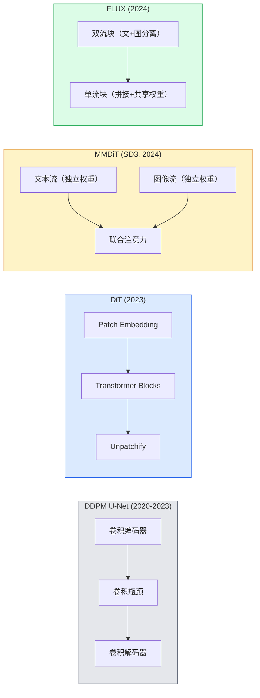

# Diffusion Transformers——DiT 扩散模型与 Rectified Flow

> 把 U-Net 换成 Transformer，把弯曲路径拉直——2026 年最强的文生图模型就这么来的。

**类型：** 实现课
**语言：** Python
**前置知识：** 阶段 04 · 10（扩散模型 DDPM）、阶段 04 · 14（ViT）、阶段 07 · 02（自注意力机制）
**预计时间：** ~90 分钟
**所处阶段：** Tier 1
**关联课程：** 阶段 04 · 10（DDPM）— U-Net 去噪基线，理解 DiT 的改进前提

---

## 🎯 学习目标

完成本课后，你能够：

- [ ] 追溯扩散模型架构的演化——从 U-Net DDPM 到 DiT、MMDiT（SD3）、双流/单流 DiT（FLUX）
- [ ] 解释 Rectified Flow 的原理——为什么直线化的噪声-数据轨迹只需 20 步采样而非 1000 步
- [ ] 从零实现一个微型 DiT Block 和 Rectified Flow 训练循环
- [ ] 区分主流文生图模型（SD3、FLUX.1-dev、FLUX.1-schnell、Z-Image）的架构、参数量和许可证差异

---

## 1. 问题

阶段 04 第 10 课构建了一个基于 U-Net 的 DDPM。这个方案在 2020-2023 年是绝对主流——Stable Diffusion 1.5、DALL-E 2、SDXL 都用它。但它有三个根本限制：

**第一，U-Net 的卷积归纳偏好限制了长程依赖。** 卷积操作天然关注局部邻域，虽然 U-Net 通过下采样扩大了感受野，但要让一个词元（如"宇航员"）精确控制远处的像素区域（如头盔形状），U-Net 需要很多层才能实现。Transformer 的自注意力一次到位。

**第二，DDPM 的噪声调度产生弯曲的随机路径。** 加噪和去噪是一个随机微分方程，需要 1000 步才能精确求解。每一步都计算前向传播，生产环境下的推理成本居高不下。

**第三，文本条件注入不够灵活。** U-Net 通过交叉注意力注入文本条件，但文本和图像的处理路径是异构的——难以充分发挥大语言模型文本编码器（如 T5-XXL）的能力。

到 2026 年，所有主流的文生图模型都抛弃了 U-Net。Stable Diffusion 3、FLUX、SD4、Z-Image、Qwen-Image、混元 Image——**每一个都是 Diffusion Transformer（DiT）**。同时，DDPM 的噪声预测损失被替换为 Rectified Flow——直线插值 + 速度预测。这两个变化加在一起，带来了：

- 提示词遵循度的大幅提升（SD3 终于能正确渲染文字了）
- 采样步数从 1000 降到 20-30（FLUX.1-dev），甚至 1-4 步（FLUX.1-schnell）
- 架构随数据量可预测地缩放——像大语言模型一样吃数据

---

## 2. 概念

### 2.1 直观理解

DiT 的核心想法很直接：**把扩散去噪当成一个序列建模问题。**

在 U-Net 中，图像被编码为多分辨率特征图，下采样再上采样。在 DiT 中，图像被切分成 patch，每个 patch 是一个"词元"，然后扔进标准的 Transformer 堆栈。

```
U-Net 方式（卷积归偏）:
  图像 → Conv编码 → 下采样 → 瓶颈 → 上采样 → Conv解码 → 输出

Transformer 方式（序列建模）:
  图像 → Patch划分 → [词元1, 词元2, ..., 词元N] → Transformer × N → Unpatchify → 输出
```

这个转变与 NLP 中从 RNN 到 Transformer 的转变如出一辙：**同样的任务，但 Transformer 的架构允许更好的并行化、更长的依赖、更可预测的缩放行为。**

### 2.2 从 U-Net 到 Transformer 的演进

#### DiT（2023）——开山之作

Peebles 和 Xie 在 2023 年的论文 "Scalable Diffusion Models with Transformers" 中首次提出了 DiT。他们将 U-Net 替换为类似 ViT 的 Transformer 架构，作用于潜空间中的 patch 序列。条件注入（时间步、类别）通过自适应层归一化（AdaLN）实现。



#### MMDiT（SD3，2024）——双流设计

Stable Diffusion 3 的文章 "Scaling Rectified Flow Transformers" 提出了 MMDiT（Multimodal DiT）。关键创新是**双流架构**：文本词元和图像词元各自有独立的权重矩阵，但共享一个联合自注意力层。这比直接把文本和图像拼接后送入共享网络要灵活得多——文本和图像的统计特性很不一样，用同一组权重处理两者不是最优的。

#### FLUX（2024）——双流 + 单流混合

Black Forest Labs 的 FLUX 在 MMDiT 的基础上更进一步：前 N 个块保持双流（文本和图像各走各的），后面的块将文本和图像拼接起来使用共享权重（单流）。这种混合设计在模型深度增加时节省了大量参数。FLUX.1-dev 有 12B 参数，FLUX.1-schnell 是其 4 步蒸馏版本。

#### Z-Image（2025）——单流效率化

Z-Image 提出 S3-DiT（Scalable Single-Stream DiT），只用单流架构，在 6B 参数量下挑战了"更大就是更好"的假设。它在效率上极具竞争力，许可证也更宽松。

### 2.3 Rectified Flow——一条直线的力量

DDPM 的加噪过程可以描述为：

$$q(x_t | x_0) = \mathcal{N}(x_t; \sqrt{\bar{\alpha}_t} x_0, (1-\bar{\alpha}_t) I)$$

这是一个向噪声扩散的随机过程。去噪是它的逆过程，一个弯曲的随机微分方程（SDE），每步走一点，需要约 1000 步。

Rectified Flow 换了一个思路：**从数据到噪声画一条直线。**

$$x_t = (1 - t) \cdot x_0 + t \cdot \epsilon, \quad t \in [0, 1]$$

这里没有精心设计的噪声调度，没有 $\bar{\alpha}_t$，没有方差保持——只有最直接的线性插值。$t=0$ 时是干净数据 $x_0$，$t=1$ 时是纯噪声 $\epsilon$。

网络要学习的是**速度**：

$$v_\theta(x_t, t) \approx \epsilon - x_0$$

速度向量 $\epsilon - x_0$ 是从干净数据指向噪声的方向。采样时，从 $t=1$ 出发，沿着速度的反方向积分回去：

```
从噪声起步: x = 随机噪声, t = 1.0
for _ in range(20):
    v = 模型(x, t)        # 预测速度
    x = x - dt * v         # 沿反方向走一步
    t = t - dt              # 时间前进
```

由于轨迹几乎是直线，20 步 Euler 积分就足够了。经过蒸馏后（FLUX.1-schnell），甚至可以降到 1-4 步。

**为什么叫 Rectified Flow？** "Rectified" 是"矫正"的意思——通过训练矫正噪声到数据的路径，使其越来越直。SD3 的论文中称其为 Rectified Flow Matching，是目前的主流训练目标。

### 2.4 AdaLN 条件调制

DiT 用 AdaLN（Adaptive Layer Normalization）代替了 U-Net 中的 FiLM 调制或交叉注意力。条件向量（时间步嵌入、文本嵌入）通过一个 MLP 预测三个参数：

```
条件向量 → MLP → (scale, shift, gate)

输出 = LayerNorm(x) * (1 + scale) + shift
残差连接: x = x + gate * 子层输出
```

"Zero" 的含义：AdaLN 中的 MLP 权重**初始化为零**。这意味着训练开始时 gate=0，整个块表现为恒等映射。随着训练进行，调制参数慢慢从零偏离，网络逐渐学到条件信息的影响。这种零初始化策略极大地稳定了深层 Transformer 的训练——与 ResNet 的零初始化残差连接原理相似。

### 2.5 主流模型全景（2026）

| 模型 | 参数量 | 架构 | 许可证 |
|---|---|---|---|
| Stable Diffusion 3 Medium | 2B | MMDiT | SAI Community |
| Stable Diffusion 3.5 Large | 8B | MMDiT | SAI Community |
| FLUX.1-dev | 12B | 双流 + 单流 DiT | 非商业 |
| FLUX.1-schnell | 12B | 同上，蒸馏版 | Apache 2.0 |
| FLUX.2 | — | 改进版 FLUX | 混合 |
| Z-Image | 6B | S3-DiT（单流） | 开放 |
| Qwen-Image | ~20B | DiT + 通义文本编码器 | Apache 2.0 |
| 混元 Image 3.0 | ~80B | DiT | 研究 |
| SD4 Turbo | 3B | DiT + 蒸馏 | SAI Commercial |

**选择建议：** FLUX.1-schnell 是目前开源的默认选择（Apache 2.0，4 步推理）。Z-Image 是效率最优的选择（6B 参数量在 12GB 显存下可运行）。追求质量上限用 FLUX.1-dev 或 SD3.5 Large。

### 2.6 无分类器引导（CFG）仍然有效

Rectified Flow 改变了去噪目标，但没有改变条件控制的方式。训练时以 10% 的概率丢弃文本条件，推理时混合有条件和无条件预测：

$$v_\text{cfg} = v_\text{uncond} + w \cdot (v_\text{cond} - v_\text{uncond})$$

其中 $w$ 是引导尺度（通常 3.5-5），比 DDPM 时代的 7.5 更低——因为 Rectified Flow 模型对提示词的跟随能力本身更强。

### 2.7 蒸馏家族：Schnell / Turbo / LCM

四个名字指向同一个思路：**将一个慢的多步老师模型蒸馏为快的少步学生模型。**

- **LCM（Latent Consistency Model）** ：训练学生模型直接从任意中间状态 $x_t$ 一步预测最终 $x_0$
- **SDXL Turbo / FLUX.1-schnell**：用对抗扩散蒸馏训练的 1-4 步模型
- **SD Turbo**：OpenAI 风格的 Consistency Model 适配潜扩散

工业生产中，一个完整质量模型和一个 turbe/schnell 变体是标配。Schnell（德语"快"）是 Black Forest Labs 的命名惯例，4 步推理即可投入实时流水线。

---

## 3. 从零实现

本节实现一个微型 DiT（约 715K 参数），在合成数据上验证 Rectified Flow 训练管道。完整代码见 `code/main.py`。

### 第 1 步：时间步嵌入

与 Transformer 位置编码相同的正弦编码方案：

```python
def timestep_embedding(t, dim):
    """将标量时间步 t 编码为 dim 维正弦嵌入。"""
    half = dim // 2
    freqs = torch.exp(-math.log(10000) *
                      torch.arange(half, device=t.device) / half)
    args = t[:, None].float() * freqs[None]
    return torch.cat([args.sin(), args.cos()], dim=-1)
```

### 第 2 步：AdaLN-Zero 条件调制层

这是 DiT 的核心机制。MLP 从条件向量预测 scale、shift、gate 三个参数，然后用于调制 LayerNorm 的输出：

```python
class AdaLNZero(nn.Module):
    """自适应层归一化 + 零初始化门控。

    训练开始时 gate=0，整个块表现为恒等映射。
    """

    def __init__(self, dim, cond_dim):
        super().__init__()
        self.norm = nn.LayerNorm(dim, elementwise_affine=False)
        self.mlp = nn.Linear(cond_dim, dim * 3)
        # 零初始化：训练开始时不改变输入
        nn.init.zeros_(self.mlp.weight)
        nn.init.zeros_(self.mlp.bias)

    def forward(self, x, cond):
        scale, shift, gate = self.mlp(cond).chunk(3, dim=-1)
        h = self.norm(x) * (1 + scale.unsqueeze(1)) + shift.unsqueeze(1)
        return h, gate.unsqueeze(1)
```

"Zero" 的含义体现在 `nn.init.zeros_(self.mlp.weight)`——如果 MLP 输出全零，那么 scale=0、shift=0、gate=0，LayerNorm 退化为无参数归一化，残差连接完全不起作用。这个设计让深层网络从恒等映射开始"热身"，避免初始化阶段的梯度爆炸。

### 第 3 步：DiT Block

标准 Transformer 块 + AdaLN 代替固定 LayerNorm + 门控残差：

```python
class DiTBlock(nn.Module):
    def __init__(self, dim=96, heads=3, mlp_ratio=4, cond_dim=96):
        super().__init__()
        self.adaln1 = AdaLNZero(dim, cond_dim)
        self.attn = nn.MultiheadAttention(dim, heads, batch_first=True)
        self.adaln2 = AdaLNZero(dim, cond_dim)
        self.mlp = nn.Sequential(
            nn.Linear(dim, dim * mlp_ratio),
            nn.GELU(),
            nn.Linear(dim * mlp_ratio, dim),
        )

    def forward(self, x, cond):
        # 注意力子层：AdaLN → 自注意力 → 门控残差
        h, gate1 = self.adaln1(x, cond)
        a, _ = self.attn(h, h, h, need_weights=False)
        x = x + gate1 * a
        # FFN 子层：AdaLN → FFN → 门控残差
        h, gate2 = self.adaln2(x, cond)
        x = x + gate2 * self.mlp(h)
        return x
```

**注意：** 这里没有使用交叉注意力。所有条件信息通过 AdaLN 注入自注意力层和前馈网络。这是 DiT 与标准 Transformer 解码器的关键区别。

### 第 4 步：组合成 TinyDiT 模型

将以上组件组合为完整的扩散 Transformer：

```python
class TinyDiT(nn.Module):
    def __init__(self, image_size=16, patch_size=2, in_channels=3,
                 dim=96, depth=4, heads=3):
        super().__init__()
        # 用 Conv2d 实现 Patch Embedding
        self.patch = nn.Conv2d(in_channels, dim,
                               kernel_size=patch_size, stride=patch_size)
        self.pos = nn.Parameter(torch.zeros(1, self.num_patches, dim))
        # 时间步 MLP
        self.time_mlp = nn.Sequential(
            nn.Linear(dim, dim * 2), nn.SiLU(), nn.Linear(dim * 2, dim),
        )
        self.blocks = nn.ModuleList(
            [DiTBlock(dim, heads, cond_dim=dim) for _ in range(depth)]
        )
        self.norm_out = nn.LayerNorm(dim, elementwise_affine=False)
        self.head = nn.Linear(dim, patch_size * patch_size * in_channels)

    def forward(self, x, t):
        # Patch + 位置编码
        x = self.patch(x).flatten(2).transpose(1, 2) + self.pos
        # 时间步编码
        t_emb = self.time_mlp(timestep_embedding(t, dim))
        # Transformer 块
        for blk in self.blocks:
            x = blk(x, t_emb)
        # 输出映射 + 还原图像
        return self._unpatchify(self.head(self.norm_out(x)), x.size(0))
```

### 第 5 步：Rectified Flow 训练循环

与 DDPM 的噪声预测训练循环结构相同，但目标不同——不是预测噪声 $\epsilon$，而是预测速度 $\epsilon - x_0$：

```python
def rectified_flow_train_step(model, x0, optimizer, device):
    model.train()
    x0 = x0.to(device)
    t = torch.rand(x0.size(0), device=device)   # 均匀采样
    epsilon = torch.randn_like(x0)

    # 直线插值
    t_expand = t[:, None, None, None]
    x_t = (1 - t_expand) * x0 + t_expand * epsilon

    # 速度目标：从数据指向噪声
    target_v = epsilon - x0
    pred_v = model(x_t, t)

    loss = F.mse_loss(pred_v, target_v)
    optimizer.zero_grad()
    loss.backward()
    optimizer.step()
    return loss.item()
```

**与 DDPM 的关键对比：**

| 组件 | DDPM（第 10 课） | Rectified Flow（本课） |
|---|---|---|
| 前向过程 | $x_t = \sqrt{\bar{\alpha}_t} x_0 + \sqrt{1-\bar{\alpha}_t} \epsilon$ | $x_t = (1-t) x_0 + t \epsilon$ |
| 预测目标 | 噪声 $\epsilon$ | 速度 $\epsilon - x_0$ |
| 调度参数 | $\bar{\alpha}_t$（余弦/线性调度） | 无 |无需调度 |
| 采样步数 | 1000（DDPM）/ 50（DDIM） | 20-30 |
| 轨迹形状 | 弯曲（SDE） | 近似直线（ODE） |

### 第 6 步：Euler 采样器

Rectified Flow 采样就是沿预测速度反向的 ODE 积分：

```python
@torch.no_grad()
def rectified_flow_sample(model, shape, steps=20, device="cpu"):
    model.eval()
    x = torch.randn(shape, device=device)
    t = torch.ones(shape[0], device=device)
    dt = 1.0 / steps
    for _ in range(steps):
        v = model(x, t)
        x = x - dt * v          # 反向欧拉步
        t = t - dt               # 时间递减
    return x
```

---

## 4. 工业工具

### 4.1 HuggingFace diffusers

`diffusers` 库集成了所有主流 DiT 模型，提供统一的 API：

```python
from diffusers import FluxPipeline
import torch

# FLUX.1-schnell：4 步推理，Apache 2.0 许可证
pipe = FluxPipeline.from_pretrained(
    "black-forest-labs/FLUX.1-schnell",
    torch_dtype=torch.bfloat16,
).to("cuda")

out = pipe(
    prompt="一只金毛在冲浪，超写实，影棚灯光",
    guidance_scale=0.0,   # schnell 训练时未使用 CFG
    num_inference_steps=4,
    max_sequence_length=256,
).images[0]
out.save("surf.png")
```

换成 FLUX.1-dev 的方案一样，只需换模型 ID，增加步数和 CFG：

```python
# FLUX.1-dev：20-30 步，高质但非商业许可证
pipe = FluxPipeline.from_pretrained(
    "black-forest-labs/FLUX.1-dev",
    torch_dtype=torch.bfloat16,
).to("cuda")

out = pipe(
    prompt="一只金毛在冲浪，超写实，影棚灯光",
    guidance_scale=3.5,
    num_inference_steps=28,
).images[0]
```

### 4.2 Stable Diffusion 3

SD3 系列也用 diffusers 接口：

```python
from diffusers import StableDiffusion3Pipeline

pipe = StableDiffusion3Pipeline.from_pretrained(
    "stabilityai/stable-diffusion-3.5-large",
    torch_dtype=torch.bfloat16,
).to("cuda")

out = pipe(
    prompt="宇航员在火星上骑自行车，数字艺术风格",
    guidance_scale=3.5,
    num_inference_steps=28,
).images[0]
```

### 4.3 文本编码器的作用

SD3 和 FLUX 使用三个文本编码器（两个 CLIP + T5-XXL），T5-XXL 单独就有 4.7B 参数。这不是巧合——为什么 SD3/FLUX 对复杂提示词的理解比 SD1.5 好那么多？**大部分功劳属于文本编码器。** 理解 DiT 架构时不要忽视编码器端的规模。

### 4.4 性能参考

| 模型 | 推理步数 | 单图时间（A100） | 显存需求 |
|---|---|---|---|
| FLUX.1-schnell | 4 | ~0.3s | 16GB |
| FLUX.1-dev | 28 | ~2s | 24GB |
| SD3.5 Large | 28 | ~1.5s | 16GB |
| Z-Image | 20 | ~1s | 12GB |

---

## 5. 知识连线

本课学习的 DiT + Rectified Flow 是 2026 年视觉生成领域的核心架构，在后续课程中有多处延伸：

- **阶段 12（多模态 AI）** ：你会看到 MMDiT 架构在文生图之外如何扩展到文生视频（Sora 的核心也是 DiT+Rectified Flow）
- **阶段 10（从零构建大语言模型）** ：DiT 的缩放行为与大语言模型遵循同样的规律——你在这里看到的"Transformer 堆栈 + 条件调制"在大语言模型中有很深的对应关系
- **阶段 17（基础设施与生产）** ：FLUX.1-schnell 的 4 步推理在线服务部署时涉及 vLLM、TensorRT-LLM 等推理优化技术

---

## 6. 工程最佳实践

### 6.1 模型选型指南

| 场景 | 推荐模型 | 理由 |
|---|---|---|
| 个人项目/实验 | FLUX.1-schnell | Apache 2.0 许可证，4 步推理 |
| 商业产品 | SD3.5 Large | SAI Community 许可证，商业安全 |
| 高质量输出 | FLUX.1-dev | 非商业，目前质量上限最高 |
| 显存受限 (<=12GB) | Z-Image | 6B 参数，效率最优 |
| 中文场景 | Qwen-Image | 通义千问中文文本编码器对齐 |
| 实时应用 | FLUX.1-schnell 或 SD4 Turbo | 1-4 步推理 |

### 6.2 中文场景特别建议

- **中文提示词：** SD3/FLUX 使用 T5 编码器，对中文理解较好，但仍推荐配合英文提示词使用（"中文描述，English keywords" 混合策略）
- **模型选择：** 通义千问系列的 Qwen-Image 使用中文对齐的文本编码器，在纯中文场景下优于 FLUX
- **文本渲染：** 如果需要生成包含中文文字的图片（海报、菜单），SD3.5 的文本渲染能力最强（虽然对中文字符仍不如英文稳定）

### 6.3 踩坑经验

1. **不要用 SD1.5 的调度器参数套用到 DiT 上。** 两者推理过程不同：SD1.5 用 DDIM/PLMS 调度器，DiT 用 FlowMatchEuler。在 diffusers 中记得启用正确的调度器。

2. **显存不足时优先减少 `max_sequence_length`。** T5-XXL 编码器的最大序列长度 512，但大多数场景 128-256 就够。这比降低模型精度更有效。

3. **FLUX.1-dev 和 FLUX.1-schnell 的 CFG 行为不同。** Schnell 在训练时没有使用无分类器引导，推理时 `guidance_scale` 设为 0。Dev 版本需要 `guidance_scale=3.5`。混淆这两者会导致生成结果与预期不符。

4. **Rectified Flow 训练的数值精度问题。** 速度目标 $\epsilon - x_0$ 的量级可能很大，在 FP16 下训练容易产生 NaN 梯度。建议用 BF16 或 FP32 训练。

5. **VAE 潜空间与像素空间的区分。** FLUX、SD3 都在 VAE 潜空间中训练 DiT。当训练自定义 Rectified Flow 模型时，要确保输入数据经过了归一化（零均值、单位方差），而不是 RGB uint8。

---

## 7. 常见错误

### 错误 1：混淆 DDPM 的噪声预测和 Rectified Flow 的速度预测

**现象：** 训练 loss 持续下降但在采样时只产生噪声，或者用 DDPM 的采样器推理 Rectified Flow 模型。

**原因：** DDPM 预测 $\epsilon$，Rectified Flow 预测 $\epsilon - x_0$。两种损失的结构相同，但目标不同，不能互换。

**修复：**
```python
# ❌ DDPM 的噪声预测（来自第 10 课）
pred_noise = model(x_t, t)
loss = F.mse_loss(pred_noise, epsilon)

# ✓ Rectified Flow 的速度预测
target_v = epsilon - x0   # 关键区别在此
pred_v = model(x_t, t)
loss = F.mse_loss(pred_v, target_v)
```

### 错误 2：采样时 t 的方向搞反

**现象：** 采样结果从清晰到模糊（越来越噪声），而不是从噪声到清晰。

**原因：** Rectified Flow 中 t=0 是干净数据，t=1 是纯噪声。采样应该从 t=1 开始向前走到 t=0。如果从 t=0 开始向 t=1 走，就会从数据走向噪声。

**修复：**
```python
# ❌ 错误：从 t=0 开始
t = torch.zeros(batch, device=device)
dt = 1.0 / steps
for _ in range(steps):
    v = model(x, t)
    x = x - dt * v
    t = t + dt           # 走向噪声

# ✓ 正确：从 t=1 开始
t = torch.ones(batch, device=device)
dt = 1.0 / steps
for _ in range(steps):
    v = model(x, t)
    x = x - dt * v
    t = t - dt           # 走向数据
```

### 错误 3：AdaLN 的初始化未置零

**现象：** 训练开始时 loss 异常高，深层网络梯度爆炸。

**原因：** AdaLN 中的 MLP 如果不初始化为零，训练初期 gate 是随机值，残差连接的不稳定缩放会放大传播误差。

**修复：**
```python
# ❌ 默认初始化（随机）
self.mlp = nn.Linear(cond_dim, dim * 3)

# ✓ 零初始化
self.mlp = nn.Linear(cond_dim, dim * 3)
nn.init.zeros_(self.mlp.weight)
nn.init.zeros_(self.mlp.bias)
```

### 错误 4：训练 Rectified Flow 时使用 RGB uint8 输入

**现象：** 训练 loss 无法收敛，生成样本始终偏白或偏黑。

**原因：** Rectified Flow 假设输入数据是零均值、单位方差的。RGB uint8 的值域是 [0, 255] 或 [0, 1]，不满足这个假设。速度目标的量级会不对。

**修复：**
```python
# ❌ 未归一化
x0 = load_image("cat.png")    # 值域 [0, 255]

# ✓ 归一化到 [-1, 1]
x0 = load_image("cat.png") / 127.5 - 1.0

# 或在 VAE 潜空间中使用编码器输出（自动归一化）
with torch.no_grad():
    x0 = vae.encode(image).latent_dist.sample()
```

### 错误 5：FLUX.1-schnell 错误地使用了 guidance_scale

**现象：** 生成结果颜色过度饱和或伪影严重。

**原因：** Schnell 训练时没有使用无分类器引导（CFG），推理时 guidance_scale 应该为 0。如果设成 3.5，CFG 会对一个没学过 CFG 的模型产生破坏性影响。

**修复：**
```python
# ❌ FLUX.1-schnell 错误用法
pipe(prompt, guidance_scale=3.5, num_inference_steps=4)

# ✓ FLUX.1-schnell 正确用法
pipe(prompt, guidance_scale=0.0, num_inference_steps=4)

# ✓ FLUX.1-dev 需要 CFG
pipe(prompt, guidance_scale=3.5, num_inference_steps=28)
```

---

## 8. 面试考点

### Q1：为什么 2024 年后的文生图模型都从 U-Net 换成了 DiT？（难度：⭐⭐）

**参考答案：**
三个方面原因。第一，**缩放特性**——DiT 像大语言模型一样遵循可预测的缩放定律，参数量增长时性能曲线平滑，而 U-Net 的缩放行为更不可预测。第二，**长程依赖**——自注意力机制让每个 patch 直接与所有 patch 交互，这比 U-Net 通过下采样积累感受野的方式更直接，对提示词-图像对齐至关重要的细节关系处理得更好。第三，**统一架构**——文本编码器已经是 Transformer，用 DiT 处理图像使得整个模型可以用统一的 Transformer 语言描述，联合训练和跨模态注意力更自然。

### Q2：Rectified Flow 和 DDPM 的核心区别是什么？（难度：⭐⭐）

**参考答案：**
DDPM 定义了一个弯曲的随机扩散路径（SDE），网络预测每一步的噪声，需要约 1000 步采样。Rectified Flow 定义了一条从数据到噪声的直线插值路径，网络预测沿直线的速度向量 $\epsilon - x_0$，近似一个 ODE。因为路径几乎是直线，20 步 Euler 积分就足够。SD3 和 FLUX 都使用 Rectified Flow 目标。

### Q3：AdaLN-Zero 中的 "Zero" 是什么意思？为什么有用？（难度：⭐⭐⭐）

**参考答案：**
"Zero" 指 AdaLN 中调制 MLP 的权重和偏置都初始化为零。这意味着训练开始时，scale=0、shift=0、gate=0，整个 DiT Block 表现为恒等映射——输入等于输出。这允许梯度在深层网络中稳定回传，避免初始化阶段的梯度爆炸。随着训练进行，梯度逐渐将 MLP 的参数从零"拉开"，门控值慢慢增大，网络逐步学习条件信息和特征变换。零初始化是训练深层 DiT 的关键工程技巧，类似于 ResNet 的恒等残差连接或 Transformer 的 Pre-LN。

### Q4：MMDiT 和标准 DiT 有什么不同？（难度：⭐⭐）

**参考答案：**
MMDiT（Multimodal DiT）是 Stable Diffusion 3 引入的架构变体。标准 DiT 将所有词元（文本 + 图像）拼接后通过共享的 Transformer 块。MMDiT 则让文本和图像词元各自通过独立的权重流，只在自注意力层交互。这样做是因为文本嵌入和图像嵌入的统计特性不同——文本嵌入来自 CLIP/T5 编码器，是离散分布；图像 patch 嵌入是连续的——用同一组权重处理两者不是最优的。独立的权重让每种模态先在自己的表示空间中处理，再通过联合注意力融合。

### Q5：FLUX.1-schnell 为什么能用 4 步推理完成高质量图像生成？（难度：⭐⭐⭐）

**参考答案：**
Schnell 使用**蒸馏（Distillation）**技术。基本流程是：先用完整训练方法训练一个高质量的老师模型（FLUX.1-dev，28 步推理），然后用对抗扩散蒸馏等方法训练一个学生模型，让学生学会用 1-4 步就复现老师 28 步的输出。架构和参数量通常保持不变（FLUX.1-dev 和 schnell 都是 12B），变化的是推理所需的步数。这类似于 LCM（Latent Consistency Model）和 SDXL Turbo 的原理——不是改变模型架构，而是通过特别的训练目标压缩推理链。

---

## 🔑 关键术语

| 术语 | 人们怎么说 | 实际含义 |
|---|---|---|
| DiT | "Diffusion Transformer" | 用 Transformer 替代 U-Net 作为扩散去噪器；对 patch 化的潜向量做序列建模 |
| AdaLN | "自适应归一化" | 从条件向量预测 scale、shift、gate，在 LayerNorm 后应用；现代 DiT 的标准条件注入方式 |
| AdaLN-Zero | "带零初始化的 AdaLN" | MLP 权重初始化为零的 AdaLN，确保块从恒等映射开始训练 |
| MMDiT | "SD3 的双流架构" | 文本和图像词元各自使用独立的权重矩阵，共享联合自注意力 |
| 双流 / 单流 | "FLUX 的设计" | 前 N 层双流（各模态独立权重），后续层单流（拼接+统一权重） |
| Rectified Flow | "直线化的噪声-数据路径" | 在数据和噪声之间做线性插值，网络预测速度；采样步数远少于 DDPM |
| 速度目标 | "epsilon - x_0" | Rectified Flow 的回归目标，从干净数据指向噪声的方向向量 |
| 无分类器引导（CFG） | "调节提示词重要性" | 混合有条件与无条件预测，控制生成结果与提示词的对齐程度 |
| Schnell / Turbo / LCM | "1-4 步蒸馏变体" | 从全质量模型蒸馏出的少步版本，适合实时生产 |
| Euler 采样 | "最简单的 ODE 求解器" | 沿速度方向跨固定步长，对 Rectified Flow 已经足够（20 步） |

---

## 📚 小结

DiT 用 Transformer 替代了 U-Net 作为扩散去噪器，将图像生成从弯曲的 1000 步随机路径简化为几乎是直线的 20 步 ODE 积分。你从零实现了一个微型 DiT（AdaLN + 自注意力 + 门控残差）和完整的 Rectified Flow 训练循环，并在合成数据上验证了管道。你还了解了 SD3、FLUX、Z-Image 等工业级模型的架构差异和选型策略。

下一课我们将进入多模态模型的世界——看如何处理文本和图像联合输入，构建真正的视觉语言模型。

---

## ✏️ 练习

1. 【理解】用自己的话解释 Rectified Flow 的速度目标 $\epsilon - x_0$ 的物理含义。为什么这个方向向量能使采样路径变直？150 字以内。

2. 【实现】修改 `code/main.py` 中的 `rectified_flow_sample` 函数，实现 DDIM 采样器作为对比。比较同一模型下 20 步 Euler 和 20 步 DDIM 的生成质量差异。

3. 【实验】训练 `TinyDiT` 时，尝试移除 `AdaLNZero` 中的零初始化（注释掉 `nn.init.zeros_` 两行），观察训练 loss 和生成质量的变化。用文字记录你的发现。

4. 【思考】Stable Diffusion 3 使用 T5-XXL（4.7B 参数）作为文本编码器，比 DiT 本身（2B 参数）还大。为什么需要这么大的文本编码器？如果一个提示词说"桌子上有一杯咖啡，旁边放着一本打开的书"，T5 能捕捉到的哪些细节是小型 CLIP 文本编码器可能丢失的？

5. 【实现】在 `synthetic_blobs` 数据集中加入类别标签（每个 blob 的颜色作为类别 0-9），然后为 DiT 添加类别条件注入（与时间步嵌入一起送入 AdaLN），实现带条件控制的 Rectified Flow 生成。

---

## 🚀 产出

本课产出以下可复用内容：

| 产出 | 文件 | 说明 |
|---|---|---|
| TinyDiT + Rectified Flow 从零实现 | `code/main.py` | 微型 DiT 模型、AdaLN、Rectified Flow 训练与采样 |
| DiT 模型选择提示词 | `outputs/prompt-dit-guide.md` | 根据质量、延迟、许可证条件推荐 DiT 文生图模型 |

---

## 📖 参考资料

1. [论文] Peebles & Xie. "Scalable Diffusion Models with Transformers". ICCV, 2023. https://arxiv.org/abs/2212.09748
2. [论文] Esser et al. "Scaling Rectified Flow Transformers for High-Resolution Image Synthesis" (SD3). ICML, 2024. https://arxiv.org/abs/2403.03206
3. [GitHub] Black Forest Labs. "FLUX.1 Model Card". https://huggingface.co/black-forest-labs/FLUX.1-dev
4. [论文] "Z-Image: Efficient Image Generation Foundation Model". 2025. https://arxiv.org/html/2511.22699v1
5. [论文] Karras et al. "Elucidating the Design Space of Diffusion-Based Generative Models". NeurIPS, 2022. https://arxiv.org/abs/2206.00364
6. [论文] Luo et al. "Latent Consistency Models for Few-Step Image Generation". 2023. https://arxiv.org/abs/2310.04378
7. [官方文档] HuggingFace diffusers. "FluxPipeline". https://huggingface.co/docs/diffusers/en/api/pipelines/flux
8. [论文] Song et al. "Score-Based Generative Modeling through Stochastic Differential Equations". ICLR, 2021. https://arxiv.org/abs/2011.13456
