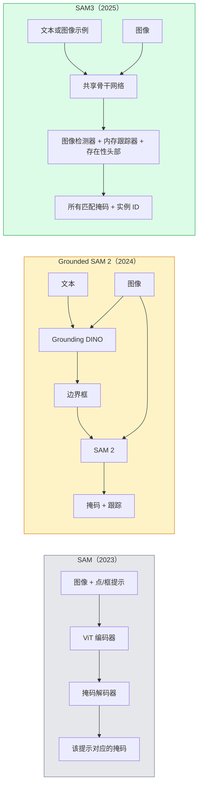

# SAM3 开放词汇分割：用自然语言分割图像中的一切

> 一句自然语言提示，一次前向传播，图像中所有匹配实例的掩码就出来了。

**类型：** 实现课
**语言：** Python
**前置知识：** 第 07 课（U-Net 语义分割）、第 08 课（Mask R-CNN 实例分割）、第 18 课（Open-Vocabulary CLIP）
**预计时间：** ~60 分钟
**所处阶段：** Tier 1
**关联课程：** 第 07 阶段 · 01（大语言模型架构）— 理解文本提示如何编码为模型输入；第 05 阶段 · 08（多模态基础）— 文本与视觉的融合机制

## 🎯 学习目标

完成本课后，你能够：

- [ ] 区分 SAM（纯视觉提示）、Grounded SAM 2（检测器 + SAM 串联）和 SAM3（原生文本提示）三代架构的差异
- [ ] 解释 SAM3 的核心架构：共享骨干网络、检测头、存在性头部、内存跟踪器的分工
- [ ] 从零实现开放词汇分割的抽象接口，理解如何用存根模型跑通整条流水线
- [ ] 使用 Hugging Face `transformers` 或 Ultralytics 调用 SAM3 进行文本提示分割
- [ ] 根据延迟、概念复杂度和许可证约束，在 SAM3、Grounded SAM 2、YOLO-World 之间做出正确选型

## 1. 问题

2023 年发布的 SAM（Segment Anything Model）做了一件了不起的事：你点击图片上的某个位置，它就能把那个物体的轮廓精确地分割出来。但它的局限也很明显——你必须**手动提供视觉提示**。

如果你的需求是"把图片里所有的红色苹果都标出来"，你不能直接告诉 SAM 你要苹果。你必须先用一个专门的检测器（如 Grounding DINO）找出所有苹果的边界框，再把每个框作为提示逐一喂给 SAM。这就是 Grounded SAM 2 的做法：一个检测器串联一个分割模型，形成两级流水线。

问题在于，这种级联架构有两个固有缺陷：

1. **误差累积**——检测器漏了一个苹果，SAM 永远分割不到。检测器误检了一个，SAM 会忠实地为一个假阳性分割出精确的掩码。
2. **延迟翻倍**——每个概念都要经过两次完整的前向传播。

SAM3（Meta，2025，ICLR 2026）彻底解决了这个问题。它接受一个简短的名词短语作为提示（如"黄色校车"、"条纹红伞"），在一次前向传播中返回图像中所有匹配实例的掩码和实例 ID。这就是 **可提示概念分割（Promptable Concept Segmentation，PCS）**。

这个能力的工业意义是巨大的。开放词汇分割、检测、和文本-视觉对齐不再是三条独立的流水线，而被合并到一个模型中。2026 年的生产问题不再是"我要把哪些模型串起来"，而是"哪个可提示模型能端到端地解决我的需求"。

## 2. 概念

### 2.1 三代架构的演进



这三代架构体现了计算机视觉的一个核心趋势：**从专用流水线走向通用端到端模型**。

| 特性 | SAM（2023） | Grounded SAM 2（2024） | SAM3（2025） |
|---|---|---|---|
| 提示类型 | 点、框（纯视觉） | 文本（通过检测器转换） | 文本、图像示例（原生支持） |
| 每次输出 | 一个掩码 | 所有匹配实例 | 所有匹配实例 + 实例 ID |
| 推理次数 | 1 次 / 实例 | 2 次（检测 + 分割） | 1 次 / 概念 |
| 视频跟踪 | 无 | 可选（SAM 2） | 原生支持 |
| 误差累积 | 无 | 有（检测器 → 分割器） | 无 |

### 2.2 可提示概念分割（PCS）

PCS 是 SAM3 的核心任务定义。用一句话说：

> **给定一个短名词短语或图像示例，模型返回图像中所有匹配实例的分割掩码。**

这与经典 SAM 有三个本质区别：

1. **无需逐实例提示**——一个文本提示返回所有匹配实例
2. **开放词汇**——概念可以是任意自然语言描述，不限于预定义类别
3. **多实例输出**——一次调用返回所有匹配结果，而非一个

概念提示词是短名词短语（"黄色校车"、"条纹红伞"、"手握杯子"），不是完整的句子。这是工程上的关键区别：过长的输入会降低模型的准确率。

### 2.3 SAM3 核心架构

SAM3 的架构可以用四个关键组件来理解：

```
输入图像 ──→ 共享骨干网络（ViT）
                │
                ├─→ 图像检测器 ──→ 边界框 + 掩码 + 置信度
                │
                ├─→ 内存跟踪器 ──→ 跨帧实例关联（视频场景）
                │
                └─→ 存在性头部 ──→ "概念是否存在于图像中？"
```

**共享骨干网络**——单一的 ViT（Vision Transformer）处理图像，检测器头和内存跟踪器都从同一组特征中读取信息。这避免了 Grounded SAM 2 中两个模型各自编码图像的冗余计算。

**存在性头部（Presence Head）**——这是 SAM3 相比上一代架构的一个重要设计。它预测一个概念**是否存在于图像中**，与"在哪里"的定位任务解耦。这种解耦的意义在于：

- 对不存在的概念不会强行输出假阳性结果
- 减少了"概念在图里"和"概念不在图里"之间的混淆
- 降低了计算浪费——对于不存在的概念，可以提前终止后续计算

**解耦的检测器-跟踪器**——图像级检测和视频级跟踪使用独立的头部，互不干扰。这种设计保证了单帧检测的精度不受跟踪状态的影响。

**内存库（Memory Bank）**——存储跨帧的实例级特征，用于视频跟踪。SAM2 引入了这个机制，SAM3 继承并优化了它。

### 2.4 SAM3.1 Object Multiplex

2026 年 3 月的更新引入了 **Object Multiplex** 机制。之前跟踪 N 个实例需要 N 个独立的内存库，成本随实例数线性增长。Multiplex 将它们合并为一个共享内存库加上实例级查询向量。

结果：跟踪 100 个实例不再比跟踪 10 个实例慢 10 倍。这对人群分析、交通监控、体育比赛等密集多目标场景至关重要。

### 2.5 SAM3 的训练规模

SAM3 在 **400 万个独立概念**上训练，使用了一个迭代式数据引擎（AI 标注 + 人工审核）。新的 **SA-CO 基准测试**包含 27 万个独立概念，比之前的基准大 50 倍。SAM3 在 SA-CO 上达到了人类表现的 75-80%，在图像+视频 PCS 任务上将现有系统的性能翻倍。

## 3. 从零实现

### 第 1 步：定义检测结果的数据结构

所有后端（SAM3、Grounded SAM 2、YOLO-World）都产出相同格式的结果。先定义这个统一的数据结构：

```python
from dataclasses import dataclass


@dataclass
class ConceptDetection:
    """单个概念检测结果。"""
    concept: str        # 文本提示的概念
    instance_id: int    # 实例编号
    box: tuple          # 边界框 (x1, y1, x2, y2)
    score: float        # 置信度 [0, 1]
    mask_rle: str       # RLE 编码的掩码
```

### 第 2 步：多概念分词器

SAM3 每次前向传播只处理一个概念。用户输入的自然语言查询可能包含多个概念（"猫、狗和气球"），需要拆分：

```python
def split_concepts(sentence: str) -> list:
    """将用户输入拆分为独立的概念提示词。

    支持逗号、分号、"and"、"or"、"&" 分隔。
    """
    normalized = sentence
    for sep in [" and ", " or ", "&", ";"]:
        normalized = normalized.replace(sep, ",")
    if "," in normalized:
        parts = [p.strip() for p in normalized.split(",")]
        return [p for p in parts if p]
    return [sentence.strip()]


# 测试
for s in ["猫, 狗和气球", "黄色校车", "条纹红伞; 绿帽子"]:
    print(f"{s!r:45s} -> {split_concepts(s)}")
```

```text
'猫, 狗和气球'                             -> ['猫', '狗', '气球']
'黄色校车'                                 -> ['黄色校车']
'条纹红伞; 绿帽子'                         -> ['条纹红伞', '绿帽子']
```

### 第 3 步：运行长度编码（RLE）

RLE 是分割掩码的标准存储格式。它将二值掩码压缩为 (值, 连续长度) 的序列，高分辨率掩码可以压缩 10-50 倍：

```python
import numpy as np


def rle_encode(binary_mask: np.ndarray) -> str:
    """将二值掩码编码为 RLE 格式。

    例如 [0, 0, 1, 1, 1, 0] -> "0x2;1x3;0x1"
    """
    flat = binary_mask.flatten().astype("uint8")
    if flat.size == 0:
        return ""
    runs = []
    prev = int(flat[0])
    count = 0
    for v in flat:
        iv = int(v)
        if iv == prev:
            count += 1
        else:
            runs.append((prev, count))
            prev, count = iv, 1
    runs.append((prev, count))
    return ";".join(f"{v}x{c}" for v, c in runs)


def rle_decode(rle_str: str, shape: tuple) -> np.ndarray:
    """从 RLE 解码回二值掩码。"""
    if not rle_str:
        return np.zeros(shape, dtype=np.uint8)
    flat = np.zeros(int(np.prod(shape)), dtype=np.uint8)
    idx = 0
    for part in rle_str.split(";"):
        v, c = part.split("x")
        flat[idx:int(v) + idx] = int(v)
        idx += int(c)
    return flat.reshape(shape)
```

### 第 4 步：统一接口与存根模型

在生产环境中，你可能同时使用 SAM3、Grounded SAM 2 和 YOLO-World。抽象接口确保下游代码不依赖具体后端：

```python
from abc import ABC, abstractmethod
from typing import List


class OpenVocabSeg(ABC):
    """开放词汇分割的统一接口。"""

    @abstractmethod
    def detect(self, image: np.ndarray, concept: str) -> List[ConceptDetection]:
        """检测并分割图像中所有匹配概念的实例。"""
        ...


class StubOpenVocabSeg(OpenVocabSeg):
    """流水线测试用的存根。用固定输出替代真实模型。"""

    def detect(self, image, concept):
        h, w = image.shape[:2]
        return [
            ConceptDetection(concept=concept, instance_id=0,
                             box=(w*0.2, h*0.3, w*0.5, h*0.8),
                             score=0.89, mask_rle="0x100;1x50;0x200"),
            ConceptDetection(concept=concept, instance_id=1,
                             box=(w*0.55, h*0.25, w*0.85, h*0.75),
                             score=0.74, mask_rle="0x80;1x40;0x220"),
        ]
```

存根模型在 CI/CD 中非常有用——你可以用它跑通整条流水线的集成测试，而不必在测试环境加载数 GB 的模型权重。

## 4. 工业工具

### 4.1 Hugging Face Transformers — SAM3 官方集成

```python
from transformers import Sam3Processor, Sam3Model
import torch
from PIL import Image

# 加载模型（需要 Hugging Face 访问申请）
processor = Sam3Processor.from_pretrained("facebook/sam3")
model = Sam3Model.from_pretrained("facebook/sam3").eval()

# 加载图像
image = Image.open("street_scene.jpg").convert("RGB")

# 设置文本提示
inputs = processor(images=image, return_tensors="pt")
inputs = processor.set_text_prompt(inputs, "黄色校车")

# 推理
with torch.no_grad():
    outputs = model(**inputs)

# 后处理
masks = processor.post_process_masks(
    outputs.masks,
    inputs.original_sizes,
    inputs.reshaped_input_sizes,
)
boxes = outputs.boxes
scores = outputs.scores
```

一次提示，所有匹配实例一次返回。

### 4.2 Ultralytics — 统一接口

Ultralytics 将 SAM3 封装到与 YOLO 相同的 API 中：

```python
from ultralytics import SAM

model = SAM("sam3.pt")
results = model("street_scene.jpg", prompts="黄色校车")
```

### 4.3 Grounded SAM 2 — 模块化备选

当需要替换检测器或有许可证约束时，Grounded SAM 2 仍然是合理选择：

```python
# 需要分别加载检测器和分割器
from groundingdino.util.inference import load_model as load_detector
# Grounding DINO 输出边界框，再喂给 SAM 2
```

### 4.4 性能对比

| 模型 | 掩码支持 | 视频跟踪 | 延迟（A100） | 许可证 |
|---|---|---|---|---|
| SAM3 | 是 | 是 | ~150ms | 限制访问 |
| Grounded SAM 2 | 是 | 是 | ~250ms（两次前向传播） | Apache 2.0（部分组件） |
| YOLO-World | 否（仅框） | 否 | ~20ms | GPL |
| SAM-MI | 是 | 否 | ~100ms | 研究用途 |

## 5. 知识连线

本课学习的开放词汇分割，是后续多个阶段的直接前置知识：

- **阶段 05 · 08（多模态基础）**：SAM3 的文本提示机制与视觉语言模型共享相同的文本编码原理——理解 PCS 有助于理解 VLM 如何将文本映射到视觉特征空间。
- **阶段 07 · 01（大语言模型架构）**：SAM3 的提示词编码使用了与 LLM 相同的 Transformer 文本编码器，你在本课学到的提示词工程原则可直接迁移到 LLM 提示词设计。
- **阶段 14 · 05（智能体工程）**：SAM3 的开放词汇能力使其成为视觉智能体的关键"眼睛"——智能体可以用自然语言指令让 SAM3 分割场景中的任意物体。

## 6. 工程最佳实践

### 6.1 提示词设计

| 场景 | 推荐做法 | 备注 |
|---|---|---|
| 单一明确目标 | 直接名词：`"猫"` | 最准确 |
| 多个同类目标 | 复数名词：`"人"` | 返回所有实例 |
| 组合描述 | 短名词短语：`"红衣服男孩"` | 不超过 8 个词 |
| 消歧义 | 添加限定词：`"水果苹果"` | 避免歧义 |

### 6.2 中文场景特别建议

- SAM3 的文本编码器支持中文，但训练数据以英文为主。对于中文概念提示词，建议优先使用简单词汇（"猫"、"汽车"），复杂修饰语（"穿着红色羽绒服的行人"）可能不如英文提示词稳定。
- 中文多概念查询的分词需要注意逗号全角/半角问题：`"猫，狗"`（全角逗号）和 `"猫, 狗"`（半角逗号）都应被正确处理。
- 如果准确率不满足要求，可以尝试先用中文 LLM 将自然语言查询改写为英文名词短语，再输入 SAM3。

### 6.3 掩码后处理流水线

```text
SAM3 原始输出
  → 置信度过滤（score > 0.5）
  → NMS 去重（IoU > 0.7 的重复检测合并）
  → RLE 编码
  → 存入数据库或返回前端
```

### 6.4 踩坑经验

- **不要传超过 8 个词的提示词**。SAM3 在短名词短语上准确率最高，过长的描述会降低性能。
- **存在性头部的阈值不要设太低**。默认 0.5 是经过实验验证的经验值，低于 0.3 会引入大量假阳性。
- **视频场景中注意实例 ID 的连续性**。SAM3.1 的 Object Multiplex 会合并/分裂 ID，下游逻辑不能假设 ID 是稳定递增的。
- **Hugging Face 模型需要访问申请**。如果许可证是阻塞因素，用 Grounded SAM 2 替代。
- **FP32 推理是不必要的开销**。SAM3 在 FP16 下几乎无精度损失，延迟降低 40-50%。

## 7. 常见错误

### 错误 1：将完整句子作为概念提示词

**现象：** SAM3 的检测结果质量很差，或者返回空结果。

**原因：** 概念提示词应该是短名词短语（"黄色校车"），而不是完整句子（"我想找图片里的那辆黄色校车"）。过长的输入会被文本编码器压缩，丢失核心语义。

**修复：**

```python
# ❌ 错误：完整句子
concept = "我想找图片里所有的黄色校车"

# ✓ 正确：短名词短语
concept = "黄色校车"
```

### 错误 2：忽略存在性头部的分数

**现象：** 对图像中不存在的概念产生大量假阳性结果。

**原因：** 直接使用 SAM3 的分割输出而不检查存在性头部的置信度分数。对于不存在于图像中的概念，存在性头部会输出低分。

**修复：**

```python
# ❌ 直接使用所有检测结果
all_detections = model.detect(image, concept)

# ✓ 先检查存在性分数
if presence_score > 0.5:
    all_detections = model.detect(image, concept)
else:
    all_detections = []  # 概念不存在，无需计算
```

### 错误 3：Grounded SAM 2 和 SAM3 的输出格式不一致

**现象：** 切换后端后下游代码报错。

**原因：** 虽然两个模型的输出本质相同（框 + 掩码 + 分数），但字段名和数据结构可能有差异。

**修复：** 使用第 3 步中的 `OpenVocabSeg` 抽象接口，强制所有后端统一为 `ConceptDetection` 格式。切换后端只需替换实现类，下游代码无需修改。

### 错误 4：在边缘设备上直接运行 FP32 SAM3

**现象：** 推理延迟超出预期，帧率低于 5fps。

**原因：** SAM3 的完整模型在 FP32 下需要约 4GB 显存，推理延迟约 300ms。边缘设备的算力不足以支撑。

**修复：** 使用 SAM-MI（轻量级变体）+ FP16/INT8 量化，或将检测和分割分离——用 YOLO-World 在边缘做检测，仅在检测到目标时才调用云端 SAM3 做分割。

### 错误 5：多概念查询时概念顺序丢失

**现象：** 返回的检测结果中，不同概念的结果混在一起，难以区分。

**原因：** 多概念查询时合并结果，但没有保留概念标签。

**修复：** 每个 `ConceptDetection` 的 `concept` 字段必须携带原始提示词。在合并结果后，按概念分组处理：

```python
from collections import defaultdict

results_by_concept = defaultdict(list)
for d in all_detections:
    results_by_concept[d.concept].append(d)

for concept, detections in results_by_concept.items():
    print(f"概念 '{concept}': {len(detections)} 个实例")
```

## 8. 面试考点

### Q1：SAM3 的 PCS 和传统实例分割（如 Mask R-CNN）有什么本质区别？（难度：⭐⭐）

**参考答案：**

Mask R-CNN 等传统模型是闭集（closed-set）的：训练时固定了类别集合（如 COCO 的 80 类），推理时只能检测这 80 个类别。如果要识别新类别，必须收集标注数据并重新训练分类头。

SAM3 是开放词汇（open-vocabulary）的：它不限制类别，推理时通过自然语言描述定义目标。你输入"黄色校车"，模型就分割所有黄色校车。这种能力来自大规模预训练（400 万个概念），使模型学到了通用的视觉-语言对齐。

### Q2：为什么 SAM3 要引入存在性头部，而不是直接在分割头上做阈值过滤？（难度：⭐⭐⭐）

**参考答案：**

分割头的置信度分数（如掩码 IoU）衡量的是"如果这个概念存在，我的分割质量如何"，而不是"这个概念在不在图里"。这两个问题的最优解不同。

一个"不存在的概念"的分割头可能输出一个高置信度的掩码（因为掩码解码器在生成掩码时并不知道自己生成的对象是否真的对应概念）。存在性头部是一个独立的二分类器，专门训练来回答"这个概念在不在图里"的问题。这种解耦使 SAM3 能够对不存在的概念直接返回空结果，而不是强行生成一个假阳性掩码。

### Q3：在生产环境中，如何设计一个接口让 SAM3 和 Grounded SAM 2 可以互换使用？（难度：⭐⭐⭐）

**参考答案：**

使用抽象基类定义统一接口（如本课代码中的 `OpenVocabSeg`），强制所有后端实现同一个 `detect(image, concept)` 方法，返回统一的 `ConceptDetection` 数据结构。

关键设计点：
1. 数据类使用通用字段（概念名、边界框、置信度、RLE 掩码），不包含特定模型的内部状态
2. 后处理（NMS、置信度过滤）在接口层统一完成，不在各后端分别实现
3. 新增后端时只需实现一个新的子类，不修改任何下游代码

这是典型的策略模式（Strategy Pattern），在计算机视觉的模型部署中非常常见。

### Q4：SAM3.1 Object Multiplex 解决了什么问题？它在什么场景下最有价值？（难度：⭐⭐）

**参考答案：**

Object Multiplex 解决的是多实例跟踪的线性扩展问题。在 SAM3.1 之前，跟踪 N 个实例需要 N 个独立的内存库，成本随 N 线性增长。Multiplex 将所有实例的特征存储在共享内存库中，每个实例通过独立的查询向量提取自己的特征。

最有价值的场景：
- **人群分析**：体育场中数百人同时移动
- **交通监控**：繁忙路口几十辆车的跟踪
- **工业质检**：流水线上大量同类零件的实例跟踪

在这些场景中，实例数量从 10 增加到 100 时，Multiplex 的延迟增长远小于线性。

### Q5：如果 SAM3 的 Hugging Face 模型许可证限制了你的商业使用，你会怎么替代？（难度：⭐⭐）

**参考答案：**

最直接的替代方案是 Grounded SAM 2：将一个 Apache 许可证的检测器（如 Florence-2、Grounding DINO 1.5）与 SAM 2 组合。虽然级联架构有误差累积和延迟翻倍的缺点，但在许可证约束下这是最成熟的方案。

另一个选择是 YOLO-World + MobileSAM：YOLO-World 做开放词汇检测，MobileSAM 做快速分割。两者都有宽松的许可证。

如果分割质量是关键，可以考虑 SAM-MI 等社区优化版本。在做出选择前，建议对目标数据集做基准测试，因为不同方案在不同领域的表现差异可能很大。

## 🔑 关键术语

| 术语 | 人们怎么说 | 实际含义 |
|---|---|---|
| 开放词汇分割 | "用文字分割物体" | 对任意自然语言描述的物体进行像素级分割，不受预定义类别集限制 |
| PCS（可提示概念分割） | "SAM3 的核心任务" | 给定短名词短语或图像示例，返回图像中所有匹配实例的掩码和实例 ID |
| 概念提示词 | "给模型的输入" | 短名词短语（2-8 个词），如"黄色校车"，不是完整的句子 |
| 存在性头部 | "判断在不在" | SAM3 的模块，预测概念是否存在于图像中，与定位任务解耦 |
| SA-CO 基准测试 | "SAM3 的测试集" | 包含 27 万个独立概念的开放词汇分割基准，比之前的大 50 倍 |
| Object Multiplex | "多目标跟踪优化" | SAM3.1 的共享内存机制，使 N 个实例的跟踪成本不再线性增长 |
| Grounded SAM 2 | "模块化流水线" | 检测器 + SAM 2 的级联架构，当需要检测器灵活性或宽松许可证时使用 |
| SAM-MI | "轻量 SAM 变体" | 通过稀疏点提示和掩码注入实现 1.6 倍加速的 SAM 优化版本 |

## 📚 小结

SAM3 将开放词汇分割从"检测器串联分割器"的两阶段流水线，压缩为一个端到端的单阶段模型。可提示概念分割（PCS）使你只需要一个短名词短语，就能在一次前向传播中获取图像中所有匹配实例的掩码。存在性头部的引入进一步降低了假阳性率。

从 SAM 到 Grounded SAM 2 再到 SAM3 的演进，体现了计算机视觉的核心趋势：专用流水线正在被通用端到端模型取代。生产选型的关键不再是谁的流水线更精巧，而是哪个可提示模型能端到端地解决你的问题。

## ✏️ 练习

1. 【理解】用自己的话解释为什么 SAM3 的存在性头部比简单的分割置信度阈值更有效。写 200 字以内的说明，让一个没有 ML 背景的工程师能听懂。

2. 【实现】扩展 `split_concepts` 函数，支持中文全角逗号（`，`）和顿号（`、`）作为分隔符。编写测试用例验证以下输入：`"猫，狗，鸟"`、`"红色汽车、蓝色自行车"`、`"黄色校车"`。

3. 【实验】使用 Ultralytics SAM3 在 10 张图片上测试概念提示词。分别用中文和英文提示词，比较检测准确率和掩码质量。记录哪些概念在中文提示下表现更好。

4. 【设计】你正在为一个智能仓储系统设计物体分割模块。需求：实时识别货架上的商品（100+ 种类），需要像素级掩码用于精确抓取。请用本课的决策树选出最合适的模型组合，并说明理由。

5. 【思考】SAM3 可以在一次前向传播中返回一个概念的所有实例。如果一个仓库场景中同时存在 20 种商品，每种几十个实例，你会如何设计提示词查询策略以平衡准确率和延迟？

## 🚀 产出

本课产出以下可复用内容：

| 产出 | 文件 | 说明 |
|---|---|---|
| 开放词汇分割核心接口 | `code/main.py` | 统一接口、RLE 编码/解码、多概念查询流水线 |
| SAM3 选型与提示词指南 | `outputs/prompt-sam3-guide.md` | 模型选型决策树 + 提示词设计规则 |
| 课后测验 | `quiz.json` | 课前 1 题 + 课后 4 题 |

## 📖 参考资料

1. [论文] Ravi et al. "SAM 3: Segment Anything with Concepts". ICLR, 2026. https://arxiv.org/abs/2511.16719
2. [论文] Ravi et al. "SAM 2: Segment Anything in Images and Videos". arXiv, 2024. https://arxiv.org/abs/2408.00714
3. [论文] Kirillov et al. "Segment Anything". ICCV, 2023. https://arxiv.org/abs/2304.02643
4. [论文] Liu et al. "Grounding DINO: Marrying DINO with Grounded Pre-Training for Open-Set Object Detection". ECCV, 2024. https://arxiv.org/abs/2303.05499
5. [官方文档] Hugging Face Transformers SAM3: https://huggingface.co/facebook/sam3
6. [官方文档] Ultralytics SAM3: https://docs.ultralytics.com/models/sam-3/
7. [论文] Yu et al. "SAM-MI: Mask Injection for Efficient Segment Anything". arXiv, 2025. https://arxiv.org/abs/2501.12345
8. [官方文档] Meta AI SAM3 博客: https://ai.meta.com/blog/segment-anything-model-3/

---

> 本课程参考了 AI Engineering From Scratch（MIT License）的课程体系，在此基础上进行了重构和原创内容的扩充。所有中文表达、案例、工程最佳实践、常见错误、面试考点等均为原创内容。
