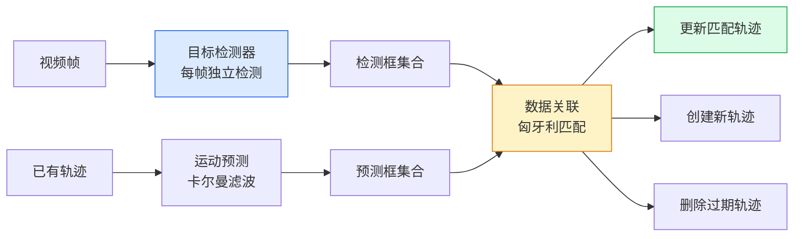

# 多目标跟踪：检测是瞬间的，跟踪是持续的

> 检测告诉你"这里有一个物体"。跟踪告诉你"这个物体就是上一帧的那个"。没有跟踪，视频就只是一堆不相关的静止帧。

**类型：** 实现课
**语言：** Python
**前置知识：** 阶段 04 · 06（目标检测 YOLO）— 理解检测输出格式，阶段 03（深度学习核心）— 反向传播与损失函数
**预计时间：** ~90 分钟
**所处阶段：** Tier 1
**关联课程：** 阶段 04 · 07（语义分割 U-Net）— 分割与跟踪的结合可用于精细目标跟踪

---

## 🎯 学习目标

完成本课后，你能够：

- [ ] 解释跟踪与检测的区别，理解跟踪-检测两阶段（Tracking-by-Detection）范式的完整流程
- [ ] 从零实现 SORT 算法——包括 IoU 代价矩阵、匈牙利匹配、卡尔曼预测-更新循环
- [ ] 描述 ByteTrack 的二次匹配核心思想，并实现低置信度检测的恢复逻辑
- [ ] 解释 Re-ID 特征学习的基本原理，以及 DeepSORT 如何在 SORT 基础上加入外观特征
- [ ] 计算 MOTA、IDF1 等跟踪指标，并理解各自的适用场景

---

## 1. 问题

你的 YOLO 检测器已经能准确找出每一帧中的人、车、猫。它给出的结果是这样的：

```
第 1 帧：检测到 3 个物体 → [人A, 人B, 车C]
第 2 帧：检测到 3 个物体 → [人X, 人Y, 车Z]
第 3 帧：检测到 3 个物体 → [人M, 人N, 车P]
```

每帧的检测结果之间没有关联——你根本不知道第 1 帧的"人A"和第 2 帧的"人X"是不是同一个人。没有这个信息，你无法实现以下任何功能：

- **目标计数**：一个路口有多少人通过？如果不能用跟踪区分"重复出现"和"新出现"，你会把同一个人重复计数
- **违规检测**：一辆车在某个车道停了 8 秒——你说它违章。但你没有跟踪的话，只能猜第 1 帧的车和第 8 帧的车是不是同一辆
- **遮挡恢复**：行人被电线杆挡住 3 帧后重新出现——没有跟踪，他变成了一个新物体；有跟踪，你知道这还是同一个人
- **轨迹分析**：商品的货架热力图——你根本看不出顾客的移动路径

这就是多目标跟踪（Multi-Object Tracking, MOT）要解决的问题。它不是在每次检测中"重新发现"世界——它是在维持一个关于世界的连续认知。

**一个典型的跟踪系统流程：**



这个流程在工业界被称为 **跟踪-检测（Tracking-by-Detection）** 范式——它用"每帧先检测，再关联"的方式，将复杂的跟踪问题拆解为可管理的子问题。

---

## 2. 概念

### 2.1 跟踪-检测范式：三步走

任何跟踪-检测跟踪器都包含三个核心步骤：

**第一步：运动预测**

当前帧到来时，上一帧的每个目标应该出现在哪里？如果一辆车以 10 米/秒的速度向右行驶，第 1 帧在坐标 (100, 200)，第 2 帧大概率在 (120, 200)。运动预测就是利用历史信息估算目标的新位置。

**第二步：数据关联**

上一步预测的位置与当前帧检测到的位置之间，哪些应该配对？这就是一个分配问题——M 个预测框和 N 个检测框，找到最佳的一对一匹配。最常用的方案是匈牙利算法搭配 IoU 代价矩阵。

**第三步：状态管理**

- **轨迹创建**：一帧中新出现的、无法匹配到任何已有轨迹的检测，创建新轨迹
- **轨迹更新**：匹配成功的轨迹用检测结果更新其状态（位置、速度）
- **轨迹删除**：连续若干帧未匹配到的轨迹，从系统中移除

### 2.2 卡尔曼滤波：运动预测的核心

卡尔曼滤波器是一个递归状态估计器。在跟踪场景下，它维护每个目标的"状态"——包括位置和速度——以及状态的不确定性。

```
状态向量 x = [x, y, w, h, vx, vy, vw, vh]
              └───位置──┘  └───速度───┘
```

卡尔曼滤波的两个阶段：

**预测（Predict）：** 用匀速模型估算目标下一帧的位置
```
x' = F @ x       # 位置 += 速度
P' = F @ P @ F^T + Q   # 不确定性增大
```

**更新（Update）：** 用检测结果修正预测
```
K = P @ H^T @ (H @ P @ H^T + R)^{-1}    # 计算卡尔曼增益
x = x + K @ (z - H @ x)                  # 状态修正
P = (I - K @ H) @ P                      # 不确定性减小
```

其中 Q 是过程噪声（模型误差有多大），R 是观测噪声（检测器有多准）。当预测的不确定性很大时（比如目标刚丢失后又出现），卡尔曼会更信任检测结果（观测值）。当检测结果噪声很大时，卡尔曼会更信任运动模型。

> **直观理解：** 卡尔曼滤波相当于在你的预测和检测之间做一个加权平均——谁更可信，就多信谁。

### 2.3 匈牙利算法：最优匹配

给定 M 个跟踪轨迹和 N 个当前帧检测，你需要找出"哪个检测框对应哪个轨迹"。匈牙利算法（Hungarian Algorithm）解决的就是这个**二分图最优匹配**问题。

```
代价矩阵 C:               对每一对 (轨迹 i, 检测 j):
                            cost[i,j] = 1 - IoU(预测框_i, 检测框_j)
                         IoU 越大的匹配代价越小

匈牙利算法结果:           行（轨迹）与列（检测）的一对一分配
                         使得总代价最小
```

在 Python 中，`scipy.optimize.linear_sum_assignment` 即是匈牙利算法的标准实现。它的时间复杂度是 O((M+N)^3)，对于通常少于 500 个目标的场景，在 Python 中也是实时的。

### 2.4 主流的跟踪算法家族

所有的跟踪-检测算法都是在这个骨架上做改进：

**SORT（2016）** — 最简实现

```
检测器 + 卡尔曼滤波 + IoU 匈牙利匹配
优点：极快（1000+ FPS on CPU）
缺点：没有外观特征，ID 切换频繁
```

**DeepSORT（2017）** — 加入外观特征

```
SORT + Re-ID 特征网络
在 IoU 代价之外增加"外观余弦距离"作为匹配约束
优点：遮挡恢复、跨帧 ID 保持更好
缺点：需要额外训练 Re-ID 网络
```

**ByteTrack（2021）** — 低置信度二次匹配

```
SORT + 两个阶段的匈牙利匹配
第一轮：高置信度检测（>= 0.5）做标准匹配
第二轮：未匹配轨迹尝试匹配低置信度检测（更宽松的 IoU 阈值）
优点：无需外观特征，在 MOT17 上达到 SOTA
缺点：对严重遮挡仍需运动模型
```

**BoT-SORT（2022）** — 全面改进

```
ByteTrack + 相机运动补偿 + Re-ID
利用全局运动补偿处理相机抖动场景
```

### 2.5 Re-ID：外观特征的提取

DeepSORT 引入了 **Re-ID（Re-Identification，重识别）** 特征来解决一个问题：仅仅依靠运动模型，两个交叉走过的行人会交换 ID。

Re-ID 网络的训练方式：

```
输入：截取的目标图像（如 128×64 的行人裁剪图）
输出：一个固定维度的特征向量（如 128 维）

训练目标：同一个人的不同视角 → 特征距离小
          不同的人             → 特征距离大
```

在匹配阶段，代价矩阵变为：
```
cost[i,j] = λ × IoU_cost + (1-λ) × cosine_distance(feature_i, feature_j)
```

这里的 λ 控制运动模型和外观模型的权重。当目标被遮挡（IoU 完全不可靠）时，外观特征成为唯一可用的信号。

### 2.6 SAM 2 基于记忆的跟踪

2024 年 Meta 提出的 SAM 2 开创了跟踪的新范式——不依赖显式的检测 + 关联，而是通过**记忆特征**来实现隐式跟踪。

给定一个提示（点击、框、文本）定位某实例后，SAM 2 将该实例的时空特征存入**记忆库**。后续帧中，解码器通过交叉注意力将记忆与当前帧特征对齐，直接输出同一实例的分割掩码。

```
Pros: 可以处理长时间遮挡（记忆携带实例身份），不需要单独的运动模型
Cons: 多目标场景较慢（每个实例独立维护记忆）
```

SAM 3.1 的 Object Multiplex 进一步解决了多目标效率问题：用一个共享记忆 + 每个实例的查询词元，成本随实例数亚线性增长。

---

## 3. 从零实现

本节从零构建一个完整的 SORT 风格跟踪器，并实现 ByteTrack 的二次匹配改进。

### 第 1 步：IoU 计算矩阵

任何跟踪器的核心都是 IoU 计算。下面这个函数接受两组边界框，返回完整的 IoU 矩阵。

```python
import numpy as np

def bbox_iou(boxes_a, boxes_b):
    """计算两组边界框之间的 IoU 矩阵。
    
    Args:
        boxes_a: (N, 4) 数组
        boxes_b: (M, 4) 数组
    
    Returns:
        (N, M) IoU 矩阵
    """
    if len(boxes_a) == 0 or len(boxes_b) == 0:
        return np.zeros((len(boxes_a), len(boxes_b)))
    
    ax1, ay1 = boxes_a[:, 0], boxes_a[:, 1]
    ax2, ay2 = boxes_a[:, 2], boxes_a[:, 3]
    bx1, by1 = boxes_b[:, 0], boxes_b[:, 1]
    bx2, by2 = boxes_b[:, 2], boxes_b[:, 3]
    
    inter_x1 = np.maximum(ax1[:, None], bx1[None, :])
    inter_y1 = np.maximum(ay1[:, None], by1[None, :])
    inter_x2 = np.minimum(ax2[:, None], bx2[None, :])
    inter_y2 = np.minimum(ay2[:, None], by2[None, :])
    
    inter = np.clip(inter_x2 - inter_x1, 0, None) * np.clip(inter_y2 - inter_y1, 0, None)
    area_a = (ax2 - ax1) * (ay2 - ay1)
    area_b = (bx2 - bx1) * (by2 - by1)
    union = area_a[:, None] + area_b[None, :] - inter
    
    return inter / np.clip(union, 1e-8, None)
```

关键设计：利用 NumPy 的广播机制一次性计算所有 (N, M) 对，避免 Python 循环。`[None, :]` 和 `[:, None]` 的维度扩展让矩阵运算是批量 IoU 计算的行业标准做法。

### 第 2 步：卡尔曼滤波器（匀速模型）

卡尔曼滤波器维护每个轨迹的状态（位置 + 速度）和不确定性（协方差矩阵）。

```python
class KalmanFilter:
    """常速模型的卡尔曼滤波器。
    
    状态: [cx, cy, w, h, vx, vy, vw, vh] (8维)
    """
    def __init__(self):
        self.dim_state = 8
        # 状态转移矩阵：匀速模型
        self.F = np.eye(self.dim_state)
        for i in range(4):
            self.F[i, i + 4] = 1.0  # 位置 += 速度
        
        # 观测矩阵：只能观测位置
        self.H = np.zeros((4, self.dim_state))
        self.H[:4, :4] = np.eye(4)
        
        self.x = np.zeros(self.dim_state)
        self.P = np.eye(self.dim_state) * 10.0
    
    def init_state(self, bbox):
        """用检测框初始化状态。"""
        x1, y1, x2, y2 = bbox
        cx, cy = (x1 + x2) / 2, (y1 + y2) / 2
        self.x = np.array([cx, cy, x2 - x1, y2 - y1, 0, 0, 0, 0])
    
    def predict(self):
        """预测下一帧的位置。"""
        self.x = self.F @ self.x
        self.P = self.F @ self.P @ self.F.T + self.Q
        return self._state_to_bbox()
    
    def update(self, bbox):
        """用检测结果更新状态。"""
        x1, y1, x2, y2 = bbox
        z = np.array([(x1 + x2) / 2, (y1 + y2) / 2, x2 - x1, y2 - y1])
        S = self.H @ self.P @ self.H.T + self.R
        K = self.P @ self.H.T @ np.linalg.inv(S)  # 卡尔曼增益
        self.x = self.x + K @ (z - self.H @ self.x)
        self.P = (np.eye(self.dim_state) - K @ self.H) @ self.P
```

这里 `Q`（过程噪声）和 `R`（观测噪声）是两个关键超参数：

- 增大 `Q`：模型认为运动不确定性大，更信任检测结果
- 增大 `R`：模型认为检测噪声大，更信任运动预测

在遮挡场景中，检测结果丢失时只剩预测在发挥作用。此时 `Q` 越大，预测框发散得越快。

### 第 3 步：SORT 跟踪器

将以上组件组合为完整的 SORT 跟踪器：

```python
from scipy.optimize import linear_sum_assignment

class SortTracker:
    """SORT 风格跟踪器。"""
    
    def __init__(self, iou_threshold=0.3, max_age=5):
        self.tracks = []
        self.next_id = 1
        self.iou_threshold = iou_threshold
        self.max_age = max_age
    
    def step(self, detections, frame_id):
        """处理一帧。"""
        # 1. 对所有轨迹做卡尔曼预测
        for track in self.tracks:
            track.predict()
        
        # 2. 计算 IoU 代价矩阵
        dets = np.array(detections) if detections else np.empty((0, 4))
        if not self.tracks or len(dets) == 0:
            # 没有轨迹或检测，直接创建新轨迹
            ...
            return
        
        track_boxes = np.array([t.bbox for t in self.tracks])
        iou = bbox_iou(track_boxes, dets)
        cost = 1 - iou
        cost[iou < self.iou_threshold] = 1e6
        
        # 3. 匈牙利匹配
        matched_tracks, matched_dets = set(), set()
        row_idx, col_idx = linear_sum_assignment(cost)
        for r, c in zip(row_idx, col_idx):
            if cost[r, c] < 1.0:
                self.tracks[r].update(dets[c], frame_id)
                matched_tracks.add(r); matched_dets.add(c)
        
        # 4. 未匹配的检测创建新轨迹
        for i, det in enumerate(dets):
            if i not in matched_dets:
                self.tracks.append(Track(self.next_id, det, frame_id))
                self.next_id += 1
        
        # 5. 删除过期轨迹
        self.tracks = [t for t in self.tracks 
                       if frame_id - t.last_frame <= self.max_age]
```

这个实现只有约 40 行核心逻辑（不含卡尔曼滤波）。它包含的数据关联策略是：**IoU 低于阈值的直接拒绝匹配**。这防止了完全无关的轨迹和检测被硬凑在一起。

### 第 4 步：ByteTrack 二次匹配

ByteTrack 的改进非常简洁：在第一轮匹配后，多做一个第二轮。

```python
class ByteTrackTracker(SortTracker):
    """ByteTrack 风格跟踪器。"""
    
    def __init__(self, iou_threshold=0.3, max_age=5, score_thresh=0.5):
        super().__init__(iou_threshold, max_age)
        self.score_thresh = score_thresh
    
    def step(self, detections_with_scores, frame_id):
        """分离高/低置信度检测，做两轮匹配。"""
        high_dets = [d for d in detections_with_scores if d[1] >= self.score_thresh]
        low_dets = [d for d in detections_with_scores if d[1] < self.score_thresh]
        
        # 第一轮：高置信度匹配（标准 SORT）
        unmatched = self._match_first_phase(high_dets, frame_id)
        
        # 第二轮：未匹配轨迹匹配低置信度检测（宽松阈值）
        if unmatched and low_dets:
            self._match_second_phase(unmatched, low_dets, frame_id)
```

核心洞察：低置信度检测不一定是噪声——遮挡中的目标、运动模糊的目标都可能产生低置信度框。如果直接丢弃它们，这些目标就会丢失。ByteTrack 给它们第二次机会。

### 第 5 步：在合成轨迹上测试

我们生成匀速直线运动的目标，观察跟踪器的行为：

```python
def synthetic_frames(num_frames=25, num_objects=3, H=240, W=320, 
                      seed=0, drop_prob=0.0):
    """生成合成测试数据。"""
    rng = np.random.default_rng(seed)
    starts = rng.uniform(20, 200, size=(num_objects, 2))
    velocities = rng.uniform(-4, 4, size=(num_objects, 2))
    
    frames, gt = [], []
    for f in range(num_frames):
        dets, gts = [], []
        for i in range(num_objects):
            cx = starts[i, 0] + f * velocities[i, 0]
            cy = starts[i, 1] + f * velocities[i, 1]
            bbox = [cx - 10, cy - 10, cx + 10, cy + 10]
            gts.append((i, bbox))
            if rng.random() >= drop_prob:
                dets.append(bbox)
        frames.append(dets)
        gt.append(gts)
    return frames, gt

# 3 个目标匀速运动，不应产生 ID 切换
tracker = SortTracker()
frames, gt = synthetic_frames(num_frames=25, num_objects=3, seed=42)
tracks_per_frame = [tracker.step(dets, f) for f, dets in enumerate(frames)]
print(f"ID 切换次数: {count_id_switches(tracks_per_frame, gt)}")  # 应为 0
```

运行 `code/main.py` 会打印不同配置下的跟踪效果，包括 3/10/30 个目标的 ID 切换计数，以及 20% 检测丢失率下的表现。完整代码见课程代码目录。

### 第 6 步：ID 切换计数与 MOTA 评估

评估跟踪器的两个基础指标：

```python
def count_id_switches(tracks_per_frame, gt_per_frame):
    """计算 ID 切换次数。"""
    prev = {}
    switches = 0
    for tracks, gts in zip(tracks_per_frame, gt_per_frame):
        if not tracks or not gts:
            continue
        t_boxes = np.array([b for _, b in tracks])
        g_boxes = np.array([b for _, b in gts])
        iou = bbox_iou(g_boxes, t_boxes)
        for gt_idx, (gt_id, _) in enumerate(gts):
            best = int(iou[gt_idx].argmax())
            if iou[gt_idx, best] > 0.5:
                track_id = tracks[best][0]
                if gt_id in prev and prev[gt_id] != track_id:
                    switches += 1
                prev[gt_id] = track_id
    return switches

def compute_mota(tracks_per_frame, gt_per_frame, num_gt):
    """MOTA = 1 - (FN + FP + ID_sw) / GT 总数"""
    fn = fp = 0
    sw = count_id_switches(tracks_per_frame, gt_per_frame)
    for tracks, gts in zip(tracks_per_frame, gt_per_frame):
        # 简化计算：IoU > 0.5 视为匹配
        ...
    return 1.0 - (fn + fp + sw) / num_gt
```

完整实现见本课代码文件。实际生产评估使用 `py-motmetrics` 和 `TrackEval` 库。

---

## 4. 工业工具

### 4.1 Ultralytics 内置跟踪

YOLOv8 及之后版本内置了 ByteTrack 和 BoT-SORT 跟踪器：

```python
from ultralytics import YOLO

# 加载检测模型
model = YOLO("yolov8n.pt")

# 跟踪视频 — 一行代码搞定
results = model.track(
    source="video.mp4",
    tracker="bytetrack.yaml",       # 使用 ByteTrack 配置
    persist=True,                   # 保持帧间 ID 一致性
    conf=0.25,
    iou=0.45,
)

# 结果包含跟踪 ID
for result in results:
    boxes = result.boxes
    if boxes is not None:
        for box in boxes:
            track_id = int(box.id) if box.id is not None else -1
            cls_name = result.names[int(box.cls)]
            conf = float(box.conf)
            print(f"跟踪 ID: {track_id}, 类别: {cls_name}, 置信度: {conf:.2f}")
```

`ultralytics` 的跟踪器配置在 YAML 文件中定义，可调整 `track_thresh`、`match_thresh`、`max_age` 等参数。这是目前最快捷的工业生产方案。

### 4.2 Supervision 跟踪工具箱

Roboflow 的 `supervision` 库将跟踪器封装为即插即用组件：

```python
import supervision as sv
from ultralytics import YOLO

model = YOLO("yolov8n.pt")
tracker = sv.ByteTrack()  # 或 sv.DeepSort()

def callback(frame: np.ndarray, frame_idx: int) -> np.ndarray:
    results = model(frame)[0]
    detections = sv.Detections.from_ultralytics(results)
    detections = tracker.update_with_detections(detections)
    
    # 标注跟踪结果
    box_annotator = sv.BoundingBoxAnnotator()
    label_annotator = sv.LabelAnnotator()
    
    labels = [f"#{tracker_id}" for tracker_id in detections.tracker_id]
    annotated = box_annotator.annotate(frame, detections)
    annotated = label_annotator.annotate(annotated, detections, labels)
    return annotated

sv.process_video(
    source_path="input.mp4",
    target_path="output.mp4",
    callback=callback
)
```

`supervision` 内置了标注工具、视频 I/O 和跟踪器的统一接口，适合快速搭建原型。

### 4.3 Py-MOTMetrics 评估

工业级跟踪评估使用 `py-motmetrics` 库：

```python
import motmetrics as mm

def evaluate_tracking(pred_path, gt_path):
    """计算 MOTA、IDF1 等指标。"""
    gt = mm.io.loadtxt(gt_path, fmt="mot15-2D")
    pred = mm.io.loadtxt(pred_path, fmt="mot15-2D")
    acc = mm.utils.compare_to_groundtruth(gt, pred, dist="iou", distth=0.5)
    metrics = mm.metrics.create().compute(
        acc, metrics=["mota", "motp", "idf1", "idp", "idr", "num_switches"]
    )
    return metrics
```

输入文件格式要求（MOT Challenge 格式）：

```
# predictions.txt
<frame>,<track_id>,<x>,<y>,<w>,<h>,<confidence>,-1,-1,-1

# ground_truth.txt
<frame>,<gt_id>,<x>,<y>,<w>,<h>,1,-1,-1,-1
```

帧从 1 开始编号，框使用 (x, y, w, h) 格式（不是 (x1, y1, x2, y2)）。格式差异是集成时最常见的 BUG 来源。

### 4.4 性能对比

| 方案 | 速度 | 外观特征 | 遮挡恢复 | 典型场景 |
|---|---|---|---|---|
| SORT（自实现） | ~1000 FPS | 无 | 弱 | 概念验证 |
| SORT（scipy 版） | ~500 FPS | 无 | 弱 | 简单场景 |
| ByteTrack（Ultralytics） | ~200 FPS | 无 | 中 | 通用场景 |
| DeepSORT（Supervision） | ~100 FPS | 有（需额外模型） | 强 | 人群跟踪 |
| BoT-SORT（Ultralytics） | ~80 FPS | 有 + 运动补偿 | 强 | 运动相机场景 |
| SAM 2（Transformers） | ~10 FPS | 记忆库 | 极强 | 精细分割跟踪 |

---

## 5. 知识连线

本课学习的多目标跟踪技术是计算机视觉中连接检测与理解的桥梁。后续课程中你会看到：

- **阶段 07（Transformer 深入）**：Transformer 架构中的交叉注意力机制正是 SAM 2 记忆跟踪的核心运算——你在本课学的"记忆库通过交叉注意力隐式关联目标"在 Transformer 课程中有完整的数学推导
- **阶段 10（大语言模型从零）**：大语言模型的自回归生成与目标跟踪的"预测-更新"循环在结构上高度相似——当前词元/位置预测下一个，然后用真实观测修正。理解卡尔曼滤波的预测-更新范式是理解 LLM 推理过程的绝佳铺垫
- **阶段 12（多模态 AI）**：视频多模态理解（VideoQA、视频描述）的第一个预处理步骤就是目标跟踪——"谁在做什么"的时空结构需要用跟踪来构建

---

## 6. 工程最佳实践

### 6.1 工业界选型指南

| 场景 | 推荐方案 | 原因 |
|---|---|---|
| 通用监控视频（30 FPS） | ByteTrack + YOLOv8 | 速度快，无需额外训练 |
| 密集人群跟踪 | ByteTrack 或 BoT-SORT | IoU 匹配 + 相机运动补偿 |
| 需要分割掩码的跟踪 | SAM 2 / SAM 3.1 | 记忆库隐式跟踪 |
| 体育赛事分析 | BoT-SORT + 强 Re-ID | 运动员球衣编号可作为 Re-ID 特征 |
| 细胞/粒子跟踪 | Btrack、TrackMate | 专为分割合并场景设计 |

### 6.2 调参要点

- **`iou_threshold`（匹配阈值）**：0.3 是通用的起点。场景越密集（人群、车流），阈值应适当提高（0.5），避免不同物体的框被错误匹配
- **`max_age`（最大丢失帧数）**：5 帧是常见值。视频帧率越高，可设越大（如 30 FPS 视频可设 10-15），因为物体实际消失时间更短
- **`score_thresh`（ByteTrack 置信度分界）**：0.5 是标准值。如果检测器质量很高，可以降低到 0.3，更多低置信度检测被纳入恢复

### 6.3 中文场景特别建议

- **路口监控**：中国城市路口人流密集，建议使用 ByteTrack 并调低 `iou_threshold`（0.3→0.25），因为密集场景下 IoU 本来就很低
- **商场客流分析**：行人方向多变，建议让 `max_age` 稍低（3-5 帧），避免离开的顾客"挂"着轨迹太久导致重新出现时 ID 分配混乱
- **工业质检流水线**：传送带上的产品运动规律（匀速、单向），卡尔曼滤波器几乎完美预测，`Q`（过程噪声）可以设得极小
- **篮球/足球赛事**：多人球衣颜色相似，纯外观 Re-ID 容易出错。建议将场上位置（空间约束）加入代价矩阵

### 6.4 踩坑经验

- 匹配代价矩阵的阈值处理必须在匈牙利匹配**之前**完成。如果先跑匈牙利再过滤低 IoU 匹配，某些轨迹可能被强制匹配到完全不相关的检测上
- 置信度阈值与 IoU 阈值需要配合调整。过高的置信度阈值导致漏检增多，过高的 IoU 阈值导致匹配失败——通常先定检测器的 `conf` 再调跟踪的 `iou_threshold`
- 边界框格式转换（[x1,y1,x2,y2] 与 [x,y,w,h]）是最容易出 BUG 的地方。MOT Challenge 评估工具要求 (x, y, w, h)，而检测器输出通常是 (x1, y1, x2, y2)
- 卡尔曼滤波器的 `Q` 和 `R` 对帧率敏感。同一组参数在 30 FPS 和 60 FPS 视频上的表现完全不同——高速视频需要更小的 `Q`（运动变化更小）

---

## 7. 常见错误

### 错误 1：IoU 阈值使用不当

**现象：** 轨迹持续性差，一会儿出现一会儿消失，ID 频繁切换。

**原因：** `iou_threshold` 设置过高（如 0.7），导致很多正确的匹配被拒绝。目标的移动导致预测框和检测框之间只有部分重叠（特别是快速移动的小物体），阈值过高会导致大量轨迹被错误终止和重建。

**修复：**
```python
# ❌ 阈值过高，快速移动物体匹配失败
tracker = SortTracker(iou_threshold=0.7)

# ✓ 0.25-0.35 是合理的范围
tracker = SortTracker(iou_threshold=0.3, max_age=5)
```

### 错误 2：匈牙利匹配前未施加 IoU 下限

**现象：** 完全不重叠的轨迹和检测被匹配，结果完全错误。

**原因：** 匈牙利算法会找到最小代价的匹配——即使代价很大。如果不设下限，两个完全不相交的框也可能被硬凑到一起。

**修复：**
```python
# ❌ 匈牙利会在所有组合中找最小代价 — 即使完全不相交
cost = 1.0 - iou_matrix
row, col = linear_sum_assignment(cost)  # 没有下限！

# ✓ 先将低 IoU 的代价设为极大值，再匹配
cost = 1.0 - iou_matrix
cost[iou_matrix < self.iou_threshold] = 1e6  # 禁止匹配
row, col = linear_sum_assignment(cost)
for r, c in zip(row, col):
    if cost[r, c] < 1.0:  # 双重保险
        ...
```

### 错误 3：卡尔曼滤波初始化不当

**现象：** 轨迹刚创建时抖动严重，预测框跳动不明显。

**原因：** 卡尔曼滤波器的初始协方差 P 设得太小，导致前几帧检测结果几乎不影响状态。初始时不确定性应该大，让检测结果充分修正状态。

**修复：**
```python
# ❌ 初始不确定性太小 — 检测框对状态几乎没有修正
kalman.P = np.eye(8) * 0.1

# ✓ 初始不确定性大 — 让检测结果充分影响状态
kalman.P = np.eye(8) * 100.0
```

### 错误 4：漏加非极大值抑制

**现象：** 同一个物体上产生多个紧挨着的轨迹（假阳性跟踪）。

**原因：** 检测器的输出如果没有经过 NMS，一个物体可能产生多个几乎重叠的检测框。每个检测框都会创建一条新轨迹。在密集场景中，这会导致"轨迹簇"——同一物体被多条轨迹跟踪。

**修复：**
```python
# ❌ 直接使用原始检测输出
dets = model(frame)[0].boxes.xyxy.numpy()

# ✓ 先做 NMS 再输入跟踪器
from torchvision.ops import nms
keep = nms(
    boxes=torch.tensor(dets),
    scores=torch.tensor(scores),
    iou_threshold=0.5
)
dets = dets[keep.numpy()]
```

### 错误 5：忽略边界框裁剪

**现象：** 轨迹的预测框逐渐飞出画面边缘，然后在新物体进入时突然跳回画面。

**原因：** 卡尔曼预测不感知画面边界。轨迹的预测框可能超出图像边缘，但下一帧的 IoU 计算只用了可见区域内的框，导致匹配失效。

**修复：**
```python
def clip_bbox(bbox, H, W):
    """将边界框裁剪到画面范围内。"""
    x1, y1, x2, y2 = bbox
    return [
        max(0, x1), max(0, y1),
        min(W, x2), min(H, y2)
    ]

# 在 IoU 计算前裁剪预测框
pred_boxes = [clip_bbox(t.predict(), H, W) for t in self.tracks]
```

---

## 8. 面试考点

### Q1：SORT、DeepSORT、ByteTrack 的区别是什么？（难度：⭐⭐）

**参考答案：**
三者都基于跟踪-检测范式，核心差异在于如何处理特征：

- **SORT**：仅用卡尔曼滤波（运动模型）+ IoU 匈牙利匹配。没有外观特征，速度快但 ID 切换频繁
- **DeepSORT**：在 SORT 基础上加入 Re-ID 外观特征。代价函数变为 `λ × IoU_cost + (1-λ) × cos(feature_i, feature_j)`。匹配更鲁棒，但需要额外训练 Re-ID 网络
- **ByteTrack**：不添加外观特征，而是利用低置信度检测做二次匹配。第一轮高置信度检测标准匹配，第二轮未匹配轨迹尝试匹配低置信度检测。简单但效果好，在 MOT17 上超过 DeepSORT

**选型判断：** 追求速度且遮挡不严重 → SORT；遮挡严重且有 Re-ID 模型 → DeepSORT；兼顾速度和效果 → ByteTrack。

### Q2：卡尔曼滤波在跟踪中是如何工作的？（难度：⭐⭐）

**参考答案：**
卡尔曼滤波完成两个交替步骤：

1. **预测**：用匀速模型（`x' = x + v`）估算目标下一帧的位置，同时增加不确定性（协方差增大）
2. **更新**：将检测结果与预测结果融合。卡尔曼增益 K 决定了"我更信模型还是更信检测"——检测噪声大则 K 小（信模型），预测不确定性大则 K 大（信检测）

跟踪中的关键参数：Q（过程噪声）——模型假设的误差；R（观测噪声）——检测器的误差。增大 Q 使滤波器响应更快（更信检测），增大 R 使轨迹更平滑（更信模型）。

### Q3：MOTA 和 IDF1 有什么不同？什么时候用哪个？（难度：⭐⭐⭐）

**参考答案：**
- **MOTA** = 1 - (FN + FP + ID_sw) / GT 总数。它将漏检、误检和 ID 切换加权组合成一个单一数字。问题是它无法区分检测能力和跟踪能力——一个检测器很差的系统可能比一个检测器好但 ID 切换多的系统得分更高
- **IDF1** = ID Precision 和 ID Recall 的调和平均数。它关注的主要是"谁是谁"——同一个真实目标在整个视频中的 ID 是否被正确保持

**选型建议：** 监控安防（ID 保持最重要）→ IDF1；学术论文对比 → HOTA（最全面）；传统习惯 → MOTA（但需同时报告 IDF1）。

### Q4：如何匹配两个帧之间的同一个目标？（难度：⭐⭐⭐）

**参考答案：**
这个问题就是跟踪的核心——数据关联。标准做法：

1. **运动预测**：卡尔曼滤波预测每个目标在当前帧的大致位置
2. **代价矩阵**：计算目标预测框与当前帧检测框的代价（1 - IoU 或余弦距离，或两者加权）
3. **多项式匹配**：匈牙利算法求最优的一对一匹配
4. **阈值过滤**：IoU 过低的匹配强制拒绝（防止强行匹配无关目标）

对于长时间遮挡的场景，建议加入外观特征（Re-ID）辅助匹配，因为仅有运动模型时目标移出预测范围后 IoU 降至零，匹配必然失败。

### Q5：ByteTrack 为什么能在不引入外观特征的情况下提升跟踪效果？（难度：⭐⭐⭐）

**参考答案：**
核心洞察在于：**丢弃低置信度检测会丢失被遮挡的目标信息**。

一个目标被部分遮挡时，检测框的置信度会下降（比如从 0.9 降至 0.3）。传统跟踪器直接丢弃了这些低置信度检测，导致目标丢失，几帧后目标重新出现时创建了新轨迹——这就产生了 ID 切换。

ByteTrack 的策略：
- 第一轮：高置信度检测（≥ 0.5）与轨迹正常匹配
- 第二轮：未匹配的轨迹尝试匹配低置信度检测（< 0.5），使用更宽松的 IoU 阈值

这个简单改动在 MOT17 数据集上取得了接近 SOTA 的效果，证明了目标跟踪中"充分利用所有可用信息"比"增加更复杂的特征"更有效。

---

## 🔑 关键术语

| 术语 | 人们怎么说 | 实际含义 |
|---|---|---|
| 跟踪-检测（Tracking-by-Detection） | "先检测后关联" | 每帧独立运行检测器，然后用匹配算法将检测框关联到已有轨迹上的两阶段范式 |
| 卡尔曼滤波（Kalman Filter） | "运动预测" | 递归状态估计器——维护每个目标的位置、速度及不确定性，交替执行预测（运动模型）和更新（观测修正） |
| 匈牙利算法（Hungarian Algorithm） | "最优匹配" | 求解二分图最小代价一对一匹配的算法；实现为 `scipy.optimize.linear_sum_assignment`，时间复杂度 O(n^3) |
| IoU（交并比） | "框的重叠程度" | Intersection over Union——预测框与真实框交集面积除以并集面积，跟踪中用作匹配代价的基础 |
| Re-ID（重识别） | "外观特征提取" | 从裁剪的目标图像中提取固定维度的特征向量，使得相同目标的不同视角特征距离远小于不同目标——用于辅助匹配 |
| ByteTrack | "低置信度二次匹配" | 将未匹配轨迹与低置信度检测做二次匹配的改进方法——低置信度检测并非都是噪声，也可能来自被遮挡的目标 |
| MOTA（多目标跟踪准确率） | "跟踪效果好不好" | 1 - (FN + FP + ID 切换) / GT 总数——将漏检、误检和 ID 切换合并的复合指标 |
| IDF1（ID F1 分数） | "ID保持得怎么样" | ID 精确率和 ID 召回率的调和平均数——衡量跟踪器在保持目标身份一致性方面的能力 |
| 记忆库（Memory Bank） | "SAM 2 的跟踪方式" | 存储实例时空特征的缓存——后续帧通过交叉注意力将记忆与当前特征对齐，隐式完成关联，无需显式的匈牙利匹配 |

---

## 📚 小结

多目标跟踪是连接"单帧检测"和"视频理解"的桥梁。你从零实现了 SORT 跟踪器的核心——IoU 代价矩阵、卡尔曼预测-更新循环、匈牙利数据关联——并理解了 ByteTrack 通过在低置信度检测上做二次匹配来恢复遮挡目标。你还学习了 Re-ID 特征在 DeepSORT 中的作用，以及 MOTA、IDF1 等评估指标的适用场景。

下一课我们将把这些跟踪技术应用到更复杂的视频理解任务中，结合行为识别和轨迹分析构建完整的视频智能系统。

---

## ✏️ 练习

1. 【理解】用你自己的话解释"跟踪为什么不等于检测"。写一段 200 字以内的说明，让一个只做过图像分类的工程师能听懂。必须包含一个实际例子说明"有跟踪 vs 没有跟踪"的区别。

2. 【实现】在 `SortTracker` 的基础上，为代价矩阵增加"距离惩罚"——两个框的中心距离超过某个阈值时，即使 IoU 很高，也降低它们的匹配优先级。在合成数据上测试你的改进是否减少了 ID 切换。

3. 【实验】运行 `code/main.py`，观察不同目标数量（3、10、30）下跟踪器的表现。分析：当目标数量增多时，IoU 匹配为什么会失败？用具体的数字说明你的论断。

4. 【实验】在合成数据中将 `drop_prob` 设为 0.3（30% 帧丢失），分别测试 `max_age=2`、`max_age=5`、`max_age=10` 对 ID 切换次数的影响。解释为什么 max_age 的取值存在一个最优区间——太大和太小分别有什么问题。

5. 【思考】ByteTrack 在低置信度检测二次匹配中使用了更宽松的 IoU 阈值。如果阈值放得太松（如从 0.3 降到 0.05），可能会出现什么问题？这种"两极匹配"策略的极限在哪？

---

## 🚀 产出

本课产出以下可复用内容：

| 产出 | 文件 | 说明 |
|---|---|---|
| SORT 跟踪器实现 | `code/main.py` | 从零实现的 SORT/ByteTrack 跟踪器，含卡尔曼滤波、匈牙利匹配和评估指标 |
| 跟踪器选型提示词 | `outputs/prompt-mot-guide.md` | 根据场景类型、遮挡程度、速度要求推荐最适合的跟踪方案 |

---

## 📖 参考资料

1. [论文] Bewley et al. "Simple Online and Realtime Tracking (SORT)". ICIP, 2016. https://arxiv.org/abs/1602.00763
2. [论文] Wojke et al. "Simple Online and Realtime Tracking with a Deep Association Metric (DeepSORT)". ICIP, 2017. https://arxiv.org/abs/1703.07402
3. [论文] Zhang et al. "ByteTrack: Multi-Object Tracking by Associating Every Detection Box". ECCV, 2022. https://arxiv.org/abs/2110.06864
4. [论文] Aharon et al. "BoT-SORT: Robust Associations Multi-Pedestrian Tracking". arXiv, 2022. https://arxiv.org/abs/2206.14651
5. [论文] Luiten et al. "HOTA: A Higher Order Metric for Evaluating Multi-Object Tracking". IJCV, 2020. https://arxiv.org/abs/2009.07736
6. [论文] Ristani et al. "Tracking the Trackers: An Analysis of the State of the Art in Multiple Object Tracking". arXiv, 2017. https://arxiv.org/abs/1704.02781
7. [官方文档] Ultralytics Tracking: https://docs.ultralytics.com/modes/track/
8. [GitHub] py-motmetrics: https://github.com/cheind/py-motmetrics
9. [官方文档] Supervision ByteTrack: https://supervision.roboflow.com/latest/trackers/
10. [官方文档] Meta SAM 2 Video: https://ai.meta.com/sam2/
