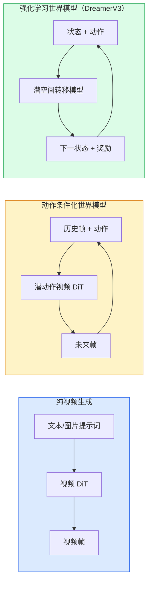
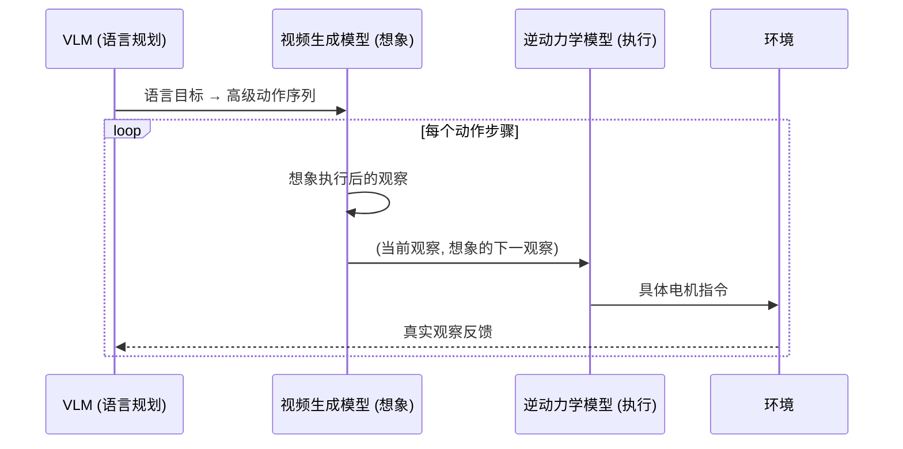

# World Models 视频扩散——当视频模型学会了"预测未来"

> 能预测下一个视频帧的模型是视频生成器；能根据动作预测未来帧的模型是世界模拟器。

**类型：** 实现课
**语言：** Python
**前置知识：** 阶段 04 · 10（扩散模型 DDPM）、阶段 04 · 12（视频理解）、阶段 04 · 23（Diffusion Transformer 与 Rectified Flow）
**预计时间：** ~90 分钟
**所处阶段：** Tier 1
**关联课程：** 阶段 04 · 23（DiT 与 Rectified Flow）— 理解扩散 Transformer 的图像级架构，本课将其扩展到视频维度

---

## 🎯 学习目标

完成本课后，你能够：

- [ ] 区分纯视频生成模型（如 Sora）与动作条件化世界模型（如 Genie 3、DreamerV3）的架构差异
- [ ] 描述视频 DiT 的时空分块（spatio-temporal patches）、3D 位置编码和分解注意力机制
- [ ] 从零实现一个微型视频 DiT，理解每个组件如何处理时空维度
- [ ] 解释世界模型在机器人学中的三组件循环（VLM + 视频模型 + 逆动力学模型）
- [ ] 区分视频生成的主要评估指标（FVD、物理合理性、可操控性）

---

## 1. 问题

在阶段 04 第 10 课，你实现了基于 U-Net 的图像扩散模型。在第 23 课，你看到了 Diffusion Transformer 如何用自注意力替代卷积，大幅提升了图像生成质量。但这些都是静态图像——它们不理解"运动"。

现实世界不是静态的。球会下落，液体会溢出，汽车会刹车。要让 AI 理解这个动态的世界，模型必须能够预测"接下来会发生什么"。

2024 年，OpenAI 发布了 Sora 的技术报告，标题直接宣称"视频生成模型作为世界模拟器"。2026 年初，Sora 2 上线，能生成带同步音频的分钟级视频。同一时期，DeepMind 的 Genie 3 从一张图片生成可交互的游戏环境，NVIDIA 的 Cosmos-Drive 为自动驾驶合成真实驾驶场景，Wayve 的 Gaia-2 生成轨迹条件化的街景视频。

一个根本性的转变正在发生：**视频生成和世界建模合流了。** 如果一个模型能生成连贯的视频序列，它在某种意义上已经学会了世界如何运动——物体恒存性、重力、因果关系。如果把这个预测条件化到动作上（向左走、开门），视频模型就变成了一个可学习的模拟器，可以替代游戏引擎、驾驶模拟器或机器人训练环境。

这种转变带来的工程影响是具体的：

- 自动驾驶团队不再需要数百万英里的真实数据采集来获取罕见场景（行人横穿、结冰路口），视频世界模型可以合成这些数据。
- 机器人团队不再需要复杂的奖励塑形和大量真实试错，视频模型在"想象"中模拟行动结果，逆动力学模型将其转化为真实动作指令。
- 游戏和内容创作领域，世界模型可以直接从一张图片生成可交互的虚拟环境。

---

## 2. 概念

### 2.1 三大世界建模家族



这三个家族的核心区别在于**是否有动作接口**：

| 家族 | 代表模型 | 条件信号 | 交互性 | 典型应用 |
|---|---|---|---|---|
| 纯视频生成 | Sora 2 | 文本/图片提示词 | 无（提示词固定后无法中途改变） | 创意视频、广告制作 |
| 动作条件化世界模型 | Genie 3、GWM-1 Worlds | 潜动作或显式动作 | 可交互（用户按键/移动相机，场景实时响应） | 游戏引擎、机器人模拟 |
| RL 世界模型 | DreamerV3 | 状态 + 动作（在潜空间中） | 低视觉质量，高样本效率 | 简单游戏的强化学习训练 |

**Sora 2** 是纯视频生成——它的提示词在第一帧设置场景，之后的视频完全由模型自回归生成，你无法中途改变方向。

**Genie 3** 是动作条件化世界模型——它从连续帧对中推断潜动作（latent action），然后在推理时用这个动作条件化下一帧生成。用户可以"操作"这个虚拟世界：按方向键移动角色，用鼠标旋转相机。

**DreamerV3** 在潜空间中工作，不追求视觉质量，追求的是用尽可能少的真实交互来学习任务——这是经典 RL 世界模型的路线。

### 2.2 视频 DiT 架构

视频 DiT 的核心思想是**将视频视为时空词元序列**，就像图像 DiT 将图像视为空间词元序列一样。

```
视频潜空间:          (C, T, H, W)
3D 分块 (Patchify):   时间方向每 P_t 帧合并，空间方向每 P_h × P_w 像素合并
得到的词元数:          (T / P_t) × (H / P_h) × (W / P_w) 个词元
```

举一个具体例子。一段 5 秒 360p 视频（150 帧，480×360 像素），使用 Sora 的分块参数（P_t=2, P_h=8, P_w=8）：

```
T_tok = 150 / 2 = 75    （时间方向词元数）
H_tok = 480 / 8 = 60    （高度方向词元数）
W_tok = 360 / 8 = 45    （宽度方向词元数）
总词元 = 75 × 60 × 45 = 202,500 个词元
```

20 万个词元——这就是视频扩散模型在处理 5 秒视频时面对的序列长度。

位置编码需要是 3D 的：每个词元需要知道自己在时间轴、高度轴、宽度轴上的位置。通常使用旋转位置嵌入（RoPE），对三个轴分别应用。

### 2.3 分解注意力——降低计算量的关键

全连接注意力的计算量是 O(N²)，其中 N 是词元总数。对于上面的例子，N = 202,500，N² ≈ 4 × 10¹⁰——完全不可接受。

**分解注意力（Divided Attention）** 将时空注意力分解为两步：

```
全连接注意力:     O((T × H × W)²)     ← 不可行
分解注意力:
  1. 时间注意力:   O(H×W × T²)        ← 同一空间位置跨时间
  2. 空间注意力:   O(T × (H×W)²)      ← 同一时间帧跨空间
```

用具体数字对比：

```
全连接注意力:     202,500² ≈ 4.1 × 10¹⁰ 对
分解-时间注意力:   2,700 × 75² ≈ 1.5 × 10⁷ 对
分解-空间注意力:   75 × 2,700² ≈ 5.5 × 10⁸ 对
分解总计:          ≈ 5.6 × 10⁸ 对

速度提升: 约 73 倍
```

TimeSformer（Bertasius et al., 2021）首次系统地提出了这个模式。2026 年的主流视频扩散模型——Sora、Wan-Video、HunyuanVideo——都使用分解注意力或其变体（如窗口注意力）。

```
分解注意力示意:

时间注意力 (同一空间位置，跨帧):
  帧1[t1] ──┐
  帧2[t2] ──┼── 注意力 → 更新
  帧3[t3] ──┘

空间注意力 (同一时间帧，跨位置):
  位置1[p1] ──┐
  位置2[p2] ──┼── 注意力 → 更新
  位置3[p3] ──┘
```

### 2.4 动作条件化——从视频生成到世界模型

视频生成器和世界模型的根本区别在于**推理时是否可以被"操控"**。

Genie 系列模型实现操控的关键技术是**潜动作模型（Latent Action Model）**：

1. 给定连续的帧对（帧_t, 帧_{t+1}），用判别器学习推断它们之间的"动作"（不一定是键盘按键，可以是任意潜变量）。
2. 训练时用这个潜动作条件化下一帧的预测。
3. 推理时，用户可以指定一个潜动作（或从先验中采样），模型生成与该动作一致的下一帧。

```
帧_t ──┐
        ├── 推断潜动作 a_t ── 条件化视频 DiT ── 帧_{t+1}
帧_{t+1}┘

推理时:
潜动作 a_t (用户指定) ── 条件化视频 DiT ── 帧_{t+1} (模型生成)
```

Sora 完全跳过了这个动作接口——它的解码器从过去的时空词元预测未来的时空词元，提示词设置开头，但中途没有任何操控机制。这就是为什么 Sora 是"视频生成器"而非"世界模型"。

### 2.5 物理合理性——世界模型的试金石

一个真正理解世界的模型应该知道：

- 物体会下落（重力）
- 不透明物体不能互相穿透（碰撞检测）
- 被遮挡的物体仍然存在（物体恒存性）
- 人吃东西时，食物应该减少，而不是凭空消失

Sora 2 的 2026 年发布明确宣传了**物理合理性**改进：重量感、平衡、物体恒存性、因果关系。模型在处理掉落物品、角色碰撞、"故意失败"（跳跃失败）等场景上明显优于 Sora 1。

但物理合理性仍然是最大的失败模式。2024-2025 年的视频模型在吃面条、喝东西等场景中频繁暴露问题——手穿过物体、物品凭空消失。2026 年的模型（Sora 2、Runway Gen-5、HunyuanVideo）减少了但没有消除这些问题。

### 2.6 自动驾驶世界模型

自动驾驶领域是视频世界模型最重要的应用场景之一：

| 模型 | 组织 | 用途 |
|---|---|---|
| Cosmos-Drive | NVIDIA | 条件化驾驶场景合成，用于强化学习训练 |
| Gaia-2 | Wayve | 轨迹条件化的街景生成，用于策略评估 |
| DrivingWorld | Tesla | 模拟各种天气、时间、交通条件 |
| Vista | ByteDance | 反应式驾驶场景合成 |

这些模型替代了昂贵的真实数据采集——行人夜间横穿、结冰路口、异常车辆类型等罕见场景，否则需要数百万英里的真实驾驶数据。

### 2.7 机器人学的三组件循环

一个正在兴起的机器人学习架构将视频世界模型与语言模型、逆动力学模型结合：



1. **VLM（视觉语言模型）** 解析目标（"拿起红色杯子"），规划高层动作序列。
2. **视频生成模型** 模拟执行每个动作后的视觉结果——预测 N 帧后的观察。
3. **逆动力学模型** 从（当前状态, 期望下一状态）中提取底层电机指令。

这个架构替代了传统的奖励塑形和大量真实试错。世界模型负责"想象"，逆动力学模型负责将想象转化为行动。Genie Envisioner 是这一架构的早期实现之一。

### 2.8 视频生成的评估指标

| 指标 | 评估维度 | 说明 |
|---|---|---|
| **FVD（Fréchet Video Distance）** | 视觉质量 | 视频版 FID，比较生成视频和真实视频在 Inflated-3D-ConvNet 特征空间中的分布距离 |
| **CLIPScore** | 提示词对齐度 | 每帧与文本提示词的 CLIP 余弦相似度 |
| **物理合理性评分** | 物理正确性 | 人工评估（如 Sora 2 的内部基准）或自动化检查（物体恒存性、重力、连续性） |
| **可操控性** | 交互世界模型 | 动作→观察的一致性：执行相同动作是否产生相同结果？能否回到之前的状态？ |

FVD 是最常用的自动评估指标，类似于图像生成中的 FID。它通过比较生成视频和真实视频在特征空间中的分布差异来评估视频质量。FVD 越低，生成质量越好。

---

## 3. 从零实现

### 第 1 步：时空 3D 分块

用 3D 卷积实现视频的时空分块——卷积核大小等于步长，不重叠。

```python
import torch
import torch.nn as nn


class VideoPatch3D(nn.Module):
    """将视频切分成时空 patch，每个 patch 映射为嵌入向量。"""

    def __init__(self, in_channels=4, dim=64, patch_t=2, patch_h=2, patch_w=2):
        super().__init__()
        # 3D 卷积：kernel_size == stride，不重叠
        self.proj = nn.Conv3d(
            in_channels, dim,
            kernel_size=(patch_t, patch_h, patch_w),
            stride=(patch_t, patch_h, patch_w),
        )

    def forward(self, x):
        # x: (N, C, T, H, W) → (N, dim, T/p_t, H/p_h, W/p_w)
        x = self.proj(x)
        n, c, t, h, w = x.shape
        # 展平时空维度为序列: (N, dim, T*H*W) → (N, T*H*W, dim)
        tokens = x.reshape(n, c, t * h * w).transpose(1, 2)
        return tokens, (t, h, w)
```

验证分块效果：

```python
# 模拟一段 4 通道的潜空间视频：8 帧，16x16 分辨率
video = torch.randn(1, 4, 8, 16, 16)
patchifier = VideoPatch3D(in_channels=4, dim=64)
tokens, grid = patchifier(video)

print(f"输入形状:  {tuple(video.shape)}")   # (1, 4, 8, 16, 16)
print(f"词元形状:  {tuple(tokens.shape)}")   # (1, 256, 64)
print(f"词元网格:  {grid}")                  # (4, 8, 8)
```

### 第 2 步：分解注意力

将时空注意力分解为时间注意力和空间注意力两个独立操作。

```python
class DividedAttentionBlock(nn.Module):
    """分解注意力 Transformer 块：先时间注意力，再空间注意力。"""

    def __init__(self, dim=64, heads=2):
        super().__init__()
        self.time_attn = nn.MultiheadAttention(dim, heads, batch_first=True)
        self.space_attn = nn.MultiheadAttention(dim, heads, batch_first=True)
        self.ln1 = nn.LayerNorm(dim)
        self.ln2 = nn.LayerNorm(dim)
        self.ln3 = nn.LayerNorm(dim)
        self.mlp = nn.Sequential(
            nn.Linear(dim, 4 * dim), nn.GELU(), nn.Linear(4 * dim, dim)
        )

    def forward(self, x, grid):
        T, H, W = grid
        n, seq, d = x.shape

        # 时间注意力：同一空间位置跨帧
        xt = x.view(n, T, H * W, d).permute(0, 2, 1, 3).reshape(n * H * W, T, d)
        a, _ = self.time_attn(self.ln1(xt), self.ln1(xt), self.ln1(xt))
        xt = (xt + a).reshape(n, H * W, T, d).permute(0, 2, 1, 3).reshape(n, seq, d)

        # 空间注意力：同一帧跨空间位置
        xs = xt.view(n, T, H * W, d).reshape(n * T, H * W, d)
        a, _ = self.space_attn(self.ln2(xs), self.ln2(xs), self.ln2(xs))
        xs = (xs + a).reshape(n, T, H * W, d).reshape(n, seq, d)

        return xs + self.mlp(self.ln3(xs))
```

### 第 3 步：组装微型视频 DiT

将分块、分解注意力组合成一个完整的视频 DiT。

```python
class TinyVideoDiT(nn.Module):
    """微型视频 Diffusion Transformer（教学演示）。"""

    def __init__(self, in_channels=4, dim=64, depth=2, heads=2):
        super().__init__()
        self.patch = VideoPatch3D(in_channels, dim, 2, 2, 2)
        self.blocks = nn.ModuleList([
            DividedAttentionBlock(dim, heads) for _ in range(depth)
        ])
        self.out = nn.Linear(dim, in_channels * 2 * 2 * 2)

    def forward(self, x):
        tokens, grid = self.patch(x)
        for blk in self.blocks:
            tokens = blk(tokens, grid)
        return self.out(tokens), grid
```

### 第 4 步：形状验证和计算量分析

```python
import math

# 形状验证
vid = torch.randn(1, 4, 8, 16, 16)  # (N, C, T, H, W)
model = TinyVideoDiT()
out, grid = model(vid)
print(f"输入:  {tuple(vid.shape)}")    # (1, 4, 8, 16, 16)
print(f"网格:  {grid}")                # (4, 8, 8)
print(f"输出:  {tuple(out.shape)}")    # (1, 256, 32)

# 计算量分析
T_total, H, W = 150, 480, 360       # 5 秒 @ 30fps, 360p
T_tok = T_total // 2                  # 75
S_tok = (H // 8) * (W // 8)          # 2,700
N = T_tok * S_tok                     # 202,500

joint = N ** 2
divided = S_tok * T_tok**2 + T_tok * S_tok**2
print(f"全连接注意力对: {joint:,}")
print(f"分解注意力对:   {divided:,}")
print(f"速度提升:       {joint / divided:.1f}x")
```

完整代码见 `code/main.py`。

---

## 4. 工业工具

### 4.1 OpenAI Sora API

```python
# Sora 2 API 调用示例（文本到视频）
from openai import OpenAI

client = OpenAI()
response = client.responses.create(
    model="sora-2",
    input="一个宇航员在月球上行走，背景是地球升起",
    # 生成参数...
)
# 返回分钟级 1080p 视频 + 同步音频
```

Sora 2 仅通过 API 访问，支持文本到视频、图片到视频，最长 1 分钟，分辨率 1080p，带同步音频。

### 4.2 Wan-Video 开源模型

```python
# Wan-Video 2.1 推理（开源，可自托管）
# pip install diffusers transformers
import torch
from diffusers import WanPipeline

pipe = WanPipeline.from_pretrained(
    "Wan-AI/Wan2.1-T2V-14B",
    torch_dtype=torch.bfloat16
)
pipe.to("cuda")

video = pipe(
    prompt="一只橘猫在阳台上晒太阳",
    num_frames=81,
    guidance_scale=7.0,
).frames[0]
```

Wan-Video 2.1 是 140 亿参数的开源视频生成模型，支持文本到视频，质量接近商业模型。许可证为非商用。

### 4.3 NVIDIA Cosmos-Drive

```python
# Cosmos-Drive 用于自动驾驶场景合成（开源权重）
# 需要 NVIDIA 账号和 GPU 集群
# 条件化输入: 轨迹、边界框、导航地图
# 输出: 多分钟的驾驶视频
```

Cosmos-Drive 针对自动驾驶场景优化，可以条件化于轨迹、边界框、导航地图，生成各种天气和时间条件下的驾驶视频。

### 4.4 工具选型对比

| 场景 | 推荐模型 | 访问方式 | 参数量 | 许可证 |
|---|---|---|---|---|
| 创意视频（最佳质量） | Sora 2 | API | 未公开 | 商业 API |
| 开源自托管 | HunyuanVideo / Wan-Video | 自托管 | 13-14B | 宽松/非商用 |
| 交互式世界模型 | Runway GWM-1 | API | 未公开 | 商业 API |
| 自动驾驶模拟 | Cosmos-Drive | 自托管 | 7-14B | NVIDIA 开放 |
| 游戏/交互式环境 | Genie 3 | 研究预览 | 11B+ | 研究预览 |

---

## 5. 知识连线

本课学习的视频世界模型和分解注意力机制，与后续课程有密切关联：

- **阶段 08（生成式 AI）**：你会在那里学习 GAN 和 VAE——它们是视频扩散模型的前身。理解 GAN 的生成-判别博弈，有助于理解世界模型如何学习物理一致性。
- **阶段 09（强化学习）**：DreamerV3 世界模型与 RL 的结合——你会看到世界模型如何作为"想象环境"来提升 RL 的样本效率，减少真实交互次数。
- **阶段 12（多模态 AI）**：视频世界模型的三组件循环（VLM + 视频模型 + 逆动力学模型）本质上是多模态推理的完整闭环。

---

## 6. 工程最佳实践

### 6.1 工业界常用方案

| 场景 | 推荐方案 | 备注 |
|---|---|---|
| 学习/实验 | 本课的 TinyVideoDiT | 理解结构原理 |
| 生产级视频生成 | Sora 2 API / Wan-Video 自托管 | 取决于质量和成本需求 |
| 交互式世界模型 | Runway GWM-1 / Genie 3 | 需要动作接口 |
| 自动驾驶数据合成 | Cosmos-Drive | NVIDIA 开放权重 |
| 机器人训练 | 视频模型 + 逆动力学模型 | 需要额外的逆动力学模块 |

### 6.2 视频模型部署的关键考量

- **显存瓶颈**：一段 5 秒 360p 视频产生约 20 万词元，全连接注意力需要约 80GB 显存（单精度）。这就是为什么分解注意力不是可选优化，而是必须使用。
- **推理延迟**：Sora 2 生成一分钟视频需要数分钟；自托管模型（如 Wan-Video）在消费级 GPU 上生成 10 秒视频可能需要几分钟。工程上需要权衡质量和延迟。
- **条件注入**：生产级视频 DiT 通常使用 AdaLN（自适应层归一化）注入条件信号（时间步、文本嵌入、动作嵌入），这比交叉注意力更高效。

### 6.3 踩坑经验

- 视频分辨率和帧数的选择直接影响词元数量，进而影响显存需求。先用低分辨率验证结构，再逐步提升。
- 分解注意力的时间-空间分解顺序不是唯一的——有些模型先做空间注意力再做时间注意力，效果差异不大，但计算效率可能不同。
- 物理合理性是当前模型最大的失败模式。在生产环境中部署视频生成模型时，务必加入自动化质量检查（物体恒存性、运动平滑性等）。
- 开源视频模型的许可证各异——Wan-Video 是非商用的，HunyuanVideo 是宽松许可的，Cosmos 是 NVIDIA 开放的。商用前必须确认许可证。

---

## 7. 常见错误

### 错误 1：忽略视频的词元数量级

**现象：** 试图对视频使用全连接注意力，显存立即溢出。

**原因：** 一段 5 秒 360p 视频有约 20 万词元，全连接注意力的 O(N²) 复杂度需要约 80GB 显存存储注意力矩阵。

**修复：**

```python
# ❌ 全连接注意力：O(N^2)，不可行
attn = nn.MultiheadAttention(dim, heads, batch_first=True)
# 对 20 万词元直接计算 → 显存爆炸

# ✓ 分解注意力：将 N^2 降为 T^2*HW + T*(HW)^2
# 先做时间注意力（75x75），再做空间注意力（2700x2700）
```

### 错误 2：3D 位置编码维度分配不当

**现象：** 模型无法区分不同时间帧的内容，视频生成出现"帧间闪烁"。

**原因：** 3D 位置编码中，时间维度分配的维度太小（如仅 4 维），模型缺乏足够的时间位置信号来区分帧。

**修复：**

```python
# ❌ 时间维度分配太少
t_dim = 4    # 只有 4 维用于编码 75 个时间位置
h_dim = 60
w_dim = 60

# ✓ 时间维度应与其他维度平衡
t_dim = 16   # 足够区分 75 个时间位置
h_dim = 24   # 与空间分辨率匹配
w_dim = 24
```

### 错误 3：忘记分解注意力中的残差连接

**现象：** 训练 loss 下降极慢，模型无法学到有意义的时空特征。

**原因：** 分解注意力将时空信息拆分为两个独立操作，如果没有残差连接，信息在两个注意力层之间无法流动。

**修复：**

```python
# ❌ 缺少残差连接
xt = self.time_attn(self.ln1(xt), ...)   # 信息被覆盖
xs = self.space_attn(self.ln2(xs), ...)  # 无法访问时间信息

# ✓ 每个注意力操作后加残差连接
xt = xt + self.time_attn(self.ln1(xt), ...)   # 保留原始信息
xs = xs + self.space_attn(self.ln2(xs), ...)  # 融合时间信息
```

### 错误 4：分块参数与解块参数不一致

**现象：** 模型输出形状无法 reshape 回视频形状，报维度错误。

**原因：** 分块（patchify）使用的 patch 大小与输出层使用的 patch 大小不一致。

**修复：**

```python
# ❌ 分块和解块使用不同的 patch 大小
self.patch = VideoPatch3D(..., patch_t=2, patch_h=2, patch_w=2)
self.out = nn.Linear(dim, in_channels * 4 * 4 * 4)  # 与 patch_t=2 不匹配

# ✓ 保持一致
self.patch = VideoPatch3D(..., patch_t=2, patch_h=2, patch_w=2)
self.out = nn.Linear(dim, in_channels * 2 * 2 * 2)  # 匹配 patch 大小
```

### 错误 5：混淆视频生成与世界模型的评估标准

**现象：** 用 FVD 评估交互式世界模型，发现 FVD 很低但模型实际不可用。

**原因：** FVD 只评估视频的视觉质量，不评估可操控性。一个交互式世界模型还需要评估动作→观察的一致性、状态可逆性等指标。

**修复：**

```python
# ❌ 只用 FVD 评估世界模型
# fvd_score = compute_fvd(generated, real)  # 只反映视觉质量

# ✓ 综合评估
metrics = {
    "fvd": compute_fvd(generated, real),              # 视觉质量
    "action_consistency": eval_action_replay(model),  # 动作可重复性
    "state_reversibility": eval_state_revert(model),  # 状态可逆性
    "physics_score": eval_physics(model),              # 物理合理性
}
```

---

## 8. 面试考点

### Q1：视频 DiT 和图像 DiT 的核心区别是什么？（难度：⭐⭐）

**参考答案：**

视频 DiT 相比图像 DiT 多了时间维度，因此有三个关键区别：

1. **3D 分块替代 2D 分块**：图像 DiT 用 2D 卷积将图像切分成 (H/P × W/P) 个词元，视频 DiT 用 3D 卷积将视频切分成 (T/P_t × H/P_h × W/P_w) 个词元，多了时间方向的分块。

2. **3D 位置编码替代 2D 位置编码**：每个词元需要知道自己在时间轴、高度轴、宽度轴上的位置。通常对三个轴分别应用 RoPE。

3. **分解注意力替代标准注意力**：全连接注意力 O((T×H×W)²) 计算量太大，分解注意力将其拆分为时间注意力和空间注意力，复杂度降为 O(H×W×T² + T×(H×W)²)。

### Q2：为什么世界模型需要"潜动作"而不是直接使用显式动作？（难度：⭐⭐⭐）

**参考答案：**

Genie 等世界模型使用潜动作而非显式动作有三个原因：

1. **动作空间未知**：在许多场景中（如从视频学习世界模型），我们不知道可用的动作是什么。潜动作可以从数据中自动学习，不需要人工定义动作空间。

2. **连续性**：真实动作往往是连续的（力度、角度、速度），但离散的键盘按键只能表达有限的控制粒度。潜动作可以是连续向量，表达更丰富。

3. **无监督学习**：潜动作模型可以从无标注视频中学习——只需要连续帧对，不需要标注"这对帧之间的动作是什么"。这大大降低了数据需求。

### Q3：分解注意力的时间和空间顺序是否重要？（难度：⭐⭐）

**参考答案：**

顺序对最终效果影响不大，但对计算效率有影响。时间注意力的复杂度是 O(H×W × T²)，空间注意力是 O(T × (H×W)²)。如果 T < H×W（大多数情况），先做时间注意力计算量更小。

在实际部署中，某些模型（如 Video Swin Transformer）使用窗口注意力进一步降低计算量，在时间和空间上都只关注局部窗口。这种设计在长视频上更高效，但可能牺牲长程依赖建模。

### Q4：FVD（Fréchet Video Distance）是如何工作的？它有什么局限？（难度：⭐⭐）

**参考答案：**

FVD 是视频版的 FID（Fréchet Inception Distance）：

1. 用预训练的视频分类网络（如 Inflated-3D-ConvNet）提取生成视频和真实视频的特征。
2. 在特征空间中计算两个分布的 Fréchet 距离。
3. FVD 越低，生成质量越好。

局限：FVD 只反映整体分布相似度，无法评估逐帧一致性、物理合理性、提示词对齐度。一个 FVD 很低的模型仍然可能生成"面条穿过碗"这种物理不合理的视频。实际评估中需要 FVD + 人工评估 + 物理检查的组合。

### Q5：设计一个基于视频世界模型的机器人训练流水线（难度：⭐⭐⭐）

**参考答案：**

三组件架构：

```
语言目标 "拿起红色杯子"
    ↓
VLM (如 Qwen3-VL) → 高级动作序列 [接近、抓取、提起]
    ↓
视频生成模型 → 想象执行后的视觉观察（逐动作预测 N 帧）
    ↓
逆动力学模型 → 从 (当前观察, 想象观察) 中提取电机指令
    ↓
机器人执行 → 真实观察 → 反馈到 VLM
```

关键设计决策：
- VLM 选择：Qwen3-VL 或 GPT-4o 处理语言理解
- 视频模型选择：Wan-Video（开源）或 Genie Envisioner（专门优化）
- 逆动力学模型：需要在真实机器人数据上训练，将观察对映射为动作
- 安全约束：想象的观察需要经过物理合理性检查，避免生成不安全的动作序列

---

## 🔑 关键术语

| 术语 | 人们怎么说 | 实际含义 |
|---|---|---|
| 世界模型 | "学会了物理的视频模型" | 给定当前状态和动作，预测未来观察的模型。视频世界模型在像素空间预测，RL 世界模型在潜空间预测 |
| 视频 DiT | "时空 Transformer" | 使用 3D 分块和分解注意力的扩散 Transformer，将视频视为时空词元序列进行建模 |
| 潜动作 | "推断出的控制信号" | 从连续帧对中判别性推断的离散或连续潜变量，用于条件化下一帧生成，使视频模型变为可交互的模拟器 |
| 分解注意力 | "先时间后空间" | 每个注意力块执行两次注意力操作——一次跨时间、一次跨空间——将 O((T×H×W)²) 降为两个更小的操作 |
| 物体恒存性 | "东西还在" | 被遮挡或暂时离开画面的物体在重新出现时应保持一致的属性。这是视频模型的经典失败模式 |
| FVD | "视频质量打分" | Fréchet Video Distance，视频版 FID。在 Inflated-3D-ConvNet 特征空间中比较生成视频和真实视频的分布距离 |
| 逆动力学模型 | "从观察反推动作" | 给定 (当前状态, 下一状态)，输出连接它们的底层电机指令。在机器人学中用于将想象转化为行动 |
| Cosmos-Drive | "英伟达驾驶模拟" | NVIDIA 开放权重的自动驾驶世界模型，可基于轨迹、边界框、导航地图合成驾驶场景视频 |

---

## 📚 小结

视频扩散模型将图像扩散的思路扩展到时空维度：3D 分块将视频切成时空词元，分解注意力让 O(N²) 的计算变得可行，3D 位置编码让模型知道每个词元在时间和空间中的位置。从纯视频生成（Sora）到动作条件化的世界模型（Genie 3），关键区别在于推理时是否能被"操控"——潜动作接口将视频生成器变成了可交互的模拟器。

视频世界模型正在改变多个领域：自动驾驶用它合成罕见驾驶场景，机器人学用它在"想象"中训练策略，游戏和内容创作用它从单张图片生成可探索的虚拟环境。物理合理性仍然是最大的挑战——2026 年的模型已经能处理简单的物理交互，但复杂的场景仍然会暴露物体恒存性和碰撞检测的失败。

下一课我们将进入多模态 AI 的领域——理解视觉语言模型如何将图像理解和语言理解统一到一个架构中。

---

## ✏️ 练习

1. 【理解】用自己的话解释分解注意力为什么比全连接注意力快。用一个具体例子：一段 3 秒 240p 视频（90 帧，426×240），分块参数 P_t=2, P_h=8, P_w=8，分别计算全连接注意力和分解注意力的词元对数。

2. 【实现】修改 `code/main.py` 中的 `DividedAttentionBlock`，在时间注意力之前增加 3D 位置编码。使用 `rope_3d` 函数，分配 t_dim=16, h_dim=24, w_dim=24。验证输出形状不变。

3. 【实验】用本课的 `TinyVideoDiT` 结构，分别训练一个 2 层和一个 6 层的模型（使用随机数据即可），比较参数量和前向传播时间。分析：层数翻倍时，计算量是否也翻倍？

4. 【思考】阅读 OpenAI 的 Sora 技术报告，用自己的话解释 Sora 为什么宣称自己是"世界模拟器"，以及这个宣称的局限性是什么。

5. 【思考】设计一个简化的机器人训练流水线：输入是一张桌面图片和目标描述（"把杯子推到桌子左边"），输出是机械臂的动作序列。画出数据流图，标注每个组件的输入输出。

---

## 🚀 产出

本课产出以下可复用内容：

| 产出 | 文件 | 说明 |
|---|---|---|
| 微型视频 DiT 实现 | `code/main.py` | 完整的视频扩散 Transformer 结构演示，包含 3D 分块、分解注意力、形状验证 |
| 视频模型选型指南 | `outputs/prompt-world-models-guide.md` | 根据任务类型、延迟需求、许可证要求选择合适的视频/世界模型 |

---

## 📖 参考资料

1. [论文] Brooks, Peebles et al. "Video generation models as world simulators". OpenAI Technical Report, 2024. https://openai.com/index/video-generation-models-as-world-simulators/
2. [论文] Bruce et al. "Genie: Generative Interactive Environments". arXiv, 2024. https://arxiv.org/abs/2402.15391
3. [论文] Bertasius et al. "Is Space-Time Attention All You Need for Video Understanding?". ICML, 2021. https://arxiv.org/abs/2102.05095
4. [论文] Hafner et al. "Mastering Diverse Domains through World Models". arXiv, 2023. https://arxiv.org/abs/2301.04104
5. [官方文档] NVIDIA. "Cosmos-Drive-Dreams". https://research.nvidia.com/labs/toronto-ai/cosmos-drive-dreams/
6. [论文] Peebles, Xie. "Scalable Diffusion Models with Transformers". ICCV, 2023. https://arxiv.org/abs/2212.09748
7. [GitHub] Awesome-From-Video-Generation-to-World-Model. https://github.com/ziqihuangg/Awesome-From-Video-Generation-to-World-Model/

---

> 本课程参考了 AI Engineering From Scratch（MIT License）的课程体系，在此基础上进行了重构和原创内容的扩充。所有中文表达、案例、工程实践、常见错误、面试考点等均为原创内容。
