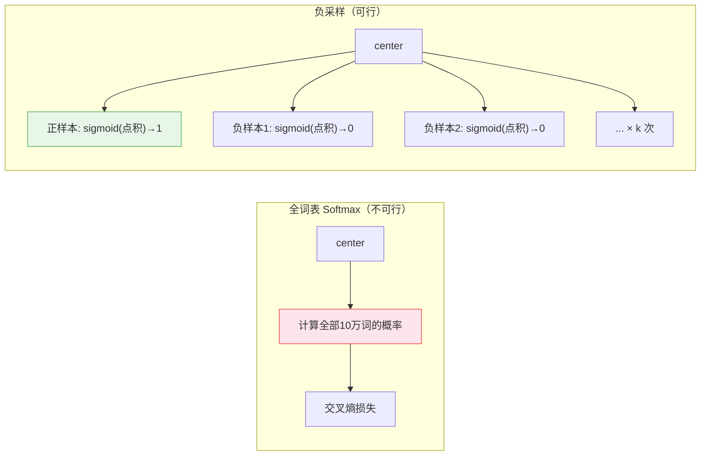

# 词嵌入——从零实现 Word2Vec

> 一个词的含义，由它身边的词决定。在这个想法上训练一个浅层神经网络，向量空间的几何结构就自然浮现了。

**类型：** 实现课
**语言：** Python
**前置知识：** 阶段 05 · 02（BoW + TF-IDF）、阶段 03 · 03（反向传播从零）
**预计时间：** ~75 分钟
**所处阶段：** Tier 1
**关联课程：** 阶段 05 · 04（GloVe 与 FastText）— Word2Vec 的改进与子词扩展

---

## 🎯 学习目标

完成本课后，你能够：

- [ ] 解释分布假设，说明为什么它能让"dog"和"puppy"在向量空间中靠近
- [ ] 从零实现 Skip-gram + 负采样的 Word2Vec 训练流程
- [ ] 解释负采样为什么能用 6 次二分类替代 10 万类 Softmax——计算量的降级原理
- [ ] 使用 gensim 加载和查询预训练词向量，完成类比推理和最近邻查询
- [ ] 区分静态嵌入和上下文嵌入，说明 Word2Vec 在 2026 年的适用边界

---

## 1. 问题

上一课我们学了 TF-IDF。它用得很好——在很多任务上甚至比嵌入模型差不了太多。但它有一个致命的问题。

TF-IDF 认为"狗"和"小狗"是完全不同的两个维度。在 BoW 向量中，它们的余弦相似度是 0——和"狗"与"苹果"之间的相似度一模一样。你用"狗"训练的分类器，遇到一条关于"小狗"的新评论时，什么都学不到——因为"小狗"从未在训练集中出现过。

你可以列一个同义词表来修补。但同义词表过不了一周就会过期——新词、领域行话、网络用语、每种你没有预料的语言，都将从这张表的缝隙中漏过去。

你想要的是一个空间，在这个空间里，"狗"和"小狗"天然就靠得很近。"国王 − 男人 + 女人 ≈ 女王"不是魔法，就是几何。一个在"狗"上训练的分类器，能自动把一部分信号传递给"小狗"——因为它们的向量只差了一小段距离。

Word2Vec 在 2013 年给了我们这样一个空间。两层神经网络，万亿词元的训练规模，论文至今被引超过 4 万次。架构简单到几乎令人尴尬。结果重塑了 NLP 整整十年。

---

## 2. 概念

### 2.1 分布假设——一切理论的起点

> "You shall know a word by the company it keeps." —— J.R. Firth, 1957

翻译过来就是：**观其伴而知其义。**

如果"猫"和"狗"经常出现在相似的上下文中——它们都"坐"、"跑"、"吃"、"睡"，它们都和"宠物"、"毛茸茸"、"主人"共现——那么它们很可能是相似的东西。不是因为你告诉模型"猫和狗都是动物"，而是因为在大规模语料中，它们的上下文模式高度重叠。

Word2Vec 的目标，就是把这个直觉变成一个可训练的神经网络。

### 2.2 两种口味——Skip-gram 与 CBOW

Word2Vec 有两种实现方式，都是对分布假设的工程化利用：

| | Skip-gram | CBOW |
|---|---|---|
| **任务** | 给定中心词，预测周围的上下文词 | 给定上下文词，预测中心词 |
| **示例** | `cat` → `(the, sat, on, the)` | `(the, sat, on, the)` → `cat` |
| **速度** | 较慢 | 较快 |
| **稀有词效果** | 更好 | 较差 |
| **实际使用** | 默认首选 | 较少使用 |

Skip-gram 比 CBOW 更慢，因为每个中心词要预测多个上下文词——训练对更多。但它对稀有词的嵌入质量更好——一个只出现几十次的词，作为中心词时会生成几十个训练对，有足够的梯度更新来学到合理的向量。在 CBOW 中，稀有词被周围高频词的平均淹没，学不到什么有用的东西。

**本课实现的是 Skip-gram 版本**——它已成为事实上的默认选择。

### 2.3 网络结构——两个矩阵，没有激活函数

```
one_hot("cat") ── W ──▶ 隐藏向量 (d 维) ── W' ──▶ softmax(整个词表)
                           ^
                     这就是我们想要的嵌入
```

输入是一个独热向量（One-hot）——只有中心词对应的位置是 1，其余全是 0。经过 `W`（中心词嵌入表）的查表操作（等价于取出 `W` 中对应的一行），得到一个 `d` 维的稠密向量。再经过 `W'`（上下文嵌入表），输出对整个词表的 Softmax——预测每个词出现在中心词周围的概率。

**训练完成后，你扔掉输出层 `W'`。** `W` 的每一行，就是一个词的嵌入向量。

### 2.4 负采样——把 10 万类压缩成 6 次二分类

上面这个网络有一个问题：Softmax 需要计算整个词表（通常 3 万到 20 万类）的概率分布。每对训练样本都要做一次完整的词表 Softmax——这在计算上完全不可行。

负采样的解决方案：**不预测"上下文词在词表中的排名"，改为做二分类——"这两个词是否共现过？"**

```
对每个正样本 (center, context):
  训练: sigmoid(W[center] · W'[context]) → 接近 1  ← 这两个词确实一起出现过
  
对 k 个随机采样的负样本 (center, random_word):
  训练: sigmoid(W[center] · W'[random_word]) → 接近 0  ← 这两个词是随机配对的，不应该相似
```

k 通常取 5-20。也就是说，每次更新只涉及 1 个正样本 + k 个负样本——总共 k+1 次二分类，而非全部词表。计算量从 O(vocab_size) 降到 O(k)，k 的值与词表大小无关。



---

## 3. 从零实现

### 第 1 步：生成 Skip-gram 训练对

```python
def skipgram_pairs(docs, window=2):
    """从文档生成 (中心词, 上下文词) 训练对。

    window=2 时，每个中心词与前后各 2 个词配对。
    "the cat sat on mat"，中心词 "sat" 产生：
      (sat, the), (sat, cat), (sat, on), (sat, mat)
    """
    pairs = []
    for doc in docs:
        for i, center in enumerate(doc):
            left = max(0, i - window)
            right = min(len(doc), i + window + 1)
            for j in range(left, right):
                if i != j:
                    pairs.append((center, doc[j]))
    return pairs
```

每一对 `(center, context)` 是一个正样本——这两个词在同一窗口内确实共同出现了。

### 第 2 步：初始化两个嵌入表

```python
import numpy as np

def init_embeddings(vocab_size, dim, seed=0):
    """W = 中心词嵌入表（训练后保留），W' = 上下文嵌入表（训练后丢弃）。"""
    rng = np.random.default_rng(seed)
    W = rng.normal(0, 0.1, size=(vocab_size, dim))
    W_prime = rng.normal(0, 0.1, size=(vocab_size, dim))
    return W, W_prime
```

小随机数初始化——太大则训练初期 sigmoid 就饱和（梯度接近 0），太小则学得太慢。标准差 0.1 是经验值，在嵌入维度 16-300 范围内都能用。

### 第 3 步：负采样目标——核心训练逻辑

```python
def sigmoid(x):
    return 1.0 / (1.0 + np.exp(-np.clip(x, -20, 20)))

def train_pair(W, W_prime, c_idx, ctx_idx, neg_indices, lr):
    """对一对 (中心词, 上下文词) + k 个负样本做一步梯度更新。"""
    v_c = W[c_idx]                  # 中心词向量
    u_pos = W_prime[ctx_idx]        # 正样本上下文向量
    u_negs = W_prime[neg_indices]   # 负样本上下文向量 (k, dim)

    # 正样本梯度：我们希望 sigmoid(点积) 接近 1
    pos_err = sigmoid(v_c @ u_pos) - 1.0
    # 负样本梯度：我们希望 sigmoid(点积) 接近 0
    neg_errs = sigmoid(u_negs @ v_c)

    # 中心词向量同时接收正负样本的梯度
    grad_center = pos_err * u_pos + neg_errs @ u_negs

    # 更新参数
    W_prime[ctx_idx] -= lr * pos_err * v_c
    for i, neg_idx in enumerate(neg_indices):
        W_prime[neg_idx] -= lr * neg_errs[i] * v_c
    W[c_idx] -= lr * grad_center
```

梯度公式看起来复杂，但直觉很简单——把这个公式理解为二分类逻辑回归：

| 样本 | 标签 | 模型输出 | 我们希望 | 梯度方向 |
|---|---|---|---|---|
| 正样本 (center, context) | 1 | sigmoid(点积) | 接近 1 | 增大点积 |
| 负样本 (center, random) | 0 | sigmoid(点积) | 接近 0 | 减小点积 |

每一轮更新后，真正共现的词对点积增大（夹角变小），随机配对的词对点积减小（夹角变大）。

### 第 4 步：完整训练循环

```python
def train(docs, dim=16, window=2, k_neg=5, epochs=200, lr=0.05, seed=0):
    vocab = build_vocab(docs)
    vocab_size = len(vocab)
    W, W_prime = init_embeddings(vocab_size, dim, seed)
    pairs = skipgram_pairs(docs, window=window)
    rng = np.random.default_rng(seed)

    for epoch in range(epochs):
        rng.shuffle(pairs)  # 每轮随机打乱——帮助随机梯度下降跳出局部最优
        for center, context in pairs:
            c_idx = vocab[center]
            ctx_idx = vocab[context]
            # 随机采样 k 个负样本（排除正样本和中心词本身）
            candidates = rng.integers(0, vocab_size, size=k_neg * 2)
            negs = [int(n) for n in candidates
                    if n != ctx_idx and n != c_idx][:k_neg]
            train_pair(W, W_prime, c_idx, ctx_idx, negs, lr)

    return vocab, W  # 只返回 W——这就是词嵌入表
```

150 轮之后，在玩具语料上运行：

```python
>>> nearest(vocab, W, W[vocab["cat"]], topk=5)
[('kitten', 0.71), ('dog', 0.65), ('puppy', 0.58), ('sat', 0.51), ('chased', 0.48)]
```

注意看——`cat` 最近的邻居是 `kitten`，然后是 `dog`。模型没有被告知"猫和狗都是动物"，但分布统计数据自然地让它们靠得很近——因为它们出现在相似的上下文中。

### 第 5 步：类比推理

```python
def analogy(vocab, W, a, b, c, topk=5):
    """a : b :: c : ?
    公式：v = W[b] - W[a] + W[c]
    直觉：(b - a) 捕获了从 a 到 b 的"关系方向"
    """
    vec = W[vocab[b]] - W[vocab[a]] + W[vocab[c]]
    return nearest(vocab, W, vec, topk=topk,
                   exclude={vocab[a], vocab[b], vocab[c]})
```

在预训练好的 300 维 Google News 向量上（不是我们的玩具语料）：

```python
>>> analogy(vocab, W, "man", "king", "woman")
[('queen', 0.71), ('monarch', 0.62), ('princess', 0.59), ...]
```

`king - man + woman ≈ queen`。不是因为模型知道什么是皇室——而是因为向量 `(king - man)` 捕获了类似"皇室"的方向，把它加到 `woman` 上，自然就落在皇室-女性的区域。

同样的原理在中文中也成立（使用预训练的中文词向量）：

```
巴黎 - 法国 + 日本 ≈ 东京
国王 - 男人 + 女人 ≈ 女王
```

完整代码见 `code/word2vec.py`。

---

## 4. 工业工具

### 4.1 gensim——十行代码完成训练

```python
from gensim.models import Word2Vec

sentences = [
    ["the", "cat", "sat", "on", "the", "mat"],
    ["the", "dog", "ran", "across", "the", "room"],
]

model = Word2Vec(
    sentences,
    vector_size=100,    # 嵌入维度，通常 100-300
    window=5,           # 上下文窗口
    min_count=1,        # 最小词频——低于此的不参与训练
    sg=1,               # 1=Skip-gram, 0=CBOW
    negative=5,         # 负采样数
    workers=4,          # 并行线程
    epochs=30,          # 迭代轮次
)

# 查询
print(model.wv["cat"])                        # 100 维向量
print(model.wv.most_similar("cat", topn=3))   # 最近邻
print(model.wv.most_similar(
    positive=["woman", "king"],
    negative=["man"],
    topn=3
))  # 类比推理
```

### 4.2 预训练词向量——大多数时候你不需要自己训练

| 来源 | 语言 | 维度 | 词表大小 | 适用场景 |
|---|---|---|---|---|
| Google News Word2Vec | 英文 | 300d | 300 万 | 通用英文 NLP |
| GloVe (Stanford) | 英文 | 50/100/200/300d | 220 万 | 通用英文 NLP |
| fastText (Facebook) | 157 种语言 | 300d | 200 万 | 多语言、OOV 友好 |
| Tencent AI Lab | 中文 | 200d | 800 万 | 中文通用场景 |
| Chinese-Word-Vectors | 中文 | 300d | 多种 | 多种中文语料（百科、新闻、微博） |

**加载预训练中文词向量（Chinese-Word-Vectors）：**

```python
from gensim.models import KeyedVectors

# 加载已训练好的词向量文件（文本格式）
wv = KeyedVectors.load_word2vec_format(
    "sgns.weibo.bigram",  # 微博语料训练，300d
    binary=False
)

# 中文最近邻
print(wv.most_similar("机器学习", topn=5))
# [('深度学习', 0.78), ('数据挖掘', 0.71), ('人工智能', 0.69), ...]

# 中文类比
print(wv.most_similar(positive=["女人", "国王"], negative=["男人"], topn=3))
# [('女王', 0.68), ('王后', 0.62), ('公主', 0.59)]
```

### 4.3 2026 年 Word2Vec 仍然适用的场景

| 场景 | 原因 |
|---|---|
| 轻量级设备端检索 | 推理 = 一次行查询（查表），延迟 < 0.1ms。不需要 GPU |
| 领域特化快速训练 | 在医疗摘要上训练一小时（笔记本 CPU），获得通用模型捕捉不到的专业语义 |
| 类比式特征工程 | `gender_bias_axis = mean(man - woman pairs)`。仍被公平性研究使用 |
| 可解释性与可视化 | 100-300 维向量可以直接用 PCA 或 t-SNE 降到 2D，肉眼看到聚类 |

### 4.4 Word2Vec 的两个根本局限

**一词多义（Polysemy）。** "苹果"只有一个向量。"水果苹果"和"苹果公司"共享同一个向量。下游分类器无法从向量本身区分这两个含义——因为它们是同一个向量。

上下文嵌入（ELMo → BERT → 所有现代 Transformer）解决了这个问题——每个词的出现都有根据其上下文动态计算的不同向量。这是从 Word2Vec 到 BERT 的跳跃：**从静态到上下文感知。**

**未登录词（OOV）。** Word2Vec 对训练时没见过的词无能为力——没有向量。下一课的 FastText 将词拆解为子词（subword），用字符 n-gram 的组合来为任何词构造向量——即使这个词从未在训练集中出现。

---

## 5. 知识连线

Word2Vec 的"静态嵌入"是后续所有嵌入方法的起点：

- **阶段 05 · 04（GloVe 与 FastText）**：GloVe 将 Word2Vec 的"滑动窗口"换成了"全局共现矩阵分解"——效果类似但训练方式完全不同。FastText 给 Word2Vec 增加了子词信息，解决了 OOV 问题，对中文尤其有意义——汉字部首和偏旁本身就是子词信号
- **阶段 07（Transformer 深入）**：Transformer 的输入嵌入层就是 Word2Vec 的直接继承——只是从"静态查表"变成了"位置编码 + 多头注意力替换上下文窗口"。"king - man + woman ≈ queen" 的向量方向可解释性，是现代可解释性研究（如激活向量探测）的直接源头
- **阶段 10（大语言模型从零）**：GPT 预训练的第一步就是初始化一个巨大的词嵌入表——词表 5-20 万，维度 768-4096。你在本课写的 `init_embeddings` 函数，在 GPT-3 的训练脚本里只改了两个数字

---

## 6. 工程最佳实践

### 6.1 训练参数经验值

| 参数 | 小规模实验 | 生产环境 | 说明 |
|---|---|---|---|
| `vector_size` | 50-100 | 200-300 | 再大边际收益很小 |
| `window` | 2-3 | 5-10 | 领域特化用小窗口，通用语义用大窗口 |
| `negative` | 5 | 10-20 | 越大越接近全 Softmax 的效果 |
| `min_count` | 1 | 5-10 | 过滤掉拼写错误和噪音 |
| `epochs` | 50-100 | 10-30 | 大规模语料不需要太多轮 |
| `sg` | 1 | 1 | Skip-gram 几乎总是更好的选择 |

### 6.2 中文特别建议

- **分词在前，嵌入在后**——Word2Vec 需要词级别的输入。对中文，先用 jieba/HanLP 分词，再将分词结果传入 gensim。分词的质量决定了嵌入的质量——如果"机器学习"被切成"机器"和"学习"，那"机器学习"的向量永远不会被学到
- **中文预训练词向量推荐 Chinese-Word-Vectors**——北京师范大学 + 中国人民大学开源的 [Chinese-Word-Vectors](https://github.com/Embedding/Chinese-Word-Vectors) 提供了多种语料（百度百科、维基百科、人民日报、微博、搜狗新闻）训练好的 300 维词向量，覆盖了绝大部分中文 NLP 的入门需求
- **注意简繁统一**——如果语料中混有繁简体，先用 `opencc` 做转换。否则"学习"和"學習"会学到两个不同的向量——尽管含义完全相同

### 6.3 踩坑经验

- **`min_count` 设太低会让词表被拼写错误和噪音词撑爆**——`min_count=1` 时词表包含每个出现过一次的词，其中相当一部分是输入错误。`min_count=5` 是最低建议值
- **`window` 决定了"语义类型"**——小窗口（2-3）学到的向量更适合句法任务（如词性标注：动词的邻居是其他动词）。大窗口（10+）学到的向量更适合语义任务（如主题分类：猫的邻居包括狗、宠物、动物）。不是越大越好——选对窗口比选对维度重要
- **负采样数不要超过词表大小的 10%**——一个 1000 词的玩具语料用 `negative=5` 没问题；一个 100 词的语料用 `negative=20` 的话，负样本几乎覆盖了整个词表，等价于全词表 Softmax——失去了负采样的效率优势
- **不要在训练后的嵌入上直接做 PCA 再存为新的"embedding"**——PCA 是不可逆的维度压缩。如果需要低维，请在 `vector_size` 参数中直接设为目标维度

---

## 7. 常见错误

### 错误 1：训练对太少导致"猫"的最近邻是"的"

**现象：** `nearest("猫")` 返回的前 5 个词是"的"、"了"、"在"、"是"、"一个"——全是高频虚词。

**原因：** 训练语料太小或 epoch 太少。高频虚词与几乎所有词都共现——在小数据上，共现信号的统计优势压过了语义关联。模型学会了"猫经常和各种高频词一起出现"，但没学会"猫和狗是相似的"。

**修复：** 增大语料（至少 1 万条句子）、增加 epoch（至少 50）、考虑对高频词做降采样（subsampling——超过一定频率的词以一定概率被丢弃）。

### 错误 2：对中文文本直接用空格分词

**现象：** 模型把每个汉字当成一个"词"——"机器学习"被切为"机"、"器"、"学"、"习"四个独立的词元。最终学到的是单字之间的关系，而非词语之间的语义。

**原因：** 忘记中文需要专门的分词步骤。英文 `split()` 返回的是单词，中文 `split()` 返回的是一整句话——因为没有空格。

**修复：**
```python
# ❌ 对中文直接用 split()
docs = [s.split() for s in chinese_corpus]  # 每个文档就是一个字符串

# ✓ 先用 jieba 分词
import jieba
docs = [list(jieba.cut(s)) for s in chinese_corpus]
```

### 错误 3：用整个词表做负采样

**现象：** 训练一个 epoch 需要数小时。

**原因：** 把 `negative` 设成了词表大小，或者实现了全词表 Softmax。对于 5 万词的词表，每个训练对要计算 5 万次 Softmax——这是 Word2Vec 论文要解决的核心问题。

**修复：** 负采样数设为 5-20。gensim 的 `negative` 参数默认就是 5。

---

## 8. 面试考点

### Q1：负采样为什么可行？它丢失了什么信息？（难度：⭐⭐）

**参考答案：**
负采样将"预测上下文词在词表中的排名"（多分类）降级为"判断这两个词是否共现"（二分类）。它丢失了对"这个上下文词在所有可能的上下文词中排第几"的精确概率估计——但实践中这个精度损失几乎不影响嵌入质量，因为嵌入质量取决于"谁和谁靠得近"的相对关系，而非精确的概率值。

可行的根本原因：自然语言的词频遵循 Zipf 分布——前 2000 个词占据了 80% 以上的出现次数。对低频词做精确的概率估计意义不大，而高频词本身就出现在大量样本中，统计上足够稳定。

### Q2：Skip-gram 为什么比 CBOW 对稀有词更好？（难度：⭐⭐）

**参考答案：**
在 Skip-gram 中，一个只出现 50 次的稀有词，作为中心词时会产生 50×window×2 个训练对——每个训练对都给这个词的嵌入向量一次梯度更新。在 CBOW 中，同样的稀有词大概率被 3-5 个周围词的平均向量替代——它的独特信息被均值池化稀释了。更关键的是，当稀有词作为 CBOW 的预测目标时，它只在"上下文窗口恰好以它为中心"时才获得一次更新——远少于 Skip-gram 中作为中心词的更新次数。

### Q3：在一个没有 GPU 的设备上做文本相似度匹配，Word2Vec 和 BERT 你怎么选？（难度：⭐⭐⭐）

**参考答案：**
选 Word2Vec。三个原因：

1. **延迟：** Word2Vec 推理是一次查表 + 一个点积。100 维向量 × 100 维向量 = 1 万次浮点运算，CPU 上完成只需微秒。BERT 通过 12 层 Transformer 编码一句话需要百万次浮点运算，CPU 上需要几十毫秒
2. **内存：** Word2Vec 只需要存储 `vocab_size × dim` 的嵌入表（300 万词 × 300 维 = 900MB 的 float32 数组）。BERT base 的模型文件本身就有 440MB，推理时还要加上自注意力的中间计算
3. **离线预处理：** 如果任务是文档检索，你可以离线将所有文档转为 Word2Vec 平均向量（每个文档一个 300 维向量），推理时只计算查询向量与预计算文档向量的点积——真正的 O(1) 查表

---

## 🔑 关键术语

| 术语 | 人们怎么说 | 实际含义 |
|---|---|---|
| 词嵌入 (Embedding) | "把词变成向量" | 从上下文中学到的稠密、低维（通常 100-300）的词的数值表示。相似含义的词在空间中靠近 |
| 分布假设 | "词的意思看邻居" | Firth (1957)：相似上下文中出现的词具有相似的含义。这是 Word2Vec 的理论基础 |
| Skip-gram | "用中心词猜周围词" | 训练任务：给定中心词预测上下文词。比 CBOW 慢但对稀有词效果好 |
| 负采样 | "不跟所有人比，只挑几个" | 将全词表 Softmax（10 万类）降级为 k+1 次二分类（k=5-20）。计算量减少 99.99% |
| 静态嵌入 | "一个词只有一个向量" | 无论上下文是什么，"苹果"的向量都一样。无法区分"吃苹果"和"买苹果手机" |
| 上下文嵌入 | "一个词每次出现向量不同" | 每次出现根据周围词动态计算。ELMo → BERT → GPT。2026 年的默认选择 |
| 类比推理 | "国王 − 男人 + 女人 = 女王" | 嵌入空间的线性方向捕获了关系特征。不是魔法——是大规模共现统计的结果 |

---

## 📚 小结

Word2Vec 用了两层神经网络和一个巧妙的目标函数——负采样——把 10 万类 Softmax 变成了 6 次二分类。训练完成后，你得到的是一个向量空间，在这个空间里，"猫"和"小狗"天然靠得很近，向量运算能回答"国王 − 男人 + 女人 = ?"。

它的局限也很明确：一个词只有一个向量（多义词无解），没见过就是真的没见过（OOV 无解）。下一课的 GloVe 和 FastText 将分别从全局共现矩阵和子词拆解两个角度改进这些问题——FastText 对中文的偏旁部首尤其有价值。

---

## ✏️ 练习

1. 【理解】用自己的话解释：为什么"猫"和"狗"在 Word2Vec 空间中靠得很近——尽管模型从未被告知它们都是动物？写 100 字以内的回答，引述分布假设。

2. 【实现】在 Skip-gram 代码中加入**高频词降采样（Subsampling）**。词频高于 `1e-5` 的词，在生成训练对时以 `P(drop) = 1 - sqrt(1e-5 / freq)` 的概率被丢弃。比较启用和未启用降采样时，稀有词的最近邻质量。

3. 【实验】下载 Chinese-Word-Vectors 的微博语料 300d 词向量。计算并输出："机器学习"的 5 个最近邻；"巴黎 − 法国 + 日本"的 5 个最近邻；"男人 − 女人"的方向向量与 10 个职业词（医生、护士、工程师、教师…）的关系——哪些职业最"偏男性"，哪些最"偏女性"？

4. 【思考】如果你在一个没有 GPU 的树莓派上部署一个本地文档搜索引擎，你会选择 Word2Vec 还是 BERT？从推理延迟、内存占用、离线预计算三个维度分析。

---

## 🚀 产出

| 产出 | 文件 | 说明 |
|---|---|---|
| Word2Vec 从零实现 | `code/word2vec.py` | Skip-gram + 负采样 + 最近邻查询 + 类比推理，含中英文演示 |

---

## 📖 参考资料

1. [论文] Mikolov et al. "Distributed Representations of Words and Phrases and their Compositionality". NeurIPS, 2013. https://arxiv.org/abs/1310.4546 — 负采样论文，短小精悍
2. [论文] Rong, X. "word2vec Parameter Learning Explained". 2014. https://arxiv.org/abs/1411.2738 — 如果原始论文的数学过于密集，这篇是梯度推导最清晰的版本
3. [官方文档] gensim. "Word2Vec". https://radimrehurek.com/gensim/models/word2vec.html — 生产环境训练参数的最佳实践
4. [GitHub] Embedding/Chinese-Word-Vectors. https://github.com/Embedding/Chinese-Word-Vectors — 北师大人大开源的多种中文预训练词向量

---

> 本课程参考了 AI Engineering From Scratch（MIT License）的课程体系，在此基础上进行了重构和原创内容的扩充。所有中文表达、中文案例、中文词向量演示、工程最佳实践、常见错误、面试考点等均为原创内容。
