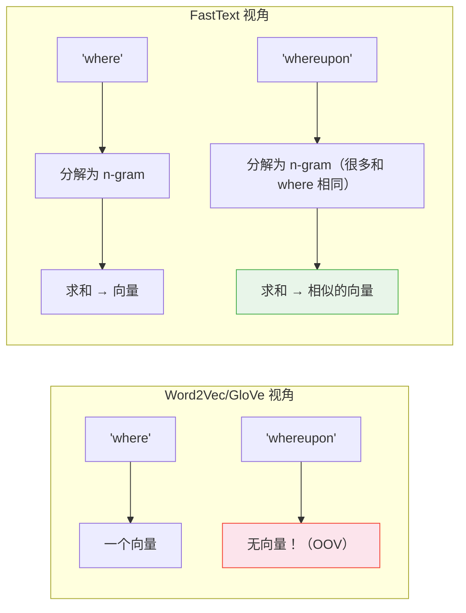

# GloVe、FastText 与子词嵌入

> Word2Vec 给每个词一个向量。GloVe 把共现矩阵做了分解。FastText 把词的每一个碎片都嵌入了。BPE 则直接把"词"这个概念拆了——从此再也没有 OOV。

**类型：** 实现课
**语言：** Python
**前置知识：** 阶段 05 · 03（Word2Vec 从零）
**预计时间：** ~45 分钟
**所处阶段：** Tier 1
**关联课程：** 阶段 10 · 01（分词器）— 本课的 BPE 是现代 LLM 分词器的前身

---

## 🎯 学习目标

完成本课后，你能够：

- [ ] 解释 GloVe 共现矩阵分解与 Word2Vec 滑动窗口训练的差异，以及加权回归损失的设计动机
- [ ] 用字符 n-gram 为未登录词构造向量——理解 FastText 为何天然对拼写错误和新词有鲁棒性
- [ ] 从零实现 BPE 的学习和应用过程，理解为什么合并顺序等同于 tokenizer 本身
- [ ] 区分 BPE、WordPiece、SentencePiece 三种子词分词器，知道微调模型时为什么必须用出厂 tokenizer

---

## 1. 问题

Word2Vec 成功了。但在 2013 到 2017 年之间，三个新问题浮出了水面。

**第一个问题：训练效率。** Word2Vec 需要一遍又一遍地在滑动窗口上做在线更新。同一对"the"和"cat"可能在窗口中反复出现，每次都要重新算梯度。有一种更直接的方法——先统计一次全局共现矩阵，然后直接拟合它——**GloVe** 证明了这种方法不仅能匹配 Word2Vec 的效果，而且训练更快。

**第二个问题：OOV。** 无论 Word2Vec 还是 GloVe，训练时没见过的词就是没有向量。`Zoomer-approved`、`dogecoin`、上周刚发明的网络梗——全都是死胡同。**FastText** 把每个词拆成字符碎片（n-gram），词的向量 = 碎片向量的求和。即使整个词没见过，只要碎片见过，就能拼出一个靠谱的向量。

**第三个问题：Transformer 来了之后，连"词"这个概念都被重新定义了。** 词级别的词表最多到一百万个条目——但真实语言是开放的。**BPE（Byte-Pair Encoding）** 及其变体学会了从语料中自动发现子词单元——高频序列如"ing"、"tion"成为单个 token，稀有词则被切为已知的子词片段。从此，"OOV"这个概念从分词层面消失了。

本课按这个时间线走完三站——它们分别回答了"怎么更快"、"怎么处理没见过"、"怎么定义词"。

---

## 2. 概念

### 2.1 GloVe——把共现矩阵直接分解

Word2Vec 是**在线学习**——在语料上滑动窗口，每遇到一对词就更新一次参数。GloVe 是**离线建模**——先扫描一遍语料，建一个全局的"词-词共现矩阵"，然后直接拟合这个矩阵。

```
Word2Vec:  语料 → 滑动窗口 → 即时更新参数
GloVe:     语料 → 共现矩阵 X → 加权回归 → 得到向量
```

共现矩阵：`X[i][j]` = 词 `j` 在词 `i` 的上下文窗口中出现了多少次（按距离衰减权重）。训练目标——让两个向量的点积尽可能接近 log(共现次数)：

$$\text{Loss} = \sum_{i,j} \underbrace{f(X_{ij})}_{\text{权重}} \cdot \big(\underbrace{W_i \cdot \tilde{W}_j + b_i + \tilde{b}_j}_{\text{预测}} - \underbrace{\log X_{ij}}_{\text{目标}}\big)^2$$

关键设计：权重函数 $f(x) = (x/x_{\max})^\alpha$（当 $x < x_{\max}$，否则 1）。这压制了极高频共现对——如果不压制，`the-and` 这对共现数千万次，其损失把一切其他信号淹没。

### 2.2 FastText——词 = 碎片的和



**FastText 的处理过程：**

1. 把词用 `<` 和 `>` 包裹（标记边界）：`"where"` → `"<where>"`
2. 提取所有 3-6 字符的 n-gram：`<wh, whe, her, ere, re>, <whe, wher, here, ere>, <wher, where, here>, <where>`
3. 词的向量 = 所有 n-gram 嵌入的求和

**OOV 词的魔法：** `whereupon` 没在训练集中出现过，但它的 n-gram（`<wh, her, ere, ...`）大量来自 `where`。FastText 虽然没见过这个完整词，但碎片的组合已足够产生一个合理的向量——而且它偏向于靠近 `where`，这是语义上正确的。

**对中文的价值：** 中文没有"英文式时态变体"——你不需要 `playing`→`played` 这种转换。但 FastText 对中文有两个特殊好处：**（1）拼写错误容错**——"机器学习"和"机器学习 "（注意末尾空格）共享大部分 n-gram，向量会很接近。**（2）生僻字处理**——"机器学习"中的"习"字常见，但假如遇到生僻字"𠮷"，它的偏旁部首的 n-gram 组合仍能产生一个合理的向量。

### 2.3 BPE——"词"这个概念被拆了

BPE 不是嵌入方法——它是**分词器**。但它对"词嵌入"这个概念产生了深远的影响：**如果词汇本身可以被拆解为可复用的子词单元，那"词"就只是一个程度问题，而非一个有或无的二元状态。**

BPE 的训练过程：

```
初始词表：l, o, w, e, r, n, ...（单个字符）
                 │
第 1 轮：统计所有相邻对 → 合并最高频对
                 │  e + s → es
                 ▼
第 2 轮：在合并后的语料上重新统计 → 再合并最高频对
                 │  es + t → est
                 ▼
...
第 k 轮后：词表 = 原始字符 + k 个合并规则
```

使用学到的'合并规则表'编码新文本——按合并规则顺序依次应用。**合并顺序 = 分词器本身。** 给同样的语料，同样的 k 值，同样的顺序，得到完全相同的 token 序列。

```
"lowest"（训练中见过）:
  l + o → lo,  lo + w → low,  e + s → es,  es + t → est
  → ['low', 'est']

"slowest"（训练中没见过）:
  s + l（没学过这条规则，跳过）
  l + o → lo,  lo + w → low（复用了从"lowest"学到的规则！）
  → ['s', 'low', 'est']
```

真正的 GPT/BERT/T5 的 tokenizer 学习 3 万到 10 万次合并且从字节（而非字符）出发——结果是：任何输入都能被编码为一个已知 token ID 的序列。**OOV 在分词层面被彻底消灭了。**

---

## 3. 从零实现

### 第 1 步：GloVe 共现矩阵

```python
from collections import Counter

def build_cooccurrence(docs, window=5):
    """构建词-词共现矩阵。距离越远，权重越低（1/distance）。"""
    vocab = {}
    for doc in docs:
        for token in doc:
            if token not in vocab:
                vocab[token] = len(vocab)

    pair_counts = Counter()
    for doc in docs:
        indexed = [vocab[t] for t in doc]
        for i, center in enumerate(indexed):
            for j in range(max(0, i - window),
                           min(len(indexed), i + window + 1)):
                if i != j:
                    pair_counts[(center, indexed[j])] += 1.0 / abs(i - j)
    return vocab, pair_counts
```

### 第 2 步：GloVe 加权回归

```python
import numpy as np

def glove_train(vocab, pair_counts, dim=16, epochs=100,
                lr=0.05, x_max=100, alpha=0.75):
    n = len(vocab)
    W = np.random.randn(n, dim) * 0.1        # 中心词嵌入
    W_tilde = np.random.randn(n, dim) * 0.1  # 上下文嵌入
    b = np.zeros(n)
    b_tilde = np.zeros(n)

    for epoch in range(epochs):
        for (i, j), x_ij in pair_counts.items():
            # 权重函数：压制高频共现对
            weight = (x_ij / x_max) ** alpha if x_ij < x_max else 1.0
            # 预测值 vs log(共现次数)
            diff = W[i] @ W_tilde[j] + b[i] + b_tilde[j] - np.log(x_ij)
            coef = weight * diff
            # 梯度更新
            W[i] -= lr * coef * W_tilde[j]
            W_tilde[j] -= lr * coef * W[i]
            b[i] -= lr * coef
            b_tilde[j] -= lr * coef

    return W + W_tilde  # 求和效果优于单独使用任一个
```

### 第 3 步：FastText 字符 n-gram

```python
def char_ngrams(word, n_min=3, n_max=6):
    """提取字符 n-gram。'<where>' 的 3-6 gram。"""
    wrapped = f"<{word}>"
    grams = {wrapped}  # 完整词形始终保留
    for n in range(n_min, n_max + 1):
        for i in range(len(wrapped) - n + 1):
            grams.add(wrapped[i:i + n])
    return grams
```

```python
>>> char_ngrams("where")
{'<where>', '<wh', 'whe', 'her', 'ere', 're>',
 '<whe', 'wher', 'here', 'ere>',
 '<wher', 'where', 'here>'}
```

"词的向量 = n-gram 嵌入的求和" 这个公式的直接推论：

```python
>>> g_where = char_ngrams("where")
>>> g_whereupon = char_ngrams("whereupon")
>>> len(g_where & g_whereupon)  # 共享的 n-gram 数量
# → 6-8 个。所以 'whereupon' 的向量天然靠近 'where'
```

`playing` 和 `played` 共享大量 n-gram（`pla`、`lay`、`play`...）——Jaccard 重叠度通常 > 60%。这解释了为什么 FastText 对英文时态变化天然鲁棒。

### 第 4 步：BPE 学习与应用

```python
def learn_bpe(corpus, k_merges):
    """corpus = {'low': 5, 'lower': 2, ...} 词频词典"""
    vocab = {tuple(word) + ("</w>",): freq
             for word, freq in corpus.items()}
    merges = []

    for _ in range(k_merges):
        # 统计所有相邻 pair 的频率（乘以词频）
        pair_freq = Counter()
        for tokens, freq in vocab.items():
            for a, b in zip(tokens, tokens[1:]):
                pair_freq[(a, b)] += freq

        best = pair_freq.most_common(1)[0][0]
        merges.append(best)

        # 在全部词表中应用合并
        new_vocab = {}
        for tokens, freq in vocab.items():
            new_tokens = []
            i = 0
            while i < len(tokens):
                if (i + 1 < len(tokens) and
                        tokens[i] == best[0] and
                        tokens[i + 1] == best[1]):
                    new_tokens.append(tokens[i] + tokens[i + 1])
                    i += 2
                else:
                    new_tokens.append(tokens[i])
                    i += 1
            new_vocab[tuple(new_tokens)] = freq
        vocab = new_vocab

    return merges

def apply_bpe(word, merges):
    tokens = list(word) + ["</w>"]
    for a, b in merges:  # 必须按学习顺序
        new_tokens = []
        i = 0
        while i < len(tokens):
            if (i + 1 < len(tokens) and
                    tokens[i] == a and tokens[i + 1] == b):
                new_tokens.append(a + b)
                i += 2
            else:
                new_tokens.append(tokens[i])
                i += 1
        tokens = new_tokens
    return tokens
```

在玩具语料上运行：

```python
>>> corpus = Counter({'low': 5, 'lower': 2, 'newest': 6,
...                   'widest': 3, 'lowest': 4})
>>> merges = learn_bpe(corpus, k_merges=10)
[('e', 's'), ('es', 't'), ('l', 'o'), ('lo', 'w'), ...]

>>> apply_bpe("lowest", merges)
['low', 'est</w>']           # 训练中见过

>>> apply_bpe("slowest", merges)
['s', 'low', 'est</w>']      # 训练中没见过——但子词规则复用了！
```

完整代码见 `code/glove_fasttext_bpe.py`。

---

## 4. 工业工具

### 4.1 FastText 预训练模型（多语言）

```python
import fasttext
import fasttext.util

# 下载英文预训练模型
fasttext.util.download_model("en", if_exists="ignore")
ft = fasttext.load_model("cc.en.300.bin")

# OOV 词的向量——没见过这个词，但碎片组合给出了合理向量
print(ft.get_word_vector("whereupon").shape)     # (300,)
print(ft.get_word_vector("zoomerapproved").shape)  # (300,)

# 中文也有！
# fasttext.util.download_model("zh", if_exists="ignore")
```

### 4.2 BPE Tokenizer——Transformer 时代的标准入口

```python
from transformers import AutoTokenizer

# GPT-2 的字节级 BPE
tok = AutoTokenizer.from_pretrained("gpt2")
print(tok.tokenize("unbelievably tokenized"))
# ['un', 'bel', 'iev', 'ably', 'Ġtoken', 'ized']
#                                ^
#                                Ġ 标记词边界（GPT-2 约定）

# 中文 BERT 的 WordPiece
bert_tok = AutoTokenizer.from_pretrained("bert-base-chinese")
print(bert_tok.tokenize("机器学习很有趣"))
# ['机', '器', '学', '习', '很', '有', '趣']
# bert-base-chinese 是字级别的——每个汉字是一个 token
```

`Ġ` 前缀是 GPT-2 的约定——标记这是一个新词的开始。每个现代 LLM 的分词器都是 BPE 的某种变体。10 万次合并之后的结果：任何一段文本都能被切分为一个有限长度、已知 token ID 的序列。

### 4.3 选择策略速查

| 场景 | 选择 | 原因 |
|---|---|---|
| 通用英文 NLP，不需要 OOV 容错 | GloVe 300d | 训练快，覆盖广，效果稳定 |
| 社交媒体、多语言、形态复杂的语言 | FastText | 子词组合天然对抗拼写错误和新词 |
| 输入要进 Transformer | 模型出厂自带的 tokenizer | **绝对不能换**——tokenizer 和模型权重绑死 |
| 从头训练自己的 LLM | 先在语料上训练 BPE/SentencePiece tokenizer | tokenizer 的训练语料必须和模型预训练语料一致 |
| 生产环境文本分类 + 线性模型 | 仍然是 TF-IDF | 阶段 05 · 02 已经说了为什么 |

---

## 5. 知识连线

GloVe、FastText、BPE 是 Word2Vec 之后三条分叉的演化路径：

- **GloVe → 全局建模 → 阶段 10（大语言模型从零）**：只有知道"局部窗口"（Word2Vec）和"全局矩阵"（GloVe）的区别，才能理解为什么 LLM 的预训练要在万亿词元上做——那是最极致的"统计全局模式"
- **FastText → 子词组合 → 阶段 10 · 01（分词器）**：FastText 的 n-gram 思想在 LLM 时代被 BPE/SentencePiece 吸收——"子词"从学术场景进入了每一条 API 调用
- **BPE → 子词分词器 → 阶段 07（Transformer 深入）**：每一个 Transformer 模型的输入都经过了 BPE 或其变体。理解 BPE 怎么学合并规则，你才能理解为什么"草莓"被切成三个 token，为什么 LLM 数 'r' 总是数不对

---

## 6. 工程最佳实践

### 6.1 Tokenizer 与模型——永远绑在一起

```python
# ❌ 灾难——tokenizer 和模型不匹配
tok = AutoTokenizer.from_pretrained("bert-base-uncased")
model = AutoModel.from_pretrained("gpt2")  # BERT 的 token ID 对 GPT 完全无意义
output = model(**tok("Hello"))  # 输出的全是随机噪声

# ✓ tokenizer 和模型一一对应
tok = AutoTokenizer.from_pretrained("gpt2")
model = AutoModel.from_pretrained("gpt2")
```

**这是 NLP 生产环境中最致命的无声故障。** token ID 和嵌入向量的映射在预训练过程中被固定——换 tokenizer 等于把所有嵌入全部打乱。模型不会报错，但输出退化为随机。

### 6.2 中文特别建议

- **FastText 对中文社交媒体场景尤其有价值**——微博/微信文本中充满了网络新词（"内卷"、"躺平"、"yyds"），FastText 的 n-gram 组合可以在不重新训练的情况下为它们提供合理的向量
- **中文 BERT 默认是字级别 tokenizer**——`bert-base-chinese` 将每个汉字作为独立 token。这对于中文来说是合理的（一个汉字通常承载独立语义），但损失了词级别信息。如果你需要词级别的中文 tokenizer，考虑基于 BPE 的 LLaMA tokenizer（在大量中文语料上训练）
- **如果自己训练中文 BPE tokenizer，确保中文语料占比 ≥ 30%**——如果语料以英文为主，BPE 的合并规则会优先学习英文高频组合（"th"、"ing"、"the"），中文文本会被切得很碎，浪费上下文窗口

### 6.3 踩坑经验

- **GloVe 的预训练向量文件可能有多个格式**——`.txt`（文本格式，gensim 可读）、`.bin`（二进制，fastText 可读）。加载错了格式会得到全零向量，模型静默失败
- **BPE tokenizer 的词汇大小直接影响推理成本**——32K token 词表意味着每次生成需要计算 32K 个 Softmax 概率；128K token 词表 × 4096 维嵌入 = 5 亿参数仅在嵌入层。选择词汇大小时，这个权衡是核心考量——不是"越大越好"
- **中文 BPE tokenizer 训练时，考虑使用 SentencePiece 而非 HuggingFace BPE**——SentencePiece 直接操作于 Unicode 字符流，对中文等无空格语言更友好，不需要预分词步骤

---

## 7. 常见错误

### 错误 1：微调模型时换了 tokenizer

**现象：** 微调一个预训练分类模型，loss 一开始就异常高，且不下降。

**原因：** 加载了错误模型对应的 tokenizer。BERT tokenizer 产生的 token ID 对 RoBERTa 模型毫无意义——同样的文本映射到完全不同的嵌入向量。

**修复：**
```python
# ❌ 换了 tokenizer
tok = AutoTokenizer.from_pretrained("bert-base-uncased")
model = AutoModelForSequenceClassification.from_pretrained(
    "roberta-base"
)

# ✓ 始终配对
tok = AutoTokenizer.from_pretrained("roberta-base")
model = AutoModelForSequenceClassification.from_pretrained(
    "roberta-base"
)
```

### 错误 2：用 TF-IDF 或 Word2Vec 的思维理解 BPE

**现象：** 试图"查看 BPE tokenizer 的词表"来理解它学了什么——发现第一行是 `"!"`，第二行是 `'"'`，第二十行是 `"the"`，感到困惑。

**原因：** BPE 的"词表"不是按重要性排列的词——它们是合并规则的产物。最前面的是单个字符（或字节），后面的是合并产生的新 token。token 顺序不代表任何"重要性"——只是合并发生的先后。

**修复：** BPE tokenizer 的词表 = 256 个字节 + k 条合并规则。理解它应该从"为什么 'ing' 是单个 token 而 'zzq' 不是"的角度——前者在训练语料中频繁出现，后者不。

---

## 8. 面试考点

### Q1：GloVe 和 Word2Vec 在训练方式上的根本差异是什么？（难度：⭐⭐）

**参考答案：**
Word2Vec 是**在线学习**——在语料上滑动窗口，即时更新参数。GloVe 是**离线建模**——先扫描一遍语料建全局共现矩阵，然后直接拟合这个矩阵。两种方式得出的向量质量接近，但 GloVe 训练更快（矩阵扫描一次即可），且可以显式地给不同共现对加权——高频对的权重被压制，稀有但信息量高的共现对不被淹没。

### Q2：FastText 为什么能处理 OOV？它对中文有什么特殊价值？（难度：⭐⭐）

**参考答案：**
FastText 将每个词表示为字符 n-gram 嵌入的求和。OOV 词虽然整体没在训练集中出现过，但构成它的字符碎片大量存在于已知词中——拼起来就是一个合理的向量。对中文，FastText 可以天然处理社交媒体中的网络新词和拼写变体，也能为构词法相近的词（如"学习"/"学习者"/"学习型"）提供有意义且彼此靠近的向量。

### Q3：BPE tokenizer 的词汇大小怎么选？（难度：⭐⭐⭐）

**参考答案：**
一个权衡：**小词表（32K）→ 文本被切得更碎 → 序列更长 → 更多前向传播 → 更慢的推理。大词表（128K+）→ 序列更短 → 推理更快，但嵌入矩阵本身消耗更多参数（128K × 4096 维 = 超过 5 亿参数只在嵌入层）。** 趋势是词表在变大——GPT-2 用 50K、GPT-4 用 100K、GPT-4o 用 200K。大模型的参数总量已经是千亿级，嵌入层多花几亿参数换取 30% 更短的序列，是值得的。

---

## 🔑 关键术语

| 术语 | 人们怎么说 | 实际含义 |
|---|---|---|
| 共现矩阵 | "词一起出现的表格" | X[i][j] = 词 j 在词 i 的窗口内出现了多少次。GloVe 的数据来源——扫描一次语料即可构建 |
| 子词 (Subword) | "词的碎片" | 字符 n-gram（FastText）或学到的 token（BPE/WordPiece/SentencePiece）。粒度在字符和完整词之间 |
| BPE | "一种压缩算法" | 迭代合并最高频相邻对，直到词表达到目标大小。GPT-2/3/4、RoBERTa、LLaMA 的全部分词器都基于此 |
| OOV | "没见过的词" | Word2Vec/GloVe 无法处理——向量不存在。FastText 用子词组合解决。BPE 从根源消除——因为任何输入都可编码为已知 token 序列 |
| 字节级 BPE | "GPT 的分词器" | 基础词表 = 256 个可能字节——**绝对没有 OOV**。GPT-2 的发明，现代 LLM 的标准做法 |

---

## 📚 小结

GloVe 证明了"扫描一次全局共现矩阵再直接拟合"和 Word2Vec 的在线学习效果相当，但更快。FastText 用字符碎片拼出了一个 OOV 时代的答案——即使一个词从未出现，只要碎片见过，就有向量。BPE 则从根本上消灭了 OOV——因为它重新定义了"词"：有意义的 token 是通过语料统计自己浮现的，不依赖空格也不依赖词典。

这三个方法加起来，构成了从"静态词向量"到"子词时代"的完整弧线。下一站：情感分析——把前面学的所有预处理和向量化技能串起来，解决一个真实的 NLP 任务。

---

## ✏️ 练习

1. 【理解】`playing` 和 `played` 的 Jaccard n-gram 重叠度超过 60%。用你自己的话解释：这个高重叠度意味着什么？为什么它对英文 NLP 尤其有价值？

2. 【实现】扩展 `learn_bpe`，在每次合并后输出两个指标：当前词表大小和平均每词 token 数（总 token 数 / 总词数）。在 k=50 合并范围内画这两个指标的走势图。你应该看到平均 token 数先快速下降，然后渐近于 ~2-3 个 token/词。

3. 【实验】下载 FastText 的中文预训练模型（`cc.zh.300.bin`）。找出 5 个它在训练中绝对没见过的词（用最新的网络流行词），计算它们与已知词的余弦相似度。相似度是否合理？找出一个相似度"不合理"的例子并解释原因。

4. 【思考】如果从头训练一个中英混合的 LLM tokenizer（50% 中文 + 50% 英文语料），你会选择 BPE、WordPiece 还是 SentencePiece？为什么？给出两个具体理由。

---

## 🚀 产出

| 产出 | 文件 | 说明 |
|---|---|---|
| GloVe + FastText + BPE 从零实现 | `code/glove_fasttext_bpe.py` | 共现矩阵构建→GloVe训练→字符n-gram→BPE学习+应用，含中文BPE演示 |

---

## 📖 参考资料

1. [论文] Pennington, Socher, Manning. "GloVe: Global Vectors for Word Representation". EMNLP, 2014. https://nlp.stanford.edu/pubs/glove.pdf — 七页纸，损失函数推导至今最清晰
2. [论文] Bojanowski et al. "Enriching Word Vectors with Subword Information". TACL, 2017. https://arxiv.org/abs/1607.04606 — FastText 论文
3. [论文] Sennrich, Haddow, Birch. "Neural Machine Translation of Rare Words with Subword Units". ACL, 2016. https://arxiv.org/abs/1508.07909 — 把 BPE 引入现代 NLP 的论文
4. [官方文档] Hugging Face. "Tokenizer Summary". https://huggingface.co/docs/transformers/tokenizer_summary — BPE/WordPiece/SentencePiece 的实际差异

---

> 本课程参考了 AI Engineering From Scratch（MIT License）的课程体系，在此基础上进行了重构和原创内容的扩充。所有中文表达、中文案例、中文 BPE 演示、FastText 中文应用分析、工程最佳实践、常见错误、面试考点等均为原创内容。
