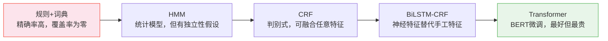

# 命名实体识别——NER 从规则到 Transformer

> 把名字从文本里捞出来。听起来简单——直到你遇到边界歧义、嵌套实体、以及"苹果"到底是水果还是公司。

**类型：** 实现课
**语言：** Python
**前置知识：** 阶段 05 · 02（BoW + TF-IDF）、阶段 05 · 03（词嵌入）
**预计时间：** ~75 分钟
**所处阶段：** Tier 1
**关联课程：** 阶段 07（Transformer 深入）— BERT 的 token-classification head 就是现代 NER 的标准架构

---

## 🎯 学习目标

完成本课后，你能够：

- [ ] 实现 BIO 标注方案和 span↔BIO 的往返转换
- [ ] 解释为什么词典匹配（Gazetteer）有高精确率但零召回率——以及为什么统计模型取代了它
- [ ] 比较 NER 架构的演化路径：规则 → HMM → CRF → BiLSTM-CRF → Transformer
- [ ] 理解中文 NER 与英文 NER 的关键差异——没有大小写信号意味着什么

---

## 1. 问题

"苹果公司在美国起诉了三星，索赔 20 亿美元。"

这句话里有几个实体？"苹果公司"是组织（ORG），"美国"是地缘政治实体（GPE），"三星"是组织（ORG），"20 亿美元"是金额（MONEY）。一个好的 NER 系统应该把它们全部正确提取出来。

一个差的系统会把"苹果"误标成果实，把"三星"漏掉（因为它不在词典里），把"20 亿美元"标成人名。

NER 是每个结构化信息提取流水线下的底座。简历解析、合规日志扫描、病历脱敏、搜索查询理解、对话机器人的实体链接、法律合同提取——你几乎看不到 NER，但到处都在依赖它。

中文 NER 更难——英文有大小写信号。"apple"是小写="水果"，“Apple”是大写="公司"。中文的"苹果"没有这个区分——上下文是唯一的线索。加上分词是 NER 的前置步骤——分词错则标注错——中文 NER 的难度天然比英文高一个等级。

---

## 2. 概念

### 2.1 BIO 标注——把找实体变成打标签

NER 的本质是**从文本中找出实体范围并分类**。BIO 把这个"找范围"的问题转化为"给每个词元分类"的问题：

```
词元      标签      含义
─────────────────────────
苹果      B-ORG     组织实体的开头
公司      I-ORG     同一实体的内部
在        O         非实体
美国      B-GPE     地理实体的开头
起诉      O         非实体
了        O         非实体
三星      B-ORG     组织实体的开头（单字实体）
```

| 标签前缀 | 含义 |
|---|---|
| B-TYPE | 某类型实体的**开头**（Beginning） |
| I-TYPE | 某类型实体的**内部**（Inside） |
| O | 不属于任何实体（Outside） |

BILOU 是 BIO 的升级版：增加了 `L-TYPE`（Last，实体结尾）和 `U-TYPE`（Unit，单字实体）。它的边界更精确，但标签数量翻倍——小数据集上可能训练不稳定。

### 2.2 架构演化——五个阶段，每个解决上一个的局限



| 阶段 | 核心思路 | 关键局限 |
|---|---|---|
| **规则 + 词典** | 正则表达式 + 实体词典查表 | 对未见实体零覆盖率；无法消歧 |
| **HMM** | 隐藏马尔可夫模型——学 P(token\|tag) 和 P(tag→tag) | 生成式模型的独立性假设限制了特征组合 |
| **CRF** | 条件随机场——判别式模型，自由组合手工特征 | 特征靠人设计，覆盖面有上限 |
| **BiLSTM-CRF** | LSTM 双向读取句子 + CRF 顶层约束 | 需要大量标注数据；离线训练成本 |
| **Transformer** | BERT fine-tune + token classification head | 推理延迟最高；小数据集可能不如 CRF 稳定 |

**每个阶段解决上一个阶段的特定局限。** 这个模式本身就是本课最重要的知识点——你看到的不只是一堆 NER 模型的列表，而是 NLP 模型如何在"泛化能力 ↔ 数据需求 ↔ 计算成本"的三元天平上不断寻找新平衡。

### 2.3 手工特征——CRF 时代的核心武器

在 BiLSTM 之前，NER 的性能靠特征工程。三个最重要的特征：

- **词形（Word Shape）：** `iPhone→xXxxxx`、`USA→XXX`、`2024Q3→ddddXd`。大小写模式是识别专有名词的最强单特征
- **前后词（Context）：** 前面是"CEO" → 当前词很可能是人名。后面是"Inc." → 当前词很可能是公司名
- **后缀（Suffix）：** `-ing`、`-tion`、`-er` 等提供词性线索，间接帮助实体边界判断

**中文没有大小写信号。** 这意味着英文 NER 最强的单特征在中文中完全不存在。中文字符级的特征（如偏旁部首——"氵"暗示水域相关，可用于 GEO 实体的辅助判断）和上下文窗口的宽度变得更重要。

---

## 3. 从零实现

### 第 1 步：BIO 标注转换

```python
def spans_to_bio(tokens, spans):
    """实体范围 → BIO 标签序列。"""
    labels = ["O"] * len(tokens)
    for start, end, label in spans:
        labels[start] = f"B-{label}"
        for i in range(start + 1, end):
            labels[i] = f"I-{label}"
    return labels

def bio_to_spans(tokens, labels):
    """BIO 标签序列 → 实体范围。这是 NER 评估的核心——实体级 F1 需要精确的 span 匹配。"""
    spans = []
    current = None
    for i, label in enumerate(labels):
        if label.startswith("B-"):
            if current:
                spans.append(current)
            current = (i, i + 1, label[2:])
        elif label.startswith("I-") and current and current[2] == label[2:]:
            current = (current[0], i + 1, current[2])
        else:
            if current:
                spans.append(current)
                current = None
    if current:
        spans.append(current)
    return spans
```

验证往返一致性：

```python
>>> tokens = "The New York City mayor visited OpenAI .".split()
>>> gold = [(1, 4, "GPE"), (6, 7, "ORG")]
>>> bio = spans_to_bio(tokens, gold)
>>> bio_to_spans(tokens, bio) == gold
True  # 往返无损
```

### 第 2 步：词典匹配（Gazetteer）——最简单的 baseline

```python
ORG_GAZETTEER = {"Apple", "Google", "Microsoft", "OpenAI", ...}
GPE_GAZETTEER = {"US", "India", "Germany", "France", ...}

def rule_based_ner(tokens):
    labels = []
    for token in tokens:
        if token in ORG_GAZETTEER:
            labels.append("B-ORG")
        elif token in GPE_GAZETTEER:
            labels.append("B-GPE")
        else:
            labels.append("O")
    return labels
```

生产级词典有从 Wikipedia 和 DBpedia 爬取的数百万条目。覆盖度可观——但消歧能力为零。"Apple"是水果还是公司？词典不知道，也不试图知道。这就是为什么统计模型取代了词典——**它们从上下文学会了消歧。**

### 第 3 步：手工特征提取

```python
def word_shape(word):
    """词形——大小写模式是专有名词的强信号。"""
    out = []
    for c in word:
        if c.isupper():   out.append("X")
        elif c.islower(): out.append("x")
        elif c.isdigit(): out.append("d")
        else:             out.append(c)
    return "".join(out)

def token_features(token, prev_token, next_token):
    return {
        "lower": token.lower(),
        "is_upper": token.isupper(),
        "is_title": token.istitle(),
        "has_digit": any(c.isdigit() for c in token),
        "suffix_3": token[-3:].lower(),
        "shape": word_shape(token),
        "prev_lower": prev_token.lower() if prev_token else "<BOS>",
        "next_lower": next_token.lower() if next_token else "<EOS>",
    }
```

```python
>>> word_shape("iPhone")   # 'xXxxxx' — 驼峰式 → 高度可疑为产品名
>>> word_shape("USA-2024") # 'XXX-dddd' — 全大写+数字 → 高度可疑为缩写
```

### 第 4 步：实体级评估

```python
def entity_f1(y_true, y_pred):
    """实体级 F1——不是词元级。"""
    true_set = set(y_true)
    pred_set = set(y_pred)
    tp = len(true_set & pred_set)
    fp = len(pred_set - true_set)
    fn = len(true_set - pred_set)
    # ... 标准 P/R/F1 计算
```

**为什么必须是实体级而非词元级？** "New York City"的 GPE 实体被预测为只有"New York"——词元级 F1 给你 2/3 的分数，但用户看到的是截断的、错误的实体名。实体级 F1——要求 (start, end, type) 完全一致——直接判为错误。

完整代码见 `code/ner.py`。

---

## 4. 工业工具

### 4.1 spaCy——开箱即用的 NER

```python
import spacy

nlp = spacy.load("en_core_web_sm")
doc = nlp("Apple sued Google over its iPhone search deal in the US.")
for ent in doc.ents:
    print(f"{ent.text:20s} {ent.label_}")
```

```
Apple                ORG
Google               ORG
iPhone               ORG     ← 注意：小模型把 iPhone 标成了 ORG
US                   GPE
```

`en_core_web_sm` 在产品实体上弱——大模型（`en_core_web_lg`）做得更好，Transformer 模型（`en_core_web_trf`）还要更好。

### 4.2 HuggingFace——BERT 做 NER

```python
from transformers import pipeline

ner = pipeline("ner", model="dslim/bert-base-NER",
               aggregation_strategy="simple")
print(ner("Apple sued Google over its iPhone in the US."))
```

```
[{'entity_group': 'ORG',  'word': 'Apple',   ...},
 {'entity_group': 'ORG',  'word': 'Google',  ...},
 {'entity_group': 'MISC', 'word': 'iPhone',  ...},
 {'entity_group': 'LOC',  'word': 'US',      ...}]
```

`aggregation_strategy="simple"` 是关键——它将连续的 B-X/I-X 词元合并为一个 span。不加这个参数，你拿到的就是逐词元的标签，需要自己合并。

### 4.3 中文 NER 工具

| 工具 | 特点 | 适用场景 |
|---|---|---|
| HanLP | 多任务（分词+NER+依存句法），中文原生 | 企业级中文 NLP |
| LAC (百度) | 分词+词性+NER 一体 | 中文词性标注+NER |
| spaCy `zh_core_web_sm` | 中文 pipeline | 通用中文 NER，开箱即用 |
| transformers BERT-chinese | fine-tune 自定义 NER | 领域特化的中文 NER |

### 4.4 LLM 做 NER（2026 年的选择）

零样本和少样本 LLM NER 已在许多领域匹敌 fine-tune 模型：

- **零样本提示。** 给 LLM 一个实体类型列表和示例格式，要 JSON 输出。开箱即用——在新领域上准确率中等，不需要任何标注数据
- **分类型抽取。** 对长文档，一次调用抽取全部实体类型会随着文档长度增长丢失召回率。按实体类型各做一次抽取更贵但显著更准——这是临床病历和法律合同的标准做法
- **动态少样本提示。** 从少量标注种子集中检索最相似的示例，每次推理时动态构造 few-shot prompt。在 2026 年的基准测试中，生物医学 NER 的 F1 提升了 10%+

**2026 生产建议：** 在收集标注数据之前先用 LLM 零样本跑一版。很多时候 F1 已经足够好，你做 fine-tune 的时间可以省了。

### 4.5 经典 NER 仍在赢的场景

| 场景 | 选择 | 原因 |
|---|---|---|
| 延迟 < 50ms | CRF / BiLSTM-CRF | 词元级推理是查表+矩阵乘法——微秒级完成 |
| 有几千条标注、需要 98%+ F1 | BiLSTM-CRF | 足够数据+固定本体→经典模型稳定到令人发指 |
| 监管要求非生成式模型 | CRF | 本地部署、完全可解释的特征权重 |
| 其他 | LLM 零/少样本 | 基准线先跑——省标注成本 |

---

## 5. 知识连线

NER 是序列标注任务的代表，它的架构演化是 NLP 发展的缩影：

- **阶段 05 · 02（BoW + TF-IDF）** 的特征设计思想 → CRF 手工特征的直接来源
- **阶段 05 · 03（Word2Vec）** 的词嵌入 → BiLSTM-CRF 的输入层
- **阶段 05 · 07（词性标注）**——NER 的孪生任务——都是序列标注，可以用同一种 BIO 方案解决
- **阶段 07（Transformer 深入）**——BERT 的 token-classification head 就是现代 NER 的标准架构

---

## 6. 工程最佳实践

### 6.1 评估——永不用词元级 F1

用 `seqeval` 库做实体级评估。它是 NER 评估的事实标准——按 BIO 标签的正确合并来计算精确率/召回率/F1。

```python
from seqeval.metrics import classification_report
print(classification_report(y_true, y_pred))
```

**永远不单独报告词元级准确率。** 在一个 O 标签占 85% 的数据集上，全部预测为 O 就获得 85% 词元级准确率——但实体召回率为 0%。

### 6.2 中文特别建议

- **分词→NER 的错误传播是中文 NER 的头号杀手。** "苹果公司"如果被切为"苹果"和"公司"——"苹果"作为单独的 token 更容易被误标为水果而非公司。最粗暴但有效的缓解：在分词词典中加入目标领域的实体词，确保它们被当作完整词切分
- **没有大小写→字符级特征更重要。** 在 BiLSTM-CRF 中，中文模型通常在字符嵌入之上叠加一个 CNN 或 LSTM 来捕获部首/偏旁的组合模式。这不是"锦上添花"——它是替代大小写特征的必要组件
- **中文 NER 数据集：** MSRA-NER（简体中文新闻）、OntoNotes 5.0 中文部分（四层标注，最全面）、Weibo NER（社交媒体风格，含大量不规范表达）

### 6.3 踩坑经验

- **词典标注和统计模型的结合方式不是"取并集"。** 不要用词典结果直接覆盖模型输出——词典的精确率高但可能标注错误类型。把词典匹配结果作为 CRF 的一个**特征**（而非直接输出）——让 CRF 自己学习什么时候该信任词典、什么时候该否决它
- **O 标签过多 → 类别不平衡会降低 CRF 的训练信号。** 如果你的训练数据中 O 标签占 80% 以上（大多数 NER 数据集都是如此），考虑对 O 标签做降采样或给非 O 类加权
- **`aggregation_strategy` 的设置因人而异。** HuggingFace NER pipeline 的 `aggregation_strategy="simple"` 会合并相邻同类型 token。`"first"` 只保留每个实体的第一个 token。`"max"` 取概率最大的 token 作为实体分数。选错了，你得到的结果可能看起来像 NER 失败了——但只是合并策略的问题

---

## 7. 常见错误

### 错误 1：中文 NER 不经分词直接逐字标注

**现象：** 对中文字符序列直接打 BIO 标签——"苹"=B-ORG、"果"=I-ORG。表面上看能正确标注单字实体，但遇到"苹果"同时是水果和公司时，逐字标注没有提供任何消歧所需的词级上下文。

**原因：** 中文实体识别需要知道"苹果"是一个词，才能在此基础上判断它是水果还是公司。逐字标注把"苹果"拆成两个独立的 token——模型只能看到"苹"和"果"各自的上下文，看不到"苹果"作为一个整体的上下文。

**修复：** 先分词，再做词级别的 BIO 标注。或使用基于字符 + 词信息的混合模型（Lattice LSTM / FLAT 等专为中文设计的 NER 架构）。

### 错误 2：用词元级准确率替代实体级 F1

**现象：** 报告 95% 的"NER 准确率"。但抽查发现人名只召回了一半。

**原因：** 绝大多数标签是"O"——预测全部为"O"就能拿到 85-95% 的词元级准确率。但实体全部漏掉。

**修复：** 用 `seqeval` 的 `classification_report`，始终报告实体级 F1——按实体类型分别给出。ORG 实体的 F1 和 PERSON 实体的 F1 可能相差 20%+——不要把它们合在一起只看一个数字。

### 错误 3：词典直接覆盖模型输出

**现象：** 精确率很高（词典标的都对了），但 F1 不足——模型从词典"学"到的只有"抄答案"，完全没学到从上下文中消歧。

**原因：** 将词典匹配结果直接替换模型预测——模型失去了在"词典候选"和其他候选之间做选择的机会。更糟的是，词典标注错误的类型（如把"苹果"标为 ORG——但在"吃了一个苹果"中它是水果）被强制覆盖到输出中。

**修复：** 把词典匹配结果作为 CRF 或 LSTM 的一个输入特征（如 `in_org_gazetteer=True`），而非直接输出。让模型学习何时信任词典、何时根据上下文否决它。

---

## 8. 面试考点

### Q1：CRF 相比 HMM 在 NER 中的核心优势是什么？（难度：⭐⭐）

**参考答案：**
CRF 是**判别式模型**——直接建模 P(tag|sentence)，而非 HMM 的 P(sentence|tag)×P(tag)。这意味着 CRF 可以在给定当前观测（整个句子）的条件下，自由组合任意特征——大小写模式、前后词、词典匹配结果——而无需担心这些特征之间是否满足独立性假设。HMM 要求特征是独立生成的——这在 NLP 中几乎从不成立。CRF 不要求。

### Q2：中文 NER 为什么比英文 NER 更难？（难度：⭐⭐）

**参考答案：**
三个结构性原因：**（1）没有大小写信号**——英文 cap 是大写的专有名词（Apple 公司 vs apple 水果），中文"苹果"只有一种写法。**（2）需要先分词**——中文 NER 是序列标注（SEQ→TAG）但不是直接在字符序列上标注（太细），也不是直接在词序列上标注（需要先正确分词）。分词错误直接传播为 NER 错误。**（3）人名和地名没有形式标记**——"王伟"看起来和普通名词没有区别；英文中首字母大写的新出现词组大概率是实体。这三个因素的叠加使得中文 NER 一直是 NLP 社区的硬骨头。

### Q3：实体级 F1 和词元级 F1 什么时候会给出完全不同的结论？（难度：⭐⭐⭐）

**参考答案：**
在多词元实体且模型倾向于"截断实体"时差异最大。举例：真实是 `["New", "York", "City"]` → GPE。模型 A 预测为只有 `["New", "York"]` → GPE（截断了"City"）。词元级：3 个词元中 2 个正确 → 67%。实体级：预测的 (0, 2, GPE) ≠ 真实的 (0, 3, GPE) → **0%**。实体级 F1 给出的 0% 是正确且诚实的——因为截断的实体在生产环境中是一个错误。"纽约市"被截断为"纽约"→ 如果这个结果输出给用户——这是一个错误。词元级 67% 给出的虚假安全感在误导你。

---

## 🔑 关键术语

| 术语 | 人们怎么说 | 实际含义 |
|---|---|---|
| NER | "把名字找出来" | 标注文本中的词元片段并归类（人名、地名、组织名、日期…） |
| BIO / BILOU | "打标签的方案" | B=开头 I=内部 O=外部。将 span 提取转化为词元分类。BILOU 增加了 L=结尾 U=单字 |
| CRF | "结构化的分类器" | 条件随机场——对标签之间的转移建模，不只对每个词元的发射概率建模。强制标签序列合法 |
| 实体级 F1 | "NER 的正确指标" | 预测的 (start, end, type) 必须与真实完全一致。词元级 F1 给出虚假的高分 |
| 嵌套 NER | "套娃实体" | 一个 span 本身是实体，其子 span 也是不同类型的实体。BIO 无法表达——需要多轮标注或 span-based 模型 |
| 词形 (Word Shape) | "大小写的指纹" | 将大写→X、小写→x、数字→d。`iPhone`→xXxxxx。英文 NER 的最强单特征——中文没有 |

---

## 📚 小结

NER 的架构演化——规则→HMM→CRF→BiLSTM-CRF→Transformer——是 NLP 模型在"泛化能力"和"训练成本"之间不断寻找新平衡的过程。BIO 标注将找实体转化为打标签，CRF 把手工特征变成艺术，BiLSTM 把手工特征变成神经特征，BERT 把这一切封装进了三个文件和一个 `from_pretrained()`。

中文 NER 的挑战更本质：没有大小写信号、需要先分词、人名没有形式标记。在收集标注数据之前，先用 LLM 零样本跑一版——很多时候 F1 已经够用了。

---

## ✏️ 练习

1. 【理解】实现 `bioto_spans` 的逆函数（`spansto_bio` 你已经有了）。用 10 个句子验证往返（spans→BIO→spans）的一致性。如果有一个句子往返失败，是为什么？

2. 【实现】在规则 NER 中加入**多词元实体的最长匹配**——如果 tokens=["New","York","City"] 且词典有"New York City"，标注为连续的 B-GPE, I-GPE, I-GPE。

3. 【实验】用 `sklearn-crfsuite` 在 CoNLL-2003 英文 NER 数据集上训练一个 CRF，使用你从零实现的手工特征提取器。用 `seqeval` 报告实体级 F1，按实体类型分别展示。典型的 CRF 结果：~84 F1。

4. 【思考】"美国银行大厦"既是 ORG（银行）又是 FACILITY（建筑物）。设计两个方案来处理这种嵌套实体——一个不需要改变模型架构，一个需要。各自的权衡是什么？

---

## 🚀 产出

| 产出 | 文件 | 说明 |
|---|---|---|
| NER 从零实现 | `code/ner.py` | BIO 标注转换 + 词典匹配 + 手工特征 + 实体级评估 |

---

## 📖 参考资料

1. [论文] Lample et al. "Neural Architectures for Named Entity Recognition". NAACL, 2016. https://arxiv.org/abs/1603.01360 — BiLSTM-CRF 的经典论文
2. [论文] Devlin et al. "BERT: Pre-training of Deep Bidirectional Transformers". NAACL, 2019. https://arxiv.org/abs/1810.04805 — 引入 token-classification pattern，现代 NER 的标准架构
3. [官方文档] spaCy. "Named Entity Recognition". https://spacy.io/usage/linguistic-features#named-entities — Doc.ents 和 Span 的完整 API 参考
4. [GitHub] seqeval. https://github.com/chakki-works/seqeval — NER 评估的正确指标库

---

> 本课程参考了 AI Engineering From Scratch（MIT License）的课程体系，在此基础上进行了重构和原创内容的扩充。所有中文表达、中文 NER 挑战分析、中文案例、中文工具推荐、工程最佳实践、常见错误、面试考点等均为原创内容。
