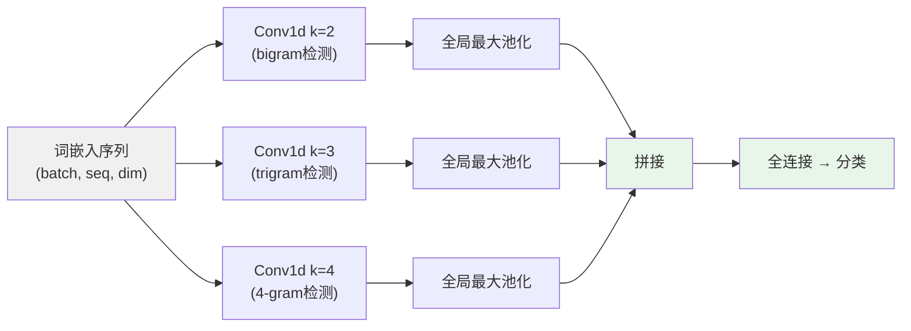

# CNN 与 RNN 文本建模

> 卷积学会检测 n-gram。循环学会记忆。两者都被注意力超越了。但在受限硬件上，两者仍然重要。

**类型：** 实现课
**语言：** Python
**前置知识：** 阶段 03 · 11（PyTorch 入门）、阶段 05 · 03（词嵌入）
**预计时间：** ~75 分钟
**所处阶段：** Tier 1
**关联课程：** 阶段 05 · 10（注意力机制）— 注意力解决了本课两个架构各自的根本局限

---

## 🎯 学习目标

完成本课后，你能够：

- [ ] 解释梯度消失问题——为什么普通 RNN 在 100 步后就什么都学不到了
- [ ] 实现 TextCNN——理解为什么多个宽度的卷积核 + 全局最大池化检测的是 n-gram 模式
- [ ] 比较 CNN、RNN、Transformer 三者在训练并行度、长距离依赖、推理延迟上的取舍
- [ ] 判断什么时候边缘设备上选 TextCNN、什么时候流式输入上选 LSTM

---

## 1. 问题

TF-IDF 和 Word2Vec 的平均池化丢掉了词序。"狗咬人"和"人咬狗"在这两种表示中完全重合——两个词在两句话中的频率一模一样，谁的嵌入都不包含"谁在咬谁"的信息。

在注意力出现之前，有两类架构填补了这个空白。

**卷积网络（TextCNN）。** 在词嵌入序列上做 1D 卷积。宽度为 3 的卷积核是一个可学习的 trigram 检测器——它在连续的 3 个词上滑动，输出一串激活值。堆叠不同宽度（2、3、4、5）的卷积核来检测多尺度的 n-gram 模式。全局最大池化压成固定长度的表示。完全并行，没有序列依赖——训练快。

**循环网络（RNN → LSTM → GRU）。** 逐词元处理，维护一个隐藏状态从前向后传递信息。序列化的、有记忆的、处理任意长度的输入。2014 到 2017 年间统治了序列建模——然后注意力出现了。

两者都被注意力机制（阶段 05 · 10）取代了。但在受限硬件上——手机、IoT、实时流——它们仍然是 2026 年的正确选择。

---

## 2. 概念

### 2.1 TextCNN——可学习的 n-gram 检测器

```
输入嵌入序列:
  "not"  "good"  "at"  "all"  "."
  [0.1]  [0.3]  [0.5] [0.2]  [0.8]
   ↓       ↓       ↓     ↓      ↓
卷积核(宽度=2):  ████（在此上滑动）
  对 ("not","good") 输出激活 0.7  ← 检测到 "not good" 的模式
  对 ("good","at")  输出激活 0.2
  对 (at, all)      输出激活 0.4
  对 (all, .)       输出激活 0.1
   ↓
全局最大池化: 0.7 ← 整句中 "not good" 最显著的出现被选中
```



**为什么有效。** 每个卷积核是一个可学习的 n-gram 模式。全局最大池化是位置不变的——"not good"无论在句首还是句末触发，池化后得到的信号相同。3 种宽度 × 100 个卷积核 = 300 个可学习的 n-gram 检测器。训练完全并行——没有序列依赖。

### 2.2 RNN——渐变消失的链

```
普通 RNN: h_t = tanh(W·x_t + U·h_{t-1})

t=1: h_1 = tanh(W·x_1 + U·h_0)
t=2: h_2 = tanh(W·x_2 + U·h_1)
...
t=100: h_100 依赖 h_1，但梯度流经了 100 次 U 的乘法
        如果 |U| < 1：0.9^100 ≈ 2.7×10^-5 → 梯度消失了
        如果 |U| > 1：1.1^100 ≈ 1.4 × 10^4 → 梯度爆炸了
```

**梯度消失不是理论问题——是一个数学事实。** 对于长度超过 50 的序列，普通 RNN 在前几个位置上的梯度已经归零——模型无法学到任何跨越超过几十个词元的依赖关系。

**LSTM 的修复：** 三条"门"控制信息流——遗忘门决定扔掉什么，输入门决定存入什么，输出门决定暴露什么。加上一条**细胞状态**——这条状态在时间步之间只有加法交互（而非乘法）。梯度在这条"高速公路"上不再被反复压缩——它能稳定流过 100+ 步的序列。

### 2.3 为什么还需要 CNN/RNN（2026 年仍然适用）

| 约束 | 选择 | 原因 |
|---|---|---|
| 手机/边缘设备推理 | TextCNN + GloVe | 模型大小 < 10MB，Transformer 的 1/100 |
| 流式/实时输入 | LSTM | 逐词处理，收到就输出。Transformer 需要完整序列 |
| 快速 baseline | TextCNN | CPU 上 5 分钟训练完成 |
| 序列标注 + 少量标注 | BiLSTM-CRF | 1k-10k 标注句上仍然是生产级 NER 架构 |
| 其他一切 | Transformer | 阶段 07 + 阶段 05 · 10 |

---

## 3. 从零实现

### 第 1 步：梯度消失——一个数字就够了

```python
import math

def vanishing_gradient_sim(seq_len, recurrent_weight=0.9):
    """模拟梯度在普通 RNN 中的衰减。0.9^100 ≈ 2.7e-5"""
    return math.pow(recurrent_weight, seq_len)

>>> vanishing_gradient_sim(10)   # 0.35  — 还能学
>>> vanishing_gradient_sim(50)   # 0.005 — 快没了
>>> vanishing_gradient_sim(100)  # 2.7e-5 — 消失了
>>> vanishing_gradient_sim(200)  # 7.1e-10 — 彻底没了
```

普通 RNN 在 100 步后丢失了 99.997% 的梯度。这就是为什么从 RNN 到 LSTM 到 GRU 到 Transformer 的演进一直在解决同一个问题：**怎么让远处的信号到达当前步。**

### 第 2 步：TextCNN 概念直通

```python
def conv1d_over_embeddings(embeddings, filter_matrix, bias=0.0):
    """1D 卷积在嵌入序列上的逐行实现。"""
    filter_width = len(filter_matrix)
    embed_dim = len(embeddings[0])
    out = []
    for i in range(len(embeddings) - filter_width + 1):
        total = bias
        for k in range(filter_width):
            for d in range(embed_dim):
                total += embeddings[i + k][d] * filter_matrix[k][d]
        out.append(max(total, 0.0))  # ReLU
    return out
```

用 5 个词 × 3 维嵌入，两个不同宽度的卷积核滑动：

```python
>>> embeddings = [[1.0, 0.2, 0.5], [0.8, 0.9, 0.1], ...]  # 5 tokens
>>> filter_w2 = [[0.5, 0.0, 0.5], [0.2, 0.3, 0.1]]        # width=2
>>> filter_w3 = [[0.3, 0.3, 0.3], ...]                       # width=3
>>> conv_w2 = conv1d_over_embeddings(embeddings, filter_w2)  # 4 个输出位置
>>> max_pool(conv_w2)  # 0.98  ← 宽度=2 检测到的最强 bigram 信号
```

**全局最大池化选出的不是"最后一个位置"——是"任意位置中最强的那一个"。** 这就是 TextCNN 的位置不变性——"not good"在句首触发和在句末触发的池化值相同。

### 第 3 步：PyTorch 实现

```python
class TextCNN(nn.Module):
    def __init__(self, vocab_size, embed_dim, n_classes,
                 filter_widths=(2, 3, 4), n_filters=64):
        super().__init__()
        self.embed = nn.Embedding(vocab_size, embed_dim)
        self.convs = nn.ModuleList([
            nn.Conv1d(embed_dim, n_filters, kernel_size=k)
            for k in filter_widths
        ])
        self.fc = nn.Linear(n_filters * len(filter_widths), n_classes)

    def forward(self, token_ids):
        x = self.embed(token_ids).transpose(1, 2) # (B, E, L)
        pooled = []
        for conv in self.convs:
            c = F.relu(conv(x))
            p = F.max_pool1d(c, c.size(2)).squeeze(2)  # 全局最大池化
            pooled.append(p)
        return self.fc(torch.cat(pooled, dim=1))
```

`transpose(1, 2)` 把 `[batch, seq_len, embed_dim]` 转置为 `[batch, embed_dim, seq_len]`——因为 PyTorch 的 `Conv1d` 将中间轴视为通道数。全局最大池化后的维度是固定的——无论输入序列多长，输出始终是 `n_filters × len(filter_widths)`。

完整代码见 `code/cnn_rnn_demo.py`。

---

## 4. 工业工具

### 4.1 PyTorch 内置——生产可用

`nn.LSTM`、`nn.GRU`、`nn.Conv1d` 都是生产级组件。训练代码与任何分类任务相同——Adam、交叉熵、梯度裁剪。

### 4.2 BERT + CNN 混合

将 BERT 作为冻结编码器，顶上接一个小 TextCNN 进行分类：

```python
from transformers import AutoModel

encoder = AutoModel.from_pretrained("bert-base-chinese")
for param in encoder.parameters():
    param.requires_grad = False  # 冻结 BERT

class BertCNN(nn.Module):
    def __init__(self, n_classes):
        super().__init__()
        self.encoder = encoder
        self.convs = nn.ModuleList([
            nn.Conv1d(768, 64, k) for k in (2, 3, 4)
        ])
        self.fc = nn.Linear(192, n_classes)

    def forward(self, input_ids, attention_mask):
        with torch.no_grad():
            x = self.encoder(input_ids=input_ids,
                            attention_mask=attention_mask).last_hidden_state
        x = x.transpose(1, 2)
        pooled = [F.max_pool1d(F.relu(conv(x)), conv(x).size(2)).squeeze(2)
                  for conv in self.convs]
        return self.fc(torch.cat(pooled, dim=1))
```

这种混合方案利用了 BERT 的语义能力 + CNN 的轻量速度——在需要比纯 CNN 好但又付不起完整 BERT fine-tune 的计算量时是最佳折中。

### 4.3 选择矩阵

```
边缘设备 + 文本分类 → TextCNN + GloVe（几 MB，< 1ms 推理）
流式输入 + 实时标注 → LSTM（逐词处理，无需等完整序列）
标注有限 + NER      → BiLSTM-CRF（1k+ 标注即可训练）
快速 baseline        → TextCNN（CPU 上 5 分钟）
其他                 → Transformer
```

---

## 5. 知识连线

CNN 和 RNN 是 Transformer 出现之前的两条演化主线。理解它们失败的地方，你就理解了注意力被发明的原因：

- **TextCNN 的固定宽度 → 自注意力的全序列窗口。** 卷积核只能看到 k 个相邻词——"not only...but also"跨越 10 词以上，没有任何固定卷积窗口能捕获。注意力机制给每个词直接连接整个序列——窗口大小 = 序列长度
- **RNN 的串行瓶颈 → Transformer 的并行前向。** 训练 1000 长度的序列需要 1000 次串行 RNN 步骤。Transformer 一步计算全部位置——同时
- **LSTM 的隐藏状态瓶颈 → 自注意力的直接连接。** 100 步前的信息经过 LSTM 门控后已经被稀释。自注意力中 O(1) 路径长度——每个词元直接与每个其他词元通信

---

## 6. 工程最佳实践

### 6.1 训练参数经验值

| 参数 | TextCNN | BiLSTM |
|---|---|---|
| 嵌入维度 | 100-300 | 100-300 |
| 卷积核宽度 | (2, 3, 4, 5) | — |
| 每宽度核数 | 64-128 | — |
| 隐藏维度 | — | 128-256 |
| Dropout | 0.3-0.5 | 0.3-0.5 |
| 学习率 | 1e-3（Adam） | 1e-3（Adam） |
| 梯度裁剪 | 1.0 | 1.0 |

### 6.2 中文特别建议

- **TextCNN 对中文的 n-gram 检测依赖分词质量。** 如果 jieba 把"不好看"切成"不"+"好看"——宽度=2 的卷积核（bigram 检测器）能捕获"不"+"好看"这个模式。但如果切成"不好"+"看"，bigram 匹配的是错误的一对。分词一致性比架构选择更重要
- **中文 BiLSTM 通常需要在字符嵌入之上叠加一个 CNN 层。** 中文没有大小写和后缀信号——字符级的卷积（如 3-gram 字嵌入）可以捕获偏旁部首和部件模式，替代英文中 size/shape 特征的作用
- **中文边缘部署——TextCNN + jieba 分词 → 总模型大小 < 20MB。** 适合微信小程序、手机端本地分类场景。不比 Transformer 准，但够好 + 够小

### 6.3 踩坑经验

- **`nn.LSTM` 的 `batch_first=True` 不设置会导致维度完全错位。** 默认为 `False` → 输入形状 `(seq_len, batch, hidden)`。大部分代码期望 `batch_first=True` → `(batch, seq_len, hidden)`。养成显式传参的习惯
- **TextCNN 的 `max_pool1d` 需要指定 `kernel_size` 为当前序列长度——否则不是"全局"池化。** 用 `F.max_pool1d(c, c.size(2))` 的写法，含义是不论输入长度多少，池化核大小 = 整个特征图长度 → 每个卷积核输出单一值
- **RNN 的 `max-pool` vs `last-state` pool——分类任务中 max-pool 通常更好。** 因为长序列尾部常常是被动结构或无关收尾，最后一个隐藏状态不等同于"全文摘要"。max-pool 选每维最强信号——不受位置影响

---

## 7. 常见错误

### 错误 1：双向 LSTM 用于自回归生成

**现象：** 训练一个"双向 LSTM 做文本生成"——测试时生成的文本完全不像语言。

**原因：** 双向 LSTM 的每个词元表示包含了**右侧上下文**——在生成场景中，你还没有右边的东西。训练时它看到了未来，但推理时未来不存在——这是训练/推理分布偏差的根源。

**修复：** 生成任务用单向 LSTM（或更好：Transformer decoder）。BiLSTM 只应该用于**编码/特征提取**——分类、序列标注——这些场景下整个句子已经在你手上了。

### 错误 2：卷积宽度只选一个

**现象：** `filter_widths=(3,)`，模型在短句上表现不错但在长句和长短语上全面失败。

**原因：** 单个宽度的卷积核只能检测单一尺度的 n-gram。宽度=3 的核永远看不到 2-gram（如"not good"）或 5-gram（如"not only but also"）的模式。

**修复：** 使用多个宽度——`(2, 3, 4, 5)` 是 Kim (2014) 论文的标配，至今未被更好的配置颠覆。

---

## 8. 面试考点

### Q1：TextCNN 的全局最大池化和平均池化有什么区别？（难度：⭐⭐）

**参考答案：**
最大池化选了"这个 n-gram 模式在本句的任意位置中最强的一次触发"。如果"not good"在句首出现了一次非常强的触发，最大池化保留这个 0.9；如果它在句尾很弱地重复了一次（0.1），最大池化忽略它。平均池化给每次触发同等的贡献——当关键词只出现一次但非常关键时，平均池化稀释信号；当关键词反复出现带来语气的增强时，平均池化放大信号。两种池化没有绝对的好坏——取决于任务。

### Q2：为什么不直接把 CNN 套在中文文本上？（难度：⭐⭐）

**参考答案：**
CNN 的卷积核在"连续词嵌入"上滑动——"连续"的前提是你已经知道哪些 token 是词。如果你在未经分词的中文字符序列上直接跑 CNN——每个汉字是一个 token，宽度=3 的卷积核看到的是"机"+"器"+"学"这种三字节组合。这不算错——一些字级别的中文分类方案就是这样做的——但它放弃了"机器学习"作为一个完整语素被一次检测到的好处。最佳方案是在 jieba 分词后的词序列上跑 CNN 或 LSTM，同时在字符级嵌入上叠加一层小 CNN 来捕获部首/偏旁信号。

### Q3：你有一台没有 GPU 的树莓派，要做实时中文评论分类（每句话过来就要立刻输出标签）——选 TextCNN 还是 BiLSTM？为什么？（难度：⭐⭐⭐）

**参考答案：**
这是两个约束的三角取舍：**（1）无 GPU + 树莓派 = 模型必须极小。TextCNN 更容易压缩——嵌入层 + 几个小卷积核 < 5MB。（2）实时逐句输出不需要流式——每句话是独立的，不需要依赖上一句的隐藏状态——所以 TextCNN 的完全并行优势明显。（3）但 BiLSTM 在非常小的数据量上一般比 TextCNN 泛化好——因为 LSTM 的门控提供了隐式的正则化。**

**结论：** 先试 TextCNN + GloVe/jieba（模型 < 10MB，推理 < 5ms）。如果 F1 不达标且标注量 < 2000 条——换 BiLSTM（模型 ~20MB，推理 < 20ms）。两个都远比 Transformer 适合这个场景。

---

## 🔑 关键术语

| 术语 | 人们怎么说 | 实际含义 |
|---|---|---|
| TextCNN | "文本卷积" | 在嵌入序列上做 1D 卷积 + 全局最大池化。Kim (2014)。检测可学习的 n-gram 模式，完全并行训练 |
| RNN | "循环神经网络" | h_t = f(W·x_t + U·h_{t-1})。逐词处理，隐藏状态从前向后传递信息。梯度消失使其无法学到长距离依赖 |
| LSTM | "带门的 RNN" | 三扇门 + 细胞状态。门控决定丟什么、存什么、暴露什么。细胞状态提供梯度高速公路 |
| 梯度消失 | "训练信号没了" | 普通 RNN 中梯度反复乘 < 1 的权重 → 指数衰减 → 远端信号归零。LSTM 和残差连接都是为这个问题发明的 |
| 双向 (Bidirectional) | "从两头各跑一次" | 正向+反向 RNN 拼接。每个词元同时看到左侧和右侧上下文。NER/POS 的标配 |

---

## 📚 小结

CNN 在文本上检测可学习的 n-gram，RNN 用隐藏状态在时间步之间传递记忆。CNN 是并行的但只能看到固定窗口，RNN 是串行的但能跨越整个序列。两者各自的根本局限——CNN 的固定宽度和 RNN 的梯度消失——直接催生了注意力机制（下一课）。

在 2026 年：边缘设备上用 TextCNN，流式输入上用 LSTM，其他一切用 Transformer。不是"谁更强"的问题——是"在当前约束下谁最合适"的问题。

---

## ✏️ 练习

1. 【理解】用一句话解释：为什么 LSTM 能处理 200 步的序列而普通 RNN 连 50 步都困难？引用"细胞状态"和"梯度高速公路"两个概念。

2. 【实现】在 TextCNN 中加入 **1D 平均池化**作为全局最大池化的替代，在同一个二分类数据集上比较两种池化的 F1 差异。分析哪种池化在什么类型的文本上更好。

3. 【实验】用 PyTorch 训练一个 BiLSTM 做中文情感分类（ChnSentiCorp 酒店评论）。比较三种池化策略——最大池化、平均池化、最后隐藏状态池化——的 F1。报告差异并解释原因。

4. 【思考】"这件衣服不贵但是质量也不好"——TextCNN 和 BiLSTM 分别如何捕获"不"字对"贵"的否定？各自的瓶颈是什么？

---

## 🚀 产出

| 产出 | 文件 | 说明 |
|---|---|---|
| CNN/RNN 机制演示 | `code/cnn_rnn_demo.py` | 梯度消失模拟 + TextCNN 概念直通 + PyTorch TextCNN/BiLSTM 实现 |

---

## 📖 参考资料

1. [论文] Kim, Y. "Convolutional Neural Networks for Sentence Classification". EMNLP, 2014. https://arxiv.org/abs/1408.5882 — TextCNN 论文，八页，可读
2. [论文] Hochreiter and Schmidhuber. "Long Short-Term Memory". Neural Computation, 1997. https://www.bioinf.jku.at/publications/older/2604.pdf — LSTM 论文，意外地清晰
3. [博客] Olah, C. "Understanding LSTM Networks". 2015. https://colah.github.io/posts/2015-08-Understanding-LSTMs/ — 让 LSTM 对所有人可及的那组图

---

> 本课程参考了 AI Engineering From Scratch（MIT License）的课程体系，在此基础上进行了重构和原创内容的扩充。所有中文表达、中文场景分析、中文边缘部署建议、工程最佳实践、常见错误、面试考点等均为原创内容。
