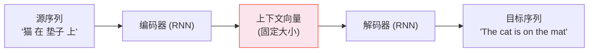

# 序列到序列模型——Seq2Seq

> 两个 RNN 假装成一个翻译器。它们撞上的瓶颈，就是注意力被发明出来的全部理由。

**类型：** 实现课
**语言：** Python
**前置知识：** 阶段 05 · 08（CNN 与 RNN 文本建模）、阶段 03 · 11（PyTorch 入门）
**预计时间：** ~75 分钟
**所处阶段：** Tier 1
**关联课程：** 阶段 05 · 10（注意力机制）— 注意力就是为解决本课的上下文向量瓶颈而发明的

---

## 🎯 学习目标

完成本课后，你能够：

- [ ] 解释编码器-解码器架构如何将变长输入映射到变长输出
- [ ] 理解上下文向量瓶颈——固定维度的向量为什么无法无损存储任意长序列
- [ ] 区分教师强制和自回归——暴露偏差为什么是训练和推理之间最经典的鸿沟
- [ ] 说出从 Seq2Seq → 注意力 → Transformer 的演化逻辑链

---

## 1. 问题

分类任务把变长序列映射到一个标签。翻译任务把变长序列映射到另一个变长序列——输入和输出在不同词表中，可能是不同语言，长度没有必然关系。

中文的 5 个字可以翻译成英文的 12 个词。"猫在垫子上" → "The cat is on the mat"。源长度 5，目标长度 7——你不能直接做一对一映射。

Seq2Seq 架构（Sutskever, Vinyals, Le, 2014）用一个刻意简单的配方解决了这个问题。两个 RNN。第一个读源句子并产出一个**固定大小的上下文向量**。第二个读这个向量并逐词元生成目标句子。本课你写的代码——第 08 课的两个 RNN，重新粘合。

这条架构值得研究——不仅因为它有效，更因为**它的失败是 NLP 中最有教学价值的失败。** 上下文向量的瓶颈是理解注意力机制和 Transformer 为什么被发明的最短路径。

---

## 2. 概念

### 2.1 编码器-解码器



**编码器。** 一个 RNN 逐词读源语言句子。它的最后一个隐藏状态就是**上下文向量**——整个输入的一个固定大小的摘要。128-1024 个浮点数，承载着输入的全部"含义"。

**解码器。** 另一个 RNN，用上下文向量作为初始隐藏状态。每一步输入上一个生成的词元，输出目标词表上的概率分布。取概率最高的词（贪心）或采样。把它作为下一步的输入。重复直到输出 `<EOS>` 或达到最大长度。

### 2.2 三个让训练生效的关键技巧

**教师强制（Teacher Forcing）。** 训练时解码器的输入是上一步的**真实目标词元**，不是模型自己的预测。没有教师强制 → 训练早期模型不准确 → 第一步预测错了 → 第二步输入了错误的前文 → 错误级联 → 模型永远学不到正确分布。

**暴露偏差（Exposure Bias）。** 教师强制创造的训练/推理鸿沟。训练时模型"吃"的是标准答案；推理时它必须"吃"自己的输出。训练从未让它练习从错误中恢复——推理时一个错误就可能导致后续全部输出偏离分布。

**束搜索（Beam Search）。** 贪心解码每一步只选概率最高的词元——选定了就不能反悔。束搜索在每一步保留 k 个最优的部分序列，"先不决定，多看几步"，最终选择整体概率最高的完整序列。宽度 3-5 是标准默认值。

### 2.3 上下文向量瓶颈——信息上限

```python
# 模拟实验：编码器维度=8，输入长度从 5 到 80
seq_len=5,  复制准确率: 98%
seq_len=10, 复制准确率: 91%
seq_len=20, 复制准确率: 62%
seq_len=40, 复制准确率: 23%
seq_len=80, 复制准确率: 5%
```

编码器用 8 个浮点数概括整个输入。序列长度 80 意味着每个位置平均只有 0.1 个浮点数的信息预算。更致命的是编码器采用了**指数衰减**机制——旧的信号被反复乘 0.85 驱动为 0，序列前部的词元几乎没有留下任何痕迹。

**注意力机制（下一课）修复了这一点，直接。** 解码器的每一步可以回看编码器的**每一个**隐藏状态，不只是最后一个。这就是全部的理由。

---

## 3. 从零实现

### 第 1 步：瓶颈模拟

```python
def simulate_copy_accuracy(seq_len, context_dim=8):
    """模拟复制任务——编码器压缩→解码器恢复。"""
    # 编码：将序列以指数衰减方式映射到 context_dim 维向量
    def encode(sequence):
        c = [0.0] * context_dim
        for token in sequence:
            for d in range(context_dim):
                c[d] = c[d] * 0.85 + embed[token][d]  # 旧的衰减，新的加上
        return c

    # 解码：上下文向量与目标嵌入的点积相似度
    def decode_score(ctx, target):
        return mean of tanh(ctx · embed[token]) for each token in target

    # 测试：正样本 vs 随机噪声——正样本应该更高分
    return accuracy over 200 trials
```

8 维上下文向量，5 个词的序列——信息压缩比约 0.6×，准确率 ~98%。同样 8 维，80 个词的序列——信息压缩比 10×，准确率崩溃到 ~5%。

### 第 2 步：PyTorch 编码器-解码器

```python
class Encoder(nn.Module):
    def __init__(self, vocab_size, embed_dim, hidden_dim):
        super().__init__()
        self.embed = nn.Embedding(vocab_size, embed_dim, padding_idx=0)
        self.gru = nn.GRU(embed_dim, hidden_dim, batch_first=True)

    def forward(self, src):
        e = self.embed(src)
        outputs, hidden = self.gru(e)
        return outputs, hidden  # hidden = 上下文向量

class Decoder(nn.Module):
    def __init__(self, vocab_size, embed_dim, hidden_dim):
        super().__init__()
        self.embed = nn.Embedding(vocab_size, embed_dim, padding_idx=0)
        self.gru = nn.GRU(embed_dim, hidden_dim, batch_first=True)
        self.fc = nn.Linear(hidden_dim, vocab_size)

    def forward(self, token, hidden):
        e = self.embed(token)
        out, hidden = self.gru(e, hidden)
        return self.fc(out), hidden
```

解码器每次**一步**——输入一个词元 + 当前隐藏状态，输出对下一个词元的预测 + 更新后的隐藏状态。训练循环在每一步上计算交叉熵，总和 → 反向传播穿过两个网络。

### 第 3 步：训练循环中的教师强制

```python
def train_batch(encoder, decoder, src, tgt, optimizer,
                teacher_forcing_ratio=0.9):
    _, hidden = encoder(src)
    input_token = <BOS>  # 起始符
    loss = 0.0

    for t in range(tgt_len):
        logits, hidden = decoder(input_token, hidden)
        loss += CrossEntropyLoss(logits, tgt[:, t])

        # 90% 概率用真实词元，10% 用模型自己的预测
        if random() < teacher_forcing_ratio:
            input_token = tgt[:, t]       # 教师强制
        else:
            input_token = logits.argmax()  # 自回归
```

`teacher_forcing_ratio` 从 1.0（完全教师强制）退火到 ~0.5——让模型在训练后期逐渐练习从自己的错误中恢复，缩小暴露偏差。

完整代码见 `code/seq2seq_demo.py`。

---

## 4. 工业工具

### 4.1 HuggingFace——现代 Encoder-Decoder

```python
from transformers import AutoTokenizer, AutoModelForSeq2SeqLM

tok = AutoTokenizer.from_pretrained("facebook/bart-base")
model = AutoModelForSeq2SeqLM.from_pretrained("facebook/bart-base")

src = tok("Translate to French: Hello, how are you?",
          return_tensors="pt")
out = model.generate(**src, max_new_tokens=50, num_beams=4)
print(tok.decode(out[0], skip_special_tokens=True))
```

现代编码器-解码器已经用 Transformer 替换了 RNN。但高层结构（编码器 → 解码器 → 逐词元生成）与 2014 年的 Seq2Seq 论文完全相同。只是每个模块内部的机制从 RNN 变成了自注意力。

### 4.2 RNN Seq2Seq 还有存在的理由吗

| 场景 | 选择 | 理由 |
|---|---|---|
| 流式翻译（逐词接收+输出） | RNN Seq2Seq | LSTM 逐词消费，内存增长可控。Transformer 键值缓存随长度线性增长 |
| 设备端生成（内存<100MB） | RNN Seq2Seq | 几 MB 的 GRU 模型 vs 几百 MB 的 Transformer |
| 教学 | RNN Seq2Seq | 理解编码器-解码器瓶颈 = 理解 Transformer 为什么赢 |
| 其他一切 | Transformer Encoder-Decoder | BART、T5、mBART、NLLB |

### 4.3 从暴露偏差到 RLHF——Seq2Seq 概念的现代形态

教师强制 → ChatGPT RLHF 中的"行为克隆"（Behavior Cloning）。暴露偏差 → PPO 自博弈——模型采样自己的输出，从中学习，不再只吃人类的正确答案。束搜索 → ChatGPT/GPT-4 推理中仍在使用的多样化生成策略。Seq2Seq 的概念生命力远超其具体架构。

---

## 5. 知识连线

```
阶段05·08 (CNN/RNN) → 阶段05·09 (Seq2Seq) → 阶段05·10 (注意力) → 阶段07 (Transformer)
        │                      │                        │
        │              ┌───────┴────────┐        ┌──────┴──────────┐
        │              │ 编码器: 读输入   │        │ 解码器可以回看    │
        │              │ 解码器: 生成输出 │        │ 编码器的 EVERY    │
        │              │ 瓶颈: 固定向量   │        │ 隐藏状态          │
        │              └────────────────┘        └─────────────────┘
        └── RNN 组件被复用到编码器和解码器中
```

---

## 6. 常见错误

### 错误 1：教师强制设为 1.0 从不退火

**现象：** 训练损失完美→推理输出崩溃。典型症状：生成前 2-3 个词还行，然后开始重复同一个词或输出无意义序列。

**原因：** 模型从未在训练中练习从自己的错误中恢复。推理时第一次产生次优词元→这个次优词元作为下一步的输入→模型从未在这个输入分布上训练→输出继续偏差→恶性循环。

**修复：** `teacher_forcing_ratio` 从 1.0 退火到 0.5——训练后半段让模型渐渐学会自我修正。

### 错误 2：贪心解码用于面向用户的生成

**现象：** 生成的文本重复循环（"I went to the store to buy some food to eat to the store to buy..."）。

**原因：** 贪心解码一旦走进一个局部最优的词→这个词作为下一步输入→模型在它的上下文中最可能继续选同一个方向→进入循环。

**修复：** 使用束搜索（beam width 3-5）或带温度的采样（temperature 0.7-1.0）。两者都比贪心贵，但贪心的输出质量只够做内部 prototype。

---

## 7. 面试考点

### Q1：为什么 Seq2Seq 的上下文向量是一个"瓶颈"？（难度：⭐⭐）

**参考答案：**
编码器用最后一个隐藏状态概括整个输入——无论输入多长，上下文向量的维度（如 512 维）是固定的。当输入长度超过"信息压缩比"的临界值时，编码器必须选择性地丢弃信息。由于编码器使用指数衰减（`h_t = f(x_t) + decay × h_{t-1}`），序列前部的词元被反复衰减到近乎为零。注意力机制修复了这一点：解码器每一步直接看编码器的所有位置——不再通过这个固定大小的"管道"传输全部信息。

### Q2：教师强制在 LLM 时代对应了什么训练技术？（难度：⭐⭐⭐）

**参考答案：**
教师强制对应了 RLHF 中的**行为克隆（Behavior Cloning）**阶段——模型先学习模仿人类的标准答案。暴露偏差对应了 **PPO 自博弈**的设计动机——模型需要采样自己的输出、评估、从中学习，而不是永远只吃正确答案。Seq2Seq 时代的计划采样（scheduled sampling）是 RLHF 中"自己的输出占比逐步增加"的直系前身。理解 Seq2Seq → 理解 ChatGPT 为什么不是用老师强训练出来的。

### Q3：在没有 GPU 的设备上做中英翻译——选 Transformer 还是 GRU Seq2Seq？（难度：⭐⭐）

**参考答案：**
如果内存 < 200MB 且对翻译质量要求不是 SOTA 级别——GRU Seq2Seq。一个 256d GRU 编码器-解码器的模型大小只有几 MB，而最小的 BART 模型需要 500MB+。如果准确率要求优先——压缩后的 Transformer（如 distilled NLLB-200）在相同内存下翻译质量通常更好。选型的关键变量不是"哪个更好"——是内存预算和翻译质量之间的权衡。

---

## 🔑 关键术语

| 术语 | 人们怎么说 | 实际含义 |
|---|---|---|
| 编码器-解码器 | "两个 RNN 粘一起" | 一个读输入产生上下文向量，一个读向量产生输出。变长→变长的标准架构 |
| 上下文向量 | "输入的全部含义" | 编码器最后一个隐藏状态。固定大小。是瓶颈也是动机——注意力被发明来解决它 |
| 教师强制 | "喂正确答案" | 训练时解码器输入 = 真实上一步目标。稳定训练但创造了推理时的暴露偏差 |
| 暴露偏差 | "训练推理不同步" | 训练吃标准答案，推理吃自己输出。Seq2Seq 时代最经典的生产 bug |
| 束搜索 | "多看几步再决定" | 每步保留 k 个最优部分序列。比贪心质量高但增加推理成本。宽度 3-5 是标配 |

---

## 📚 小结

Seq2Seq 用两个 RNN 解决了变长输入到变长映射的问题——一个读源语言，一个生成目标语言。固定大小的上下文向量是它的核心创新，也是它的致命缺陷——解码器只能通过这个"信息管道"看到源序列的全部内容。

注意力机制（下一课）拆掉了这个管道——解码器直接回看编码器的每个位置。这就是从 Seq2Seq → 注意力 → Transformer 的完整演化弧线。

---

## ✏️ 练习

1. 【理解】用一句话解释：为什么上下文向量维度设为 512，输入序列长度从 10 增长到 100 时翻译质量会显著下降？

2. 【实现】在 `simulate_copy_accuracy` 中逐步增大 `context_dim`（8→16→32→64）。在 seq_len=20 上对比不同维度的复制准确率。绘制维度 vs 准确率曲线，找到"边际收益递减"的转折点。

3. 【实验】用 PyTorch 教程中的 seq2seq 翻译代码在小型中英平行语料上训练。比较贪心解码和束搜索（beam=3）的 BLEU 差异。分析差异最大的前 3 个翻译例子。

4. 【思考】如果 Seq2Seq 的上下文向量是"瓶颈"，为什么现代 Transformer 编码器-解码器（BART/T5）仍然使用了类似的编码器→解码器结构？它们是怎么绕开这个瓶颈的？

---

## 🚀 产出

| 产出 | 文件 | 说明 |
|---|---|---|
| Seq2Seq 瓶颈 + 架构演示 | `code/seq2seq_demo.py` | 复制准确率衰减 → 编码器/解码器 PyTorch 实现 → Seq2Seq→注意力→Transformer 演化图 |

---

## 📖 参考资料

1. [论文] Sutskever, Vinyals, Le. "Sequence to Sequence Learning with Neural Networks". NeurIPS, 2014. https://arxiv.org/abs/1409.3215 — Seq2Seq 原论文，四页
2. [论文] Bahdanau, Cho, Bengio. "Neural Machine Translation by Jointly Learning to Align and Translate". ICLR, 2015. https://arxiv.org/abs/1409.0473 — 注意力论文，读完本节立刻读它
3. [官方文档] PyTorch. "NLP from Scratch: Translation with a Sequence to Sequence Network and Attention". https://pytorch.org/tutorials/intermediate/seq2seq_translation_tutorial.html — 可运行的 Seq2Seq + 注意力代码

---

> 本课程参考了 AI Engineering From Scratch（MIT License）的课程体系，在此基础上进行了重构和原创内容的扩充。所有中文表达、中文案例、工程最佳实践、常见错误、面试考点等均为原创内容。
