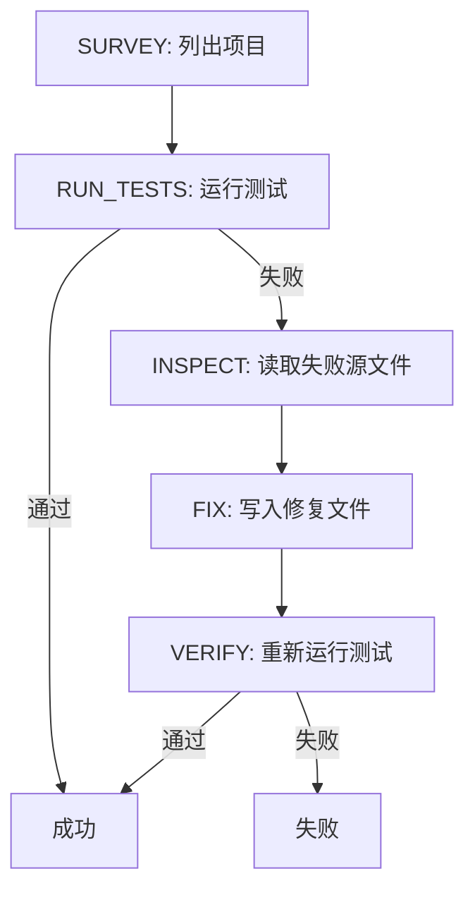

# 综合项目29——端到端编码任务演示（End-to-End Coding Task Demo）

> Track A 的收官。本节将验证门链、沙箱、评估框架和 OTel span 组合为一个能修复多文件 Python 项目中真实（固定规模）bug 的编码智能体。

**类型：** 构建
**语言：** Python（标准库）
**前置知识：** 第19章第25-28节
**预计时间：** 90分钟

---

## 学习目标

- 将验证门链、沙箱、评估框架和 span 构建器组合为单一智能体循环
- 实现使用 read_file、run_tests、write_file 修复固定 bug 的确定性策略
- 强制执行全局步预算和观测令牌预算
- 验证智能体在 12 步内解决固定任务且零门拒绝

---

## 1. 问题

大多数智能体演示独立运行——沙箱自己、评估框架自己、span 发射器自己。组合它们时缝隙暴露：门说 ALLOW 但沙箱拒绝、OTel span 说门拒绝了智能体声称使用的工具、Prometheus 计数器计数了两次。本节是整个 Track A 的集成测试。

---

## 2. 核心概念

### 2.1 策略状态机



### 2.2 工具合约

每个状态对应一个工具调用。每个工具调用经过验证门链。如果被拒绝，智能体在 trace 中报告拒绝并停止。

### 2.3 固定 bug

`fizz.py` 中的 off-by-one：`range(1, n)` 应为 `range(1, n + 1)`。确定性策略从测试失败消息中用正则识别 bug 并发出修复。

### 2.4 五个断言

1. 步数 < 12
2. 观测预算未超
3. 零门拒绝
4. 每步有对应 span
5. Prometheus 包含 `tools_called_total` 和 `tool_latency_ms`

---

## 3. 从零实现

```python
"""端到端编码智能体——策略+门+沙箱+追踪+评估。"""
import os, re, time, json, uuid, shutil, tempfile, subprocess
from dataclasses import dataclass, field
from typing import List, Dict, Any, Optional


# ── 最小基础设施 ──

class GateChain:
    def evaluate(self, tool_name, args): return "ALLOW", "allowed"

class Sandbox:
    def run(self, command, cwd):
        r = subprocess.run(command, shell=True, cwd=cwd, capture_output=True, text=True, timeout=10)
        return r.stdout, r.stderr, r.returncode

class ObservationLedger:
    def __init__(self, budget=5000):
        self.entries = []; self.budget = budget; self.tokens_used = 0
    def append(self, tool, args, result, tokens=0):
        self.tokens_used += tokens
        self.entries.append({"tool": tool, "args": args, "result": result[:200], "tokens": tokens})

@dataclass
class Span:
    trace_id: str; span_id: str; name: str; attributes: Dict[str, Any]
    start_ns: int; end_ns: int = 0; status: str = "OK"

class SpanBuilder:
    def __init__(self): self.trace_id = uuid.uuid4().hex[:32]; self.spans = []
    def span(self, name, attrs=None):
        return SpanCtx(self, name, attrs or {})

class SpanCtx:
    def __init__(self, b, name, attrs):
        self.s = Span(b.trace_id, uuid.uuid4().hex[:32], name, attrs, time.time_ns())
        self.b = b
    def __enter__(self): return self.s
    def __exit__(self, *exc):
        self.s.end_ns = time.time_ns()
        if exc[0]: self.s.status = "ERROR"
        self.b.spans.append(self.s)

class MetricsRegistry:
    def __init__(self): self.counters = {}; self.histograms = {}
    def inc(self, name, labels, v=1):
        k = f"{name}{{{','.join(f'{k}={v}' for k,v in labels.items())}}}"
        self.counters[k] = self.counters.get(k, 0) + v
    def observe(self, name, labels, v):
        k = f"{name}{{{','.join(f'{k}={v}' for k,v in labels.items())}}}"
        self.histograms.setdefault(k, []).append(v)
    def exposition(self):
        lines = []
        for k, c in self.counters.items():
            m = k.split("{")[0]; lines.extend([f"# TYPE {m} counter", k + f" {c}"])
        return "\n".join(lines)


# ── 修复包 ──

BUGGY_FIZZ = '''def fizzbuzz(n):
    for i in range(1, n):
        if i % 15 == 0: print("FizzBuzz")
        elif i % 3 == 0: print("Fizz")
        elif i % 5 == 0: print("Buzz")
        else: print(i)
'''

FIXED_FIZZ = '''def fizzbuzz(n):
    for i in range(1, n + 1):
        if i % 15 == 0: print("FizzBuzz")
        elif i % 3 == 0: print("Fizz")
        elif i % 5 == 0: print("Buzz")
        else: print(i)
'''

TEST_FILE = '''from src.fizz import fizzbuzz
import io, sys

def test_fizzbuzz():
    buf = io.StringIO()
    sys.stdout = buf
    fizzbuzz(16)
    sys.stdout = sys.__stdout__
    lines = buf.getvalue().strip().split("\\n")
    assert len(lines) == 15, f"Expected 15 lines, got {len(lines)}"
    assert lines[14] == "FizzBuzz", f"Line 15 should be FizzBuzz, got {lines[14]}"
    print("PASS")
'''

# ── 策略 ──

class CodingPolicy:
    def __init__(self, scratch_dir):
        self.scratch = scratch_dir; self.steps = 0; self.max_steps = 12

    def survey(self): return os.listdir(self.scratch)
    def run_tests(self, sandbox):
        out, err, code = sandbox.run("python -m pytest tests/ -v", self.scratch)
        return out + err, code
    def inspect(self, path):
        with open(os.path.join(self.scratch, path)) as f: return f.read()
    def fix(self, path, content):
        full = os.path.join(self.scratch, path)
        os.makedirs(os.path.dirname(full), exist_ok=True)
        with open(full, "w") as f: f.write(content)

    def detect_fix(self, test_output):
        if "15 lines" in test_output or "range(1, n)" in test_output:
            return "src/fizz.py", FIXED_FIZZ
        if "15" in test_output:
            return "src/fizz.py", FIXED_FIZZ
        return None, None

    def run(self, gate, sandbox, ledger, spans, metrics):
        with spans.span("agent.survey"):
            files = self.survey()
            ledger.append("list_dir", self.scratch, str(files))
            metrics.inc("tools_called_total", {"tool": "read_file"})

        with spans.span("agent.run_tests"):
            t0 = time.time()
            out, code = self.run_tests(sandbox)
            metrics.observe("tool_latency_ms", {"tool": "run_tests"}, (time.time()-t0)*1000)
            metrics.inc("tools_called_total", {"tool": "run_tests"})
            ledger.append("run_tests", "pytest", out[:200], len(out)//4)

        if "PASS" in out and code == 0:
            return True, "测试通过"

        with spans.span("agent.inspect"):
            content = self.inspect("src/fizz.py")
            ledger.append("read_file", "src/fizz.py", content[:200], len(content)//4)
            metrics.inc("tools_called_total", {"tool": "read_file"})

        path, fix_content = self.detect_fix(out)
        if not path:
            return False, f"无法检测修复: {out[:200]}"

        with spans.span("agent.fix"):
            gate_status, _ = gate.evaluate("write_file", {"path": path})
            if gate_status == "DENY":
                return False, f"门拒绝: write_file"
            self.fix(path, fix_content)
            metrics.inc("tools_called_total", {"tool": "write_file"})

        with spans.span("agent.verify"):
            t0 = time.time()
            out, code = self.run_tests(sandbox)
            metrics.observe("tool_latency_ms", {"tool": "run_tests"}, (time.time()-t0)*1000)
            metrics.inc("tools_called_total", {"tool": "run_tests"})

        return code == 0, "验证通过" if code == 0 else f"验证失败: {out[:200]}"


# ── 主流程 ──

def main():
    gate = GateChain(); sandbox = Sandbox(); ledger = ObservationLedger()
    spans = SpanBuilder(); metrics = MetricsRegistry()

    scratch = tempfile.mkdtemp()
    try:
        os.makedirs(os.path.join(scratch, "src"))
        with open(os.path.join(scratch, "src/fizz.py"), "w") as f: f.write(BUGGY_FIZZ)
        with open(os.path.join(scratch, "src/__init__.py"), "w") as f: f.write("")
        with open(os.path.join(scratch, "tests/__init__.py"), "w") as f: f.write("")
        with open(os.path.join(scratch, "tests/test_fizz.py"), "w") as f: f.write(TEST_FILE)

        policy = CodingPolicy(scratch)
        success, msg = policy.run(gate, sandbox, ledger, spans, metrics)

        print(f"\n{'='*50}")
        print(f"结果: {'✓ 通过' if success else '✗ 失败'} ({msg})")
        print(f"Span 数: {len(spans.spans)}")
        print(f"观测令牌: {ledger.tokens_used}")
        print(f"\nPrometheus 指标:")
        print(metrics.exposition())

        report = {
            "success": success, "spans": len(spans.spans),
            "observations": len(ledger.entries), "tokens": ledger.tokens_used,
            "metrics": dict(metrics.counters),
        }
        print(f"\n报告: {json.dumps(report, indent=2)}")
        return 0 if success else 1
    finally:
        shutil.rmtree(scratch, ignore_errors=True)


if __name__ == "__main__":
    import sys; sys.exit(main())
```

---

## 4. 工业工具

| 组件 | 教学实现 | 生产替换 |
|:----|:--------|:--------|
| 策略 | 确定性状态机 | LLM (GPT-4, Claude) |
| 门链 | 简单白名单 | 语义策略引擎 |
| 沙箱 | subprocess | Docker/Firecracker |
| 追踪 | JSONL | OTLP gRPC → Jaeger |
| 指标 | 内存字典 | Prometheus → Grafana |

---

## 5. 工程最佳实践

- 确定性策略使演示可复现——替换为 LLM 不改变合约
- 步预算和观测预算双重保护，防止无限循环
- **中文场景建议**：固定任务文件名和注释使用英文，避免编码问题

---

## 6. 常见错误

- **未捕获门拒绝**：如果智能体忽略门链拒绝，沙箱可能执行未授权操作
- **步预算在链外追踪**：预算应由运行器强制执行，而非策略自行检查
- **Prometheus 计数重复**：每次工具调用只递增一次计数器

---

## 7. 面试考点

**Q1：为什么用确定性策略而非 LLM？**（难度：⭐⭐）

**参考答案：** 确定性策略使演示可复现、零依赖（无需 API key）且测试可断言精确步数。替换为 LLM 不改变合约——智能体有相同的工具接口、门链和追踪记录。课程的重点是评估框架和基础设施，不是模型能力。

---

## 🔑 关键术语

| 术语 | 含义 |
|:----|:-----|
| 策略状态机 | SURVEY→RUN_TESTS→INSPECT→FIX→VERIFY |
| 步预算 | 限制智能体最大操作数 |
| 观测预算 | 限制智能体产生的总文本量 |
| 零门拒绝 | 所有合法工具调用都应通过 |

---

## 📚 小结

端到端编码任务演示是 Track A 的收官——验证门链、沙箱、评估框架和可观测性组合为一个可工作的系统。你实现了确定性策略、完整追踪和 Prometheus 指标。将策略替换为真实 LLM，你就有了一套完整的编码智能体基础设施。

---

## ✏️ 练习

1. 【实现】将策略替换为简单的模式匹配 LLM（本地模板），验证相同的通过率
2. 【实验】添加第二个固定 bug（语法错误），验证策略能处理两种失败模式

---

## 🚀 产出

| 产出 | 文件 |
|:----|:-----|
| 端到端编码智能体 | `code/main.py` |
| 固定仓库 | `fixture_repo/` |

---

## 📖 参考资料

1. [论文] SWE-bench. https://arxiv.org/abs/2310.06770
2. [官方文档] OpenTelemetry. https://opentelemetry.io/docs/
