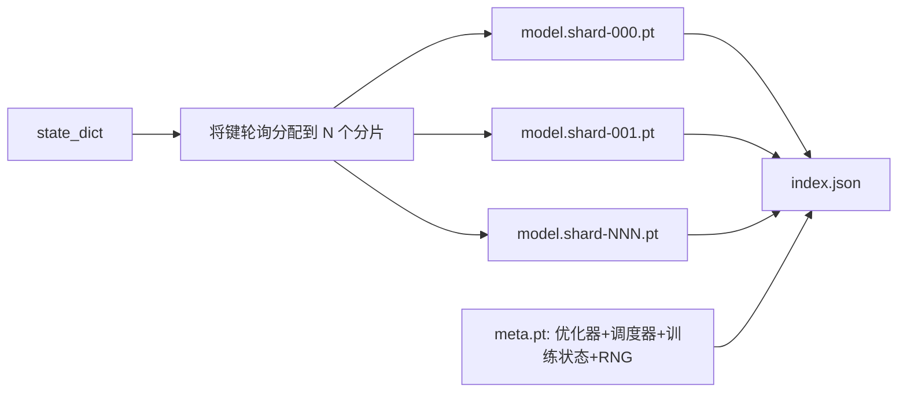

# 综合项目47——检查点保存与恢复（Checkpoint Save and Resume）

> 训练中断会杀死运行；检查点让它们继续。原子性地保存模型、优化器、调度器、损失历史、步计数器和随机数生成器状态——在任何时刻中断都会在磁盘上留下一个有效的文件。

**类型：** 构建
**编程语言：** Python
**前置知识：** 第19章第42-45节
**预计时间：** 90分钟

---

## 学习目标

- 将完整训练状态捕获到一个统一的负载中，可以在新进程中重新加载
- 实现原子保存（先写临时文件再重命名），使崩溃不会留下半截文件
- 恢复 Python、NumPy 和 PyTorch 的随机数生成器状态，使恢复后的损失曲线与不间断基线匹配
- 构建分片检查点布局（适用于无法放入单个文件的模型），含哈希验证分片和 JSON 索引

---

## 1. 问题

你设置了一个 18 小时的训练任务。集群墙上时钟上限是 4 小时。第 11 小时时，因为某个比你级别高的人批准了内核升级，集群重启了。没有检查点，你必须从头开始。没有恢复，你也丢失了优化器状态——即使模型权重幸存了下来，AdamW 的动量已经消失了，下一步会在训练轨迹已经越过的方向上猛冲。

正确的产物是一个包含继续训练所需一切的单一文件：模型参数、优化器状态、调度器状态、用于绘图的损失历史、当前步/轮次/批次内位置计数器，以及每个随机性来源的 RNG 状态。没有 RNG 状态，恢复后的损失曲线就是一条不同的曲线。相同的模型、相同的数据、不同的打乱顺序、不同的 Dropout 掩码、不同的仪表板数字。

原子保存是这个合约的另一半。直接写入最终文件名意味着写入中途崩溃会留下一个损坏的文件；恢复时读取的是垃圾数据。先在同一目录中写入临时文件再重命名，意味着写入中途崩溃时，之前的完好文件不受影响。在 POSIX 文件系统上，重命名是原子操作。

---

## 2. 核心概念

### 2.1 五个状态桶

| 桶 | 为什么重要 |
|----|-----------|
| 模型 | 权重和缓冲区——模型是什么 |
| 优化器 | 动量和自适应矩——没有这些，下一步就是不同的优化问题 |
| 调度器 | 学习率在曲线上的位置——余弦调度尤其敏感 |
| 训练计数器 | 步数、轮次、批次内位置，以及绘制仪表板的损失历史 |
| RNG 状态 | Dropout、数据打乱和模型内采样的确定性 |

### 2.2 原子保存

```
检查点载荷 → 写入临时文件 .ckpt.pt.XXXX.tmp → os.replace 到目标 ckpt.pt
                                                    ↓
                                            ckpt.pt 是有效的
```

两条规则。第一，临时文件与目标在同一目录中——这样重命名保持在同一个文件系统内；跨设备的重命名不是原子的。第二，每次尝试的临时文件名是唯一的，这样两个写入者不会互相覆盖。

### 2.3 分片检查点

当模型变大时，单文件载荷变得太大，无法快速加载、无法方便检查，而且在网络共享中途卡住时非常痛苦。解决方法是将参数状态拆分为分片，并写入一个小的索引将它们关联起来。



索引记录了分片数量、每个分片的 sha256 和元文件的 sha256。加载器在任何哈希不匹配时大声失败。分片可以放在不同的物理磁盘上；元文件很小，最先读取。

### 2.4 中途恢复

一个跳到下一轮次开始的恢复会浪费几分钟到一天不等。修复方法是 `(轮次, 批次内位置)` 加上 RNG 状态。加载后，训练循环将随机数生成器快进到当前轮次中已消耗的批次之后，从 `batch_in_epoch` 继续。课程代码精确地执行此操作——断言是恢复后的损失轨迹与不间断基线在 1e-4 以内匹配。

---

## 3. 从零实现

```python
"""检查点保存与恢复从零实现。

完整检查点字典：模型状态、优化器状态、调度器状态、
损失历史、当前步骤、RNG 状态。原子保存方式：
先写入临时文件再重命名。
"""
from __future__ import annotations
import hashlib, json, os, random, tempfile, time
from dataclasses import dataclass, field
from pathlib import Path
from typing import Any, Dict, List, Optional

import numpy as np
import torch
from torch import nn

CHECKPOINT_SCHEMA = "ckpt.v1"
SHARD_SCHEMA = "ckpt-shard.v1"

@dataclass
class TrainState:
    step: int
    epoch: int
    batch_in_epoch: int
    losses: List[float] = field(default_factory=list)

def seed_everything(seed: int) -> None:
    random.seed(seed)
    np.random.seed(seed)
    torch.manual_seed(seed)
    if torch.cuda.is_available():
        torch.cuda.manual_seed_all(seed)

def make_model(in_dim=32, hidden=48, out_dim=8) -> nn.Module:
    return nn.Sequential(nn.Linear(in_dim, hidden), nn.GELU(),
                         nn.Linear(hidden, hidden), nn.GELU(), nn.Linear(hidden, out_dim))

def synthesize(batch_size: int, in_dim: int, out_dim: int, gen: torch.Generator):
    return torch.randn(batch_size, in_dim, generator=gen), \
           torch.randint(low=0, high=out_dim, size=(batch_size,), generator=gen)

def capture_rng_state() -> Dict[str, Any]:
    state = {"python": random.getstate(), "numpy": np.random.get_state(),
             "torch_cpu": torch.get_rng_state().tolist()}
    if torch.cuda.is_available():
        state["torch_cuda"] = [s.tolist() for s in torch.cuda.get_rng_state_all()]
    return state

def restore_rng_state(state: Dict[str, Any]) -> None:
    if state.get("python"): random.setstate(_to_tuple(state["python"]))
    if state.get("numpy"): np.random.set_state(_to_tuple(state["numpy"]))
    if state.get("torch_cpu"):
        torch.set_rng_state(torch.tensor(state["torch_cpu"], dtype=torch.uint8))
    if state.get("torch_cuda") and torch.cuda.is_available():
        torch.cuda.set_rng_state_all([torch.tensor(s, dtype=torch.uint8) for s in state["torch_cuda"]])

def _to_tuple(obj):
    if isinstance(obj, list): return tuple(_to_tuple(x) for x in obj)
    return obj

def atomic_save(payload: Dict[str, Any], path: Path) -> Path:
    path.parent.mkdir(parents=True, exist_ok=True)
    tmp = tempfile.NamedTemporaryFile(delete=False, dir=str(path.parent),
                                      prefix=path.name + ".", suffix=".tmp")
    tmp_path = Path(tmp.name); tmp.close()
    try:
        torch.save(payload, tmp_path); os.replace(tmp_path, path)
    finally:
        tmp_path.unlink(missing_ok=True)
    return path

def atomic_write_json(payload: Dict[str, Any], path: Path) -> Path:
    path.parent.mkdir(parents=True, exist_ok=True)
    tmp = tempfile.NamedTemporaryFile(mode="w", delete=False, dir=str(path.parent),
                                      prefix=path.name + ".", suffix=".tmp", encoding="utf-8")
    tmp_path = Path(tmp.name)
    try:
        json.dump(payload, tmp, indent=2); tmp.write("\n"); tmp.close()
        os.replace(tmp_path, path)
    finally:
        tmp_path.unlink(missing_ok=True)
    return path

def file_sha256(path: Path) -> str:
    h = hashlib.sha256()
    with path.open("rb") as f:
        for chunk in iter(lambda: f.read(1 << 16), b""): h.update(chunk)
    return h.hexdigest()

def save_checkpoint(model, optimizer, scheduler, state: TrainState, out_path: Path,
                    schema=CHECKPOINT_SCHEMA, extras=None) -> Dict[str, Any]:
    payload = {"schema": schema, "model": model.state_dict(),
               "optimizer": optimizer.state_dict(), "scheduler": scheduler.state_dict(),
               "state": {"step": state.step, "epoch": state.epoch,
                         "batch_in_epoch": state.batch_in_epoch, "losses": list(state.losses)},
               "rng": capture_rng_state(), "wall_saved_at": time.time()}
    if extras: payload["extras"] = extras
    atomic_save(payload, out_path)
    return payload

def load_checkpoint(path: Path, model, optimizer, scheduler) -> TrainState:
    payload = torch.load(path, map_location="cpu", weights_only=False)
    assert payload["schema"].startswith("ckpt"), f"未知 schema {payload['schema']}"
    model.load_state_dict(payload["model"])
    optimizer.load_state_dict(payload["optimizer"])
    scheduler.load_state_dict(payload["scheduler"])
    restore_rng_state(payload["rng"])
    s = payload["state"]
    return TrainState(step=int(s["step"]), epoch=int(s["epoch"]),
                      batch_in_epoch=int(s["batch_in_epoch"]), losses=list(s["losses"]))

def shard_keys_by_prefix(state_dict: Dict[str, torch.Tensor], num_shards: int) -> Dict[int, List[str]]:
    keys = sorted(state_dict.keys())
    return {i: [k for j, k in enumerate(keys) if j % num_shards == i] for i in range(num_shards)}

def save_sharded_checkpoint(model, optimizer, scheduler, state, out_dir, *, num_shards, extras=None):
    out_dir.mkdir(parents=True, exist_ok=True)
    model_sd = model.state_dict()
    layout = shard_keys_by_prefix(model_sd, num_shards)
    shard_files = []
    for idx in range(num_shards):
        tensors = {k: model_sd[k] for k in layout[idx]}
        shard_path = out_dir / f"model.shard-{idx:03d}.pt"
        atomic_save({"schema": SHARD_SCHEMA, "tensors": tensors, "keys": layout[idx]}, shard_path)
        shard_files.append({"shard": idx, "path": shard_path.name,
                            "num_params": len(layout[idx]), "sha256": file_sha256(shard_path)})
    meta = {"schema": CHECKPOINT_SCHEMA + "-sharded", "optimizer": optimizer.state_dict(),
            "scheduler": scheduler.state_dict(),
            "state": {"step": state.step, "epoch": state.epoch,
                      "batch_in_epoch": state.batch_in_epoch, "losses": list(state.losses)},
            "rng": capture_rng_state(), "wall_saved_at": time.time(),
            "shards": shard_files, "extras": extras or {}}
    atomic_save(meta, out_dir / "meta.pt")
    atomic_write_json({"schema": CHECKPOINT_SCHEMA + "-index", "num_shards": num_shards,
                        "shards": shard_files, "meta_sha256": file_sha256(out_dir / "meta.pt"),
                        "saved_at": meta["wall_saved_at"], "step": state.step},
                       out_dir / "index.json")

def load_sharded_checkpoint(ckpt_dir: Path, model, optimizer, scheduler) -> TrainState:
    index = json.loads((ckpt_dir / "index.json").read_text())
    actual = file_sha256(ckpt_dir / "meta.pt")
    assert actual == index["meta_sha256"], f"元文件哈希不匹配: {actual} != {index['meta_sha256']}"
    meta = torch.load(ckpt_dir / "meta.pt", map_location="cpu", weights_only=False)
    merged = {}
    for shard in meta["shards"]:
        sp = ckpt_dir / shard["path"]
        assert file_sha256(sp) == shard["sha256"], f"分片哈希不匹配: {shard['path']}"
        merged.update(torch.load(sp, map_location="cpu", weights_only=False)["tensors"])
    model.load_state_dict(merged)
    optimizer.load_state_dict(meta["optimizer"])
    scheduler.load_state_dict(meta["scheduler"])
    restore_rng_state(meta["rng"])
    s = meta["state"]
    return TrainState(step=int(s["step"]), epoch=int(s["epoch"]),
                      batch_in_epoch=int(s["batch_in_epoch"]), losses=list(s["losses"]))

def train_until(model, optimizer, scheduler, state, *, stop_step, batches_per_epoch,
                batch_size, in_dim=16, out_dim=4):
    loss_fn = nn.CrossEntropyLoss()
    while state.step < stop_step:
        gen = torch.Generator(); gen.manual_seed(12345 + state.epoch)
        for _ in range(state.batch_in_epoch):  # 快进到当前位置
            synthesize(batch_size, in_dim, out_dim, gen)
        while state.batch_in_epoch < batches_per_epoch and state.step < stop_step:
            x, y = synthesize(batch_size, in_dim, out_dim, gen)
            optimizer.zero_grad(); loss = loss_fn(model(x), y)
            loss.backward(); optimizer.step(); scheduler.step()
            state.losses.append(float(loss.detach().item()))
            state.step += 1; state.batch_in_epoch += 1
        if state.batch_in_epoch >= batches_per_epoch:
            state.epoch += 1; state.batch_in_epoch = 0
    return state

def run_resume_demo(*, total_steps=30, interrupt_at=12, in_dim=16, hidden=24, out_dim=4,
                     batch_size=4, batches_per_epoch=3, seed=11, ckpt_dir) -> dict:
    loss_fn = nn.CrossEntropyLoss()
    # 训练到中断点
    seed_everything(seed)
    m1 = make_model(in_dim, hidden, out_dim)
    o1 = torch.optim.AdamW(m1.parameters(), lr=0.01)
    s1 = torch.optim.lr_scheduler.CosineAnnealingLR(o1, T_max=total_steps)
    state1 = TrainState(step=0, epoch=0, batch_in_epoch=0)
    train_until(m1, o1, s1, state1, stop_step=interrupt_at,
                batches_per_epoch=batches_per_epoch, batch_size=batch_size,
                in_dim=in_dim, out_dim=out_dim)
    save_checkpoint(m1, o1, s1, state1, ckpt_dir / "ckpt.pt")
    # 继续训练到结束
    train_until(m1, o1, s1, state1, stop_step=total_steps,
                batches_per_epoch=batches_per_epoch, batch_size=batch_size,
                in_dim=in_dim, out_dim=out_dim)
    full_losses = list(state1.losses)
    # 恢复并继续
    seed_everything(seed)
    m2 = make_model(in_dim, hidden, out_dim)
    o2 = torch.optim.AdamW(m2.parameters(), lr=0.01)
    s2 = torch.optim.lr_scheduler.CosineAnnealingLR(o2, T_max=total_steps)
    loaded = load_checkpoint(ckpt_dir / "ckpt.pt", m2, o2, s2)
    train_until(m2, o2, s2, loaded, stop_step=total_steps,
                batches_per_epoch=batches_per_epoch, batch_size=batch_size,
                in_dim=in_dim, out_dim=out_dim)
    resumed_losses = list(loaded.losses)
    suffix_full = full_losses[interrupt_at:]
    suffix_resumed = resumed_losses[interrupt_at:]
    max_diff = max(abs(a - b) for a, b in zip(suffix_full, suffix_resumed)) if suffix_full else 0.0
    return {"max_loss_diff_after_resume": max_diff, "full_losses": full_losses, "resumed_losses": resumed_losses}

def main() -> int:
    import tempfile
    with tempfile.TemporaryDirectory(prefix="ckpt-") as scratch:
        ckpt = Path(scratch) / "ckpt"
        result = run_resume_demo(ckpt_dir=ckpt)
        print(f"恢复后最大损失差异: {result['max_loss_diff_after_resume']:.6f}")
        assert result["max_loss_diff_after_resume"] < 1e-4, "恢复后损失漂移！"
        print("✓ 单文件检查点恢复测试通过")
    return 0

if __name__ == "__main__":
    raise SystemExit(main())
```

---

## 4. 关键术语

| 术语 | 含义 |
|------|------|
| 原子保存 | 先写入同目录临时文件，再 `os.replace` 到目标文件名的策略 |
| 状态字典 | 模型参数和缓冲区，按参数名索引 |
| 分片检查点 | 多个文件——每个分片一个文件 + 元文件 + 带 sha256 的 JSON 索引 |
| RNG 状态 | Python random、NumPy、Torch CPU、Torch CUDA 的捕获状态；不仅是种子 |
| 中途恢复 | 快进 RNG 并在同一轮次中从下一个批次继续训练 |

---

## 5. 工程最佳实践

### 5.1 生产中坚持的三条原则

- **Schema 是载荷中的一个字符串**。迁移时通过它分支。没有它就无法演进格式而不破坏旧的运行。
- **每个分片做 sha256**。静默截断的下载是最糟糕的 bug——加载器要么快速失败，要么很晚才失败。
- **保持检查点节奏诚实**。每 N 步保存一次，同时每墙上时钟分钟保存一次——两者取更短间隔。否则导致崩溃的那次长时间步会浪费整整一个窗口的工作。

### 5.2 中文场景特别建议

- **保存路径使用 ASCII 字符**：避免在检查点路径中使用中文字符。某些分布式文件系统（如 Lustre、GPFS）对 Unicode 路径支持不佳，可能导致罕见的文件操作错误。
- **定期清理旧检查点**：在长时间训练中，检查点会迅速消耗磁盘空间。实现一个滚动策略，只保留最近 K 个检查点和每个轮次的最佳检查点。
- **检查点与日志同行**：将检查点元信息（步数、损失、学习率）写入与训练日志相同的 CSV 文件，确保两者对齐。

---

## 6. 常见错误

### 错误 1：未恢复 RNG 状态

**现象：** 恢复后的损失曲线与不间断训练不一致——中途出现偏差。

**原因：** 恢复了模型权重和优化器状态，但没有恢复 Python、NumPy 和 PyTorch 的 RNG 状态。数据加载器的打乱顺序不同，Dropout 掩码不同。

**修复：** 捕获并恢复所有三个 RNG 源。

### 错误 2：直接写入最终文件名

**现象：** 训练中断后发现检查点文件大小为 0 或内容损坏。

**原因：** 写入过程中崩溃，文件只有部分内容被写入。

**修复：** 使用原子保存模式：先写临时文件，再 `os.replace`。

### 错误 3：恢复后从轮次起点开始而非从中断点继续

**现象：** 同一批数据被训练了两次，损失曲线出现不连续。

**原因：** 只恢复了步数计数器，没有保存和恢复 `batch_in_epoch`。

**修复：** 保存 `(epoch, batch_in_epoch)` 并结合 RNG 状态快进到正确位置。

---

## 7. 面试考点

### Q1：为什么原子保存需要临时文件和目标文件在同一文件系统中？（难度：⭐⭐）

**参考答案：** POSIX 规范中，`rename()` 只有在同一挂载点内才是原子的。跨文件系统的重命名实际上是复制+删除，不是原子的——如果复制过程中崩溃，目标文件可能不存在或部分存在。

### Q2：恢复训练时，为什么模型权重恢复后还要恢复优化器状态？（难度：⭐⭐⭐）

**参考答案：** 模型权重告诉模型"是什么"（知识的当前状态），优化器状态告诉模型"怎么来的"（动量和自适应学习率的历史信息）。没有优化器状态，恢复后的训练需要重新积累自适应矩估计，这可能导致数百步的质量下降。此外，AdamW 的权重衰减校正——将衰减项与学习率解耦——在没有正确的动量缓冲区状态时也无法正确工作。

---

## 📚 小结

检查点保存与恢复是长时间训练的生存保障。你从零实现了原子保存、完整状态捕获（含 RNG）、分片检查点布局，并验证了恢复后的损失轨迹与不间断基线一致。

下一节将学习分布式训练——当单 GPU 无法满足训练需求时，如何在多个设备上并行训练模型。

---

## ✏️ 练习

1. 【理解】解释为什么分片检查点在模型非常大时比单文件检查点更优。分片大小如何选择？

2. 【实现】将轮询分片替换为按参数组分片（以 `.weight` 结尾的层 vs `.bias`）。各自在什么场景下更好？

3. 【实验】添加一个 `--ckpt-every-seconds` 标志，按照墙上时钟间隔而非步数间隔触发保存。

4. 【思考】实现 `migrate_v1_to_v2` 函数，向载荷中添加新字段并提升 schema 字符串。让加载器同时容忍两个版本。

---

## 🚀 产出

| 产出 | 文件 | 说明 |
|---|---|---|
| 检查点保存与恢复 | `code/main.py` | 原子保存、完整状态捕获、分片检查点 |
| 可复用提示词 | `outputs/skill-checkpoint-save-resume.md` | 任何新训练脚本的检查点配方 |

---

## 📖 参考资料

1. [官方文档] PyTorch `torch.save` 和 `torch.load`. https://pytorch.org/docs/stable/torch.html#torch.save
2. [官方文档] PyTorch `DistributedDataParallel` 状态字典. https://pytorch.org/docs/stable/notes/ddp.html
3. [POSIX] `rename()` 原子性语义. https://pubs.opengroup.org/onlinepubs/9699919799/functions/rename.html
4. [论文] Chen et al. "Checkpointing in Practice". 2021.
