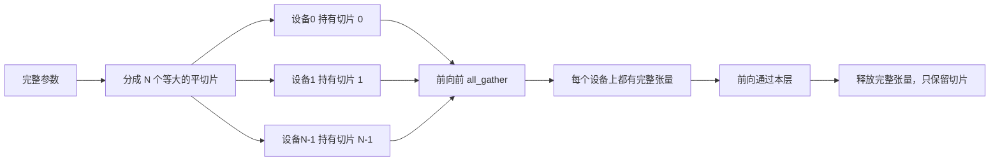

# 综合项目48——分布式训练 DDP 与 FSDP（Distributed Data Parallel & FSDP）

> 多设备训练是两个集体通信操作和一条规则。启动时广播参数，反向传播后对梯度取平均，绝不让各设备对当前步数产生分歧。

**类型：** 构建
**编程语言：** Python
**前置知识：** 第19章第42-45节
**预计时间：** 90分钟

---

## 学习目标

- 使用 `gloo` 后端在 N 个设备上启动进程组，无需特殊硬件
- 实现一个极简的 DDP 封装——构建时广播参数，反向传播后全规约梯度
- 证明跨设备的全规约梯度与单进程在拼接输入上的梯度一致
- 勾勒 FSDP 参数分片——每个设备持有参数的一个切片，前向传播时全收集完整张量，使用后释放

---

## 1. 问题

模型能放进一个设备。数据集不能。优化预算要求你在相同的墙上时间内看到 N 倍的样本。第一个杠杆是数据并行：每个设备在批次的不同切片上运行相同的模型，然后在优化器步骤前对梯度取平均。第二个杠杆是 FSDP：模型连在一个设备上也放不下了，所以每个设备持有每个参数的一个片段，在前向传播过程中逐层重建完整的张量。

痛点在于簿记。如果参数在各个设备之间漂移，训练是静默损坏的。如果你对梯度取平均但没有对损失取平均，仪表板会撒谎。如果集体通信后端无法就拓扑达成一致，训练会永远挂起。解决方法是一次手写集体通信，并且永远不要信任一个你无法复现的封装。

本节课在 CPU 上运行。不假设 CUDA。`gloo` 后端随每个 PyTorch 构建一起发布，并接受 `torch.multiprocessing` 工作进程；相同的代码切换到 `nccl` 后端后，在多 GPU 节点上无需更改结构。

---

## 2. 核心概念

### 2.1 两个关键的集体通信操作

| 操作 | 作用 | 时机 |
|------|------|------|
| `broadcast` | 将张量从一个设备复制到所有其他设备 | 参数初始化、调度器状态、任何一对多的同步 |
| `all_reduce` | 跨所有设备对张量求和（或取平均/最大值），每个设备都得到结果 | 反向传播后的梯度平均 |
| `all_gather` | 每个设备贡献一个张量，每个设备都得到拼接结果 | logits 收集、FSDP 参数反分片 |

DDP 的合约是：构建时 `broadcast`，反向传播后 `all_reduce`。FSDP 的草图在每层前向传播前增加 `all_gather`。

### 2.2 梯度平均匹配单进程梯度

在一个跨 N 个设备的 B 样本批次上训练的模型，必须产生与单进程在 N×B 样本批次上训练相同的梯度。关键在于：将各设备梯度求和并除以 N 得到平均损失梯度——这与交叉熵以 `mean` 规约在全批次上产生的结果一致。课程代码在 `max-abs-diff < 1e-3` 下断言了手动全规约梯度与参考单进程梯度之间的等价性。

### 2.3 FSDP 草图



内存收益是确切的：每个设备的参数内存降至 1/N。代价是每层前向传播都需要一次 all_gather。生产级 FSDP 将 all_gather 与前一层的计算重叠，因此墙上时间成本远小于朴素的估算。课程在每个参数上都做了往返测试，断言重建结果与原始数据按位相同。

### 2.4 CPU 与 gloo 后端

CUDA 是生产目标，但相同的代码路径在 CPU 上存在。`gloo` 是 CPU 集体通信后端。它在 GPU 上比 `nccl` 慢几个数量级，但 API 表面完全相同。课程的进程组以 `backend="gloo"` 初始化，设备使用 `torch.multiprocessing` 而非 `torchrun` 启动；最终都落在相同的 `torch.distributed` 调用上。在多 GPU 节点上，唯一的变化是 `backend="nccl"`、设备张量和 `torchrun` 启动方式。

---

## 3. 从零实现

```python
"""分布式数据并行从零实现（gloo 后端）。

不假设 CUDA。使用 torch.multiprocessing 生成多个工作进程，
通过 gloo CPU 后端连接。
"""
from __future__ import annotations
import json, os, sys, time
from dataclasses import dataclass
from pathlib import Path
from typing import Dict, List

import torch
import torch.distributed as dist
import torch.multiprocessing as mp
from torch import nn

OUT_DIR = Path(__file__).parent.parent / "outputs"
DEMO_PATH = OUT_DIR / "ddp-demo.json"

@dataclass
class RankResult:
    rank: int; world_size: int; backend: str
    final_loss: float; pre_param_sum: float; post_param_sum: float
    grad_norm_after_all_reduce: float; fsdp_round_trip_ok: bool

def init_process_group(rank: int, world_size: int, backend: str, master_port: int) -> None:
    os.environ["MASTER_ADDR"] = "127.0.0.1"
    os.environ["MASTER_PORT"] = str(master_port)
    ifname = "lo0" if sys.platform == "darwin" else "lo"
    os.environ.setdefault("GLOO_SOCKET_IFNAME", ifname)
    dist.init_process_group(backend=backend, rank=rank, world_size=world_size)

def make_model(in_dim=32, hidden=16, out_dim=4) -> nn.Module:
    return nn.Sequential(nn.Linear(in_dim, hidden), nn.GELU(), nn.Linear(hidden, out_dim))

def broadcast_module(module: nn.Module, src=0) -> None:
    for tensor in list(module.parameters()) + list(module.buffers()):
        dist.broadcast(tensor.data, src=src)

def all_reduce_grads_(module: nn.Module, world_size: int) -> float:
    total_sq = 0.0
    for p in module.parameters():
        if p.grad is None:
            p.grad = torch.zeros_like(p.data)
        dist.all_reduce(p.grad.data, op=dist.ReduceOp.SUM)
        p.grad.data.div_(world_size)
        total_sq += float(p.grad.data.pow(2).sum().item())
    return total_sq ** 0.5

def shard_for_rank(x: torch.Tensor, rank: int, world_size: int) -> torch.Tensor:
    total, per = x.shape[0], x.shape[0] // world_size
    start, end = rank * per, (rank + 1) * per if rank < world_size - 1 else total
    return x[start:end]

class MinimalDDP(nn.Module):
    """玩具分布式数据并行封装。"""
    def __init__(self, module: nn.Module, world_size: int):
        super().__init__()
        self.module = module; self.world_size = world_size
        if dist.is_initialized() and world_size > 1:
            broadcast_module(self.module, src=0)
    def forward(self, *args, **kwargs):
        return self.module(*args, **kwargs)
    def sync_grads(self) -> float:
        if not dist.is_initialized() or self.world_size == 1:
            return _grad_norm(self.module)
        return all_reduce_grads_(self.module, self.world_size)

def _grad_norm(module: nn.Module) -> float:
    total_sq = sum(float(p.grad.data.pow(2).sum().item())
                   for p in module.parameters() if p.grad is not None)
    return total_sq ** 0.5

def fsdp_round_trip_sketch(module: nn.Module, world_size: int, rank: int) -> bool:
    """参数分片+收集往返测试。"""
    ok = True
    for p in module.parameters():
        full = p.data.detach().clone()
        flat = full.flatten(); total = flat.numel()
        per = (total + world_size - 1) // world_size
        padded = torch.cat([flat, torch.zeros(per * world_size - total, dtype=flat.dtype)])
        my_slice = padded[rank * per:(rank + 1) * per].clone()
        gathered = [torch.empty(per, dtype=flat.dtype) for _ in range(world_size)]
        dist.all_gather(gathered, my_slice)
        rebuilt = torch.cat(gathered)[:total].view_as(full)
        if not torch.allclose(rebuilt, full):
            ok = False; break
    return ok

def manual_all_reduce_matches_single_process(rank, world_size, in_dim, out_dim, batch_size):
    """每个设备在其切片上计算梯度；all-reduce-mean 恢复全批次梯度。"""
    torch.manual_seed(0)
    full_x = torch.randn(batch_size * world_size, in_dim)
    full_y = torch.randint(low=0, high=out_dim, size=(batch_size * world_size,))
    x, y = shard_for_rank(full_x, rank, world_size), shard_for_rank(full_y, rank, world_size)
    torch.manual_seed(7)
    model = make_model(in_dim, 16, out_dim); broadcast_module(model, src=0)
    loss_fn = nn.CrossEntropyLoss()
    for p in model.parameters(): p.grad = None
    loss_fn(model(x), y).backward()
    norm_after = all_reduce_grads_(model, world_size)
    if rank == 0:
        torch.manual_seed(7)
        ref = make_model(in_dim, 16, out_dim)
        for p in ref.parameters(): p.grad = None
        ref_loss = loss_fn(ref(full_x), full_y); ref_loss.backward()
        diffs = [float((a.grad.data - b.grad.data).abs().max().item())
                 for a, b in zip(model.parameters(), ref.parameters())]
        max_diff = max(diffs)
    else:
        max_diff = 0.0
    return norm_after, max_diff

def rank_main(rank, world_size, backend, port, result_queue, in_dim, hidden, out_dim,
              batch_size, num_steps, lr, seed):
    try:
        init_process_group(rank, world_size, backend, port)
        torch.manual_seed(seed + rank)
        grad_norm, max_diff = manual_all_reduce_matches_single_process(rank, world_size, in_dim, out_dim, batch_size)
        torch.manual_seed(seed)
        ddp = MinimalDDP(make_model(in_dim, hidden, out_dim), world_size)
        opt = torch.optim.SGD(ddp.parameters(), lr=lr)
        pre_sum = sum(float(p.data.sum().item()) for p in ddp.parameters())
        for step in range(num_steps):
            x = torch.randn(batch_size, in_dim)
            y = torch.randint(low=0, high=out_dim, size=(batch_size,))
            opt.zero_grad(); loss = nn.CrossEntropyLoss()(ddp(x), y)
            loss.backward(); ddp.sync_grads(); opt.step()
        fsdp_ok = fsdp_round_trip_sketch(ddp.module, world_size, rank)
        post_sum = sum(float(p.data.sum().item()) for p in ddp.parameters())
        result_queue.put((rank, RankResult(rank, world_size, backend, float(loss.detach().item()),
                                           pre_sum, post_sum, grad_norm, fsdp_ok), max_diff))
    except Exception as exc:
        result_queue.put((rank, {"error": str(exc)}, -1.0))
    finally:
        if dist.is_initialized(): dist.destroy_process_group()

def free_port() -> int:
    import socket
    s = socket.socket(socket.AF_INET, socket.SOCK_STREAM)
    s.bind(("127.0.0.1", 0)); port = s.getsockname()[1]; s.close()
    return port

def run_demo(world_size=2, *, backend="gloo", in_dim=32, hidden=16, out_dim=4,
             batch_size=8, num_steps=6, lr=0.05, seed=0, timeout=60.0) -> dict:
    ctx = mp.get_context("spawn"); q = ctx.Queue(); port = free_port()
    procs = [ctx.Process(target=rank_main, args=(r, world_size, backend, port, q,
                 in_dim, hidden, out_dim, batch_size, num_steps, lr, seed))
             for r in range(world_size)]
    for p in procs: p.start()
    results, max_diff, deadline = {}, 0.0, time.time() + timeout
    while len(results) < world_size and time.time() < deadline:
        try:
            rank, payload, diff = q.get(timeout=1.0)
            results[rank] = payload; max_diff = max(max_diff, diff)
        except: continue
    for p in procs: p.join(1.0)
    param_sums = {r: results[r].post_param_sum for r in results if not isinstance(results[r], dict)}
    spread = max(param_sums.values()) - min(param_sums.values()) if param_sums else 0.0
    return {"world_size": world_size, "backend": backend, "param_sum_spread": spread,
            "manual_all_reduce_max_diff": max_diff,
            "fsdp_round_trip_ok": all(results[r].fsdp_round_trip_ok for r in results
                                      if not isinstance(results[r], dict))}

def main() -> int:
    result = run_demo(world_size=2)
    print(json.dumps(result, indent=2))
    assert result["param_sum_spread"] < 1e-3, "参数跨设备分歧！"
    assert result["fsdp_round_trip_ok"], "FSDP 往返测试失败！"
    assert result["manual_all_reduce_max_diff"] < 1e-4, "手动全规约与单进程梯度不匹配！"
    OUT_DIR.mkdir(parents=True, exist_ok=True)
    (OUT_DIR / "ddp-demo.json").write_text(json.dumps({"schema": "ddp-demo.v1", **result}, indent=2) + "\n")
    print(f"✓ DDP 演示完成，结果写入 {DEMO_PATH}")
    return 0

if __name__ == "__main__":
    raise SystemExit(main())
```

---

## 4. 关键术语

| 术语 | 含义 |
|------|------|
| 后端（Backend） | 实现集体通信操作的库；gloo 用于 CPU，nccl 用于 GPU |
| 世界大小（World Size） | 进程组中的进程数量；集体通信操作的单位 |
| 设备排名（Rank） | 进程组内从零开始的进程标识符 |
| 全规约（All-Reduce） | 跨所有设备对张量求和，每个设备以相同结果结束 |
| 反分片（Unshard） | 通过 all_gather 从每个设备的分片重建完整张量 |

---

## 5. 工程最佳实践

### 5.1 生产中的 DDP vs FSDP 选择

| 场景 | 推荐方案 |
|------|---------|
| 模型能放入单 GPU，但需要更快训练 | DDP（`DistributedDataParallel`） |
| 模型无法放入单 GPU | FSDP（`FullyShardedDataParallel`）或 DeepSpeed ZeRO-3 |
| 8 GPU 以下 | DDP 简单且高效 |
| 64 GPU 以上 | FSDP 节省显存，通信开销可通过计算重叠隐藏 |

### 5.2 三条生产经验

- **启动时广播一次参数**。没有这一步，每个设备用自己的种子初始化，从第一步起参数就分歧了。
- **反向传播后立即全规约梯度**。PyTorch 的 DDP 使用后向钩子将全规约与反向传播重叠。手动实现的工作方式相同。
- **全规约后除以世界大小**。`dist.all_reduce(op=SUM)` 后必须除以 `world_size` 得到平均值。一些后端支持 `dist.ReduceOp.AVG`，但并非所有后端都支持。

### 5.3 中文场景特别建议

- **`gloo` 后端在 CPU 上需要设置网络接口**：`GLOO_SOCKET_IFNAME=lo` 可以避免在有多网络接口的机器上出现连接问题。
- **`nccl` 后端需要使用 `torchrun` 启动**：`torchrun --nproc_per_node=N train.py` 比手写 `multiprocessing` 更稳定。
- **分布式训练的数据加载器必须在每个设备上产生不同的数据切片**：使用 `DistributedSampler` 并按 `rank` 和 `epoch` 设置种子。

---

## 6. 常见错误

### 错误 1：未在各设备间同步参数初始值

**现象：** 训练几个步骤后，各设备的参数开始分歧。

**原因：** 每个设备使用各自的随机种子初始化参数。即使梯度平均正确，参数起点不同也导致分歧。

**修复：** 在构建后立即从设备 0 广播参数。

### 错误 2：忘记在全规约后除以世界大小

**现象：** 梯度范数比预期大 N 倍（与不使用 DDP 时的单 GPU 训练相比）。

**原因：** `all_reduce` 默认是求和操作。需要手动除以设备数量才能得到平均梯度。

**修复：**
```python
dist.all_reduce(p.grad.data, op=dist.ReduceOp.SUM)
p.grad.data.div_(world_size)  # ✓ 取平均
```

### 错误 3：在分布式中使用不正确的 `DistributedSampler` 种子

**现象：** 每个轮次的训练数据分配与上一轮次相同，模型可能看到重复或遗漏的数据。

**原因：** `DistributedSampler` 的种子需要与轮次绑定，否则打乱顺序不变。

**修复：** 在每个轮次开始时调用 `sampler.set_epoch(epoch)`。

---

## 7. 面试考点

### Q1：为什么 DDP 中要对梯度做 all-reduce 取平均而不是求和？（难度：⭐⭐）

**参考答案：** 交叉熵损失的默认规约方式是 `mean`（取平均）。如果每个设备在 B/N 个样本上计算损失后求和梯度，得到的总和相当于一个设备在 B 个样本上计算的梯度的 N 倍。除以 N 使梯度与使用全局批次 B 训练时的梯度大小一致。

### Q2：FSDP 如何节省显存？节省的代价是什么？（难度：⭐⭐⭐）

**参考答案：** FSDP 将每个参数分片到不同设备。在任意时刻，每个设备只持有全部参数的 1/N。参数在需要时才通过 all_gather 重建完整张量，使用后立即释放。**节省**：每个设备的参数内存降至 1/N。**代价**：每层前向传播时都需要一次 all_gather 操作，引入通信开销。生产级 FSDP 通过将 all_gather 与前一层的计算重叠来隐藏大部分延迟。

---

## 📚 小结

分布式训练是将单 GPU 实验扩展到多 GPU 生产的关键技术。你从零实现了 DDP 的核心机制——广播初始化和梯度全规约——并用 FSDP 的参数分片方案处理了超大模型。你验证了手动全规约的梯度与单进程梯度在数值上等价。

下一节将构建语言模型评估框架——一个可复现、可扩展的模型评测系统。

---

## ✏️ 练习

1. 【实现】将世界大小改为 4，确认参数跨度在整个运行过程中保持在 1e-3 以下。

2. 【实验】将手动平均替换为 `dist.all_reduce(op=dist.ReduceOp.AVG)` 并比较时间差异。

3. 【实现】在 DDP 封装中添加一个后向钩子，使 all-reduce 与反向传播的其余部分重叠。

4. 【思考】实现 FSDP 的重新分片步骤：前向传播后，用本地切片替换完整张量。确认每个设备的内存使用下降。

---

## 🚀 产出

| 产出 | 文件 | 说明 |
|---|---|---|
| 分布式训练演示 | `code/main.py` | DDP 从零实现 + FSDP 往返测试 |
| 可复用提示词 | `outputs/skill-distributed-fsdp-ddp.md` | 新训练脚本的分布式训练配方 |

---

## 📖 参考资料

1. [官方文档] PyTorch `torch.distributed`. https://pytorch.org/docs/stable/distributed.html
2. [官方文档] PyTorch FSDP. https://pytorch.org/docs/stable/fsdp.html
3. [论文] Rajbhandari et al. "ZeRO: Memory Optimizations Toward Training Trillion Parameter Models". SC 2020. https://arxiv.org/abs/1910.02054
4. [GitHub] PyTorch 分布式教程. https://github.com/pytorch/examples/tree/main/distributed
