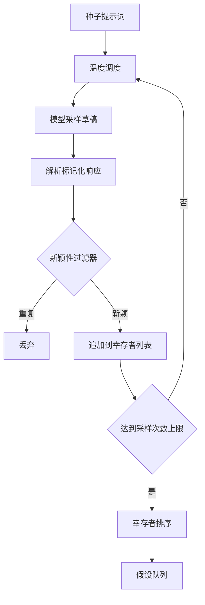

# 综合项目50——假设生成器（Hypothesis Generator）

> 一个问同一个问题两次的研究智能体是在浪费词元。关键在于强制每次草稿落在新的位置。

**类型：** 构建
**编程语言：** Python
**前置知识：** 第19章第20-29节
**预计时间：** 90分钟

---

## 学习目标

- 从种子提示词驱动采样器，并将输出转换为类型化的假设记录
- 在每次生成时逐步提高采样温度，使后续草稿进一步远离前一个
- 使用小型嵌入模型和余弦距离阈值过滤近似重复
- 用融合了新颖性、特异性和可测试性的评分函数对幸存者排序
- 保持每一步的确定性——相同的种子始终产生相同的队列

---

## 1. 问题

一个规划器向一个模型提一个问题、得到一条假设。这在简单示例中够用。对于研究循环来说，这是错误的形状。循环需要一个有深度的排序队列——这样当第一个假设失败时，运行器已经有了下一个假设，无需为另一个完整的采样过程付费。

两个想法结合起来产生这个队列。首先是**温度调度**：每次采样时将温度提升一个档次，使后续草稿更"发散"。其次是**新颖性过滤**：每次草稿后，生成器测量与之前所有幸存者的嵌入距离，拒绝距离太近的结果。

本节附带了模拟语言模型——为固定提示词返回脚本化的词元序列。这个 mock 足以锻炼完整路径：种子提示词 → 温度调度 → 候选解析 → 新颖性过滤 → 排序队列输出。

---

## 2. 核心概念

### 2.1 假设的数据结构

```
假设
  id             : int           （运行内单调递增）
  text           : str           （断言/主张）
  variables      : list[str]     （条件之间变化的内容）
  metric         : str           （运行器将测量的指标）
  baseline_ref   : str | None    （比较引用的论文或运行）
  draft_pass     : int           （产生此假设的采样轮次）
  temperature    : float         （草稿时的采样器设置）
  novelty_score  : float         （与已有幸存者的距离，0..1）
  rank_score     : float         （用于排序的加权和）
```

`variables` 和 `metric` 不是自由文本。解析器从标记化的响应中提取它们。

`baseline_ref` 可选但推荐。评估器需要基线来比较。如果假设省略了基线，评估器会回退到同一指标上的上一次运行。

### 2.2 架构



每个步骤都有严格的合约。

### 2.3 温度调度

从 `t_min` 开始，到 `t_max` 结束，步长为 `(t_max - t_min) / (采样次数 - 1)`。每次采样以当前温度调用采样器，产生均匀分布的值。模拟模型通过在一小组脚本化的响应中切换来模拟温度——响应基于 `(提示词签名, 温度桶)` 键控。

默认调度是 6 次采样，从 `0.2` 到 `1.2`。六次足够填充队列，而不会为新颖性过滤器注定拒绝的样本付费。低于 `0.2` 时，模型只是复读种子提示词。高于 `1.2` 时，响应往往偏离主题，解析器无法处理。

### 2.4 新颖性过滤

每次草稿被解析后，生成器对文本做嵌入，并与所有已接受的假设比较。嵌入是一个小的哈希词袋向量，归一化为单位长度。两个单位向量之间的余弦距离是 `1 - dot(a, b)`。草稿通过的条件是：它与任何已有幸存者的最小距离高于 `novelty_threshold`。默认值为 `0.25`。

哈希嵌入并不高级。它是确定性的、零依赖、足以捕获明显的情况——两个共享大部分名词的草稿。生产部署可以替换为小型句子嵌入模型。接口保持不变。

### 2.5 排序分数

```
rank_score = w_novelty × novelty_score
           + w_specificity × specificity_score
           + w_testability × testability_score
```

三个子分数：

- **新颖性分数**：与已有幸存者的最小嵌入距离
- **特异性分数**：假设中的具体变量数量除以目标数量
- **可测试性分数**：如果假设同时指定了指标和基线为 1，只有指标为 0.5，都没有为 0

默认权重为 `0.4`、`0.3`、`0.3`。权重存在于生成器配置中，下游课程可以在不 fork 代码的情况下调整。

---

## 3. 从零实现

```python
"""假设生成器：温度调度采样、新颖性过滤、排序队列。

仅使用标准库。运行：python3 code/main.py
"""
from __future__ import annotations
import hashlib, json, math, re
from dataclasses import dataclass, field
from typing import Callable

HASH_DIM = 128

# 假设的 XML 标签格式——解析器从标记化响应中提取结构化字段
TAG_RE = re.compile(
    r"<hypothesis>\s*"
    r"<text>(?P<text>.*?)</text>\s*"
    r"<variables>(?P<variables>.*?)</variables>\s*"
    r"<metric>(?P<metric>.*?)</metric>\s*"
    r"(?:<baseline>(?P<baseline>.*?)</baseline>\s*)?"
    r"</hypothesis>",
    re.DOTALL,
)

@dataclass
class Hypothesis:
    id: int; text: str; variables: list[str]; metric: str
    baseline_ref: str | None; draft_pass: int; temperature: float
    novelty_score: float = 0.0; rank_score: float = 0.0

    def to_dict(self) -> dict:
        return {"id": self.id, "text": self.text, "variables": list(self.variables),
                "metric": self.metric, "baseline_ref": self.baseline_ref,
                "draft_pass": self.draft_pass, "temperature": round(self.temperature, 3),
                "novelty_score": round(self.novelty_score, 4),
                "rank_score": round(self.rank_score, 4)}

class ParserError(ValueError):
    """采样器响应不匹配假设标签格式时抛出。"""

def _tokenise(text: str) -> list[str]:
    return re.findall(r"[a-z0-9]+", text.lower())

def hashed_embed(text: str, dim: int = HASH_DIM) -> list[float]:
    """哈希词袋嵌入，L2 归一化。纯标准库实现，确定性。"""
    vec = [0.0] * dim
    for tok in _tokenise(text):
        h = hashlib.md5(tok.encode("utf-8")).digest()
        idx = int.from_bytes(h[:4], "big") % dim
        sign = 1.0 if (h[4] & 1) == 0 else -1.0
        vec[idx] += sign
    norm = math.sqrt(sum(v * v for v in vec))
    return vec if norm == 0.0 else [v / norm for v in vec]

def cosine_distance(a: list[float], b: list[float]) -> float:
    dot = max(-1.0, min(1.0, sum(x * y for x, y in zip(a, b))))
    return 1.0 - dot

def parse_response(raw: str) -> dict:
    """从标记化响应中提取假设字段。"""
    match = TAG_RE.search(raw)
    if match is None:
        raise ParserError("未找到假设块")
    text = match.group("text").strip()
    if not text: raise ParserError("空的 text")
    metric = match.group("metric").strip()
    if not metric: raise ParserError("空的 metric")
    variables = [v.strip() for v in match.group("variables").split(",") if v.strip()]
    if not variables: raise ParserError("空的 variables")
    baseline = match.group("baseline")
    return {"text": text, "variables": variables, "metric": metric,
            "baseline_ref": baseline.strip() if baseline and baseline.strip() else None}

def temperature_bucket(temperature: float) -> int:
    """将连续温度映射到离散桶索引。"""
    if temperature < 0.35: return 0
    if temperature < 0.65: return 1
    if temperature < 0.95: return 2
    return 3

class MockLLM:
    """脚本化采样器，基于 (提示词签名, 温度桶) 键控。

    未知键返回无法解析的 fallback，使解析器失败路径可在测试中到达。
    """
    def __init__(self, scripts: dict[tuple[str, int], list[str]]) -> None:
        self._scripts = dict(scripts)

    @staticmethod
    def prompt_signature(prompt: str) -> str:
        return hashlib.sha1(prompt.encode("utf-8")).hexdigest()[:10]

    def sample(self, prompt: str, temperature: float, seed: int) -> str:
        key = (self.prompt_signature(prompt), temperature_bucket(temperature))
        bank = self._scripts.get(key)
        if not bank:
            return "<noise>无法解析的输出</noise>"
        return bank[seed % len(bank)]

@dataclass
class GeneratorConfig:
    n_passes: int = 6
    t_min: float = 0.2
    t_max: float = 1.2
    novelty_threshold: float = 0.25
    target_variable_count: int = 3
    w_novelty: float = 0.4
    w_specificity: float = 0.3
    w_testability: float = 0.3
    base_seed: int = 0

    def schedule(self) -> list[float]:
        if self.n_passes <= 0: return []
        if self.n_passes == 1: return [self.t_min]
        step = (self.t_max - self.t_min) / (self.n_passes - 1)
        return [self.t_min + i * step for i in range(self.n_passes)]

@dataclass
class GenerationLog:
    pass_index: int; temperature: float; seed: int
    accepted_id: int | None; reject_reason: str | None; raw_excerpt: str

    def to_dict(self) -> dict:
        return {"pass": self.pass_index, "temperature": round(self.temperature, 3),
                "seed": self.seed, "accepted_id": self.accepted_id,
                "reject_reason": self.reject_reason, "raw_excerpt": self.raw_excerpt[:80]}

class HypothesisGenerator:
    """在温度调度上驱动模拟 LLM 并对幸存者排序。"""

    def __init__(self, llm: MockLLM, config: GeneratorConfig | None = None,
                 embedder: Callable[[str], list[float]] = hashed_embed):
        self._llm = llm; self._cfg = config or GeneratorConfig(); self._embed = embedder

    def _specificity_score(self, h: Hypothesis) -> float:
        target = max(1, self._cfg.target_variable_count)
        return min(1.0, len(h.variables) / target)

    def _testability_score(self, h: Hypothesis) -> float:
        return 1.0 if h.metric and h.baseline_ref else (0.5 if h.metric else 0.0)

    def _score(self, h: Hypothesis) -> float:
        return (self._cfg.w_novelty * h.novelty_score
                + self._cfg.w_specificity * self._specificity_score(h)
                + self._cfg.w_testability * self._testability_score(h))

    def _novelty(self, candidate: list[float], survivors: list[list[float]]) -> float:
        if not survivors: return 1.0
        return min(cosine_distance(candidate, s) for s in survivors)

    def run(self, seed_prompt: str) -> tuple[list[Hypothesis], list[GenerationLog]]:
        """执行完整生成流程：温度调度 → 采样 → 解析 → 过滤 → 排序。"""
        survivors: list[Hypothesis] = []
        survivor_vecs: list[list[float]] = []
        logs: list[GenerationLog] = []
        next_id = 1
        for pass_index, temperature in enumerate(self._cfg.schedule()):
            seed = self._cfg.base_seed + pass_index
            raw = self._llm.sample(seed_prompt, temperature, seed)
            try:
                parsed = parse_response(raw)
            except ParserError as exc:
                logs.append(GenerationLog(pass_index, temperature, seed, None, f"解析错误:{exc}", raw))
                continue
            vec = self._embed(parsed["text"])
            novelty = self._novelty(vec, survivor_vecs)
            if novelty < self._cfg.novelty_threshold:
                logs.append(GenerationLog(pass_index, temperature, seed, None, "重复", raw))
                continue
            h = Hypothesis(id=next_id, text=parsed["text"], variables=parsed["variables"],
                           metric=parsed["metric"], baseline_ref=parsed["baseline_ref"],
                           draft_pass=pass_index, temperature=temperature, novelty_score=novelty)
            h.rank_score = self._score(h)
            survivors.append(h); survivor_vecs.append(vec)
            logs.append(GenerationLog(pass_index, temperature, seed, next_id, None, raw))
            next_id += 1
        survivors.sort(key=lambda h: (-h.rank_score, h.id))
        return survivors, logs

def build_demo_scripts() -> dict[tuple[str, int], list[str]]:
    """为演示种子提示词跨温度桶构建脚本化响应。"""
    prompt = "研究小型 Transformer 中的注意力稀疏性"
    sig = MockLLM.prompt_signature(prompt)
    return {
        (sig, 0): ['<hypothesis><text>将注意力头数从 8 降至 4 会在 12M 参数模型上使验证损失增加不到 2%。</text><variables>head_count, validation_loss</variables><metric>validation_loss</metric><baseline>head_count_8</baseline></hypothesis>'],
        (sig, 1): ['<hypothesis><text>在 12M 参数规模下，k=16 的 Top-k 稀疏注意力在困惑度上匹配密集注意力。</text><variables>k, perplexity, parameter_count</variables><metric>perplexity</metric><baseline>dense_attention</baseline></hypothesis>'],
        (sig, 2): ['<hypothesis><text>通过学习门控路由注意力可减少 30% 的 FLOPs 而不损害下游准确率。</text><variables>gate_temperature, flops, accuracy</variables><metric>downstream_accuracy</metric><baseline>dense_attention</baseline></hypothesis>'],
        (sig, 3): ['<hypothesis><text>块大小为 32 的块稀疏注意力在消费级 GPU 上将训练墙上时间降低 18%。</text><variables>block_size, training_seconds, hardware</variables><metric>training_seconds</metric><baseline>dense_attention</baseline></hypothesis>'],
    }

def main() -> int:
    llm = MockLLM(build_demo_scripts())
    config = GeneratorConfig(n_passes=4, t_min=0.2, t_max=1.1)
    generator = HypothesisGenerator(llm, config)
    queue, logs = generator.run("研究小型 Transformer 中的注意力稀疏性")
    print(json.dumps({"queue_size": len(queue), "queue": [h.to_dict() for h in queue],
                       "logs": [log.to_dict() for log in logs]}, indent=2, ensure_ascii=False))
    return 0

if __name__ == "__main__":
    raise SystemExit(main())
```

---

## 4. 关键术语

| 术语 | 含义 |
|------|------|
| 温度调度 | 每次采样逐步提高温度，使后续草稿更多样化 |
| 新颖性过滤 | 基于嵌入距离拒绝与已有假设过于相似的草稿 |
| 哈希嵌入 | 使用 MD5 将词元映射到固定维度向量的确定性嵌入 |
| 余弦距离 | `1 - cosine_similarity(a, b)`，范围 [0, 2] |
| 排序分数 | 新颖性、特异性和可测试性的加权和，用于排序 |

---

## 5. 工程最佳实践

### 5.1 生产部署的替换

- **将哈希嵌入替换为小型句子嵌入模型**（如 `all-MiniLM-L6-v2`）。哈希嵌入很粗糙——它只捕获词级别的重叠，无法理解同义词或语义相似性。句子嵌入模型可以检测"增加学习率"和"提高学习率"之间的语义等价关系。
- **将模拟 LLM 替换为真实模型 API 调用**。模拟模型是静态脚本，不会产生真正的分布外假设。在真实部署中，使用 `temperature=t` 配置的采样调用。

### 5.2 队列管理

- **队列有限**。当队列为空时，编排器可以扩大种子提示词范围并重新运行生成器，或者停止并报告预算耗尽。
- **种子固定以确保可复现性**。课程固定种子以保持结果可复现。在真实部署中，种子来自系统时钟或计数器。
- **日志记录**。每次生成运行的完整日志（含拒绝原因）存储在 `GenerationLog` 中，用于调试和改进提示词设计。

### 5.3 中文场景特别建议

- **提示词设计要具体**：种子提示词越具体（如"研究 12M 参数 Transformer 中注意力头数对验证损失的影响"），生成的假设越聚焦。太宽泛的提示词可能导致不可测试的假设。
- **标签格式的稳定性**：假设的 XML 标签格式是解析合约。任何格式变化都需要同时更新提示词和解析器。在生产中，考虑使用 JSON 格式而非 XML 以减少解析错误。
- **中文文本的嵌入**：哈希嵌入对中文的效果不如英文——因为中文分词需要更精细的处理。中文生产部署强烈建议替换为中文句子嵌入模型。

---

## 6. 常见错误

### 错误 1：解析器过于严格，忽略格式边缘情况

**现象：** 采样器产生语义正确的响应，但被解析器拒绝，队列中假设数量不足。

**原因：** 正则表达式要求精确的 XML 标签格式，但在生成文本中，标签可能有多余的空格、换行或格式错误。

**修复：**
```python
# ❌ 过于严格
re.match(r"<hypothesis><text>...", raw)

# ✓ 容忍空白和换行
re.search(r"<hypothesis>\s*<text>(.*?)</text>\s*...", raw, re.DOTALL)
```

### 错误 2：新颖性阈值过低导致重复假设累积

**现象：** 队列中的多个假设本质上是同一个主张的变体。

**原因：** 阈值过低，轻度不同的措辞被判定为"新颖"。

**修复：** 将 `novelty_threshold` 从 `0.25` 提高到 `0.4` 或更高。

### 错误 3：温度调度范围不当

**现象：** 前半部分采样全部被新颖性过滤器拒绝（温度太低，所有草稿太相似），或者后半部分全部解析失败（温度太高，输出偏离格式）。

**原因：** `t_min` 太接近 `t_max`，或者调度未覆盖足够宽的范围。

**修复：** 从 `0.2` 到 `1.2` 的 6 次采样是经验上合理的起始点。根据具体模型和提示词调整。

---

## 7. 面试考点

### Q1：为什么需要温度调度而不是固定温度采样？（难度：⭐⭐）

**参考答案：** 固定低温产生的假设聚集在种子提示词的邻近区域，多样性不足。固定高温产生的假设往往格式松散，解析失败率高。温度调度从低到高逐步提升，在保持早期草稿质量的同时，逐步鼓励后期草稿探索更远的空间。这是经典的"探索-利用"权衡在采样中的体现。

### Q2：新颖性过滤为什么使用嵌入距离而不是简单的字符串匹配？（难度：⭐⭐⭐）

**参考答案：** 字符串匹配（如编辑距离）对措辞敏感——"增加学习率到 1e-4"和"将学习率设为 1e-4"在语义上相同但编辑距离很大。嵌入将文本映射到连续向量空间，语义相似的文本在空间中也接近。哈希嵌入虽然粗糙，但在零依赖的条件下捕获了词级别的共现关系，足以过滤掉明显的近似重复。

---

## 📚 小结

假设生成器是自动化科研循环的第一步。你实现了温度调度、结构化解、新颖性过滤和排序队列，将种子提示词转化为一个深度优先的假设队列。完整的科研循环还需要文献检索、实验运行和结果评估——接下来的几节将补齐这些组件。

---

## ✏️ 练习

1. 【理解】用自己的话解释为什么假设生成器使用排序队列而不是简单列表。队列为空时应该怎么做？

2. 【实现】将哈希嵌入替换为简单的句子嵌入模型（如 `sentence-transformers`）。比较新旧嵌入在新颖性检测上的差异。

3. 【实验】将 `novelty_threshold` 从 0.1 变化到 0.9，观察队列大小和多样性的变化。找到适合你任务的阈值。

4. 【思考】添加一个缓存层：如果给定种子提示词的结果已经存在，直接返回缓存的队列而不重新采样。在提示词完全相同时节省 API 调用。

---

## 🚀 产出

| 产出 | 文件 | 说明 |
|---|---|---|
| 假设生成器 | `code/main.py` | 温度调度 + 解析 + 新颖性过滤 + 排序队列 |
| 单元测试 | `code/tests/test_generator.py` | 覆盖主路径、重复拒绝、解析失败、温度边界 |

---

## 📖 参考资料

1. [论文] Brown et al. "Language Models are Few-Shot Learners". NeurIPS 2020. https://arxiv.org/abs/2005.14165 — 温度采样在大语言模型中的应用
2. [论文] Reimers, Gurevych. "Sentence-BERT: Sentence Embeddings using Siamese BERT-Networks". EMNLP 2019. https://arxiv.org/abs/1908.10084 — 句子嵌入用于语义相似度
3. [GitHub] Sentence-Transformers. https://github.com/UKPLab/sentence-transformers
4. [官方文档] Python `hashlib` — 确定性哈希嵌入. https://docs.python.org/3/library/hashlib.html
