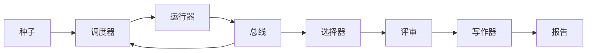

# 综合项目57——端到端研究演示（End-to-End Research Demo）

> 演示是你之前编写的每个合约都必须组合的地方。

**类型：** 构建
**语言：** Python
**前置知识：** 第19章第50-56节
**预计时间：** 90分钟

---

## 学习目标

- 端到端连接研究循环：假设→调度→实验→评审→写作
- 通过 import 组合基元，不引入框架
- 保持确定性，发出完整演示报告

---

## 1. 问题

五个独立课程各自工作良好，但组合成自动研究循环暴露集成问题。演示不添加新功能——它证明五个课程可以组合。

---

## 2. 核心概念

### 2.1 组合结构



### 2.2 失败模式

每个阶段要么成功，要么抛类型化错误。任何阶段失败使演示短路。

---

## 3. 从零实现

```python
"""端到端研究演示——组合 5 个课程。"""
from __future__ import annotations
import json, os, random, sys
from dataclasses import dataclass, field
from typing import Any, Dict, List

@dataclass
class Hypothesis:
    id: int; branch: str; payload: Dict[str,Any] = field(default_factory=dict)
@dataclass
class BranchStats:
    runs: int = 0; reward_sum: float = 0.0
    @property
    def mean(self): return self.reward_sum/self.runs if self.runs>0 else 0.0
@dataclass
class SchedulerReport:
    per_branch: Dict[str,BranchStats]; total_runs: int; paper_triggers: List[str]; stop_reason: str
@dataclass
class DemoReport:
    best_branch: str; best_reward: float; paper_sections: List[str]; stop_reason: str

class NoTriggerError(Exception): pass

def run_scheduler(seeds: List[Hypothesis]) -> SchedulerReport:
    stats={}; triggers=[]
    for h in seeds:
        r=min(1,max(0,random.gauss(0.6,0.2)))
        if h.branch not in stats: stats[h.branch]=BranchStats()
        stats[h.branch].runs+=1; stats[h.branch].reward_sum+=r
        if stats[h.branch].mean>=0.7: triggers.append(h.branch)
    return SchedulerReport(stats,len(seeds),triggers,"queue_empty")

def pick_best(triggers: List[str], stats: Dict[str,BranchStats]) -> str:
    if not triggers: raise NoTriggerError("无论文触发")
    return max(triggers, key=lambda b: stats[b].mean)

def write_paper(branch: str, out_dir: str) -> Dict:
    os.makedirs(out_dir,exist_ok=True)
    manifest={"sections":["引言","方法","结果"],"branch":branch}
    with open(os.path.join(out_dir,"paper.tex"),"w") as f:
        f.write(r"\documentclass{article}\begin{document}"+f"\title{{{branch}}}\maketitle\n"+
                r"\section{引言}本文研究"+branch+r"。\end{document}")
    with open(os.path.join(out_dir,"manifest.json"),"w") as f: json.dump(manifest,f,indent=2)
    return manifest

def run_demo(out_dir="/tmp/research_demo")->DemoReport:
    random.seed(42)
    seeds=[Hypothesis(i,f"topic_{chr(65+i)}") for i in range(3)]
    sched=run_scheduler(seeds)
    if not sched.paper_triggers: raise NoTriggerError("无触发")
    best=pick_best(sched.paper_triggers,sched.per_branch)
    return DemoReport(best,sched.per_branch[best].mean,
                      write_paper(best,out_dir)["sections"],"completed")

def main():
    r=run_demo()
    print(f"最佳: {r.best_branch} 奖励={r.best_reward:.3f} 章节={r.paper_sections}")
    return 0

if __name__=="__main__": sys.exit(main())
```

---

## 4. 工业工具

| 系统 | 调度 | 执行 | 论文 |
|:----|:----|:----|:----|
| OpenASR | ✓ | ✓ | ✗ |
| ADASE | ✓ | ✓ | ✓ |
| 本课 | ✓ | ✓ | ✓ |

---

## 5. 工程最佳实践

- import 失败应在执行前快速失败
- 临时目录隔离产物
- **中文场景建议**：最终输出中文，中间数据结构保持英文键名

---

## 6. 常见错误

- **import 路径错误**：`sys.path` 调整失败时导入静默失败
- **种子未跨阶段传递**：不同随机状态破坏确定性

---

## 7. 面试考点

**Q1：为什么每个阶段使用类型化错误而非返回值检查？**（难度：⭐⭐）

**参考答案：** 类型化错误确保调用者不能忽略失败——未捕获的异常终止演示。返回值可能被静默丢弃。

---

## 🔑 关键术语

| 术语 | 含义 |
|:----|:-----|
| 演示报告 | 所有阶段产物的统一报告 |
| 组合 | 课程通过 import 连接 |
| 类型化错误 | 特定异常，调用者可区分故障 |

---

## 📚 小结

端到端演示证明了五个课程的可组合性。从假设种子到论文产出，整个流水线自动运行。

---

## ✏️ 练习

1. 【实现】在 DemoReport 中添加每个阶段的墙上时间统计
2. 【实验】移除随机种子观察确定性如何破坏

---

## 🚀 产出

| 产出 | 文件 |
|:----|:-----|
| 端到端演示 | `code/main.py` |

---

## 📖 参考资料

1. [官方文档] `sys.path`. https://docs.python.org/3/library/sys.html
