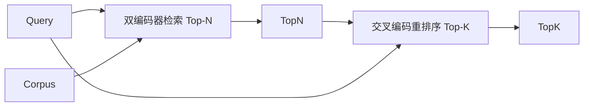

# 综合项目66——交叉编码重排序器（Cross-Encoder Reranker）

> 双编码器独立嵌入查询和文档。交叉编码器将它们拼接后一起阅读。它是最聪明的读取器，也是最慢的。用作双编码器 top-N 的第二阶段，它物有所值。

**类型：** 构建
**语言：** Python
**前置知识：** 第19章第65节
**预计时间：** 90分钟

---

## 学习目标

- 区分双编码器和交叉编码器的输入形状、参数量和每查询成本
- 实现小型交叉编码器：接收拼接的 (查询, 文档) 序列，输出单个相关性标量
- 组合检索-重排序两级流水线
- 在延迟与质量曲线上选择合适的 N

---

## 1. 问题

双编码器将查询和文档映射到同一向量空间，用余弦排序。两种编码互相看不见——模型必须将文档的所有有用信息压缩到单个向量中。快但精度低。

交叉编码器将查询和文档一起阅读——`[CLS] query [SEP] document [SEP]`——全注意力联合阅读，输出单个相关性分数。精度高但无法处理全语料库（1000万文档 = 1000万次前向传播/查询）。

解决方法是分级：双编码器检索 Top-N（N=50-200），交叉编码器将 N 重排序到 Top-K（K=10-30）。

---

## 2. 核心概念

### 2.1 两级流水线



### 2.2 延迟-质量曲线

| N | 重排序后 Recall@1 | 前向传播次数 | 延迟 |
|:--|:---|:---|:---|
| 5 | ~0.62 | 5 | 低 |
| 20 | ~0.81 | 20 | 中 |
| 50 | ~0.86 | 50 | 高 |

Knee 在 N=20-50 处——超过这个范围提升饱和。

### 2.3 交叉编码器输入格式

```
[CLS] query_tokens [SEP] document_tokens [SEP]
```

CLS 位置输出经线性头产生一个标量。

---

## 3. 从零实现

```python
"""交叉编码重排序器——两级检索-重排序流水线。"""
import torch, torch.nn as nn, torch.nn.functional as F, time, re

class CrossEncoder(nn.Module):
    def __init__(self, vocab=256, dim=64, heads=4):
        super().__init__()
        self.emb = nn.Embedding(vocab, dim)
        self.type_emb = nn.Embedding(2, dim)
        self.block = nn.TransformerEncoderLayer(dim, heads, dim*4, batch_first=True, norm_first=True)
        self.head = nn.Linear(dim, 1)

    def forward(self, ids, type_ids):
        x = self.emb(ids) + self.type_emb(type_ids)
        x = self.block(x)
        return self.head(x[:, 0, :]).squeeze(-1)


def tokenize_pair(query, doc, max_len=32):
    toks = re.findall(r"[a-z0-9]+", (query + " [SEP] " + doc).lower())
    ids = [hash(t) % 256 for t in toks[:max_len]]
    types = [0] * (ids.index(0) if 0 in ids else len(ids)) + [1] * (len(ids) - (ids.index(0) if 0 in ids else len(ids)))
    return ids, types

def pad_batch(pairs):
    max_len = max(len(ids) for ids, _ in pairs)
    ids = [p[0] + [0]*(max_len - len(p[0])) for p in pairs]
    types = [p[1] + [1]*(max_len - len(p[1])) for p in pairs]
    return torch.tensor(ids), torch.tensor(types)

def rerank(model, query, candidates, top_k=5):
    pairs = [tokenize_pair(query, c) for c in candidates]
    ids, types = pad_batch(pairs)
    with torch.no_grad(): scores = model(ids, types)
    ranked = sorted(range(len(candidates)), key=lambda i: -scores[i].item())
    return [(candidates[i], scores[i].item()) for i in ranked[:top_k]]


def mock_retrieve(query, corpus, top_n=10):
    return [d for d in corpus if any(w in d.lower() for w in re.findall(r"[a-z]+", query.lower()))][:top_n] or corpus[:top_n]


def main():
    torch.manual_seed(42)
    model = CrossEncoder()
    corpus = [
        "AbortMultipartOnFail handles upload cancellation gracefully.",
        "Large file chunking splits uploads for reliability.",
        "Retry policy ensures failed requests are attempted again.",
        "Budget threshold limits the number of retry attempts.",
    ]
    query = "what happens when upload fails and budget is gone"
    t0 = time.perf_counter()
    top_n = mock_retrieve(query, corpus, 3)
    t_retrieve = (time.perf_counter() - t0) * 1000

    t0 = time.perf_counter()
    top_k = rerank(model, query, top_n, 2)
    t_rerank = (time.perf_counter() - t0) * 1000

    print(f"查询: '{query}'")
    print(f"检索 Top-N ({t_retrieve:.1f}ms): {top_n}")
    print(f"重排序 Top-K ({t_rerank:.1f}ms):")
    for doc, score in top_k:
        print(f"  {score:.4f} — {doc[:60]}")
    return 0

if __name__ == "__main__":
    import sys; sys.exit(main())
```

---

## 4. 工业工具

| 工具 | 参数量 | 特点 |
|:----|:------|:-----|
| ms-marco-MiniLM-L-6 | 22M | 最常用生产模型 |
| bge-reranker-v2-m3 | 568M | 高质量，大模型 |
| Cohere rerank | API | 云端服务 |
| Jina reranker | API | 开源+云端 |

---

## 5. 工程最佳实践

- N（候选数）至少是 K 的 3 倍——N=K 时重排序无法重排
- 缓存重排序输出：相同查询+相同文档 = 相同分数
- **中文场景建议**：中文交叉编码器需先分词；BGE-reranker 支持中文

---

## 6. 常见错误

- **交换查询和文档顺序**：`rerank(q,d)` ≠ `rerank(d,q)`，始终查询在前
- **N=K**：重排序看起来无提升，因为没有空间重排
- **训练数据泄漏到评估集**：严格分离训练和评估

---

## 7. 面试考点

**Q1：双编码器和交叉编码器的核心区别是什么？**（难度：⭐⭐）

**参考答案：** 双编码器独立编码查询和文档，用余弦相似度排名——快（一次嵌入复用多次），但精度受限于向量空间的表达力。交叉编码器联合编码 (查询, 文档) 对——精度高（每个 token 可关注查询的每个 token），但慢（每个候选都要一次前向传播）。

---

## 🔑 关键术语

| 术语 | 含义 |
|:----|:-----|
| 双编码器 | 独立编码查询和文档，用余弦排名 |
| 交叉编码器 | 联合编码 (查询, 文档)，输出相关性标量 |
| 两级流水线 | 廉价检索 Top-N → 昂贵重排序 Top-K |
| N（候选预算） | 交叉编码器每查询评估的候选数 |

---

## 📚 小结

交叉编码器是重排序的第二阶段——双编码器检索候选，交叉编码器精选最终结果。你实现了从零交叉编码器和两级流水线。下一节将构建查询重写器以改善检索质量。

---

## ✏️ 练习

1. 【实验】扫描 N 从 5 到 50，绘制 recall@1 曲线
2. 【实现】添加缓存层：相同 (query, doc_id) 返回缓存分数

---

## 🚀 产出

| 产出 | 文件 |
|:----|:-----|
| 交叉编码重排序器 | `code/main.py` |

---

## 📖 参考资料

1. [论文] Nogueira & Cho. "Passage Re-ranking with BERT". 2019.
2. [论文] Reimers & Gurevych. "Sentence-BERT". 2019.
