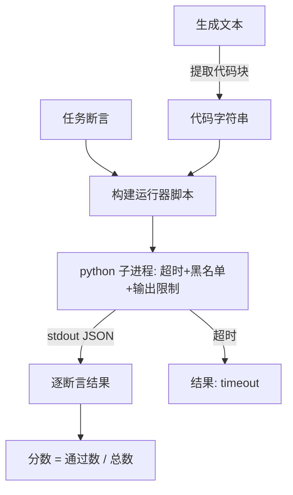

# 综合项目72——代码执行指标（Code Exec Metric）

> 生成的代码通过测试才算正确。评估框架提取代码、在隔离环境中运行、诚实地统计通过率。

**类型：** 构建
**语言：** Python
**前置知识：** 第19章第70-71节
**预计时间：** 90分钟

---

## 学习目标

- 从自由格式生成中提取代码块
- 在隔离子进程中执行候选代码（超时、输出限制、导入黑名单）
- 按通过断言比例计分
- 计算 pass-at-k

---

## 1. 问题

内联 `exec` 是安全和稳定性隐患——`while True: pass` 阻塞评估，`shutil.rmtree('/')` 毁掉文件系统。修复方法：为每个候选启动一个新 Python 解释器，通过 stdin 传递代码，stdout 写回结果，超时则 kill 进程。

---

## 2. 核心概念

### 2.1 子进程执行



### 2.2 退出码词汇表

- `pass`：所有断言通过
- `assertion_fail`：代码运行但断言失败
- `syntax_error`：语法错误
- `timeout`：墙上时钟超时
- `error`：其他崩溃

### 2.3 pass-at-k

```
pass_at_k(n, c, k) = 1 - C(n-c, k) / C(n, k)
```

n 次采样中有 c 次通过，k 个样本中至少一个通过的概率。

---

## 3. 从零实现

```python
"""代码执行指标——子进程隔离+pass@k。"""
import re, json, subprocess, sys, tempfile
from dataclasses import dataclass
from typing import List, Optional

DENIED = ["os.system", "subprocess", "socket", "shutil", "requests", "urllib", "ctypes"]

def extract_code(text):
    m = re.search(r"```(?:python)?\n(.*?)```", text, re.DOTALL)
    return m.group(1).strip() if m else text.strip()

def build_runner(code, assertions):
    safe_builtins = "__builtins__ = {'range': range, 'len': len, 'int': int, 'float': float, 'print': print, 'True': True, 'False': False}\n"
    imports = "\n".join(f"import {m}; {m} = None" for m in DENIED if m not in ("os.system",))
    return safe_builtins + imports + "\n" + code + "\n" + "\n".join(
        f"try:\n    assert {a}, 'FAIL'\n    results.append(True)\nexcept:\n    results.append(False)"
        for a in assertions) + "\nimport json; print(json.dumps(results))"

@dataclass
class CodeExecResult:
    passed: int; total: int; score: float; exit_code: str; detail: str = ""

def run_candidate(code, assertions, timeout=3.0):
    script = build_runner(code, assertions)
    try:
        result = subprocess.run([sys.executable, "-c", script], capture_output=True, text=True, timeout=timeout)
        if result.returncode != 0:
            if "SyntaxError" in result.stderr:
                return CodeExecResult(0, len(assertions), 0.0, "syntax_error", result.stderr[:200])
            return CodeExecResult(0, len(assertions), 0.0, "error", result.stderr[:200])
        try:
            results = json.loads(result.stdout.strip())
            passed = sum(1 for r in results if r)
            return CodeExecResult(passed, len(assertions), passed / max(len(assertions), 1), "pass" if passed == len(assertions) else "assertion_fail")
        except:
            return CodeExecResult(0, len(assertions), 0.0, "error", "JSON解析失败")
    except subprocess.TimeoutExpired:
        return CodeExecResult(0, len(assertions), 0.0, "timeout")
    except Exception as e:
        return CodeExecResult(0, len(assertions), 0.0, "error", str(e)[:200])

def score_code_exec(prediction, targets, extras=None):
    code = extract_code(prediction)
    assertions = targets if isinstance(targets, list) else [targets]
    result = run_candidate(code, assertions)
    return result.score

import math
def pass_at_k(n, c, k):
    if n - c < k: return 1.0
    return 1.0 - math.comb(n - c, k) / math.comb(n, k)


def main():
    print("=== 代码执行指标 ===")
    examples = [
        ("def f(x): return x * 2", ["f(2) == 4", "f(3) == 6"]),
        ("def f(x): return x + 1", ["f(2) == 4"]),  # 断言失败
        ("def f(x): while True: pass", ["f(2) == 4"]),  # 超时
    ]
    for code, asserts in examples:
        result = run_candidate(code, asserts)
        print(f"  代码: {code[:40]}... → {result.exit_code} 分数={result.score:.3f} ({result.passed}/{result.total})")

    print(f"\npass@k: n=10, c=5, k=1 → {pass_at_k(10, 5, 1):.3f}")
    print(f"pass@k: n=10, c=5, k=5 → {pass_at_k(10, 5, 5):.3f}")
    return 0

if __name__ == "__main__":
    import sys; sys.exit(main())
```

---

## 4. 工业工具

| 工具 | 隔离 | 用途 |
|:----|:-----|:-----|
| 本课子进程 | Python subprocess | 教学 |
| Docker | 容器 | 生产评估 |
| E2B | microVM | 云端沙箱 |
| HumanEval | subprocess | 代码基准 |

---

## 5. 工程最佳实践

- 超时默认 3 秒——大部分正确代码 < 1 秒完成
- 输出限制 256KB 防止内存耗尽
- **中文场景建议**：代码注释不影响执行，但错误信息需要国际化

---

## 6. 常见错误

- **未处理超时**：`TimeoutExpired` 后必须 kill 进程
- **未限制导入**：黑名单不完整时恶意代码可能逃脱
- **pass@k 边界**：当 n-c < k 时分子未定义，结果为 1.0

---

## 7. 面试考点

**Q1：为什么 pass@k 而不是简单的通过率？**（难度：⭐⭐）

**参考答案：** pass@k 衡量"多次采样中至少有一个正确"的概率。10 次采样中有 5 次正确，pass@1=50%，pass@5=83%。这更接近实际使用场景——用户可以让模型重试多次。

---

## 🔑 关键术语

| 术语 | 含义 |
|:----|:-----|
| pass@k | k 个样本中至少一个正确的概率 |
| 退出码词汇 | pass/assertion_fail/syntax_timeout/error |
| 导入黑名单 | 阻止危险模块（os, subprocess, socket） |

---

## 📚 小结

代码执行指标在隔离环境中验证生成代码的正确性。你实现了子进程执行、退出码分类和 pass@k 计算。下一节构建困惑度与校准评估。

---

## ✏️ 练习

1. 【实现】添加输出限制（256KB），超限时返回 `error: output_overflow`
2. 【实验】用死循环代码 `while True: pass` 验证超时机制

---

## 🚀 产出

| 产出 | 文件 |
|:----|:-----|
| 代码执行指标 | `code/main.py` |

---

## 📖 参考资料

1. [论文] Chen et al. "Evaluating Large Language Models Trained on Code" (HumanEval). 2021.
2. [GitHub] HumanEval. https://github.com/openai/human-eval
