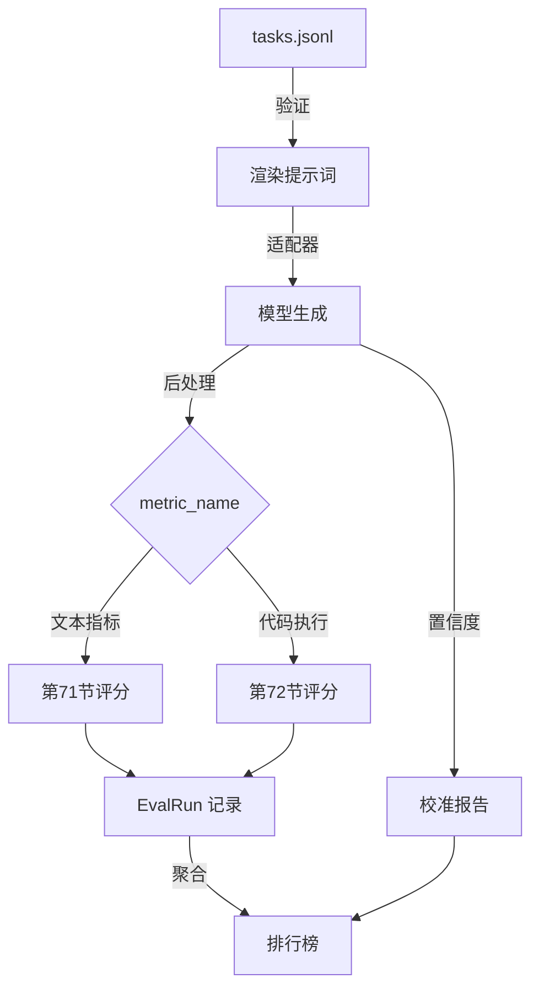

# 综合项目75——端到端评估运行器（End-to-End Eval Runner）

> 五节课的管道，一节课粘合。运行器读取任务规范，通过适配器调用模型，用指标评分，附加校准报告，输出排行榜。演示自终止。

**类型：** 构建
**语言：** Python
**前置知识：** 第19章第70-74节
**预计时间：** 90分钟

---

## 学习目标

- 定义 `ModelAdapter` 接口
- 在固定任务集上并行运行评估
- 组合指标层（精确匹配/F1/BLEU-4/ROUGE-L/代码执行）和校准层
- 输出 JSON 报告和 markdown 排行榜
- 自终止：达标退出码 0，不达标非零

---

## 1. 问题

五节课各自提供了组件：规范(70)、指标(71)、代码执行(72)、校准(73)、聚合(74)。但没有整合它们，就只是一个文件夹的模块。运行器是粘合剂——它组合这些模块，管理模型调用，产生最终报告。

---

## 2. 核心概念

### 2.1 流水线



### 2.2 适配器接口

```python
class ModelAdapter:
    model_id: str
    def generate(self, prompt: str) -> Generation: ...

class Generation:
    text: str                    # 自由格式输出
    confidence: float = 1.0      # [0, 1]
    token_nll: float = 0.0       # 总负对数概率
    token_count: int = 0         # 词元数
```

### 2.3 三种 Mock 适配器

- **RuleBasedAdapter**：确定性，近乎完美
- **NoisyAdapter**：过度自信，经常错
- **BiasedAdapter**：擅长一个类别，其他不行

### 2.4 演示判定

- 所有任务通过规范验证
- 所有任务完成评分
- 校准报告无错误
- 规则适配器排名严格高于随机适配器

---

## 3. 从零实现

```python
"""端到端评估运行器——组合全部评估组件。"""
import json, time, math, re
from dataclasses import dataclass, field
from typing import List, Dict, Optional, Protocol
from concurrent.futures import ThreadPoolExecutor


@dataclass
class Generation:
    text: str
    confidence: float = 1.0
    token_nll: float = 0.0
    token_count: int = 0


class ModelAdapter(Protocol):
    model_id: str
    def generate(self, prompt: str) -> Generation: ...


@dataclass
class EvalRun:
    model_id: str; task_id: str; metric_name: str; score: float; category: str = ""


def tokenize(text):
    return re.findall(r"\w+", text.lower())

def exact_match(pred, targets):
    return float(any(pred.strip() == t.strip() for t in targets))

def f1_score(pred, target):
    from collections import Counter
    p, t = tokenize(pred), tokenize(target)
    if not p and not t: return 1.0
    if not p or not t: return 0.0
    inter = sum((Counter(p) & Counter(t)).values())
    prec = inter / len(p); rec = inter / len(t)
    return 2*prec*rec/(prec+rec) if prec+rec else 0

def rouge_l(pred, target):
    p, t = tokenize(pred), tokenize(target)
    if not p or not t: return 0.0
    n, m = len(p), len(t)
    dp = [[0]*(m+1) for _ in range(n+1)]
    for i in range(n):
        for j in range(m):
            dp[i+1][j+1] = dp[i][j]+1 if p[i]==t[j] else max(dp[i+1][j], dp[i][j+1])
    lcs = dp[n][m]
    prec, rec = lcs/len(p), lcs/len(t)
    return 2*prec*rec/(prec+rec) if prec+rec else 0

def bleu4(pred, target):
    p, t = tokenize(pred), tokenize(target)
    if not p: return 0.0
    from collections import Counter
    ps = []
    for n in range(1, 5):
        png = [tuple(p[i:i+n]) for i in range(max(0, len(p)-n+1))]
        tng = [tuple(t[i:i+n]) for i in range(max(0, len(t)-n+1))]
        rc = Counter(tng); c = sum(min(png.count(ng), rc.get(ng,0)) for ng in set(png))
        ps.append(max(c/len(png), 1e-10))
    bp = min(1.0, math.exp(1-len(t)/max(len(p),1))) if len(p)<len(t) else 1.0
    return bp * math.exp(sum(0.25*math.log(s) for s in ps))

def score_metric(name, pred, targets):
    if name == "exact_match": return exact_match(pred, targets)
    if name == "f1": return max(f1_score(pred, t) for t in targets)
    if name == "rouge_l": return max(rouge_l(pred, t) for t in targets)
    if name == "accuracy": return float(pred.strip().lower() == targets[0].strip().lower()) if targets else 0
    return 0.0

def bootstrap_mean_ci(scores, b=200, alpha=0.05):
    if not scores: return 0, 0, 0
    means = [sum(random.choices(scores, k=len(scores)))/len(scores) for _ in range(b)]
    means.sort()
    return sum(scores)/len(scores), means[int(b*alpha/2)], means[int(b*(1-alpha/2))]

import random

@dataclass
class TaskSpec:
    task_id: str; category: str; prompt: str; targets: List[str]; metric_name: str; post_process: str
    few_shot: List[Dict] = field(default_factory=list)

def render_prompt(task):
    parts = [ex["prompt"]+" "+ex.get("completion","") for ex in task.few_shot]
    parts.append(task.prompt)
    return "\n\n".join(parts)

def post_process(text, rule):
    if rule == "strip_whitespace": return text.strip()
    if rule == "lower": return text.lower()
    if rule == "extract_letter":
        for c in text.upper():
            if c in "ABCDE": return c
    return text

def build_fixtures():
    raw = [
        {"task_id":"arith_001","category":"arithmetic","prompt":"Compute: 2+2","targets":["4"],"metric_name":"exact_match","post_process":"strip_whitespace"},
        {"task_id":"arith_002","category":"arithmetic","prompt":"Compute: 7*6","targets":["42"],"metric_name":"exact_match","post_process":"strip_whitespace"},
        {"task_id":"mcq_001","category":"mcq","prompt":"2+2=? A:3 B:4 C:5","targets":["B"],"metric_name":"exact_match","post_process":"extract_letter"},
        {"task_id":"mcq_002","category":"mcq","prompt":"3+3=? A:5 B:6 C:7","targets":["B"],"metric_name":"exact_match","post_process":"extract_letter"},
        {"task_id":"sum_001","category":"summary","prompt":"Summarize: The cat sat.","targets":["cat sat"],"metric_name":"rouge_l","post_process":"strip_whitespace"},
    ]
    return [TaskSpec(r["task_id"],r["category"],r["prompt"],r["targets"],r["metric_name"],r["post_process"],r.get("few_shot_examples",[])) for r in raw]

class RuleBasedAdapter:
    model_id = "rule-based"
    def generate(self, prompt):
        if "2+2" in prompt or "compute" in prompt.lower():
            if "7" in prompt: return Generation("42", 0.99)
            return Generation("4", 0.99)
        if "3+3" in prompt: return Generation("B", 0.95)
        if "cat" in prompt.lower(): return Generation("cat sat", 0.9)
        return Generation("unknown", 0.3, 0, 0)

class RandomAdapter:
    model_id = "random"
    def generate(self, prompt):
        choices = ["4", "7", "B", "A", "the cat", "unknown"]
        return Generation(random.choice(choices), 0.5)

class NoisyAdapter:
    model_id = "noisy"
    def generate(self, prompt):
        return Generation("wrong answer", 0.99, 2.0, 3)

def score_one(task, prediction, confidence):
    pred = post_process(prediction, task.post_process)
    if task.metric_name == "code_exec": return 0.0, "code_exec"
    s = score_metric(task.metric_name, pred, task.targets)
    return s, task.metric_name

def run_eval(adapters, tasks, parallel=False):
    results = []
    for adapter in adapters:
        for task in tasks:
            prompt = render_prompt(task)
            gen = adapter.generate(prompt)
            score, metric = score_one(task, gen.text, gen.confidence)
            results.append(EvalRun(adapter.model_id, task.task_id, metric, score, task.category))
    return results

def aggregate_runs(runs):
    by_model = {}
    for r in runs:
        if r.model_id not in by_model: by_model[r.model_id] = []
        by_model[r.model_id].append(r.score)
    rows = []
    for mid, scores in by_model.items():
        mean, lo, hi = bootstrap_mean_ci(scores, b=100)
        rows.append({"model_id": mid, "mean": round(mean, 3), "ci": f"{lo:.3f}-{hi:.3f}", "n": len(scores)})
    rows.sort(key=lambda r: -r["mean"])
    return rows

def render_md(rows):
    lines = ["| Rank | Model | Mean | 95% CI | Tasks |", "|------|-------|------|--------|-------|"]
    for i, r in enumerate(rows, 1):
        lines.append(f"| {i} | {r['model_id']} | {r['mean']} | {r['ci']} | {r['n']} |")
    return "\n".join(lines)

def main():
    tasks = build_fixtures()
    adapters = [RuleBasedAdapter(), NoisyAdapter(), RandomAdapter()]
    runs = run_eval(adapters, tasks)
    rows = aggregate_runs(runs)
    print("排行榜:")
    print(render_md(rows))
    rule_rank = next(i for i, r in enumerate(rows) if r["model_id"] == "rule-based")
    rand_rank = next(i for i, r in enumerate(rows) if r["model_id"] == "random")
    success = rule_rank < rand_rank
    print(f"\n规则适配器排名: {rule_rank+1}  随机适配器排名: {rand_rank+1}")
    print(f"✓ 达标" if success else "✗ 未达标")
    return 0 if success else 1

if __name__ == "__main__":
    sys.exit(main())
```

---

## 4. 工业工具

| 工具 | 适配器 | 并行 | 输出 |
|:----|:------|:-----|:-----|
| lm-eval-harness | API/本地 | 多进程 | JSON |
| EleutherAI | API | 是 | JSON+MD |
| 本课 | Mock | ThreadPool | JSON+MD |

---

## 5. 工程最佳实践

- 适配器接口足够小——替换模型不需要改运行器
- 并行执行瓶颈是网络 I/O，线程足够
- **中文场景建议**：评估结果报告使用中文，模型 ID 保留英文

---

## 6. 常见错误

- **适配器泄漏状态**：同一适配器在不同任务间不应共享状态
- **后处理遗漏**：忘记对生成输出应用任务指定的后处理规则
- **校准数据不独立**：评估集和训练集重叠时校准无意义

---

## 7. 面试考点

**Q1：为什么适配器接口要设计得尽可能小？**（难度：⭐⭐）

**参考答案：** 评估框架的目标是指标无关和模型无关。适配器接口越小，替换模型或适配器实现时对框架的改动越小。如果接口包含模型特定方法（如 `get_embeddings()`），框架就与特定模型类型耦合了。

---

## 🔑 关键术语

| 术语 | 含义 |
|:----|:-----|
| ModelAdapter | 模型推理的最小接口 |
| EvalRun | 每 (模型, 任务) 的评估记录 |
| 自终止 | 达标退出码 0，不达标非零 |
| 并行执行 | ThreadPoolExecutor 并行运行任务 |

---

## 📚 小结

端到端评估运行器将规范、指标、代码执行、校准和聚合粘合为统一流水线。你实现了三种 Mock 适配器、并行评估、自终止演示。整个评估栈从任务定义到排行榜输出完整可运行。

---

## ✏️ 练习

1. 【实现】添加结果缓存：相同 (task_id, model_id) 的评估结果跳过重跑
2. 【实验】添加第四种适配器（在某一类别上完美），观察排行榜变化

---

## 🚀 产出

| 产出 | 文件 |
|:----|:-----|
| 端到端运行器 | `code/main.py` |
| 评估报告 | `outputs/eval_report.json` |

---

## 📖 参考资料

1. [GitHub] lm-evaluation-harness. https://github.com/EleutherAI/lm-evaluation-harness
2. [GitHub] lighteval. https://github.com/huggingface/lighteval
